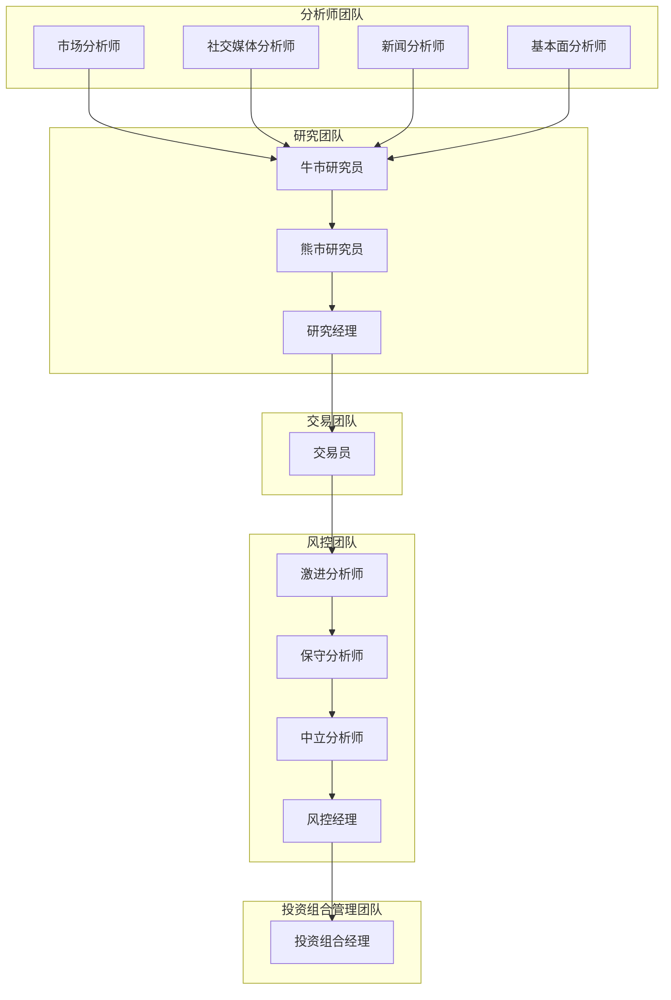

# CLI快速入门

<cite>
**Referenced Files in This Document**   
- [main.py](file://cli/main.py)
- [welcome.txt](file://cli/static/welcome.txt)
- [utils.py](file://cli/utils.py)
- [trading_graph.py](file://tradingagents/graph/trading_graph.py)
- [default_config.py](file://tradingagents/default_config.py)
</cite>

## 目录
1. [简介](#简介)
2. [启动程序](#启动程序)
3. [五步交互流程](#五步交互流程)
4. [智能体团队执行顺序](#智能体团队执行顺序)
5. [运行示例与输出解读](#运行示例与输出解读)
6. [报告文件与日志记录](#报告文件与日志记录)

## 简介

本教程旨在指导用户如何使用`TradingAgents`框架的命令行界面（CLI）进行金融交易分析。该框架采用多智能体系统，模拟真实交易公司的运作模式，通过专业化的LLM驱动智能体协同工作，共同评估市场状况并做出交易决策。

**Section sources**
- [main.py](file://cli/main.py#L1-L50)
- [README.md](file://README.md#L1-L50)

## 启动程序

要启动`TradingAgents`的CLI界面，用户需要在终端中执行以下命令：

```bash
python -m cli.main
```

此命令将启动交互式界面，用户可以通过该界面进行一系列选择，以配置分析任务。程序启动后，首先会显示一个包含ASCII艺术的欢迎界面，介绍框架的基本信息和工作流程。

**Section sources**
- [main.py](file://cli/main.py#L375-L385)
- [welcome.txt](file://cli/static/welcome.txt#L1-L8)

## 五步交互流程

### 1. 选择股票代码

用户首先需要输入要分析的股票代码。程序会提示用户输入一个有效的股票代码，默认值为`SPY`。用户可以输入任何有效的股票代码，如`NVDA`、`AAPL`等。

```python
def get_ticker():
    """Get ticker symbol from user input."""
    return typer.prompt("", default="SPY")
```

**Section sources**
- [main.py](file://cli/main.py#L200-L205)
- [utils.py](file://cli/utils.py#L23-L42)

### 2. 分析日期

接下来，用户需要输入分析的日期，格式为`YYYY-MM-DD`。默认值为当前日期。程序会验证输入的日期格式，并确保日期不为未来日期。

```python
def get_analysis_date():
    """Get the analysis date from user input."""
    while True:
        date_str = typer.prompt(
            "", default=datetime.datetime.now().strftime("%Y-%m-%d")
        )
        try:
            analysis_date = datetime.datetime.strptime(date_str, "%Y-%m-%d")
            if analysis_date.date() > datetime.datetime.now().date():
                console.print("[red]Error: Analysis date cannot be in the future[/red]")
                continue
            return date_str
        except ValueError:
            console.print(
                "[red]Error: Invalid date format. Please use YYYY-MM-DD[/red]"
            )
```

**Section sources**
- [main.py](file://cli/main.py#L207-L229)
- [utils.py](file://cli/utils.py#L44-L79)

### 3. LLM分析师团队

用户可以选择参与分析的LLM分析师团队。可选的分析师包括市场分析师、社交媒体分析师、新闻分析师和基本面分析师。用户可以通过空格键选择或取消选择，按`a`键选择或取消所有选项。

```python
def select_analysts() -> List[AnalystType]:
    """Select analysts using an interactive checkbox."""
    choices = questionary.checkbox(
        "Select Your [Analysts Team]:",
        choices=[
            questionary.Choice(display, value=value) for display, value in ANALYST_ORDER
        ],
        instruction="\n- Press Space to select/unselect analysts\n- Press 'a' to select/unselect all\n- Press Enter when done",
        validate=lambda x: len(x) > 0 or "You must select at least one analyst.",
        style=questionary.Style(
            [
                ("checkbox-selected", "fg:green"),
                ("selected", "fg:green noinherit"),
                ("highlighted", "noinherit"),
                ("pointer", "noinherit"),
            ]
        ),
    ).ask()

    if not choices:
        console.print("\n[red]No analysts selected. Exiting...[/red]")
        exit(1)

    return choices
```

**Section sources**
- [main.py](file://cli/main.py#L446-L456)
- [utils.py](file://cli/utils.py#L81-L125)

### 4. 研究深度

用户可以选择研究的深度级别，包括浅层、中等和深层。不同的深度级别对应不同的辩论轮次和策略讨论轮次。

```python
def select_research_depth() -> int:
    """Select research depth using an interactive selection."""

    DEPTH_OPTIONS = [
        ("Shallow - Quick research, few debate and strategy discussion rounds", 1),
        ("Medium - Middle ground, moderate debate rounds and strategy discussion", 3),
        ("Deep - Comprehensive research, in depth debate and strategy discussion", 5),
    ]

    choice = questionary.select(
        "Select Your [Research Depth]:",
        choices=[
            questionary.Choice(display, value=value) for display, value in DEPTH_OPTIONS
        ],
        instruction="\n- Use arrow keys to navigate\n- Press Enter to select",
        style=questionary.Style(
            [
                ("selected", "fg:yellow noinherit"),
                ("highlighted", "fg:yellow noinherit"),
                ("pointer", "fg:yellow noinherit"),
            ]
        ),
    ).ask()

    if choice is None:
        console.print("\n[red]No research depth selected. Exiting...[/red]")
        exit(1)

    return choice
```

**Section sources**
- [main.py](file://cli/main.py#L458-L467)
- [utils.py](file://cli/utils.py#L127-L169)

### 5. LLM提供商及思维模型

用户需要选择LLM提供商（如OpenAI、Anthropic、Google等）和相应的思维模型（浅层思维和深层思维模型）。这些选择将影响智能体的推理能力和决策过程。

```python
def select_llm_provider() -> tuple[str, str]:
    """Select the OpenAI api url using interactive selection."""
    BASE_URLS = [
        ("OpenAI", "https://api.openai.com/v1"),
        ("Anthropic", "https://api.anthropic.com/"),
        ("Google", "https://generativelanguage.googleapis.com/v1"),
        ("Openrouter", "https://openrouter.ai/api/v1"),
        ("Ollama", "http://localhost:11434/v1"),        
    ]
    
    choice = questionary.select(
        "Select your LLM Provider:",
        choices=[
            questionary.Choice(display, value=(display, value))
            for display, value in BASE_URLS
        ],
        instruction="\n- Use arrow keys to navigate\n- Press Enter to select",
        style=questionary.Style(
            [
                ("selected", "fg:magenta noinherit"),
                ("highlighted", "fg:magenta noinherit"),
                ("pointer", "fg:magenta noinherit"),
            ]
        ),
    ).ask()
    
    if choice is None:
        console.print("\n[red]no OpenAI backend selected. Exiting...[/red]")
        exit(1)
    
    display_name, url = choice
    print(f"You selected: {display_name}\tURL: {url}")
    
    return display_name, url
```

**Section sources**
- [main.py](file://cli/main.py#L469-L480)
- [utils.py](file://cli/utils.py#L235-L275)

## 智能体团队执行顺序

智能体团队的执行顺序如下：

1. **分析师团队**：市场分析师、社交媒体分析师、新闻分析师和基本面分析师分别进行市场分析、社交媒体情绪分析、新闻分析和基本面分析。
2. **研究团队**：牛市研究员和熊市研究员基于分析师团队的报告进行辩论，研究经理最终做出决策。
3. **交易团队**：交易员根据研究团队的决策制定交易计划。
4. **风控团队**：激进分析师、保守分析师和中立分析师对交易计划进行风险评估，风控经理最终做出风险决策。
5. **投资组合管理团队**：投资组合经理根据风控团队的决策，最终批准或拒绝交易提案。



**Diagram sources**
- [trading_graph.py](file://tradingagents/graph/trading_graph.py#L144-L189)
- [setup.py](file://tradingagents/graph/setup.py#L110-L140)

**Section sources**
- [main.py](file://cli/main.py#L215-L245)
- [trading_graph.py](file://tradingagents/graph/trading_graph.py#L144-L189)

## 运行示例与输出解读

以下是一个完整的运行示例：

1. 启动程序：`python -m cli.main`
2. 输入股票代码：`NVDA`
3. 输入分析日期：`2024-05-10`
4. 选择分析师团队：选择所有分析师
5. 选择研究深度：选择“深层”
6. 选择LLM提供商：选择“OpenAI”
7. 选择思维模型：选择相应的浅层和深层思维模型

程序将依次执行各个智能体团队的任务，并在界面上实时显示进度和结果。最终，用户将看到一个完整的分析报告，包括各个团队的分析结果和最终的交易决策。

**Section sources**
- [main.py](file://cli/main.py#L977-L1008)
- [trading_graph.py](file://tradingagents/graph/trading_graph.py#L144-L189)

## 报告文件与日志记录

程序运行完成后，生成的报告文件和日志记录将保存在指定的目录中。报告文件位于`results/<股票代码>/<分析日期>/reports/`目录下，日志记录文件位于`results/<股票代码>/<分析日期>/`目录下，文件名为`message_tool.log`。

```python
# Create result directory
results_dir = Path(config["results_dir"]) / selections["ticker"] / selections["analysis_date"]
results_dir.mkdir(parents=True, exist_ok=True)
report_dir = results_dir / "reports"
report_dir.mkdir(parents=True, exist_ok=True)
log_file = results_dir / "message_tool.log"
log_file.touch(exist_ok=True)
```

**Section sources**
- [main.py](file://cli/main.py#L751-L779)
- [default_config.py](file://tradingagents/default_config.py#L1-L23)