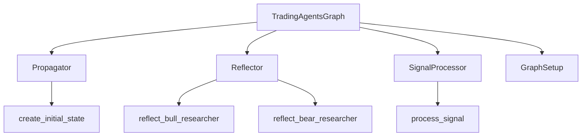
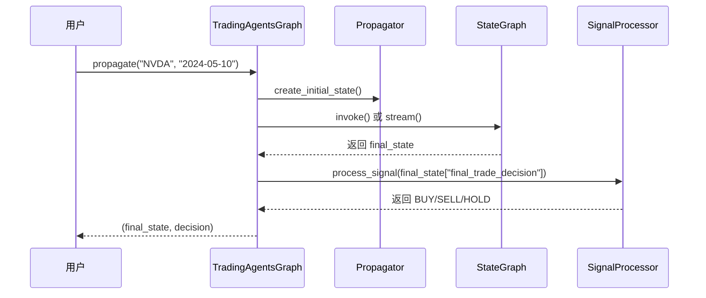
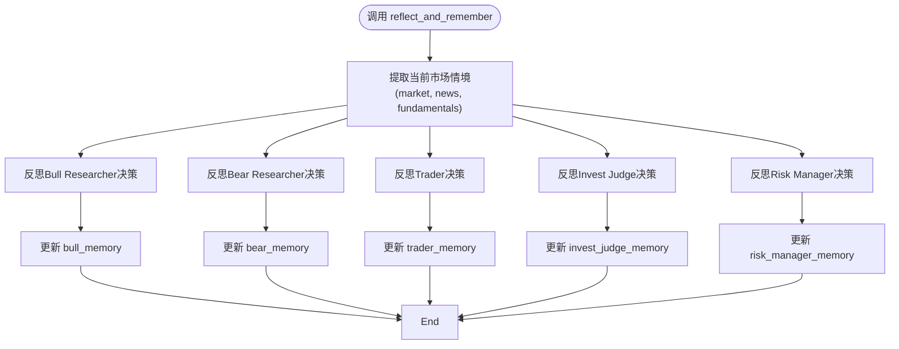

# Python API使用示例

<cite>
**本文档中引用的文件**  
- [main.py](file://main.py)
- [tradingagents/default_config.py](file://tradingagents/default_config.py)
- [tradingagents/graph/trading_graph.py](file://tradingagents/graph/trading_graph.py)
- [tradingagents/graph/propagation.py](file://tradingagents/graph/propagation.py)
- [tradingagents/graph/reflection.py](file://tradingagents/graph/reflection.py)
- [tradingagents/graph/signal_processing.py](file://tradingagents/graph/signal_processing.py)
</cite>

## 目录
1. [简介](#简介)
2. [核心组件概述](#核心组件概述)
3. [TradingAgentsGraph 初始化](#tradingagentsgraph-初始化)
4. [propagate 方法详解](#propagate-方法详解)
5. [配置自定义：切换LLM与调整参数](#配置自定义：切换llm与调整参数)
6. [reflect_and_remember 方法说明](#reflect_and_remember-方法说明)
7. [扩展使用建议](#扩展使用建议)
8. [总结](#总结)

## 简介
本示例文档旨在说明如何在Python代码中集成 **TradingAgents** 框架。通过 `main.py` 中的实例，详细展示 `TradingAgentsGraph` 类的初始化、核心方法调用流程、配置自定义方式以及后续的反思学习机制。文档适用于希望将该智能体系统嵌入量化策略或自动化交易系统的开发者。

## 核心组件概述
TradingAgents 框架基于多智能体协作与LangGraph工作流构建，核心组件包括：
- **TradingAgentsGraph**：主控类，协调所有智能体的执行流程。
- **Propagator**：负责初始化状态并驱动图的执行。
- **Reflector**：实现基于收益反馈的反思与记忆更新。
- **SignalProcessor**：从复杂决策中提取最终交易信号（BUY/SELL/HOLD）。



**图示来源**
- [tradingagents/graph/trading_graph.py](file://tradingagents/graph/trading_graph.py#L31-L253)
- [tradingagents/graph/propagation.py](file://tradingagents/graph/propagation.py#L1-L49)
- [tradingagents/graph/reflection.py](file://tradingagents/graph/reflection.py#L1-L121)
- [tradingagents/graph/signal_processing.py](file://tradingagents/graph/signal_processing.py#L1-L31)

**本节来源**
- [tradingagents/graph/trading_graph.py](file://tradingagents/graph/trading_graph.py#L31-L253)

## TradingAgentsGraph 初始化
`TradingAgentsGraph` 是框架的入口点，其构造函数接受以下参数：

- **selected_analysts**：可选的分析师类型列表，如 `"market"`, `"social"`, `"news"`, `"fundamentals"`，默认全部启用。
- **debug**：布尔值，启用后将在控制台输出详细的执行追踪信息。
- **config**：配置字典，若未提供则使用 `DEFAULT_CONFIG`。

```python
ta = TradingAgentsGraph(debug=True, config=config)
```

当 `config` 参数传入时，框架会使用该配置初始化大语言模型（LLM）、工具集和记忆模块。若未提供，则默认加载 `tradingagents/default_config.py` 中定义的 `DEFAULT_CONFIG`。

**本节来源**
- [tradingagents/graph/trading_graph.py](file://tradingagents/graph/trading_graph.py#L31-L60)

## propagate 方法详解
`propagate` 方法用于执行完整的分析流程，接收两个参数：

- **company_name**：股票代码（如 `"NVDA"`）。
- **trade_date**：分析日期（格式为 `"YYYY-MM-DD"`）。

该方法返回一个元组 `(final_state, decision)`：
- **final_state**：包含整个分析流程的完整状态字典，包括市场报告、新闻分析、多空辩论记录、风险评估等。
- **decision**：由 `SignalProcessor` 提取的最终交易决策，为字符串 `"BUY"`、`"SELL"` 或 `"HOLD"`。

```python
_, decision = ta.propagate("NVDA", "2024-05-10")
print(decision)  # 输出: BUY
```

在内部，`propagate` 方法会：
1. 创建初始状态（调用 `Propagator.create_initial_state`）。
2. 根据 `debug` 模式选择流式输出或直接调用。
3. 执行图工作流，生成最终决策。
4. 调用 `process_signal` 提取核心决策。
5. 将完整状态记录到日志文件中。



**图示来源**
- [tradingagents/graph/trading_graph.py](file://tradingagents/graph/trading_graph.py#L156-L189)
- [tradingagents/graph/propagation.py](file://tradingagents/graph/propagation.py#L1-L49)
- [tradingagents/graph/signal_processing.py](file://tradingagents/graph/signal_processing.py#L1-L31)

**本节来源**
- [tradingagents/graph/trading_graph.py](file://tradingagents/graph/trading_graph.py#L156-L189)

## 配置自定义：切换LLM与调整参数
通过修改 `DEFAULT_CONFIG`，可以灵活定制框架行为。以下为常见配置项：

```python
config = DEFAULT_CONFIG.copy()
config["llm_provider"] = "google"  # 切换至Google Gemini
config["backend_url"] = "https://generativelanguage.googleapis.com/v1"
config["deep_think_llm"] = "gemini-2.0-flash"
config["quick_think_llm"] = "gemini-2.0-flash"
config["max_debate_rounds"] = 3  # 增加辩论轮次
config["online_tools"] = True  # 启用在线工具获取实时数据
```

| 配置项 | 说明 |
|--------|------|
| `llm_provider` | LLM提供商，支持 `"openai"`, `"anthropic"`, `"google"` 等 |
| `deep_think_llm` / `quick_think_llm` | 深度思考与快速思考所用的模型名称 |
| `backend_url` | LLM API的后端地址 |
| `max_debate_rounds` | 多空研究员之间的最大辩论轮数 |
| `online_tools` | 是否启用在线工具（如实时新闻、股价） |

**本节来源**
- [main.py](file://main.py#L1-L21)
- [tradingagents/default_config.py](file://tradingagents/default_config.py#L1-L22)

## reflect_and_remember 方法说明
`reflect_and_remember` 方法用于在交易周期结束后，根据实际收益进行反思学习，以优化未来决策。

```python
ta.reflect_and_remember(1000)  # 参数为持仓收益或亏损（正数为收益，负数为亏损）
```

该方法会：
1. 调用 `Reflector` 对当前状态（`curr_state`）进行分析。
2. 分别对 **Bull Researcher**、**Bear Researcher**、**Trader**、**Invest Judge** 和 **Risk Manager** 的决策进行反思。
3. 生成改进建议，并将其与当前市场情境一起存入各自的 `FinancialSituationMemory` 中。

此机制实现了基于经验的持续学习，使智能体能够从历史决策中吸取教训。



**图示来源**
- [tradingagents/graph/trading_graph.py](file://tradingagents/graph/trading_graph.py#L233-L249)
- [tradingagents/graph/reflection.py](file://tradingagents/graph/reflection.py#L1-L121)

**本节来源**
- [tradingagents/graph/trading_graph.py](file://tradingagents/graph/trading_graph.py#L233-L249)

## 扩展使用建议
以下为框架的高级使用场景：

### 批量处理多只股票
可通过循环调用 `propagate` 实现批量分析：

```python
tickers = ["NVDA", "AAPL", "TSLA"]
results = {}
for ticker in tickers:
    _, decision = ta.propagate(ticker, "2024-05-10")
    results[ticker] = decision
```

### 集成到量化系统
可将 `TradingAgentsGraph` 作为信号生成模块，嵌入到回测或实盘系统中：

```python
class TradingAgentSignal:
    def __init__(self):
        self.ta = TradingAgentsGraph(config=custom_config)

    def generate_signal(self, ticker, date):
        _, decision = self.ta.propagate(ticker, date)
        return 1 if decision == "BUY" else (-1 if decision == "SELL" else 0)
```

### 动态配置切换
可在运行时根据市场环境动态调整配置，例如在高波动期增加辩论轮次或切换至更稳健的LLM。

## 总结
本文档详细介绍了如何使用 `TradingAgentsGraph` 类构建基于多智能体的交易决策系统。通过自定义配置、调用 `propagate` 获取决策、并利用 `reflect_and_remember` 实现反思学习，开发者可以灵活地将该框架应用于各种量化投资场景。建议在实际使用中结合在线工具与自定义LLM配置，以获得最佳分析效果。