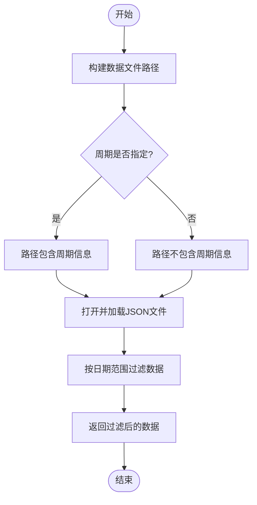
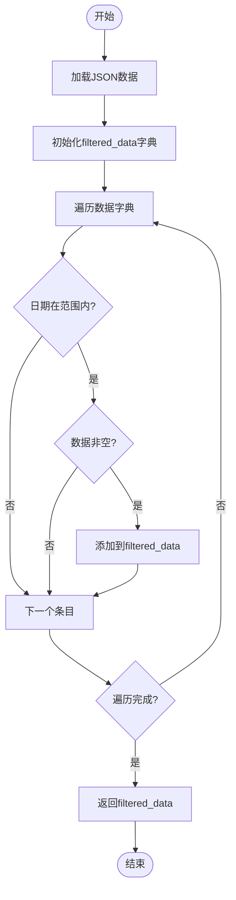
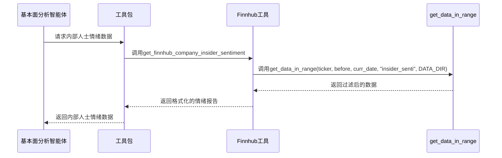
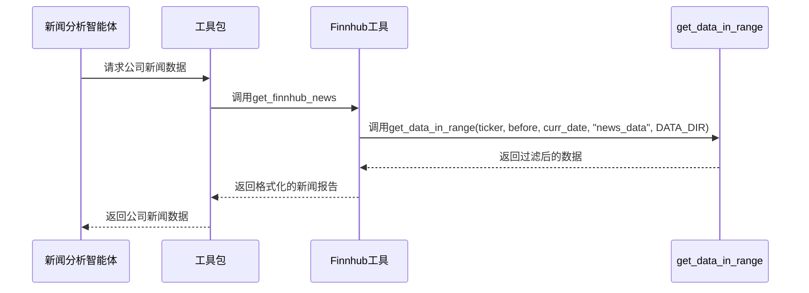

# Finnhub 数据集成

<cite>
**Referenced Files in This Document**   
- [finnhub_utils.py](file://tradingagents/dataflows/finnhub_utils.py)
- [interface.py](file://tradingagents/dataflows/interface.py)
- [config.py](file://tradingagents/dataflows/config.py)
- [default_config.py](file://tradingagents/default_config.py)
- [fundamentals_analyst.py](file://tradingagents/agents/analysts/fundamentals_analyst.py)
- [news_analyst.py](file://tradingagents/agents/analysts/news_analyst.py)
</cite>

## 目录
1. [核心功能概述](#核心功能概述)
2. [get_data_in_range 函数详解](#get_data_in_range-函数详解)
3. [数据加载与缓存机制](#数据加载与缓存机制)
4. [数据过滤逻辑](#数据过滤逻辑)
5. [调用示例与异常处理](#调用示例与异常处理)
6. [在整体数据流中的作用](#在整体数据流中的作用)
7. [与智能体的协作关系](#与智能体的协作关系)

## 核心功能概述

Finnhub 数据集成模块是 TradingAgents 系统中用于获取和处理金融数据的核心组件。该模块通过 `finnhub_utils.py` 文件中的 `get_data_in_range` 函数，从本地磁盘加载预缓存的 Finnhub 金融数据。这些数据包括公司内部人士交易、SEC 文件、新闻数据、内部人士情绪和财务报告等。

该模块的设计旨在提供高效的数据访问，避免重复的网络请求，并确保数据的一致性和可靠性。通过将数据缓存在本地磁盘，系统可以在需要时快速检索和处理数据，从而提高整体性能和响应速度。

**Section sources**
- [finnhub_utils.py](file://tradingagents/dataflows/finnhub_utils.py#L1-L36)

## get_data_in_range 函数详解

`get_data_in_range` 函数是 Finnhub 数据集成模块的核心，负责从本地磁盘加载指定范围内的金融数据。该函数的参数如下：

- **ticker** (str): 公司的股票代码，用于标识要查询的公司。
- **start_date** (str): 查询的起始日期，格式为 YYYY-MM-DD。
- **end_date** (str): 查询的结束日期，格式为 YYYY-MM-DD。
- **data_type** (str): 要获取的数据类型，可以是 `insider_trans`（内部人士交易）、`SEC_filings`（SEC 文件）、`news_data`（新闻数据）、`insider_senti`（内部人士情绪）或 `fin_as_reported`（财务报告）。
- **data_dir** (str): 存储数据的目录路径。
- **period** (str, optional): 如果指定了周期，应为 `annual`（年度）或 `quarterly`（季度）。

该函数首先根据 `period` 参数构建数据文件的路径。如果 `period` 不为空，则路径中包含周期信息；否则，路径中不包含周期信息。然后，函数打开并加载指定路径的 JSON 文件，读取数据。



**Diagram sources**
- [finnhub_utils.py](file://tradingagents/dataflows/finnhub_utils.py#L4-L35)

**Section sources**
- [finnhub_utils.py](file://tradingagents/dataflows/finnhub_utils.py#L4-L35)

## 数据加载与缓存机制

Finnhub 数据集成模块采用本地磁盘缓存机制来存储和管理金融数据。数据文件以 JSON 格式存储在指定的 `data_dir` 目录下，路径结构为 `data_dir/finnhub_data/data_type/ticker_period_data_formatted.json` 或 `data_dir/finnhub_data/data_type/ticker_data_formatted.json`，具体取决于是否指定了周期。

当 `get_data_in_range` 函数被调用时，它会根据提供的参数构建相应的文件路径，并尝试从该路径加载数据。如果文件存在且可读，函数将成功加载数据；如果文件不存在或无法读取，函数将抛出异常。

为了确保数据路径的正确性和文件的完整性，建议在调用 `get_data_in_range` 函数之前，先检查 `data_dir` 目录是否存在，并确认数据文件是否已正确生成。此外，可以通过定期更新数据文件来保持数据的时效性。

**Section sources**
- [finnhub_utils.py](file://tradingagents/dataflows/finnhub_utils.py#L4-L35)
- [config.py](file://tradingagents/dataflows/config.py#L1-L34)

## 数据过滤逻辑

`get_data_in_range` 函数在加载数据后，会对数据进行过滤，以确保只返回指定日期范围内的有效数据。过滤逻辑如下：

1. 遍历加载的数据字典，检查每个键（日期）是否在 `start_date` 和 `end_date` 之间。
2. 对于符合条件的键，检查其对应的值（数据列表）是否非空。
3. 将符合条件的键值对添加到 `filtered_data` 字典中。

最终，函数返回 `filtered_data` 字典，其中包含指定日期范围内的所有有效数据。



**Diagram sources**
- [finnhub_utils.py](file://tradingagents/dataflows/finnhub_utils.py#L4-L35)

**Section sources**
- [finnhub_utils.py](file://tradingagents/dataflows/finnhub_utils.py#L4-L35)

## 调用示例与异常处理

以下是一个调用 `get_data_in_range` 函数的示例：

```python
ticker = "AAPL"
start_date = "2023-01-01"
end_date = "2023-12-31"
data_type = "news_data"
data_dir = "/path/to/data_dir"

try:
    data = get_data_in_range(ticker, start_date, end_date, data_type, data_dir)
    print(data)
except FileNotFoundError:
    print("数据文件未找到，请检查数据路径和文件名。")
except json.JSONDecodeError:
    print("JSON 解码错误，请检查数据文件的格式。")
except Exception as e:
    print(f"发生未知错误: {e}")
```

在调用 `get_data_in_range` 函数时，应注意以下几点：

- 确保 `data_dir` 目录存在且可读。
- 确认数据文件已正确生成，并且文件名与 `ticker` 和 `data_type` 匹配。
- 处理可能的异常，如文件未找到、JSON 解码错误等。

**Section sources**
- [finnhub_utils.py](file://tradingagents/dataflows/finnhub_utils.py#L4-L35)

## 在整体数据流中的作用

Finnhub 数据集成模块在 TradingAgents 系统的整体数据流中扮演着关键角色。它为其他模块和智能体提供高质量的金融数据，支持基本面分析、新闻分析和市场分析等多种任务。

通过从本地磁盘加载预缓存的数据，该模块减少了对网络资源的依赖，提高了数据访问的速度和可靠性。同时，数据的本地化存储也便于数据的管理和维护，确保了数据的一致性和完整性。

**Section sources**
- [interface.py](file://tradingagents/dataflows/interface.py#L1-L808)

## 与智能体的协作关系

Finnhub 数据集成模块与多个智能体紧密协作，共同完成复杂的金融分析任务。以下是两个主要的协作关系：

### 与基本面分析智能体的协作

基本面分析智能体（`fundamentals_analyst.py`）利用 Finnhub 数据集成模块提供的内部人士交易和内部人士情绪数据，进行深入的基本面分析。当 `online_tools` 配置为 `False` 时，智能体会调用 `get_finnhub_company_insider_sentiment` 和 `get_finnhub_company_insider_transactions` 函数，获取指定公司和日期范围内的相关数据。



**Diagram sources**
- [fundamentals_analyst.py](file://tradingagents/agents/analysts/fundamentals_analyst.py#L1-L64)
- [interface.py](file://tradingagents/dataflows/interface.py#L1-L808)

**Section sources**
- [fundamentals_analyst.py](file://tradingagents/agents/analysts/fundamentals_analyst.py#L1-L64)
- [interface.py](file://tradingagents/dataflows/interface.py#L1-L808)

### 与新闻分析智能体的协作

新闻分析智能体（`news_analyst.py`）利用 Finnhub 数据集成模块提供的新闻数据，进行新闻和趋势分析。当 `online_tools` 配置为 `False` 时，智能体会调用 `get_finnhub_news` 函数，获取指定公司和日期范围内的新闻数据。



**Diagram sources**
- [news_analyst.py](file://tradingagents/agents/analysts/news_analyst.py#L1-L60)
- [interface.py](file://tradingagents/dataflows/interface.py#L1-L808)

**Section sources**
- [news_analyst.py](file://tradingagents/agents/analysts/news_analyst.py#L1-L60)
- [interface.py](file://tradingagents/dataflows/interface.py#L1-L808)