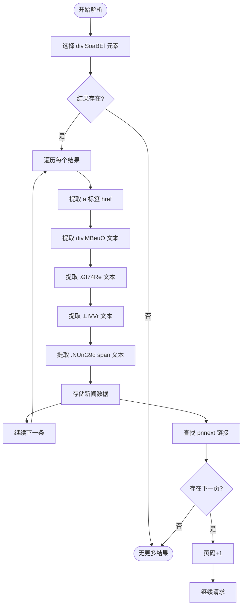
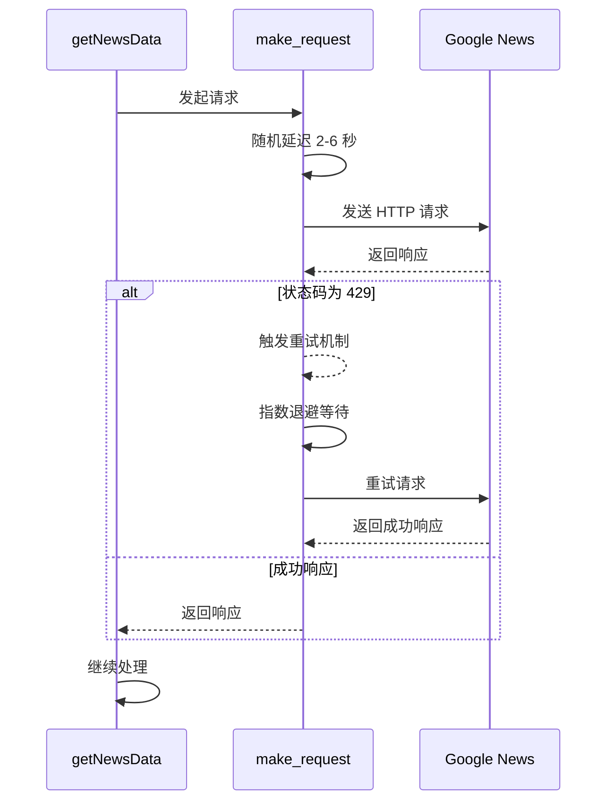
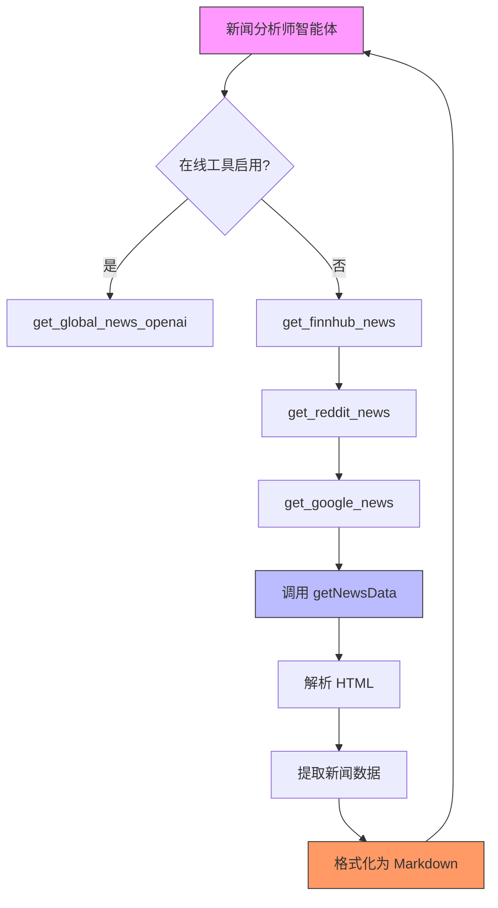

# Google News 数据集成

<cite>
**本文档引用的文件**
- [googlenews_utils.py](file://tradingagents/dataflows/googlenews_utils.py)
- [interface.py](file://tradingagents/dataflows/interface.py)
- [news_analyst.py](file://tradingagents/agents/analysts/news_analyst.py)
</cite>

## 目录
1. [简介](#简介)
2. [核心功能概述](#核心功能概述)
3. [URL 构造与 tbs 参数详解](#url-构造与-tbs-参数详解)
4. [HTML 解析实现细节](#html-解析实现细节)
5. [重试机制与反检测策略](#重试机制与反检测策略)
6. [请求头配置最佳实践](#请求头配置最佳实践)
7. [数据传递流程](#数据传递流程)
8. [结论](#结论)

## 简介
本模块实现了从 Google News 网页端抓取指定查询关键词和日期范围内新闻数据的功能，为交易决策系统中的新闻分析师智能体提供实时、结构化的新闻信息支持。该功能通过网络爬虫技术模拟浏览器行为，结合智能重试和反检测机制，确保在复杂网络环境下稳定获取数据。

## 核心功能概述
`getNewsData` 函数是 Google News 数据集成的核心，负责执行完整的新闻抓取流程。该函数接收查询关键词、起始日期和结束日期作为输入参数，返回包含新闻标题、摘要、日期、来源和链接的结构化结果列表。整个流程包括日期格式标准化、URL 动态构造、HTTP 请求发送、HTML 内容解析、分页处理和异常捕获等关键步骤。

**Section sources**
- [googlenews_utils.py](file://tradingagents/dataflows/googlenews_utils.py#L33-L107)

## URL 构造与 tbs 参数详解
Google News 的搜索结果通过特定的 URL 参数进行控制。本模块采用精确的 URL 构造逻辑来限定搜索范围：

- **基础搜索路径**：`https://www.google.com/search`
- **查询参数**：`q={query}` 用于指定搜索关键词
- **新闻类型标识**：`tbm=nws` 指定搜索类型为新闻
- **分页控制**：`start={offset}` 实现结果分页，每页偏移量为 10 的倍数

`tbs` 参数是时间范围过滤的核心，其格式为 `cdr:1,cd_min:{start_date},cd_max:{end_date}`，其中：
- `cdr:1` 启用自定义日期范围过滤
- `cd_min` 指定搜索的起始日期
- `cd_max` 指定搜索的结束日期

日期格式在内部被统一转换为 `mm/dd/yyyy` 格式以确保兼容性。

**Section sources**
- [googlenews_utils.py](file://tradingagents/dataflows/googlenews_utils.py#L58-L65)

## HTML 解析实现细节
本模块使用 BeautifulSoup 库对 Google News 的 HTML 页面进行解析，提取关键新闻信息。解析过程基于稳定的 CSS 选择器定位页面元素：

- **新闻容器**：使用 `div.SoaBEf` 选择器定位每条新闻条目
- **标题提取**：通过 `div.MBeuO` 选择器获取新闻标题文本
- **摘要提取**：使用 `.GI74Re` 选择器获取新闻摘要内容
- **日期提取**：通过 `.LfVVr` 选择器获取新闻发布或收录时间
- **来源提取**：使用 `.NUnG9d span` 选择器获取新闻来源媒体名称
- **链接提取**：从新闻容器内的 `<a>` 标签中提取 `href` 属性

解析过程包含异常处理机制，当某个字段无法提取时会跳过该条目并继续处理下一条，确保整体流程的健壮性。

**Diagram sources**
- [googlenews_utils.py](file://tradingagents/dataflows/googlenews_utils.py#L70-L107)

**Section sources**
- [googlenews_utils.py](file://tradingagents/dataflows/googlenews_utils.py#L70-L107)

## 重试机制与反检测策略
为应对网络波动和速率限制，本模块实现了多层次的容错和反检测机制：

### 重试机制
基于 `tenacity` 库实现智能重试逻辑，当服务器返回 429 状态码（速率限制）时自动触发重试。重试策略采用指数退避算法：
- **重试条件**：`retry_if_result(is_rate_limited)` 检查响应状态码
- **等待策略**：`wait_exponential(multiplier=1, min=4, max=60)` 实现指数增长的等待时间
- **最大尝试次数**：`stop_after_attempt(5)` 限制最多尝试 5 次

### 反检测策略
为避免被识别为自动化脚本，每次请求前都会引入随机延迟：
- **随机延迟**：`time.sleep(random.uniform(2, 6))` 在 2-6 秒之间随机休眠
- **请求间隔**：确保请求之间有足够的时间间隔，模拟人类操作行为

**Diagram sources**
- [googlenews_utils.py](file://tradingagents/dataflows/googlenews_utils.py#L15-L45)

**Section sources**
- [googlenews_utils.py](file://tradingagents/dataflows/googlenews_utils.py#L15-L45)

## 请求头配置最佳实践
为了提高请求的成功率并模拟真实浏览器行为，本模块配置了精心设计的请求头：

- **User-Agent**：模拟最新版本的 Chrome 浏览器在 Windows 10 系统上的行为
- **浏览器标识**：包含完整的 Mozilla、WebKit 和 Chrome 版本信息
- **平台信息**：明确指定为 Windows NT 10.0 x64 平台

这种配置有助于绕过基本的机器人检测机制，同时确保服务器返回适合现代浏览器的 HTML 内容。

**Section sources**
- [googlenews_utils.py](file://tradingagents/dataflows/googlenews_utils.py#L47-L55)

## 数据传递流程
Google News 数据集成模块与新闻分析师智能体通过清晰的接口进行数据传递：

1. **工具注册**：`get_google_news` 函数作为工具被注册到工具包中
2. **参数转换**：接收查询关键词、当前日期和回溯天数，自动计算起止日期
3. **数据获取**：调用 `getNewsData` 执行实际的爬虫操作
4. **格式化输出**：将原始数据转换为 Markdown 格式的结构化文本
5. **智能体输入**：格式化后的新闻数据作为上下文输入提供给新闻分析师智能体

新闻分析师智能体利用这些数据生成综合性的市场分析报告，为交易决策提供支持。

**Diagram sources**
- [interface.py](file://tradingagents/dataflows/interface.py#L274-L302)
- [news_analyst.py](file://tradingagents/agents/analysts/news_analyst.py#L1-L60)

**Section sources**
- [interface.py](file://tradingagents/dataflows/interface.py#L274-L302)
- [news_analyst.py](file://tradingagents/agents/analysts/news_analyst.py#L1-L60)

## 结论
Google News 数据集成模块通过精心设计的爬虫架构，实现了稳定、可靠和隐蔽的新闻数据获取能力。其核心优势在于：
- 灵活的日期范围控制和 URL 构造逻辑
- 健壮的 HTML 解析和异常处理机制
- 智能的重试和反检测策略
- 与智能体系统的无缝集成

该模块为交易决策系统提供了重要的外部信息源，增强了系统对市场动态的感知能力和分析深度。