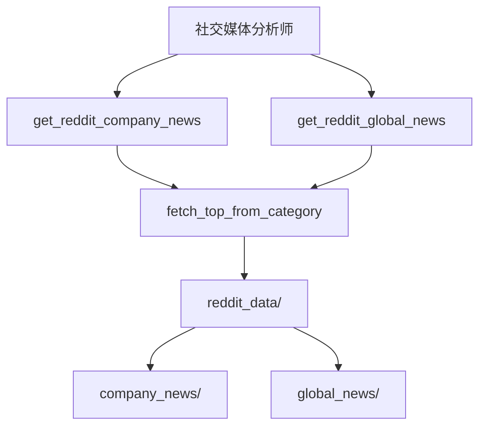
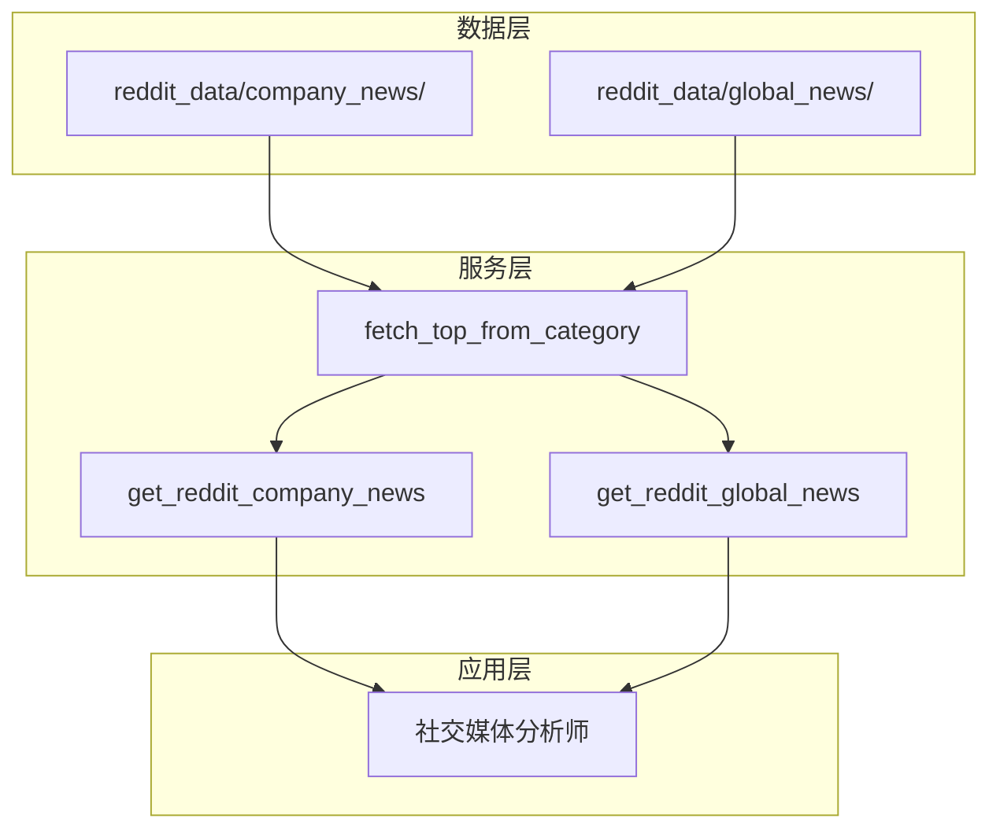
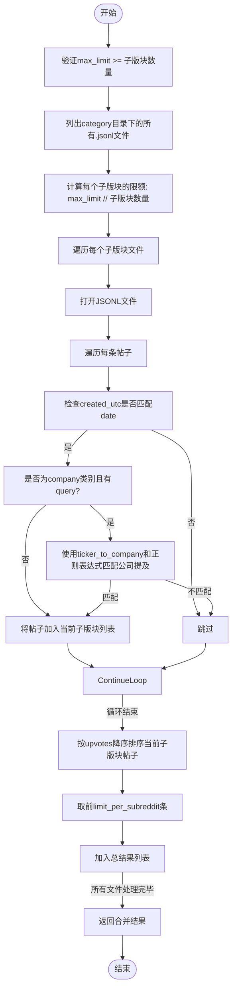
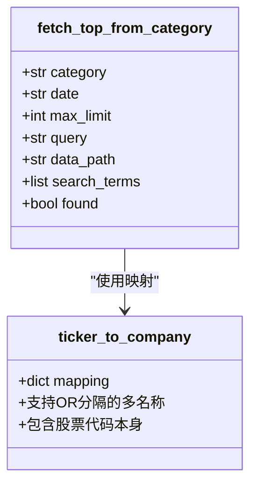
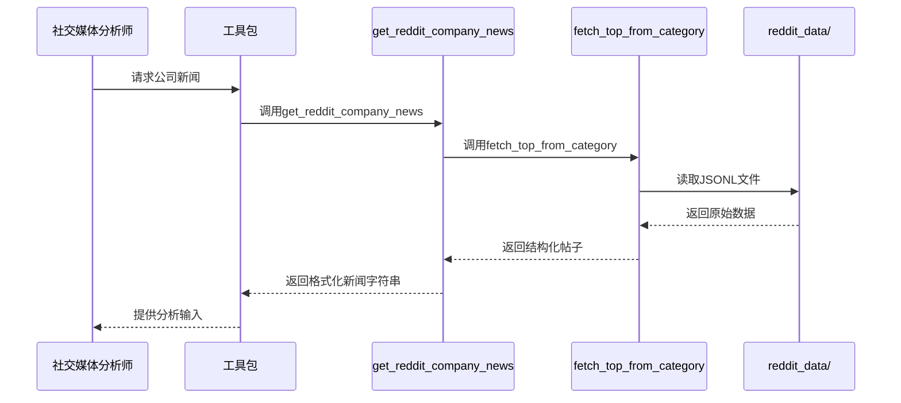
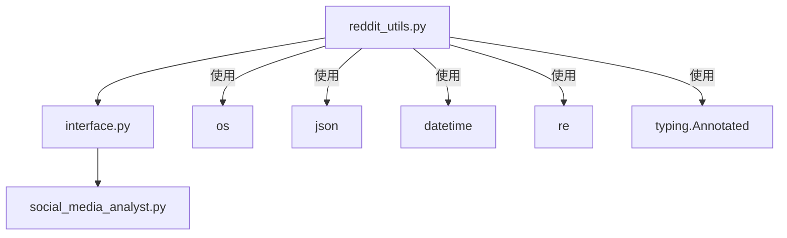

# Reddit 社交媒体集成

<cite>
**本文档中引用的文件**  
- [reddit_utils.py](file://tradingagents/dataflows/reddit_utils.py)
- [interface.py](file://tradingagents/dataflows/interface.py)
- [social_media_analyst.py](file://tradingagents/agents/analysts/social_media_analyst.py)
</cite>

## 目录
1. [简介](#简介)
2. [项目结构](#项目结构)
3. [核心组件](#核心组件)
4. [架构概述](#架构概述)
5. [详细组件分析](#详细组件分析)
6. [依赖分析](#依赖分析)
7. [性能考虑](#性能考虑)
8. [故障排除指南](#故障排除指南)
9. [结论](#结论)

## 简介
本文档详细说明了Reddit社交媒体集成模块的设计与实现，重点阐述`fetch_top_from_category`函数如何从本地存储的Reddit数据中提取高质量帖子。该模块支持社交媒体分析师智能体对特定公司或宏观新闻进行舆情分析，通过结构化数据提取和多形式匹配机制，为交易决策提供社会情绪支持。

## 项目结构
Reddit数据处理模块位于`tradingagents/dataflows/`目录下，主要由`reddit_utils.py`和`interface.py`构成。数据源假设为预先抓取并按类别组织的JSONL文件，存储于`reddit_data`目录中。社交媒体分析师通过工具包调用接口函数获取结构化新闻内容。

**Diagram sources**  
- [interface.py](file://tradingagents/dataflows/interface.py#L310-L359)
- [reddit_utils.py](file://tradingagents/dataflows/reddit_utils.py#L51-L134)

**Section sources**
- [interface.py](file://tradingagents/dataflows/interface.py#L310-L429)
- [reddit_utils.py](file://tradingagents/dataflows/reddit_utils.py#L51-L134)

## 核心组件
核心功能由`fetch_top_from_category`函数实现，该函数根据类别、日期和数量限制从本地Reddit数据中提取高质量帖子。`ticker_to_company`映射表支持公司名称的多形式匹配，正则表达式用于在标题和内容中搜索公司提及。社交媒体分析师节点集成该功能，构建舆情分析报告。

**Section sources**
- [reddit_utils.py](file://tradingagents/dataflows/reddit_utils.py#L51-L134)
- [social_media_analyst.py](file://tradingagents/agents/analysts/social_media_analyst.py#L0-L59)

## 架构概述
系统采用离线数据预处理架构，假设Reddit数据已通过外部流程抓取并存储为JSONL格式。`fetch_top_from_category`作为核心提取函数，被`get_reddit_company_news`和`get_reddit_global_news`封装，供社交媒体分析师调用。整个流程无需实时网络请求，确保分析过程的稳定性和可重复性。

**Diagram sources**  
- [reddit_utils.py](file://tradingagents/dataflows/reddit_utils.py#L51-L134)
- [interface.py](file://tradingagents/dataflows/interface.py#L310-L429)

## 详细组件分析

### fetch_top_from_category 函数分析
该函数实现从指定类别中提取高质量Reddit帖子的核心逻辑。它接收类别、日期、最大数量和可选查询参数，返回按点赞数排序的帖子列表。

#### 参数协同工作机制
函数的三个核心参数`category`、`date`和`max_limit`协同工作：`category`确定数据源子目录，`date`过滤发布时间，`max_limit`控制返回数量。当查询公司新闻时，`query`参数激活公司名称匹配逻辑。

**Diagram sources**  
- [reddit_utils.py](file://tradingagents/dataflows/reddit_utils.py#L51-L134)

#### 子版块平均分配算法
当`max_limit`大于子版块数量时，函数采用平均分配策略。通过`limit_per_subreddit = max_limit // 子版块数量`计算每个子版块的获取限额，确保数据来源的多样性。此算法防止某个子版块主导结果，提升舆情分析的全面性。

**Section sources**
- [reddit_utils.py](file://tradingagents/dataflows/reddit_utils.py#L65-L68)

### ticker_to_company 映射表分析
该字典实现股票代码到公司名称的映射，支持多形式匹配。对于存在别名的公司（如Meta/Facebook），值中包含"OR"分隔的多个名称，允许正则表达式进行灵活匹配。

#### 多形式匹配实现
当`category`包含"company"且提供`query`时，函数检查`ticker_to_company[query]`是否包含"OR"。若包含，则分割为多个搜索词；否则直接使用公司名称。最终搜索词列表包含公司名称和股票代码本身，确保匹配的全面性。

**Diagram sources**  
- [reddit_utils.py](file://tradingagents/dataflows/reddit_utils.py#L0-L48)
- [reddit_utils.py](file://tradingagents/dataflows/reddit_utils.py#L91-L107)

#### 正则表达式搜索实现
系统使用`re.search(term, text, re.IGNORECASE)`在帖子标题和内容中进行不区分大小写的模式匹配。搜索词列表依次尝试，一旦匹配成功即标记`found=True`并保留该帖子。此实现确保公司提及的准确识别，同时支持名称变体。

**Section sources**
- [reddit_utils.py](file://tradingagents/dataflows/reddit_utils.py#L109-L118)

### 数据预抓取架构设计
本模块采用"数据与逻辑分离"的架构设计，假设Reddit数据已通过外部流程预先抓取并存储为JSONL文件。这种设计带来三大优势：1) 分离关注点，抓取与分析解耦；2) 提高分析性能，避免实时网络延迟；3) 增强可测试性，使用固定数据集验证逻辑。

#### 与社交媒体分析师的集成
`social_media_analyst.py`通过工具包调用`get_reddit_company_news`或`get_reddit_global_news`。当`online_tools`为`False`时，系统自动选择Reddit数据源，否则调用在线搜索。分析师节点将获取的帖子内容整合为结构化报告，为交易决策提供依据。

**Diagram sources**  
- [social_media_analyst.py](file://tradingagents/agents/analysts/social_media_analyst.py#L0-L59)
- [interface.py](file://tradingagents/dataflows/interface.py#L362-L429)
- [reddit_utils.py](file://tradingagents/dataflows/reddit_utils.py#L51-L134)

**Section sources**
- [social_media_analyst.py](file://tradingagents/agents/analysts/social_media_analyst.py#L0-L59)
- [interface.py](file://tradingagents/dataflows/interface.py#L362-L429)

## 依赖分析
Reddit集成模块依赖`os`、`json`、`datetime`和`re`等标准库，以及`typing.Annotated`用于参数注解。`interface.py`依赖`reddit_utils.py`的`fetch_top_from_category`函数，形成清晰的调用链。社交媒体分析师依赖`interface.py`提供的封装接口，实现松耦合集成。

**Diagram sources**  
- [reddit_utils.py](file://tradingagents/dataflows/reddit_utils.py#L0-L10)
- [interface.py](file://tradingagents/dataflows/interface.py#L0-L3)

**Section sources**
- [reddit_utils.py](file://tradingagents/dataflows/reddit_utils.py#L0-L10)
- [interface.py](file://tradingagents/dataflows/interface.py#L0-L3)

## 性能考虑
由于数据已本地化，主要性能开销在于文件I/O和正则表达式匹配。建议将`max_limit`设置为合理值以控制内存占用。对于高频调用场景，可考虑将常用数据加载到内存缓存中。正则表达式的复杂度较低，主要为字符串包含匹配，性能影响较小。

## 故障排除指南
常见问题包括`max_limit`小于子版块数量导致的ValueError，可通过增加`max_limit`解决。数据未找到时返回空字符串，需检查`data_path`和文件日期格式。公司提及匹配失败时，应验证`ticker_to_company`映射表是否包含目标公司。JSONL解析错误通常由损坏的文件引起，需重新抓取数据。

**Section sources**
- [reddit_utils.py](file://tradingagents/dataflows/reddit_utils.py#L60-L63)
- [reddit_utils.py](file://tradingagents/dataflows/reddit_utils.py#L80-L82)

## 结论
Reddit社交媒体集成模块通过`fetch_top_from_category`函数实现了高效、灵活的本地数据提取。其平均分配算法确保了数据多样性，`ticker_to_company`映射表和正则表达式实现了精准的公司提及识别。与社交媒体分析师的无缝集成，为交易系统提供了重要的社会情绪分析能力。该离线架构设计平衡了性能、稳定性和可维护性，是系统的重要组成部分。