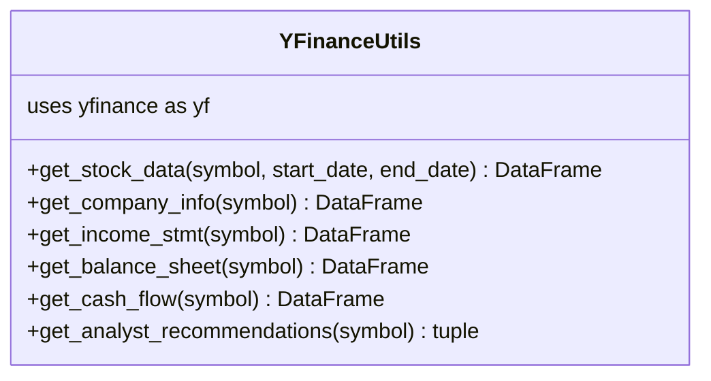
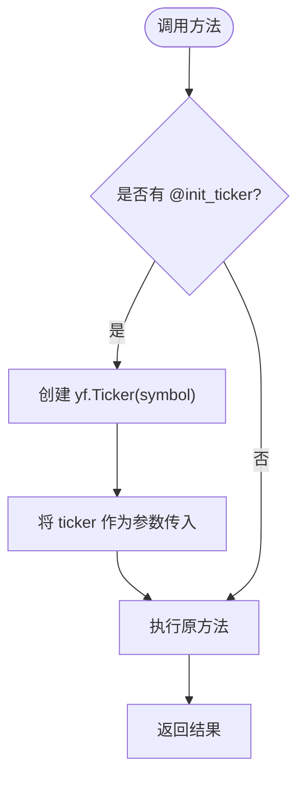
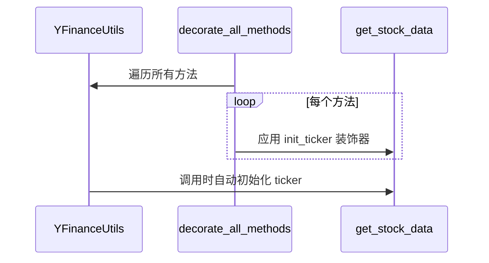
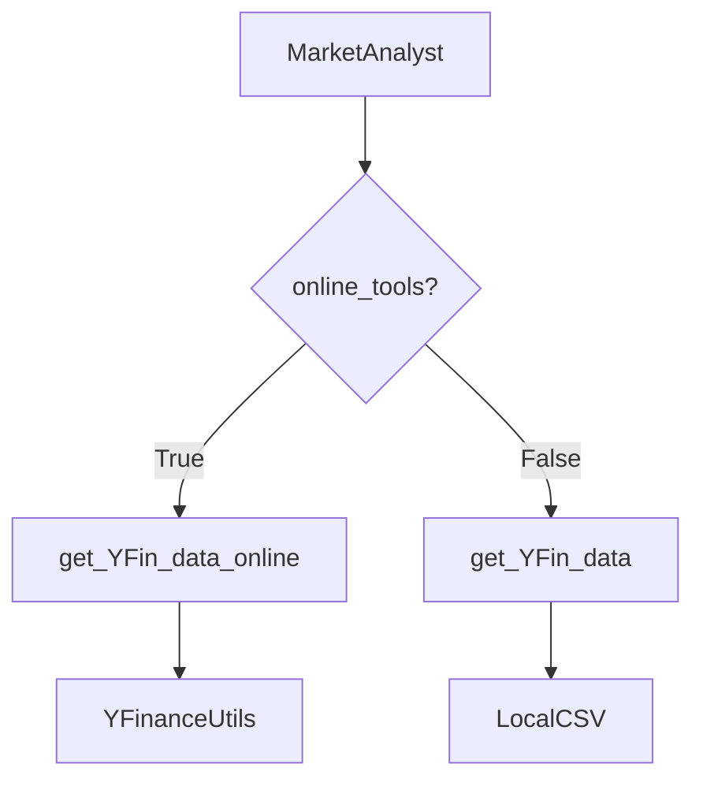

# Yahoo Finance 数据集成

<cite>
**本文档中引用的文件**  
- [yfin_utils.py](file://tradingagents/dataflows/yfin_utils.py)
- [fundamentals_analyst.py](file://tradingagents/agents/analysts/fundamentals_analyst.py)
- [market_analyst.py](file://tradingagents/agents/analysts/market_analyst.py)
- [utils.py](file://tradingagents/dataflows/utils.py)
- [interface.py](file://tradingagents/dataflows/interface.py)
</cite>

## 目录
1. [简介](#简介)
2. [核心组件](#核心组件)
3. [YFinanceUtils 类详解](#yfinanceutils-类详解)
4. [方法实现细节](#方法实现细节)
5. [装饰器机制](#装饰器机制)
6. [与分析师模块的集成](#与分析师模块的集成)
7. [调用示例](#调用示例)
8. [结论](#结论)

## 简介
本项目通过 `YFinanceUtils` 类实现了与 Yahoo Finance 的深度集成，为市场和技术分析提供基础数据支持。该工具类封装了获取股票历史数据、公司信息、财务报表及分析师评级等核心功能，是交易代理系统中数据获取的关键组件。

**Section sources**
- [yfin_utils.py](file://tradingagents/dataflows/yfin_utils.py#L1-L117)

## 核心组件
`YFinanceUtils` 类位于 `tradingagents/dataflows/yfin_utils.py` 文件中，基于 `yfinance` 库构建，提供了一系列用于获取金融数据的方法。这些方法被统一通过装饰器进行初始化处理，确保在调用时自动创建 `yf.Ticker` 实例。



**Diagram sources**
- [yfin_utils.py](file://tradingagents/dataflows/yfin_utils.py#L23-L116)

**Section sources**
- [yfin_utils.py](file://tradingagents/dataflows/yfin_utils.py#L23-L116)

## YFinanceUtils 类详解
`YFinanceUtils` 是一个静态工具类，所有方法均为类方法，无需实例化即可调用。该类通过 `@decorate_all_methods(init_ticker)` 装饰器统一管理其内部方法的 ticker 初始化逻辑。

### 数据获取方法概览
| 方法名 | 功能描述 | 返回类型 |
|-------|--------|--------|
| `get_stock_data` | 获取指定时间段内的股价历史数据 | DataFrame |
| `get_company_info` | 获取公司基本信息 | DataFrame |
| `get_income_stmt` | 获取最新利润表 | DataFrame |
| `get_balance_sheet` | 获取最新资产负债表 | DataFrame |
| `get_cash_flow` | 获取最新现金流量表 | DataFrame |
| `get_analyst_recommendations` | 获取主流分析师评级 | tuple |

**Section sources**
- [yfin_utils.py](file://tradingagents/dataflows/yfin_utils.py#L23-L116)

## 方法实现细节

### get_stock_data 方法
该方法用于获取指定股票在给定时间范围内的历史价格数据。它会自动将 `end_date` 向后推移一天以确保数据范围的包含性，并调用 `ticker.history()` 方法获取数据。

**Section sources**
- [yfin_utils.py](file://tradingagents/dataflows/yfin_utils.py#L44-L60)

### get_company_info 方法
此方法从 `ticker.info` 中提取关键公司信息，包括公司名称、行业、部门、国家和网站，并将其组织成一个单行的 DataFrame 返回。

**Section sources**
- [yfin_utils.py](file://tradingagents/dataflows/yfin_utils.py#L62-L78)

### 财务报表相关方法
`get_income_stmt`、`get_balance_sheet` 和 `get_cash_flow` 三个方法分别调用 `ticker.financials`、`ticker.balance_sheet` 和 `ticker.cashflow` 属性来获取对应的财务报表数据。这些方法返回的 DataFrame 包含多年度的财务数据，按列排列。

**Section sources**
- [yfin_utils.py](file://tradingagents/dataflows/yfin_utils.py#L84-L100)

### get_analyst_recommendations 方法
该方法解析 `ticker.recommendations` 数据，返回当前最主流的分析师评级及其投票数。它通过排除 `period` 列并找出第一行中最大值的索引来确定主流意见。

**Section sources**
- [yfin_utils.py](file://tradingagents/dataflows/yfin_utils.py#L102-L116)

## 装饰器机制

### init_ticker 装饰器
`init_ticker` 是一个函数装饰器，负责初始化 `yf.Ticker` 对象并将其实例作为第一个参数传递给被装饰的方法。这使得类内所有方法可以直接使用已初始化的 ticker 实例。



**Diagram sources**
- [yfin_utils.py](file://tradingagents/dataflows/yfin_utils.py#L15-L21)

### decorate_all_methods 应用
`decorate_all_methods` 是一个类装饰器工厂函数，定义于 `utils.py` 中，能够将指定的装饰器（如 `init_ticker`）批量应用于类中的所有可调用成员。



**Diagram sources**
- [yfin_utils.py](file://tradingagents/dataflows/yfin_utils.py#L23)
- [utils.py](file://tradingagents/dataflows/utils.py#L35-L39)

**Section sources**
- [yfin_utils.py](file://tradingagents/dataflows/yfin_utils.py#L23)
- [utils.py](file://tradingagents/dataflows/utils.py#L35-L39)

## 与分析师模块的集成

### 与市场分析师集成
`market_analyst.py` 中的 `create_market_analyst` 函数根据配置决定使用在线或离线工具获取数据。当启用 `online_tools` 时，会调用 `toolkit.get_YFin_data_online` 来实时获取 Yahoo Finance 数据。



**Diagram sources**
- [market_analyst.py](file://tradingagents/agents/analysts/market_analyst.py#L10-L25)

**Section sources**
- [market_analyst.py](file://tradingagents/agents/analysts/market_analyst.py#L10-L25)

### 与基本面分析师集成
虽然 `fundamentals_analyst.py` 主要依赖 Finnhub 和 SimFin 数据源，但其设计模式与 YFinanceUtils 一致，均通过 toolkit 提供数据接口，体现了系统在数据访问层面的统一抽象。

**Section sources**
- [fundamentals_analyst.py](file://tradingagents/agents/analysts/fundamentals_analyst.py#L10-L25)

## 调用示例
以下为 `YFinanceUtils` 的典型调用方式：

```python
# 获取苹果公司过去一年的股价数据
stock_data = YFinanceUtils.get_stock_data("AAPL", "2024-01-01", "2024-12-31")

# 获取公司基本信息
company_info = YFinanceUtils.get_company_info("AAPL")

# 获取最新利润表
income_stmt = YFinanceUtils.get_income_stmt("AAPL")

# 获取分析师主流评级
recommendation, count = YFinanceUtils.get_analyst_recommendations("AAPL")
```

**Section sources**
- [yfin_utils.py](file://tradingagents/dataflows/yfin_utils.py#L44-L116)

## 结论
`YFinanceUtils` 类通过简洁的接口封装了复杂的金融数据获取逻辑，结合装饰器模式实现了代码复用和初始化自动化。其与市场分析师模块的深度集成，确保了系统能够在需要时获取最新的市场数据，为交易决策提供有力支持。