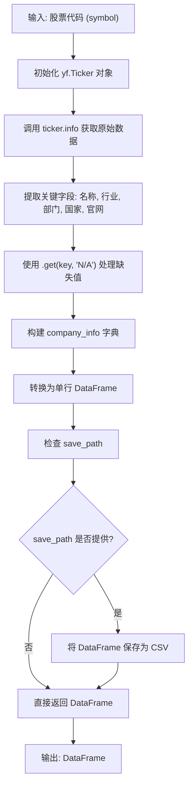
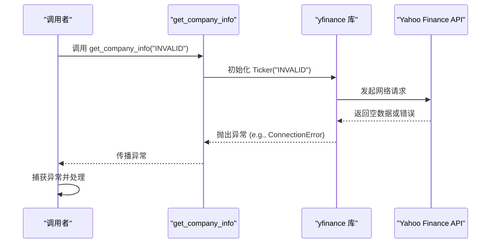

# 公司基本信息集成

<cite>
**本文档引用的文件**  
- [yfin_utils.py](file://tradingagents/dataflows/yfin_utils.py)
- [fundamentals_analyst.py](file://tradingagents/agents/analysts/fundamentals_analyst.py)
- [interface.py](file://tradingagents/dataflows/interface.py)
</cite>

## 目录
1. [方法概述](#方法概述)
2. [技术实现细节](#技术实现细节)
3. [数据来源与字段说明](#数据来源与字段说明)
4. [结果持久化与输出格式](#结果持久化与输出格式)
5. [在基本面分析中的应用](#在基本面分析中的应用)
6. [调用示例](#调用示例)
7. [异常处理机制](#异常处理机制)

## 方法概述

`get_company_info` 方法是 `YFinanceUtils` 工具类中的一个核心功能，旨在为用户提供一种便捷的方式来获取上市公司的基本背景信息。该方法通过集成 yfinance 库，从公开的金融数据源中提取关键的企业元数据，并将其组织成结构化的数据格式，以便于后续的分析和处理。

**Section sources**
- [yfin_utils.py](file://tradingagents/dataflows/yfin_utils.py#L52-L70)

## 技术实现细节

该方法的实现采用了清晰的函数式设计。它接收一个股票代码（`symbol`）作为必填参数，并提供一个可选的 `save_path` 参数用于结果的持久化存储。

其核心逻辑流程如下：
1.  **初始化 Ticker 对象**：方法利用 `@init_ticker` 装饰器，自动将传入的股票代码字符串转换为一个 `yfinance.Ticker` 对象。这个装饰器封装了 `yf.Ticker(symbol)` 的初始化过程，使得主函数逻辑更加简洁。
2.  **获取原始信息**：通过访问 `ticker.info` 属性，方法获取一个包含该公司所有可用信息的字典。`info` 属性是 yfinance 库提供的一个强大接口，它会向 Yahoo Finance API 发起网络请求，拉取最新的公司数据。
3.  **数据提取与结构化**：从 `info` 字典中，方法精确地提取出“公司名称”、“行业”、“部门”、“国家”和“官网”这五个关键字段。为了保证数据的健壮性，使用了字典的 `.get()` 方法，并为每个字段设置了默认值 "N/A"，以应对数据缺失的情况。
4.  **创建 DataFrame**：将提取出的五个字段组织成一个 Python 字典 `company_info`，然后使用 `pandas.DataFrame([company_info])` 将其转换为一个单行的 DataFrame。这种结构化的数据格式便于与其他数据分析流程集成。



**Diagram sources**
- [yfin_utils.py](file://tradingagents/dataflows/yfin_utils.py#L52-L70)

**Section sources**
- [yfin_utils.py](file://tradingagents/dataflows/yfin_utils.py#L52-L70)

## 数据来源与字段说明

`get_company_info` 方法的所有数据均来源于 Yahoo Finance 的公开 API，通过 yfinance 库进行访问。以下是各字段的具体说明：

| 字段 | 数据来源 (yfinance.info 键) | 说明 | 可能出现 "N/A" 的情况 |
| :--- | :--- | :--- | :--- |
| **公司名称** | `shortName` | 公司的简称或常用名。 | 当 Yahoo Finance 未收录该公司或数据源临时不可用时。 |
| **行业** | `industry` | 公司所属的细分行业类别。 | 某些特殊或新上市的公司可能缺少行业分类。 |
| **部门** | `sector` | 公司所属的宏观经济部门，如科技、金融、医疗等。 | 同上，数据源不完整时。 |
| **国家** | `country` | 公司的注册地或主要运营国家。 | 国际化公司或数据源错误时可能为空。 |
| **官网** | `website` | 公司的官方网站链接。 | 公司未提供或数据未被正确抓取时。 |

**Section sources**
- [yfin_utils.py](file://tradingagents/dataflows/yfin_utils.py#L52-L70)

## 结果持久化与输出格式

`save_path` 参数在该方法中扮演着结果持久化的角色。其作用机制如下：
*   **条件性保存**：当调用者传入一个有效的文件路径（如 `"./data/company_info.csv"`）时，方法会在返回 DataFrame 之前，自动调用 `company_info_df.to_csv(save_path)` 将数据写入指定的 CSV 文件。
*   **用户反馈**：保存操作完成后，方法会通过 `print()` 函数输出一条日志信息，例如 `Company info for AAPL saved to ./data/company_info.csv`，以向用户确认操作成功。
*   **无路径则不保存**：如果 `save_path` 参数为 `None`（默认值），则跳过保存步骤，仅返回内存中的 DataFrame。

**输出格式**：无论是否进行持久化，方法的返回值始终是一个 `pandas.DataFrame`。该 DataFrame 仅包含一行数据和五列，列名为“公司名称”、“行业”、“部门”、“国家”和“官网”，数据类型为字符串。这种格式确保了与下游数据处理工具（如数据分析、报告生成）的无缝对接。

**Section sources**
- [yfin_utils.py](file://tradingagents/dataflows/yfin_utils.py#L52-L70)

## 在基本面分析中的应用

`get_company_info` 方法为基本面分析师提供了至关重要的企业背景支持。在 `fundamentals_analyst.py` 模块中，虽然当前的 `create_fundamentals_analyst` 节点主要依赖 `get_finnhub_company_insider_sentiment` 和 `get_simfin_income_stmt` 等工具来获取财务数据和内部人士动向，但 `get_company_info` 提供的基础信息是构建完整分析框架的基石。

一个全面的基本面分析报告需要首先明确分析对象的基本属性。通过 `get_company_info` 获取的行业和部门信息，可以帮助分析师：
1.  **进行同业比较**：将目标公司的财务指标（如市盈率、利润率）与同行业其他公司进行对比，评估其相对竞争力。
2.  **理解宏观影响**：不同部门（如能源、科技）受宏观经济周期的影响不同。了解公司所属部门有助于分析师判断其业绩波动的宏观驱动因素。
3.  **验证信息一致性**：将获取的公司名称和官网与公开信息进行核对，确保分析对象的准确性。

因此，该方法可以作为基本面分析工作流的前置步骤，为后续的深度财务分析和市场情绪研究提供准确的上下文。

**Section sources**
- [yfin_utils.py](file://tradingagents/dataflows/yfin_utils.py#L52-L70)
- [fundamentals_analyst.py](file://tradingagents/agents/analysts/fundamentals_analyst.py#L0-L64)

## 调用示例

以下是如何使用 `get_company_info` 方法的 Python 代码示例：

```python
# 假设 YFinanceUtils 已被正确实例化为 yfin_toolkit
# 示例1: 仅获取数据，不保存
company_df = yfin_toolkit.get_company_info("AAPL")
print(company_df)

# 输出:
#   Company Name    Industry       Sector Country                     Website
# 0      Apple  Technology  Information Technology     United States  https://www.apple.com/

# 示例2: 获取数据并保存到本地文件
company_df = yfin_toolkit.get_company_info("TSLA", save_path="./data/tesla_info.csv")
# 控制台将输出: Company info for TSLA saved to ./data/tesla_info.csv
```

**Section sources**
- [yfin_utils.py](file://tradingagents/dataflows/yfin_utils.py#L52-L70)

## 异常处理机制

根据对代码库的分析，`get_company_info` 方法本身并未显式地包含 `try...except` 异常处理块。这意味着它将直接抛出其依赖项（主要是 yfinance 库）所引发的任何异常。

常见的异常情况及其来源包括：
*   **网络超时或连接失败**：当 yfinance 库尝试连接 Yahoo Finance API 时，如果网络不稳定或 API 服务器无响应，会抛出 `requests.exceptions.RequestException` 或其子类（如 `Timeout`）。
*   **无效股票代码**：如果传入的 `symbol` 不存在或拼写错误，yfinance 库可能会返回一个空的 `info` 字典或抛出特定的异常。

**处理策略**：由于该方法不捕获异常，调用者有责任在更高层级的代码中进行异常处理。例如，在 `interface.py` 中的 `get_YFin_data_online` 函数就展示了如何捕获异常并返回友好的错误信息。因此，最佳实践是在调用 `get_company_info` 时使用 `try...except` 语句来优雅地处理这些潜在的网络和数据获取错误。



**Diagram sources**
- [yfin_utils.py](file://tradingagents/dataflows/yfin_utils.py#L52-L70)
- [interface.py](file://tradingagents/dataflows/interface.py#L774-L806)

**Section sources**
- [yfin_utils.py](file://tradingagents/dataflows/yfin_utils.py#L52-L70)
- [interface.py](file://tradingagents/dataflows/interface.py#L774-L806)