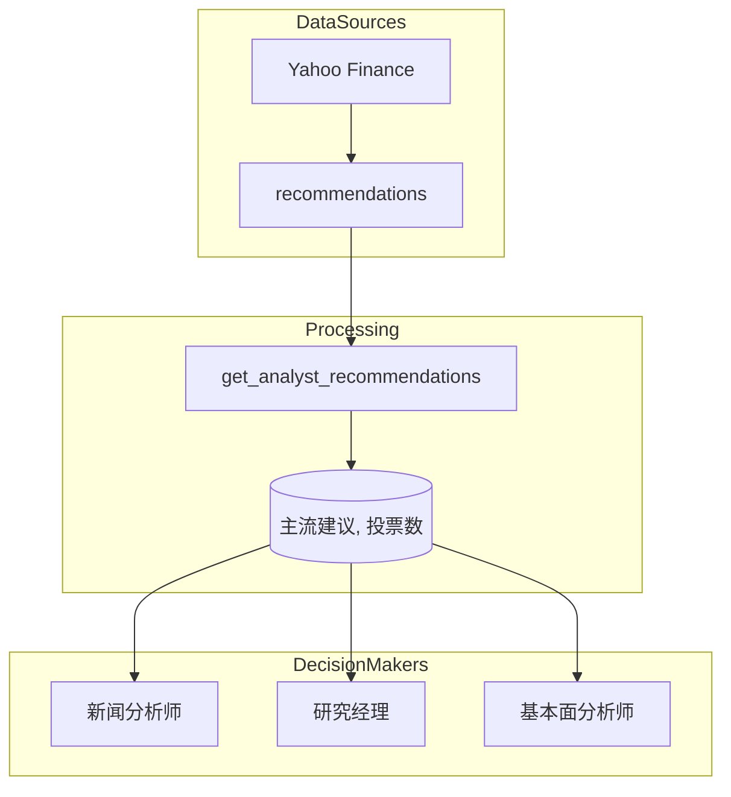
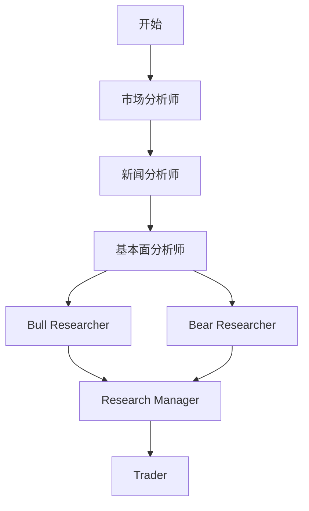

# 分析师评级集成

<cite>
**本文档中引用的文件**  
- [yfin_utils.py](file://tradingagents/dataflows/yfin_utils.py)
- [research_manager.py](file://tradingagents/agents/managers/research_manager.py)
- [news_analyst.py](file://tradingagents/agents/analysts/news_analyst.py)
- [setup.py](file://tradingagents/graph/setup.py)
</cite>

## 目录
1. [引言](#引言)
2. [核心机制分析](#核心机制分析)
3. [数据结构与处理逻辑](#数据结构与处理逻辑)
4. [主流建议计算流程](#主流建议计算流程)
5. [返回值含义与决策影响](#返回值含义与决策影响)
6. [异常处理与健壮性设计](#异常处理与健壮性设计)
7. [在分析系统中的集成作用](#在分析系统中的集成作用)

## 引言
本文档深入解析 `get_analyst_recommendations` 方法的工作机制，详细说明其如何从 Yahoo Finance 获取并解析分析师推荐数据。该方法为投资决策系统提供关键的市场情绪信号，被多个智能体组件用于形成交易建议。文档将重点阐述其数据提取逻辑、投票统计机制以及在整体分析流程中的作用。

## 核心机制分析

`get_analyst_recommendations` 方法是 `YFinanceUtils` 类中的一个核心工具函数，负责从 Yahoo Finance API 获取最新的分析师评级数据，并从中提取最具代表性的推荐意见。

该方法首先通过 `yf.Ticker(symbol)` 初始化指定股票代码的 Ticker 对象，然后调用其 `recommendations` 属性获取评级数据。此属性返回一个包含多个时间周期评级汇总的 Pandas DataFrame。

**Section sources**
- [yfin_utils.py](file://tradingagents/dataflows/yfin_utils.py#L102-L116)

## 数据结构与处理逻辑

Yahoo Finance 的 `recommendations` 表结构通常包含以下列：
- `period`: 评级周期（如 "0m", "1m", "3m" 等）
- `Strong Buy`: 给出“强力买入”评级的分析师人数
- `Buy`: 给出“买入”评级的分析师人数
- `Hold`: 给出“持有”评级的分析师人数
- `Sell`: 给出“卖出”评级的分析师人数
- `Strong Sell`: 给出“强力卖出”评级的分析师人数

方法通过 `recommendations.iloc[0, 1:]` 提取首行数据（即最新周期的评级汇总），并使用切片 `[1:]` 排除第一列 `period`，从而获得一个仅包含各评级投票数的 Series。

```mermaid
flowchart TD
A[调用 get_analyst_recommendations] --> B[获取 recommendations DataFrame]
B --> C{数据为空？}
C --> |是| D[返回 (None, 0)]
C --> |否| E[提取首行并排除 'period' 列]
E --> F[计算最大投票数]
F --> G[找出获得最多投票的评级]
G --> H[返回 (评级, 投票数)]
```

**Diagram sources**
- [yfin_utils.py](file://tradingagents/dataflows/yfin_utils.py#L102-L116)

**Section sources**
- [yfin_utils.py](file://tradingagents/dataflows/yfin_utils.py#L102-L116)

## 主流建议计算流程

在成功提取首行投票数据后，方法执行以下计算逻辑：

1.  **计算最大投票数**：使用 `row_0.max()` 找出所有评级类别中的最高票数，存储在 `max_votes` 变量中。
2.  **确定主流建议**：通过 `row_0[row_0 == max_votes].index.tolist()` 找出所有获得 `max_votes` 票数的评级类别。这会返回一个索引列表（即评级名称列表）。
3.  **返回结果**：由于通常只有一个评级获得最高票数，方法返回该列表的第一个元素（`majority_voting_result[0]`）作为主流建议，以及对应的 `max_votes`。

此逻辑确保了返回的是当前市场上最主流的分析师观点。

**Section sources**
- [yfin_utils.py](file://tradingagents/dataflows/yfin_utils.py#L102-L116)

## 返回值含义与决策影响

该方法返回一个元组 `(recommendation: str, vote_count: int)`，其含义如下：
- **推荐类型 (recommendation)**：代表市场主流的分析师观点，可能的值包括 `'Strong Buy'`（强力买入）、`'Buy'`（买入）、`'Hold'`（持有）、`'Sell'`（卖出）、`'Strong Sell'`（强力卖出）。
- **投票数 (vote_count)**：支持该主流建议的分析师人数，反映了该观点的市场共识强度。

此数据对下游分析组件具有重要影响：
- **新闻分析师 (news_analyst)**：可将此主流评级作为背景信息，结合新闻事件分析市场情绪的驱动因素。
- **研究经理 (research_manager)**：在综合市场、基本面、新闻等多维度信息时，分析师评级是重要的量化输入之一，用于形成最终的“买入/卖出/持有”决策。



**Diagram sources**
- [yfin_utils.py](file://tradingagents/dataflows/yfin_utils.py#L102-L116)
- [news_analyst.py](file://tradingagents/agents/analysts/news_analyst.py)
- [research_manager.py](file://tradingagents/agents/managers/research_manager.py)

## 异常处理与健壮性设计

该方法具备处理异常情况的健壮性设计：
- **空数据集处理**：通过 `if recommendations.empty:` 检查返回的 DataFrame 是否为空。如果为空（例如，该股票无分析师覆盖），方法会优雅地返回 `(None, 0)`，避免程序崩溃。
- **数据缺失容忍**：即使 `period` 列不存在，`iloc[0, 1:]` 仍会尝试获取第一行从第二列开始的所有数据，保证了代码的鲁棒性。

这种设计确保了系统在面对不完整或缺失数据时仍能稳定运行，不会因单个数据源的问题而中断整个分析流程。

**Section sources**
- [yfin_utils.py](file://tradingagents/dataflows/yfin_utils.py#L102-L116)

## 在分析系统中的集成作用

`get_analyst_recommendations` 是整个智能体分析系统数据流的关键一环。它被集成在 `YFinanceUtils` 工具类中，供 `fundamentals_analyst` 等基础面分析师使用。这些分析师的输出，连同市场、新闻等其他维度的分析，最终被 `research_manager`（研究经理）汇总，形成最终的投资决策。

系统通过 `setup.py` 中定义的有向无环图（DAG）将各个分析节点（如 `News Analyst`, `Fundamentals Analyst`）串联起来，确保 `get_analyst_recommendations` 获取的数据能够被有效地传递和利用。



**Diagram sources**
- [setup.py](file://tradingagents/graph/setup.py#L76-L155)
- [research_manager.py](file://tradingagents/agents/managers/research_manager.py)

**Section sources**
- [setup.py](file://tradingagents/graph/setup.py#L76-L155)
- [research_manager.py](file://tradingagents/agents/managers/research_manager.py)