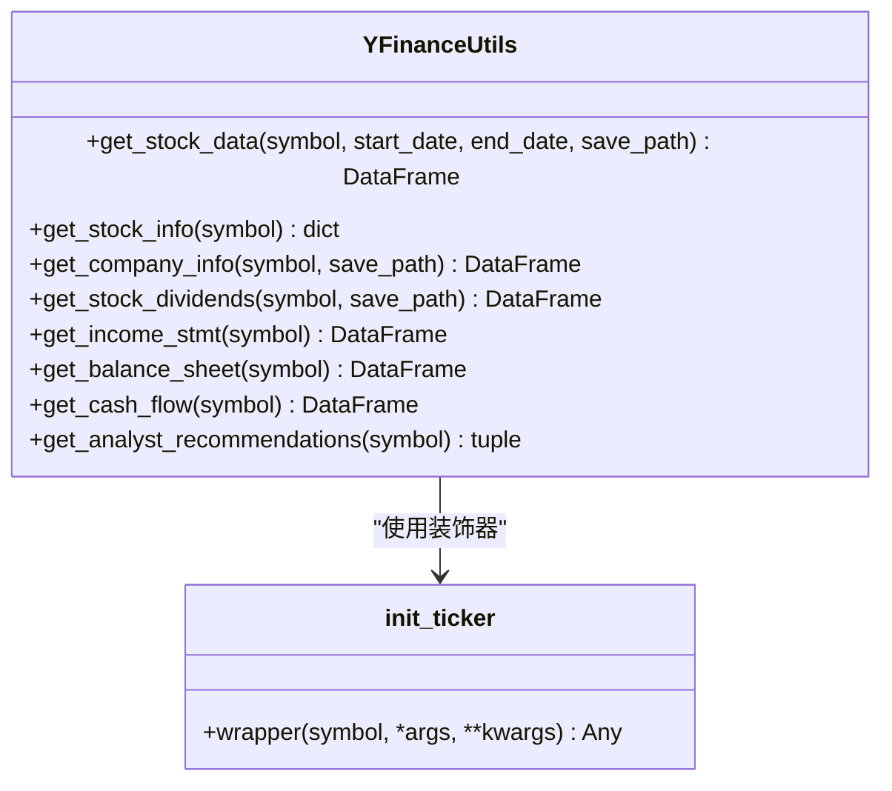

# 股价数据集成

<cite>
**本文档中引用的文件**  
- [yfin_utils.py](file://tradingagents/dataflows/yfin_utils.py#L25-L42)
- [requirements.txt](file://requirements.txt#L5)
</cite>

## 目录
1. [简介](#简介)
2. [核心功能解析](#核心功能解析)
3. [YFinanceUtils类架构](#yfinanceutils类架构)
4. [get_stock_data方法详解](#get_stock_data方法详解)
5. [返回数据结构说明](#返回数据结构说明)
6. [实际调用示例](#实际调用示例)
7. [常见问题与处理](#常见问题与处理)
8. [结论](#结论)

## 简介
本文档详细解析了TradingAgents项目中基于Yahoo Finance的股价数据集成机制，重点聚焦于`YFinanceUtils`类中的`get_stock_data`方法。该方法为市场分析、基本面分析等智能体提供关键的历史价格数据支持，是整个交易决策系统的重要数据源之一。

## 核心功能解析
`get_stock_data`方法实现了从Yahoo Finance获取指定股票代码在给定时间范围内历史价格数据的核心功能。其主要职责包括：
- 接收股票代码（symbol）、起始日期（start_date）和结束日期（end_date）作为输入参数
- 利用`yfinance`库调用远程API获取数据
- 对日期范围进行边界处理以确保包含性
- 返回结构化的Pandas DataFrame格式数据

该方法被市场分析师（market_analyst）等智能体直接调用，用于生成技术指标分析报告。

**Section sources**
- [yfin_utils.py](file://tradingagents/dataflows/yfin_utils.py#L25-L42)

## YFinanceUtils类架构
`YFinanceUtils`是一个封装了Yahoo Finance数据访问功能的工具类，采用装饰器模式提升代码复用性和可维护性。



**Diagram sources**
- [yfin_utils.py](file://tradingagents/dataflows/yfin_utils.py#L1-L117)

**Section sources**
- [yfin_utils.py](file://tradingagents/dataflows/yfin_utils.py#L1-L117)

## get_stock_data方法详解
`get_stock_data`方法是YFinanceUtils类中最常用的数据获取接口，其参数定义如下：

| 参数名 | 类型 | 描述 |
|-------|------|------|
| symbol | str | 股票代码（如"NVDA"） |
| start_date | str | 数据起始日期，格式为YYYY-mm-dd |
| end_date | str | 数据结束日期，格式为YYYY-mm-dd |
| save_path | SavePathType | 可选参数，指定数据保存路径 |

### 时间范围处理逻辑
该方法对`end_date`进行了特殊处理：通过`pd.to_datetime(end_date) + pd.DateOffset(days=1)`将结束日期向后推移一天，从而确保原始请求的时间范围在调用`ticker.history()`时具有**边界包含性**。例如，当请求"2024-05-10"到"2024-05-15"的数据时，实际查询的是"2024-05-10"到"2024-05-16"的数据，最终结果会包含2024年5月15日当天的完整交易记录。

此设计解决了yfinance库默认不包含结束日数据的问题，保证了数据分析的完整性。

**Section sources**
- [yfin_utils.py](file://tradingagents/dataflows/yfin_utils.py#L25-L42)

## 返回数据结构说明
`get_stock_data`方法返回一个Pandas DataFrame对象，包含以下标准字段：

| 字段名 | 含义 | 数据类型 |
|--------|------|---------|
| Open | 开盘价 | float64 |
| High | 最高价 | float64 |
| Low | 最低价 | float64 |
| Close | 收盘价 | float64 |
| Volume | 成交量 | int64 |
| Dividends | 股息 | float64 |
| Stock Splits | 股票拆分 | float64 |

该数据结构被广泛应用于：
- **市场分析师**：用于计算技术指标（如移动平均线、RSI、MACD等），识别趋势和交易信号
- **基本面分析师**：结合财务数据进行估值分析，评估股价与基本面的匹配程度

DataFrame的索引为日期（DatetimeIndex），便于时间序列分析和可视化展示。

**Section sources**
- [yfin_utils.py](file://tradingagents/dataflows/yfin_utils.py#L25-L42)

## 实际调用示例
以下为`get_stock_data`方法的典型使用方式：

```python
# 初始化YFinanceUtils实例
utils = YFinanceUtils()

# 获取英伟达(NVDA)2024年5月1日至5月10日的历史数据
stock_data = utils.get_stock_data(
    symbol="NVDA",
    start_date="2024-05-01",
    end_date="2024-05-10"
)

# 查看前5行数据
print(stock_data.head())

# 可选：将数据持久化到本地CSV文件
stock_data = utils.get_stock_data(
    symbol="NVDA",
    start_date="2024-05-01",
    end_date="2024-05-10",
    save_path="data/nvda_20240501_20240510.csv"
)
```

> 注意：当前实现中`save_path`参数在`get_stock_data`方法体内被注释掉，未实际启用持久化功能。其他方法如`get_company_info`和`get_stock_dividends`仍保留了完整的保存逻辑。

**Section sources**
- [yfin_utils.py](file://tradingagents/dataflows/yfin_utils.py#L25-L42)

## 常见问题与处理
在使用`get_stock_data`方法时可能遇到以下常见问题：

### 数据缺失
- **现象**：返回的DataFrame为空或缺少某些交易日数据
- **原因**：非交易日（周末、节假日）无数据，或股票在该时间段内尚未上市
- **处理**：检查日期是否为有效交易日，确认股票代码和时间范围的正确性

### 日期格式错误
- **现象**：抛出`ValueError`或`KeyError`
- **原因**：`start_date`或`end_date`格式不符合YYYY-mm-dd要求
- **处理**：确保输入字符串符合ISO 8601日期格式，建议使用`datetime.strftime()`生成日期字符串

### 网络请求失败
- **现象**：抛出`ConnectionError`或超时异常
- **原因**：网络连接问题或Yahoo Finance服务暂时不可用
- **处理**：增加重试机制，设置合理的超时时间，或切换至离线缓存模式（通过配置`online_tools=False`）

此外，项目依赖文件`requirements.txt`中已明确包含`yfinance`库，确保了外部依赖的正确安装。

**Section sources**
- [yfin_utils.py](file://tradingagents/dataflows/yfin_utils.py#L25-L42)
- [requirements.txt](file://requirements.txt#L5)

## 结论
`get_stock_data`方法作为TradingAgents系统中关键的数据接入组件，提供了稳定可靠的历史股价获取能力。通过对yfinance库的封装和日期边界的智能处理，该方法有效支持了后续的技术分析和交易决策流程。尽管当前版本中数据持久化功能暂未启用，但整体架构清晰，易于扩展和维护，为构建自动化交易系统奠定了坚实的数据基础。