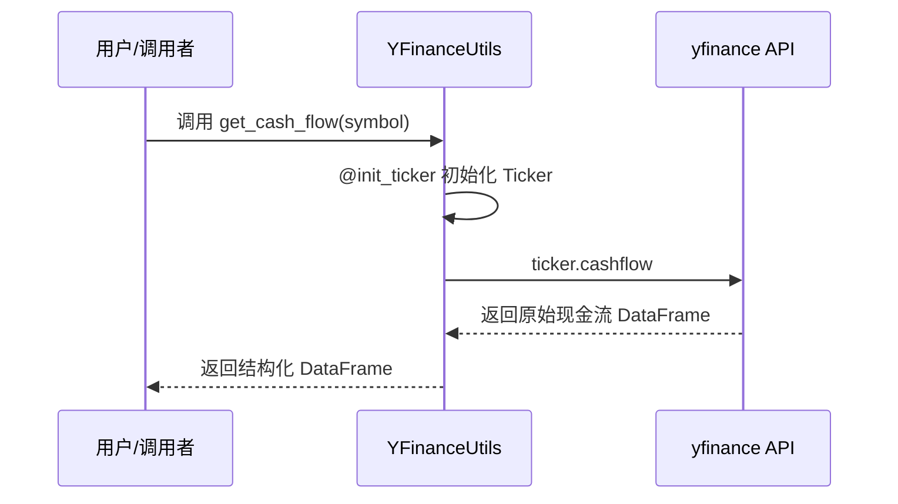
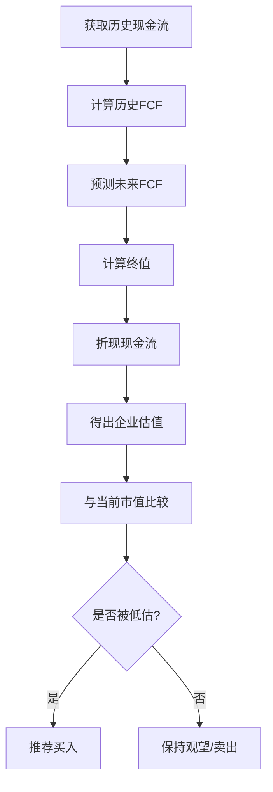

# 现金流量表数据集成

<cite>
**本文档引用文件**  
- [yfin_utils.py](file://tradingagents/dataflows/yfin_utils.py)
- [bull_researcher.py](file://tradingagents/agents/researchers/bull_researcher.py)
- [interface.py](file://tradingagents/dataflows/interface.py)
- [agent_utils.py](file://tradingagents/agents/utils/agent_utils.py)
- [fundamentals_analyst.py](file://tradingagents/agents/analysts/fundamentals_analyst.py)
</cite>

## 目录
1. [引言](#引言)
2. [YFinanceUtils.get_cash_flow 方法详解](#yfinanceutilsget_cash_flow-方法详解)
3. [现金流数据结构与分类](#现金流数据结构与分类)
4. [经营性现金流与净利润的对比分析](#经营性现金流与净利润的对比分析)
5. [数据清洗、重命名与时间序列对齐](#数据清洗重命名与时间序列对齐)
6. [非标准化项目处理](#非标准化项目处理)
7. [现金流数据在 DCF 模型中的应用](#现金流数据在-dcf-模型中的应用)
8. [结论](#结论)

## 引言
在企业财务分析中，现金流量表是评估公司财务健康状况的核心工具之一。与利润表不同，现金流量表反映的是企业实际的现金流入与流出，避免了会计准则下权责发生制可能带来的误导。本文档深入解析 `YFinanceUtils.get_cash_flow` 方法的工作机制，阐述其如何获取并结构化经营性、投资性和融资性现金流数据，并探讨其在估值模型中的关键作用。

**Section sources**  
- [yfin_utils.py](file://tradingagents/dataflows/yfin_utils.py#L96-L100)

## YFinanceUtils.get_cash_flow 方法详解
`YFinanceUtils.get_cash_flow` 是一个封装了 Yahoo Finance API 的工具方法，用于从 `yfinance` 库中提取指定股票代码（symbol）的最新现金流量表数据，并以 `pandas.DataFrame` 的形式返回。

该方法通过 `@init_ticker` 装饰器自动初始化 `yf.Ticker` 对象，简化了外部调用流程。其核心逻辑仅需一行代码 `ticker.cashflow` 即可获取完整的现金流量表，包括多年度的财务数据列和详细的现金流项目行。

此方法返回的数据为原始格式，通常包含大量国际会计准则（IFRS）或美国通用会计准则（GAAP）下的细项，需进一步清洗和结构化处理才能用于分析。



**Diagram sources**  
- [yfin_utils.py](file://tradingagents/dataflows/yfin_utils.py#L96-L100)

**Section sources**  
- [yfin_utils.py](file://tradingagents/dataflows/yfin_utils.py#L96-L100)

## 现金流数据结构与分类
通过 `get_cash_flow` 获取的 `DataFrame` 通常包含以下三大类现金流项目：

1. **经营性现金流 (Operating Cash Flow)**  
   反映企业主营业务产生的现金流动，如“净利润”、“折旧与摊销”、“应收账款变动”等。这是评估企业“造血能力”的核心指标。

2. **投资性现金流 (Investing Cash Flow)**  
   包括资本支出（CapEx）、固定资产买卖、投资支付等，反映企业扩张或收缩的资本活动。

3. **融资性现金流 (Financing Cash Flow)**  
   涉及债务融资、股票发行、分红支付等，体现企业与投资者和债权人的资金往来。

原始数据中的列名通常为英文且按时间倒序排列（最新季度在左），需进行列重命名和时间对齐处理。

**Section sources**  
- [yfin_utils.py](file://tradingagents/dataflows/yfin_utils.py#L96-L100)

## 经营性现金流与净利润的对比分析
经营性现金流与净利润的差异分析是识别财务健康度的关键。净利润基于权责发生制，可能包含大量非现金项目（如折旧、递延收入）和一次性收益/损失；而经营性现金流则反映真实现金变动。

- **OCF > 净利润**：通常表明企业盈利质量高，应收账款回收良好，存货管理有效。
- **OCF < 净利润**：可能暗示收入确认激进、应收账款积压或存在大量非现金收益，需警惕利润“注水”风险。

在 `YFinanceUtils` 获取的数据基础上，可通过提取 `Total Cash Flow From Operating Activities` 与 `Net Income` 进行直接对比，结合趋势分析判断企业财务质量。

**Section sources**  
- [yfin_utils.py](file://tradingagents/dataflows/yfin_utils.py#L96-L100)

## 数据清洗、重命名与时间序列对齐
以下是处理 `get_cash_flow` 返回数据的实用代码示例：

```python
# 示例：数据清洗与结构化
def clean_cash_flow(raw_df: DataFrame) -> DataFrame:
    # 重命名关键列
    rename_dict = {
        'Net Income': '净利润',
        'Total Cash Flow From Operating Activities': '经营性现金流',
        'Capital Expenditures': '资本支出',
        'Total Cash Flows From Investing Activities': '投资性现金流',
        'Total Cash Flows From Financing Activities': '融资性现金流'
    }
    cleaned = raw_df.T  # 转置：时间作为行索引
    cleaned = cleaned.rename(columns=rename_dict)
    cleaned.index = pd.to_datetime(cleaned.index)  # 确保时间索引
    cleaned = cleaned.sort_index()  # 按时间正序排列
    return cleaned[['净利润', '经营性现金流', '资本支出', '投资性现金流', '融资性现金流']]
```

此处理流程将原始宽表转换为适合时间序列分析的长表格式，便于后续可视化与建模。

**Section sources**  
- [yfin_utils.py](file://tradingagents/dataflows/yfin_utils.py#L96-L100)
- [interface.py](file://tradingagents/dataflows/interface.py#L190-L232)

## 非标准化项目处理
现金流量表中常包含“特殊项目”（如重组费用、资产减值、诉讼支出等），这些非经常性项目会影响现金流的可持续性评估。在分析时应：

1. **识别并标注**：通过 `yfinance` 返回的细项（如 `Change In Special Items`）识别非标准化项目。
2. **调整计算**：在计算自由现金流（FCF）时，可选择性剔除这些项目以评估核心业务现金流。
3. **单独披露**：在报告中明确列出这些项目及其影响，避免误导。

虽然 `YFinanceUtils.get_cash_flow` 不直接过滤这些项目，但其提供的完整数据结构为深入分析提供了基础。

**Section sources**  
- [yfin_utils.py](file://tradingagents/dataflows/yfin_utils.py#L96-L100)

## 现金流数据在 DCF 模型中的应用
在 `bull_researcher.py` 所代表的牛市研究员估值逻辑中，高质量的现金流是构建 **DCF（Discounted Cash Flow）模型** 的基石。其流程如下：

1. **获取基础数据**：通过 `YFinanceUtils.get_cash_flow` 获取历史经营性现金流。
2. **预测自由现金流 (FCF)**：  
   `FCF = 经营性现金流 - 资本支出`  
   基于历史趋势和增长假设预测未来 FCF。
3. **计算终值 (Terminal Value)**：使用永续增长模型或退出倍数法。
4. **折现求现值**：以加权平均资本成本（WACC）为折现率，计算企业价值。

牛市研究员会强调企业强劲的经营性现金流增长潜力，论证其未来 FCF 的可持续性，从而支撑更高的估值。相反，熊市研究员则可能质疑现金流质量或资本支出需求，压低估值预期。



**Diagram sources**  
- [yfin_utils.py](file://tradingagents/dataflows/yfin_utils.py#L96-L100)
- [bull_researcher.py](file://tradingagents/agents/researchers/bull_researcher.py#L5-L58)

**Section sources**  
- [yfin_utils.py](file://tradingagents/dataflows/yfin_utils.py#L96-L100)
- [bull_researcher.py](file://tradingagents/agents/researchers/bull_researcher.py#L5-L58)

## 结论
`YFinanceUtils.get_cash_flow` 方法为财务分析提供了便捷的现金流量表数据接入能力。通过对经营性、投资性和融资性现金流的结构化处理与深度分析，特别是经营性现金流与净利润的对比，能够有效识别企业的真实财务健康状况。这些数据不仅是基本面分析的核心输入，更是构建 DCF 等高级估值模型的基础。在 `bull_researcher` 等智能体的决策逻辑中，高质量的现金流数据直接支撑其乐观估值的论证，凸显了其在自动化投资研究中的核心价值。