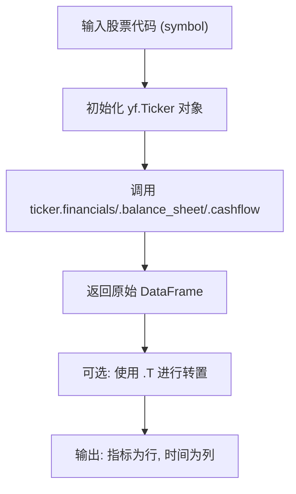

# 财务报表数据集成

<cite>
**本文档引用的文件**  
- [yfin_utils.py](file://tradingagents/dataflows/yfin_utils.py#L84-L100)
- [interface.py](file://tradingagents/dataflows/interface.py#L256-L302)
- [utils.py](file://tradingagents/dataflows/utils.py#L0-L39)
</cite>

## 目录
1. [引言](#引言)
2. [核心财务报表方法概述](#核心财务报表方法概述)
3. [利润表获取方法](#利润表获取方法)
4. [资产负债表获取方法](#资产负债表获取方法)
5. [现金流量表获取方法](#现金流量表获取方法)
6. [数据结构与标准化处理](#数据结构与标准化处理)
7. [在基本面分析中的作用](#在基本面分析中的作用)
8. [数据清洗与转置示例](#数据清洗与转置示例)
9. [潜在问题与应对策略](#潜在问题与应对策略)
10. [结论](#结论)

## 引言
本文件系统性地文档化了从公开市场数据源中提取公司财务报表的核心方法，包括利润表、资产负债表和现金流量表。这些方法为基本面分析师提供结构化、标准化的财务数据，是量化分析与投资决策的重要基础。通过集成 yfinance 等金融数据接口，系统能够自动化获取并处理关键财务指标。

## 核心财务报表方法概述
系统通过 `YFinanceUtils` 类封装了三大核心财务报表的获取方法：`get_income_stmt`、`get_balance_sheet` 和 `get_cash_flow`。这些方法均接受股票代码（symbol）作为输入，利用 yfinance 库从 Yahoo Finance 获取原始财务数据，并返回一个经过初步标准化的 Pandas DataFrame。所有方法均被 `@init_ticker` 装饰器修饰，确保在调用前自动初始化 `yf.Ticker` 对象。

**Section sources**
- [yfin_utils.py](file://tradingagents/dataflows/yfin_utils.py#L84-L100)

## 利润表获取方法
`get_income_stmt` 方法用于获取公司的利润表。该方法通过 `ticker.financials` 属性拉取数据，返回一个 DataFrame，其中行代表各项收入与费用指标（如营业收入、营业成本、净利润等），列则按报告期（如年度或季度）排列。此方法为分析公司盈利能力、毛利率和净利率等关键绩效指标提供了直接数据支持。

**Section sources**
- [yfin_utils.py](file://tradingagents/dataflows/yfin_utils.py#L84-L88)

## 资产负债表获取方法
`get_balance_sheet` 方法用于获取公司的资产负债表。该方法通过 `ticker.balance_sheet` 属性获取数据，返回的 DataFrame 包含资产（如现金、应收账款、固定资产）、负债（如应付账款、长期债务）和股东权益（如股本、留存收益）三大类别的详细项目。该数据是评估公司财务健康状况、偿债能力和资本结构的核心依据。

**Section sources**
- [yfin_utils.py](file://tradingagents/dataflows/yfin_utils.py#L90-L94)

## 现金流量表获取方法
`get_cash_flow` 方法用于获取公司的现金流量表。该方法通过 `ticker.cashflow` 属性提取数据，返回的 DataFrame 展示了公司在经营、投资和筹资三大活动中的现金流入与流出情况。经营性现金流是衡量公司主营业务产生现金能力的关键指标，对判断盈利质量至关重要。

**Section sources**
- [yfin_utils.py](file://tradingagents/dataflows/yfin_utils.py#L96-L100)

## 数据结构与标准化处理
三大财务报表返回的 DataFrame 具有统一的数据结构：**列名为报告日期**（如 2023-12-31），**行为具体的财务指标**（如 Total Revenue、Total Assets、Net Cash Provided by Operating Activities）。这种“指标为行，时间为列”的布局是金融数据的常见格式，便于进行跨时间的纵向比较。系统通过 Pandas 提供的 `.T` 方法可轻松实现数据转置，以适应不同分析场景的需求。



**Diagram sources**
- [yfin_utils.py](file://tradingagents/dataflows/yfin_utils.py#L84-L100)

**Section sources**
- [yfin_utils.py](file://tradingagents/dataflows/yfin_utils.py#L84-L100)

## 在基本面分析中的作用
这些财务报表数据是基本面分析师进行价值评估的基石。利润表用于预测未来收益和计算市盈率（P/E）；资产负债表用于计算市净率（P/B）、评估杠杆水平和流动性风险；现金流量表则用于计算自由现金流（FCF），是企业估值模型（如 DCF）的核心输入。通过整合这三张报表，分析师能够构建完整的财务模型，对公司内在价值做出判断。

**Section sources**
- [yfin_utils.py](file://tradingagents/dataflows/yfin_utils.py#L84-L100)

## 数据清洗与转置示例
在实际使用中，通常需要对原始数据进行清洗和格式化。以下为典型的数据处理流程：

1.  **转置数据**：将时间从列转为行，便于时间序列分析。
2.  **重置索引**：将报告日期设为索引。
3.  **处理缺失值**：填充或删除 NaN 值。
4.  **数据类型转换**：确保数值列为 float 类型。

```python
# 示例代码路径
[SPEC SYMBOL](file://tradingagents/dataflows/yfin_utils.py#L84-L100)
```

**Section sources**
- [yfin_utils.py](file://tradingagents/dataflows/yfin_utils.py#L84-L100)
- [utils.py](file://tradingagents/dataflows/utils.py#L0-L39)

## 潜在问题与应对策略
在使用这些方法时，可能遇到以下问题：

- **数据延迟**：公开财务数据存在发布延迟。应对策略是结合 `curr_date` 参数，在 `interface.py` 中筛选发布日期早于当前日期的报告，确保分析的时效性。
- **缺失报告期**：某些公司可能缺少特定季度或年度的报告。应对策略是检查返回的 DataFrame 是否为空，并提供相应的日志或默认值。
- **多币种处理**：不同公司的财务报表可能使用不同货币。应对策略是在数据获取后，检查 `ticker.info` 中的 `currency` 字段，并在必要时进行汇率换算。

```mermaid
graph TB
Problem["潜在问题"] --> Delay["数据延迟"]
Problem --> Missing["缺失报告期"]
Problem --> Currency["多币种处理"]
Delay --> Strategy1["使用发布日期过滤"]
Missing --> Strategy2["检查DataFrame是否为空"]
Currency --> Strategy3["查询currency字段并换算"]
Strategy1 --> [interface.py](file://tradingagents/dataflows/interface.py#L256-L302)
Strategy2 --> [yfin_utils.py](file://tradingagents/dataflows/yfin_utils.py#L84-L100)
Strategy3 --> [yfin_utils.py](file://tradingagents/dataflows/yfin_utils.py#L70-L78)
```

**Diagram sources**
- [interface.py](file://tradingagents/dataflows/interface.py#L256-L302)
- [yfin_utils.py](file://tradingagents/dataflows/yfin_utils.py#L84-L100)

**Section sources**
- [interface.py](file://tradingagents/dataflows/interface.py#L256-L302)
- [yfin_utils.py](file://tradingagents/dataflows/yfin_utils.py#L84-L100)

## 结论
`get_income_stmt`、`get_balance_sheet` 和 `get_cash_flow` 方法为系统提供了稳定、高效的财务数据接入能力。它们返回的标准化 DataFrame 结构，为后续的财务分析、模型构建和投资决策奠定了坚实的数据基础。通过理解这些方法的实现细节、数据结构特点以及潜在问题的应对策略，开发者和分析师可以更有效地利用这些工具进行深入的公司基本面研究。