# 资产负债表数据集成

<cite>
**本文档中引用的文件**  
- [yfin_utils.py](file://tradingagents/dataflows/yfin_utils.py)
- [interface.py](file://tradingagents/dataflows/interface.py)
- [agent_utils.py](file://tradingagents/agents/utils/agent_utils.py)
- [conservative_debator.py](file://tradingagents/agents/risk_mgmt/conservative_debator.py)
</cite>

## 目录
1. [引言](#引言)
2. [核心实现分析](#核心实现分析)
3. [数据预处理与标准化](#数据预处理与标准化)
4. [关键财务指标结构](#关键财务指标结构)
5. [数据延迟对杠杆率计算的影响](#数据延迟对杠杆率计算的影响)
6. [风险评估中的应用](#风险评估中的应用)
7. [结论](#结论)

## 引言
本文档系统性地文档化 `YFinanceUtils.get_balance_sheet` 方法的技术实现，重点描述其如何提取公司的资产负债表数据并组织为标准化的 DataFrame 格式。文档将详细说明总资产、总负债和股东权益等关键字段的结构位置，分析数据预处理流程，并探讨数据延迟对杠杆率计算的影响。最后，结合 `conservative_debator.py` 中的风险评估逻辑，阐述资产负债表数据如何支撑投资决策中的风险判断。

## 核心实现分析
`YFinanceUtils.get_balance_sheet` 方法是系统中获取公司资产负债表的核心接口。该方法通过 `yfinance` 库直接从 Yahoo Finance API 获取最新财务数据，并以结构化的 DataFrame 形式返回，为后续的财务分析和风险评估提供基础数据支持。

**Diagram sources**  
- [yfin_utils.py](file://tradingagents/dataflows/yfin_utils.py#L90-L94)

**Section sources**  
- [yfin_utils.py](file://tradingagents/dataflows/yfin_utils.py#L90-L94)

## 数据预处理与标准化
在实际应用中，原始的资产负债表数据需要经过预处理才能用于分析。常见的预处理操作包括转置数据以使时间序列成为行索引，以及处理缺失值。

**Diagram sources**  
- [yfin_utils.py](file://tradingagents/dataflows/yfin_utils.py#L90-L94)

**Section sources**  
- [yfin_utils.py](file://tradingagents/dataflows/yfin_utils.py#L90-L94)

## 关键财务指标结构
`get_balance_sheet` 方法返回的 DataFrame 包含了资产负债表的核心组成部分，这些数据是进行财务分析和风险评估的基础。

```mermaid
erDiagram
BALANCE_SHEET {
string Ticker PK
datetime Report_Date PK
float Total_Assets
float Total_Liabilities
float Total_Equity
float Current_Assets
float Noncurrent_Assets
float Current_Liabilities
float Long_Term_Debt
}
BALANCE_SHEET ||--o{ ASSETS : "包含"
BALANCE_SHEET ||--o{ LIABILITIES : "包含"
BALANCE_SHEET ||--o{ EQUITY : "包含"
```

**Diagram sources**  
- [yfin_utils.py](file://tradingagents/dataflows/yfin_utils.py#L90-L94)
- [interface.py](file://tradingagents/dataflows/interface.py#L136-L181)

**Section sources**  
- [yfin_utils.py](file://tradingagents/dataflows/yfin_utils.py#L90-L94)

## 数据延迟对杠杆率计算的影响
财务数据的发布存在固有的延迟，这直接影响杠杆率等关键指标的计算时效性和准确性。

**Diagram sources**  
- [yfin_utils.py](file://tradingagents/dataflows/yfin_utils.py#L90-L94)
- [interface.py](file://tradingagents/dataflows/interface.py#L136-L181)

**Section sources**  
- [interface.py](file://tradingagents/dataflows/interface.py#L136-L181)

## 风险评估中的应用
资产负债表数据是风险评估模块的核心输入。在 `conservative_debator.py` 中，保守型风险分析师会利用这些数据来评估公司的财务稳健性。

**Diagram sources**  
- [conservative_debator.py](file://tradingagents/agents/risk_mgmt/conservative_debator.py#L0-L58)
- [agent_utils.py](file://tradingagents/agents/utils/agent_utils.py#L263-L291)

**Section sources**  
- [conservative_debator.py](file://tradingagents/agents/risk_mgmt/conservative_debator.py#L0-L58)

## 结论
`YFinanceUtils.get_balance_sheet` 方法为交易系统提供了获取公司财务健康状况的关键能力。通过高效地提取和标准化资产负债表数据，该方法支撑了从基础财务分析到高级风险评估的整个决策链条。尽管存在数据延迟的挑战，但通过与 `conservative_debator` 等风险评估模块的集成，系统能够利用这些数据做出更为审慎和数据驱动的投资决策。未来可考虑引入数据延迟补偿机制或结合多个数据源以提高评估的时效性。