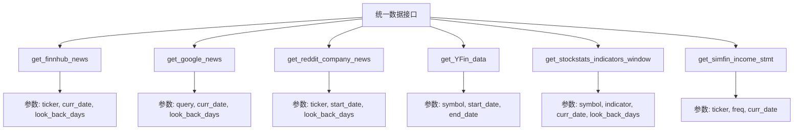
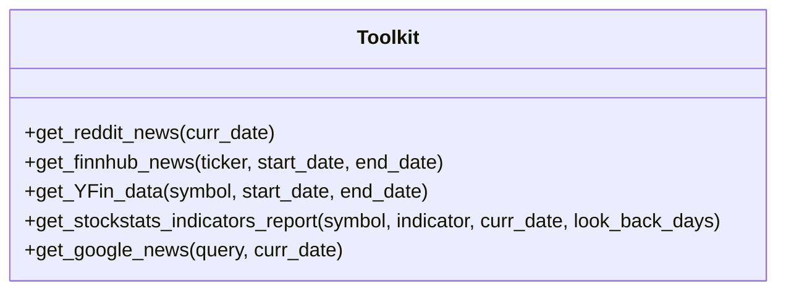
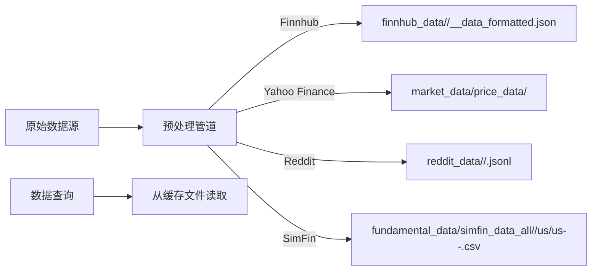
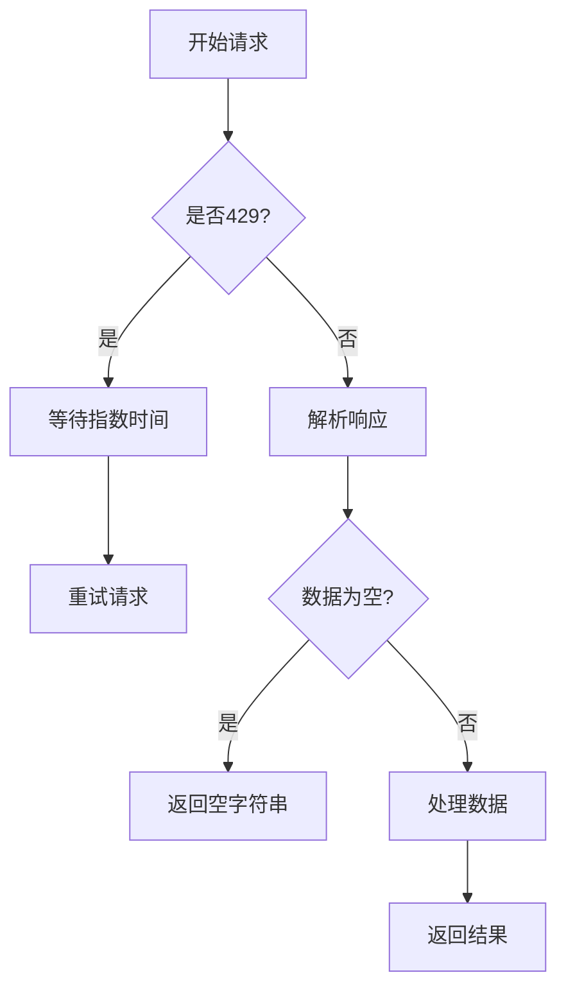

# 数据流与集成

<cite>
**本文档中引用的文件**  
- [finnhub_utils.py](file://tradingagents/dataflows/finnhub_utils.py)
- [yfin_utils.py](file://tradingagents/dataflows/yfin_utils.py)
- [googlenews_utils.py](file://tradingagents/dataflows/googlenews_utils.py)
- [reddit_utils.py](file://tradingagents/dataflows/reddit_utils.py)
- [interface.py](file://tradingagents/dataflows/interface.py)
- [agent_utils.py](file://tradingagents/agents/utils/agent_utils.py)
- [config.py](file://tradingagents/dataflows/config.py)
- [utils.py](file://tradingagents/dataflows/utils.py)
</cite>

## 目录
1. [引言](#引言)
2. [数据源接入与处理](#数据源接入与处理)
3. [统一数据接口规范](#统一数据接口规范)
4. [工具函数封装与调用](#工具函数封装与调用)
5. [数据预处理流程](#数据预处理流程)
6. [异常处理与重试机制](#异常处理与重试机制)
7. [缓存与数据持久化策略](#缓存与数据持久化策略)
8. [结论](#结论)

## 引言
本系统旨在通过整合多源金融数据，为交易代理提供全面的市场分析能力。系统从Finnhub、Yahoo Finance、Google News和Reddit四大平台获取数据，涵盖股价、财务报告、新闻舆情和社交媒体情绪等关键信息。所有数据通过统一接口进行标准化处理，并通过工具函数封装供智能代理调用。本文档详细说明数据流架构、外部集成方式、接口设计及异常处理机制。

## 数据源接入与处理

### Finnhub数据接入
Finnhub提供公司新闻、内部人士交易和情绪分析等结构化数据。系统通过`finnhub_utils.py`中的`get_data_in_range`函数从本地缓存文件中读取预处理数据，支持按时间范围过滤。数据路径根据数据类型（如`news_data`、`insider_trans`）和周期（年度/季度）组织，确保高效检索。

**Section sources**
- [finnhub_utils.py](file://tradingagents/dataflows/finnhub_utils.py#L1-L36)

### Yahoo Finance历史数据提取
Yahoo Finance通过`yfin_utils.py`模块提供丰富的市场数据。`YFinanceUtils`类使用装饰器`@decorate_all_methods(init_ticker)`自动初始化`yf.Ticker`对象，简化API调用。核心方法包括：
- `get_stock_data`: 获取指定时间段的股价历史
- `get_income_stmt`, `get_balance_sheet`, `get_cash_flow`: 获取三大财务报表
- `get_analyst_recommendations`: 获取分析师评级汇总

所有方法均支持可选的`save_path`参数，用于将结果持久化到CSV文件。

**Section sources**
- [yfin_utils.py](file://tradingagents/dataflows/yfin_utils.py#L1-L117)

### Google News新闻聚合
`googlenews_utils.py`实现对Google News的网页抓取。通过`getNewsData`函数构造搜索URL并发送HTTP请求，使用BeautifulSoup解析HTML结果。为避免被反爬虫机制拦截，系统采用以下策略：
- 随机延迟（2-6秒）在每次请求前
- 自定义User-Agent头模拟真实浏览器
- 基于指数退避的重试机制（最多5次）应对429状态码

解析结果包含标题、摘要、来源和发布日期，形成结构化新闻列表。

**Section sources**
- [googlenews_utils.py](file://tradingagents/dataflows/googlenews_utils.py#L1-L108)

### Reddit社交媒体情绪分析
`reddit_utils.py`从本地存储的Reddit数据中提取与特定公司相关的帖子。`fetch_top_from_category`函数支持两种模式：
- **全局新闻**：从`global_news`分类中获取热门帖子
- **公司新闻**：结合`ticker_to_company`映射表，通过正则表达式匹配公司名称或股票代码

数据按创建时间过滤，并根据点赞数排序，确保返回最具影响力的内容。

**Section sources**
- [reddit_utils.py](file://tradingagents/dataflows/reddit_utils.py#L1-L135)

## 统一数据接口规范

`interface.py`定义了系统对外暴露的统一数据访问接口，所有函数均使用`Annotated`类型注解明确参数含义。主要接口包括：

**Diagram sources**
- [interface.py](file://tradingagents/dataflows/interface.py#L1-L799)

所有接口函数返回格式化的字符串报告，包含数据标题、时间范围和结构化内容，便于下游代理直接解析使用。

**Section sources**
- [interface.py](file://tradingagents/dataflows/interface.py#L1-L799)

## 工具函数封装与调用

`agent_utils.py`中的`Toolkit`类将数据接口封装为LangChain工具，供智能代理调用。每个工具方法使用`@tool`装饰器注册，并提供详细的参数描述。例如：

**Diagram sources**
- [agent_utils.py](file://tradingagents/agents/utils/agent_utils.py#L1-L419)

工具函数自动处理日期计算（如`look_back_days`）和参数转换，屏蔽底层复杂性。例如，`get_finnhub_news`工具将起始/结束日期转换为回溯天数，再调用底层接口。

**Section sources**
- [agent_utils.py](file://tradingagents/agents/utils/agent_utils.py#L1-L419)

## 数据预处理流程

系统采用离线预处理与在线查询相结合的模式。原始数据通过批处理任务下载并清洗，存储在`DATA_DIR`目录下，形成以下结构：

**Diagram sources**
- [config.py](file://tradingagents/dataflows/config.py#L1-L34)
- [utils.py](file://tradingagents/dataflows/utils.py#L1-L39)

`config.py`管理`DATA_DIR`配置，`utils.py`提供`save_output`等辅助函数。

**Section sources**
- [config.py](file://tradingagents/dataflows/config.py#L1-L34)
- [utils.py](file://tradingagents/dataflows/utils.py#L1-L39)

## 异常处理与重试机制

系统在多个层面实现健壮的错误处理：

1. **网络请求层**：`googlenews_utils.py`使用`tenacity`库实现指数退避重试，针对429状态码自动重试最多5次。
2. **数据访问层**：`interface.py`中所有函数检查返回数据是否为空，若无结果则返回空字符串而非抛出异常。
3. **文件操作层**：`reddit_utils.py`在打开文件前验证扩展名，并跳过空行。
4. **参数验证层**：`get_stockstats_indicators_report`检查指标名称是否在支持列表中，否则抛出`ValueError`。

**Diagram sources**
- [googlenews_utils.py](file://tradingagents/dataflows/googlenews_utils.py#L1-L108)
- [interface.py](file://tradingagents/dataflows/interface.py#L1-L799)

**Section sources**
- [googlenews_utils.py](file://tradingagents/dataflows/googlenews_utils.py#L1-L108)
- [interface.py](file://tradingagents/dataflows/interface.py#L1-L799)

## 缓存与数据持久化策略

系统采用混合缓存策略：
- **磁盘缓存**：所有外部数据源结果持久化到本地文件系统，路径由`DATA_DIR`配置。例如，Yahoo Finance数据存储为CSV，Finnhub数据为JSON。
- **内存缓存**：`config.py`使用模块级变量`_config`缓存配置，避免重复初始化。
- **API缓存**：`get_stockstats_indicator`等函数优先从本地文件读取，仅在`online=True`时发起网络请求。

`utils.py`中的`save_output`函数统一管理数据保存逻辑，支持可选的保存路径。

**Section sources**
- [config.py](file://tradingagents/dataflows/config.py#L1-L34)
- [utils.py](file://tradingagents/dataflows/utils.py#L1-L39)

## 结论
本系统通过模块化设计实现了多源金融数据的高效集成。`dataflows`模块提供细粒度的数据访问工具，`interface.py`定义统一的高层接口，`agent_utils.py`将其封装为代理可用的工具。系统通过本地缓存、重试机制和异常处理确保可靠性，为交易决策提供坚实的数据基础。