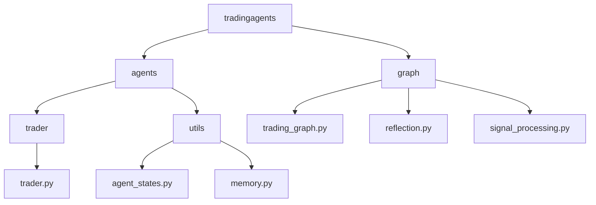
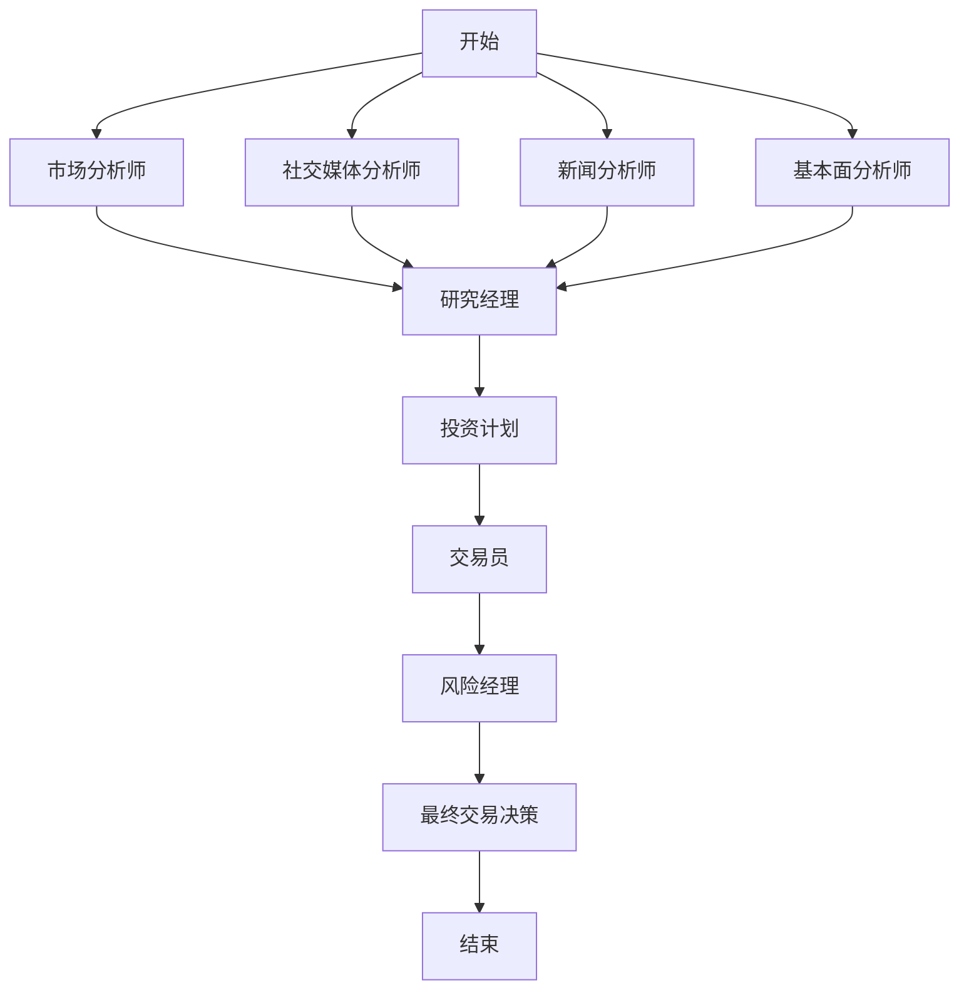
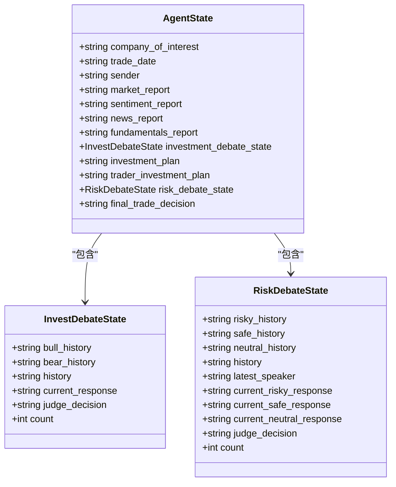
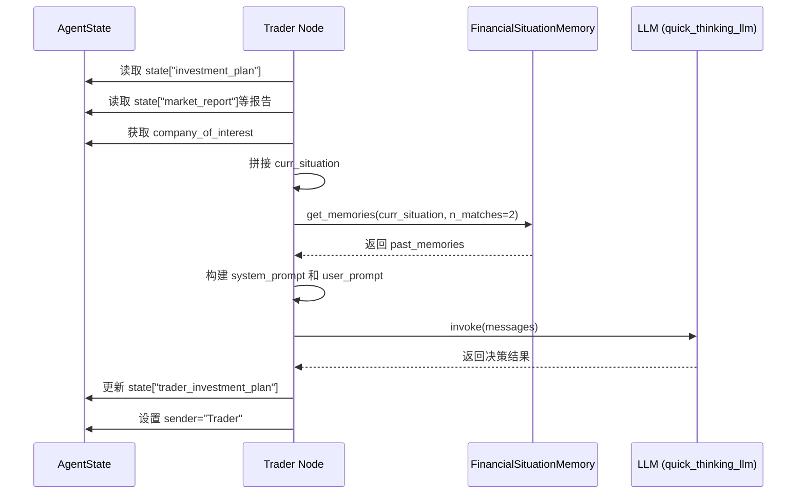

# 交易团队

<cite>
**本文档引用文件**  
- [trader.py](file://tradingagents/agents/trader/trader.py)
- [agent_states.py](file://tradingagents/agents/utils/agent_states.py)
- [trading_graph.py](file://tradingagents/graph/trading_graph.py)
- [memory.py](file://tradingagents/agents/utils/memory.py)
- [reflection.py](file://tradingagents/graph/reflection.py)
- [signal_processing.py](file://tradingagents/graph/signal_processing.py)
- [default_config.py](file://tradingagents/default_config.py)
</cite>

## 目录
1. [引言](#引言)
2. [项目结构](#项目结构)
3. [核心组件](#核心组件)
4. [架构概览](#架构概览)
5. [详细组件分析](#详细组件分析)
6. [依赖分析](#依赖分析)
7. [性能考量](#性能考量)
8. [故障排除指南](#故障排除指南)
9. [结论](#结论)

## 引言
本文档全面介绍交易员智能体（Trader Agent）在交易团队中的核心功能与实现机制。该智能体作为决策链的关键环节，负责整合研究团队、分析团队和风险团队的多维度信息，生成结构化的投资计划，并最终输出可执行的交易建议。文档将深入解析其在LangGraph工作流中的节点定义、状态聚合机制、提示工程设计、LLM调用策略以及与记忆系统的交互方式。

## 项目结构
交易团队的代码组织遵循模块化设计原则，核心功能分散在`tradingagents/agents/`目录下的不同子模块中。交易员智能体位于`trader`子目录，其状态管理由`utils/agent_states.py`统一定义，而整个工作流的编排则由`graph/`目录下的组件负责。



**图示来源**  
- [trader.py](file://tradingagents/agents/trader/trader.py)
- [agent_states.py](file://tradingagents/agents/utils/agent_states.py)
- [trading_graph.py](file://tradingagents/graph/trading_graph.py)

**本节来源**  
- [trader.py](file://tradingagents/agents/trader/trader.py)
- [agent_states.py](file://tradingagents/agents/utils/agent_states.py)

## 核心组件
交易员智能体的核心功能是接收来自上游的综合分析报告，并结合历史决策经验，生成最终的交易提案。其主要输入包括市场分析报告、情绪分析报告、新闻报告和基本面报告，以及由研究团队生成的初步投资计划。

**本节来源**  
- [trader.py](file://tradingagents/agents/trader/trader.py#L10-L17)
- [agent_states.py](file://tradingagents/agents/utils/agent_states.py#L53-L75)

## 架构概览
交易员智能体是LangGraph工作流中的一个关键节点。整个工作流由`TradingAgentsGraph`类（位于`trading_graph.py`）进行编排。该图首先调用各类分析师生成报告，然后通过研究经理整合形成投资计划，再由交易员节点进行决策，最后交由风险经理团队进行评估。



**图示来源**  
- [trading_graph.py](file://tradingagents/graph/trading_graph.py#L144-L189)
- [trader.py](file://tradingagents/agents/trader/trader.py)

## 详细组件分析

### 交易员智能体分析
交易员智能体通过`create_trader`函数创建，该函数返回一个符合LangGraph规范的节点函数。该节点函数接收当前的`AgentState`作为输入，并输出更新后的状态。

#### 状态聚合机制
交易员智能体在`AgentState`中聚合了来自多个团队的关键信息：
- **公司信息**：`company_of_interest`字段指明了当前关注的交易标的。
- **多维度报告**：`market_report`、`sentiment_report`、`news_report`和`fundamentals_report`分别存储了来自市场、情绪、新闻和基本面分析团队的报告。
- **投资计划**：`investment_plan`字段包含了研究团队经过辩论后生成的初步投资建议。
- **历史记忆**：`trader_investment_plan`字段用于存储交易员自身的历史决策。



**图示来源**  
- [agent_states.py](file://tradingagents/agents/utils/agent_states.py#L23-L75)

#### 提示模板与LLM调用
交易员智能体使用精心设计的提示模板来引导大语言模型（LLM）进行决策。其提示分为两部分：
1.  **系统提示（System Prompt）**：定义了交易员的角色、任务和输出格式要求。它明确要求模型在最后以`FINAL TRANSACTION PROPOSAL: **BUY/HOLD/SELL**`的格式给出最终建议，并强调要利用历史决策经验。
2.  **用户提示（User Prompt）**：提供当前的市场情境和研究团队的`investment_plan`作为决策依据。

LLM的调用模式由`TradingAgentsGraph`在初始化时根据配置文件（`default_config.py`）确定。系统支持OpenAI、Anthropic和Google等不同提供商，并区分了用于深度思考的`deep_thinking_llm`和用于快速响应的`quick_thinking_llm`。交易员节点通常使用`quick_thinking_llm`以保证效率。



**图示来源**  
- [trader.py](file://tradingagents/agents/trader/trader.py)
- [memory.py](file://tradingagents/agents/utils/memory.py)
- [trading_graph.py](file://tradingagents/graph/trading_graph.py#L50-L75)

**本节来源**  
- [trader.py](file://tradingagents/agents/trader/trader.py#L0-L46)
- [memory.py](file://tradingagents/agents/utils/memory.py#L0-L113)

### 输出格式校验机制
为了确保交易信号的标准化和可解析性，系统引入了`SignalProcessor`（位于`signal_processing.py`）。该组件负责处理交易员或风险经理输出的完整文本，并从中提取出最核心的决策（BUY, SELL, 或 HOLD）。

其工作原理是使用一个专门的LLM调用，该调用的系统提示被严格限定为“只输出BUY, SELL, 或 HOLD，不要包含任何其他文本”。这保证了最终信号的纯净性，便于下游系统进行自动化处理。

**本节来源**  
- [signal_processing.py](file://tradingagents/graph/signal_processing.py#L0-L31)

## 依赖分析
交易员智能体的正常运行依赖于多个核心组件和外部服务。

```mermaid
graph TD
Trader[交易员智能体] --> AgentState[AgentState]
Trader --> Memory[FinancialSituationMemory]
Trader --> LLM[LLM (quick_thinking_llm)]
AgentState --> InvestDebateState
AgentState --> RiskDebateState
Memory --> ChromaDB[(ChromaDB)]
Memory --> OpenAI[OpenAI Embeddings]
LLM --> OpenAI_API[OpenAI API]
TradingGraph[TradingAgentsGraph] --> Trader
TradingGraph --> SignalProcessor
SignalProcessor --> LLM
```

**图示来源**  
- [trader.py](file://tradingagents/agents/trader/trader.py)
- [memory.py](file://tradingagents/agents/utils/memory.py)
- [trading_graph.py](file://tradingagents/graph/trading_graph.py)
- [signal_processing.py](file://tradingagents/graph/signal_processing.py)

**本节来源**  
- [trading_graph.py](file://tradingagents/graph/trading_graph.py#L50-L75)
- [default_config.py](file://tradingagents/default_config.py#L0-L22)

## 性能考量
系统的性能主要受以下因素影响：
1.  **LLM调用延迟**：每次决策都涉及多次LLM调用，这是最主要的延迟来源。
2.  **向量数据库查询**：`FinancialSituationMemory`在每次决策前都需要查询ChromaDB以获取历史记忆，其性能取决于数据库的规模和查询效率。
3.  **外部API调用**：数据流组件（如`yfin_utils.py`）需要调用外部金融数据API，其响应时间不可控。

通过配置`default_config.py`中的`llm_provider`和模型名称，可以权衡决策质量和响应速度。例如，使用`gpt-4o-mini`作为`quick_thinking_llm`可以在保证一定智能水平的同时，获得较快的响应速度。

## 故障排除指南
当交易员智能体出现异常时，可参考以下步骤进行排查：

1.  **检查配置文件**：确认`default_config.py`中的`llm_provider`、`backend_url`和模型名称配置正确。
2.  **验证API密钥**：确保环境变量中包含了访问LLM和外部数据API所需的密钥。
3.  **检查向量数据库**：如果历史记忆功能失效，检查ChromaDB服务是否正常运行，并确认`FinancialSituationMemory`的集合是否已正确创建。
4.  **分析日志**：系统会将完整的状态日志保存在`eval_results/`目录下。检查`full_states_log_*.json`文件，可以清晰地看到每一步的输入和输出，便于定位问题发生在哪个环节。
5.  **验证输出格式**：如果下游系统无法解析交易信号，检查`SignalProcessor`的输出。问题可能源于交易员或风险经理的输出未能严格遵循`FINAL TRANSACTION PROPOSAL`的格式要求。

**本节来源**  
- [trading_graph.py](file://tradingagents/graph/trading_graph.py#L214-L253)
- [reflection.py](file://tradingagents/graph/reflection.py#L87-L120)
- [default_config.py](file://tradingagents/default_config.py)

## 结论
交易员智能体是整个交易团队工作流中的决策核心。它通过一个结构化的`AgentState`有效地聚合了来自研究、分析和风险团队的异构信息，并利用大语言模型的强大推理能力，结合历史决策经验，生成具体的交易建议。其与`FinancialSituationMemory`和`SignalProcessor`等组件的协同工作，构建了一个具备学习能力、可追溯且输出标准化的智能交易系统。通过配置文件，该系统可以灵活地适应不同的交易策略和LLM提供商，展现了良好的可扩展性和实用性。