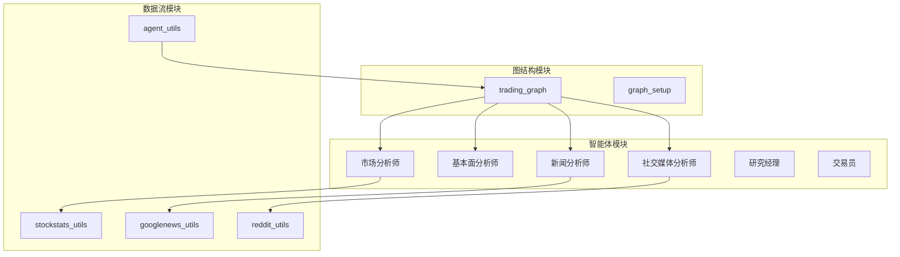
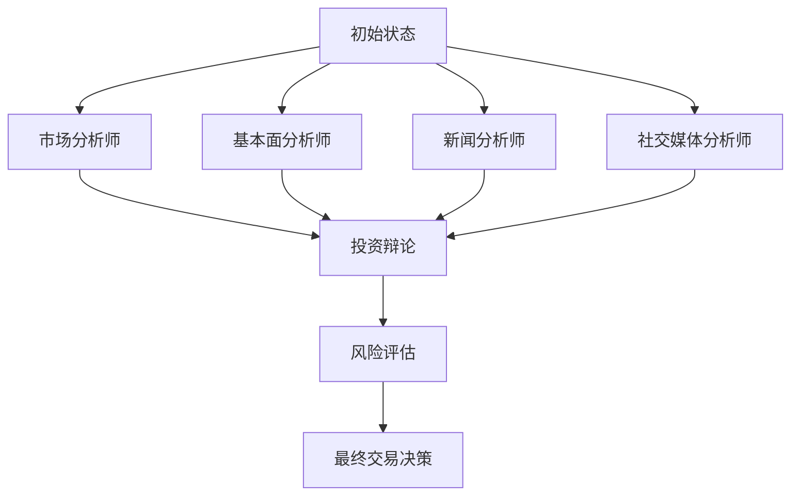
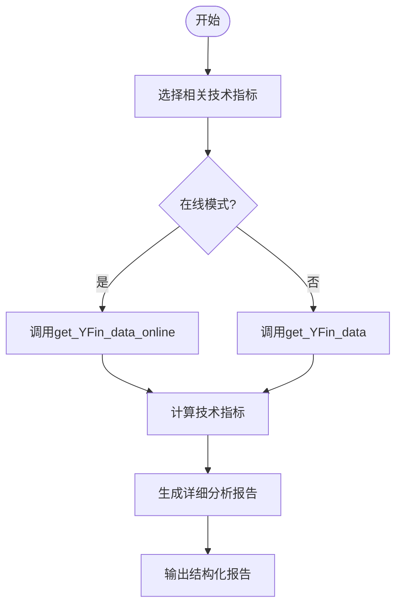
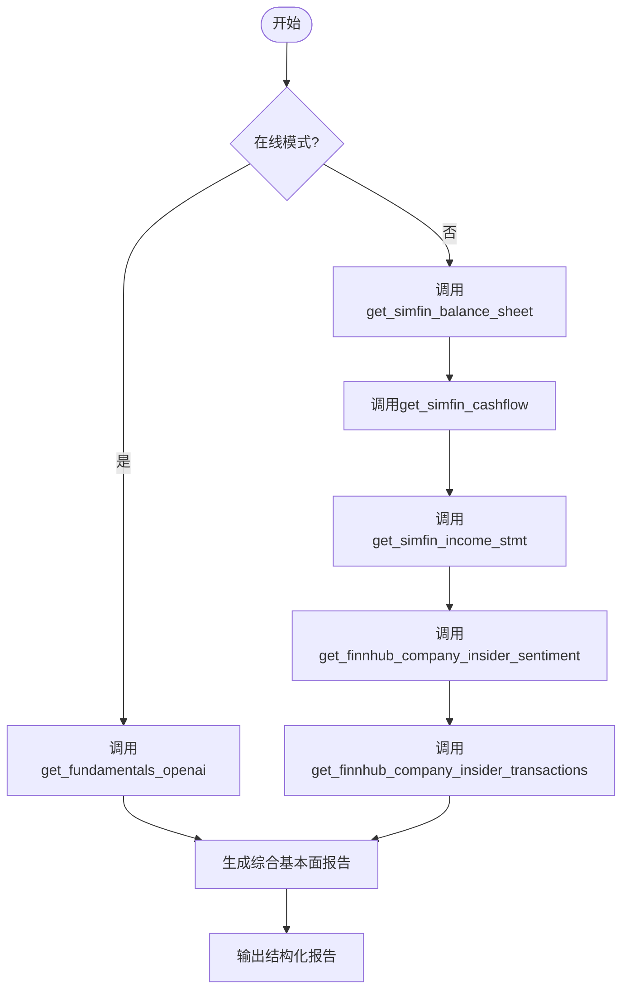
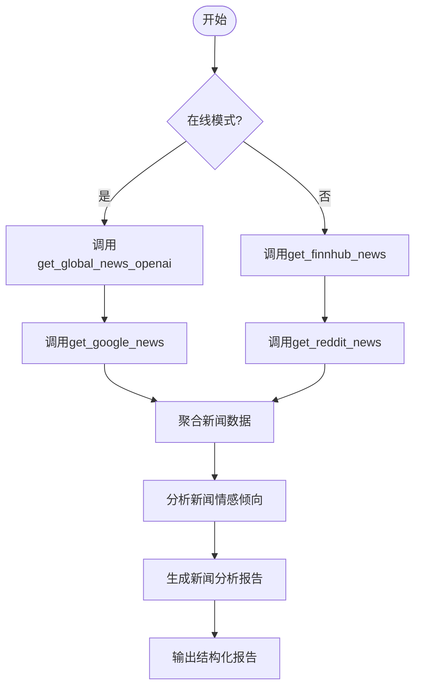
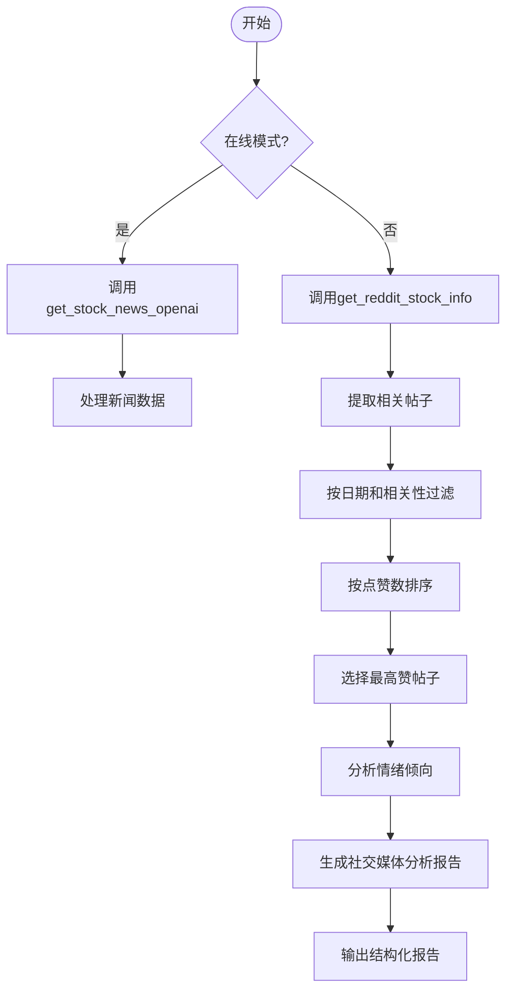
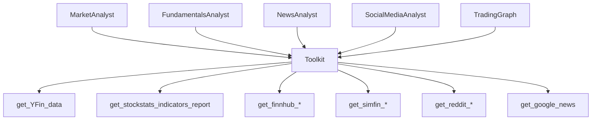

# 分析团队

<cite>
**本文档中引用的文件**  
- [market_analyst.py](file://tradingagents/agents/analysts/market_analyst.py)
- [fundamentals_analyst.py](file://tradingagents/agents/analysts/fundamentals_analyst.py)
- [news_analyst.py](file://tradingagents/agents/analysts/news_analyst.py)
- [social_media_analyst.py](file://tradingagents/agents/analysts/social_media_analyst.py)
- [stockstats_utils.py](file://tradingagents/dataflows/stockstats_utils.py)
- [googlenews_utils.py](file://tradingagents/dataflows/googlenews_utils.py)
- [reddit_utils.py](file://tradingagents/dataflows/reddit_utils.py)
- [agent_utils.py](file://tradingagents/agents/utils/agent_utils.py)
- [trading_graph.py](file://tradingagents/graph/trading_graph.py)
</cite>

## 目录
1. [引言](#引言)
2. [项目结构](#项目结构)
3. [核心组件](#核心组件)
4. [架构概述](#架构概述)
5. [详细组件分析](#详细组件分析)
6. [依赖分析](#依赖分析)
7. [性能考虑](#性能考虑)
8. [故障排除指南](#故障排除指南)
9. [结论](#结论)

## 引言
本文档详细阐述了交易智能体系统中各分析师智能体的职责与实现机制。重点说明市场分析师如何利用MACD、RSI等技术指标进行量化分析，并集成stockstats_utils进行数据处理；基本面分析师如何解析公司财务报表并评估企业内在价值；新闻分析师如何通过googlenews_utils获取并分析财经新闻情感倾向；社交媒体分析师如何从reddit_utils获取Reddit帖子数据并评估市场情绪。同时描述这些分析师如何将各自领域的洞察转化为结构化报告，并通过LangGraph状态机传递给研究团队。

## 项目结构
该系统采用模块化设计，主要分为智能体（agents）、数据流（dataflows）、图结构（graph）三大模块。智能体模块包含各类分析师、管理者和交易员；数据流模块负责与外部数据源交互；图结构模块则协调整个分析流程。

**图源**  
- [market_analyst.py](file://tradingagents/agents/analysts/market_analyst.py)
- [fundamentals_analyst.py](file://tradingagents/agents/analysts/fundamentals_analyst.py)
- [news_analyst.py](file://tradingagents/agents/analysts/news_analyst.py)
- [social_media_analyst.py](file://tradingagents/agents/analysts/social_media_analyst.py)
- [trading_graph.py](file://tradingagents/graph/trading_graph.py)

**节源**  
- [tradingagents/agents/analysts](file://tradingagents/agents/analysts)
- [tradingagents/dataflows](file://tradingagents/dataflows)
- [tradingagents/graph](file://tradingagents/graph)

## 核心组件
系统核心由四类分析师智能体构成：市场分析师、基本面分析师、新闻分析师和社交媒体分析师。每个智能体都通过LangChain框架构建，利用特定工具集从外部数据源获取信息，并生成结构化分析报告。

**节源**  
- [market_analyst.py](file://tradingagents/agents/analysts/market_analyst.py#L1-L89)
- [fundamentals_analyst.py](file://tradingagents/agents/analysts/fundamentals_analyst.py#L1-L64)
- [news_analyst.py](file://tradingagents/agents/analysts/news_analyst.py#L1-L60)
- [social_media_analyst.py](file://tradingagents/agents/analysts/social_media_analyst.py#L1-L60)

## 架构概述
系统采用基于状态机的多智能体协作架构，通过LangGraph实现复杂的决策流程。各分析师智能体并行工作，将分析结果汇总至研究团队进行综合判断。

**图源**  
- [trading_graph.py](file://tradingagents/graph/trading_graph.py#L1-L254)

## 详细组件分析

### 市场分析师分析
市场分析师负责技术面分析，利用多种技术指标评估股票走势。

**图源**  
- [market_analyst.py](file://tradingagents/agents/analysts/market_analyst.py#L1-L89)
- [stockstats_utils.py](file://tradingagents/dataflows/stockstats_utils.py#L1-L87)

**节源**  
- [market_analyst.py](file://tradingagents/agents/analysts/market_analyst.py#L1-L89)
- [stockstats_utils.py](file://tradingagents/dataflows/stockstats_utils.py#L1-L87)

### 基本面分析师分析
基本面分析师负责分析公司的财务状况和内在价值。

**图源**  
- [fundamentals_analyst.py](file://tradingagents/agents/analysts/fundamentals_analyst.py#L1-L64)
- [agent_utils.py](file://tradingagents/agents/utils/agent_utils.py#L1-L419)

**节源**  
- [fundamentals_analyst.py](file://tradingagents/agents/analysts/fundamentals_analyst.py#L1-L64)
- [agent_utils.py](file://tradingagents/agents/utils/agent_utils.py#L1-L419)

### 新闻分析师分析
新闻分析师负责收集和分析财经新闻，评估宏观市场环境。

**图源**  
- [news_analyst.py](file://tradingagents/agents/analysts/news_analyst.py#L1-L60)
- [googlenews_utils.py](file://tradingagents/dataflows/googlenews_utils.py#L1-L108)
- [agent_utils.py](file://tradingagents/agents/utils/agent_utils.py#L1-L419)

**节源**  
- [news_analyst.py](file://tradingagents/agents/analysts/news_analyst.py#L1-L60)
- [googlenews_utils.py](file://tradingagents/dataflows/googlenews_utils.py#L1-L108)

### 社交媒体分析师分析
社交媒体分析师负责分析社交媒体情绪，特别是Reddit平台上的讨论。

**图源**  
- [social_media_analyst.py](file://tradingagents/agents/analysts/social_media_analyst.py#L1-L60)
- [reddit_utils.py](file://tradingagents/dataflows/reddit_utils.py#L1-L135)
- [agent_utils.py](file://tradingagents/agents/utils/agent_utils.py#L1-L419)

**节源**  
- [social_media_analyst.py](file://tradingagents/agents/analysts/social_media_analyst.py#L1-L60)
- [reddit_utils.py](file://tradingagents/dataflows/reddit_utils.py#L1-L135)

## 依赖分析
系统各组件之间存在明确的依赖关系，通过工具包（Toolkit）进行协调管理。

**图源**  
- [agent_utils.py](file://tradingagents/agents/utils/agent_utils.py#L1-L419)
- [trading_graph.py](file://tradingagents/graph/trading_graph.py#L1-L254)

**节源**  
- [agent_utils.py](file://tradingagents/agents/utils/agent_utils.py#L1-L419)
- [trading_graph.py](file://tradingagents/graph/trading_graph.py#L1-L254)

## 性能考虑
系统实现了多种性能优化策略，包括数据缓存、请求重试机制和并行处理。

**节源**  
- [stockstats_utils.py](file://tradingagents/dataflows/stockstats_utils.py#L1-L87)
- [googlenews_utils.py](file://tradingagents/dataflows/googlenews_utils.py#L1-L108)
- [reddit_utils.py](file://tradingagents/dataflows/reddit_utils.py#L1-L135)

## 故障排除指南
当系统出现异常时，可参考以下常见问题及解决方案：

**节源**  
- [googlenews_utils.py](file://tradingagents/dataflows/googlenews_utils.py#L1-L108)
- [reddit_utils.py](file://tradingagents/dataflows/reddit_utils.py#L1-L135)
- [agent_utils.py](file://tradingagents/agents/utils/agent_utils.py#L1-L419)

## 结论
该分析团队架构通过专业化分工和系统化集成，实现了对金融市场多维度的全面分析。各智能体协同工作，将技术分析、基本面分析、新闻分析和社交媒体分析有机结合，为投资决策提供全面支持。