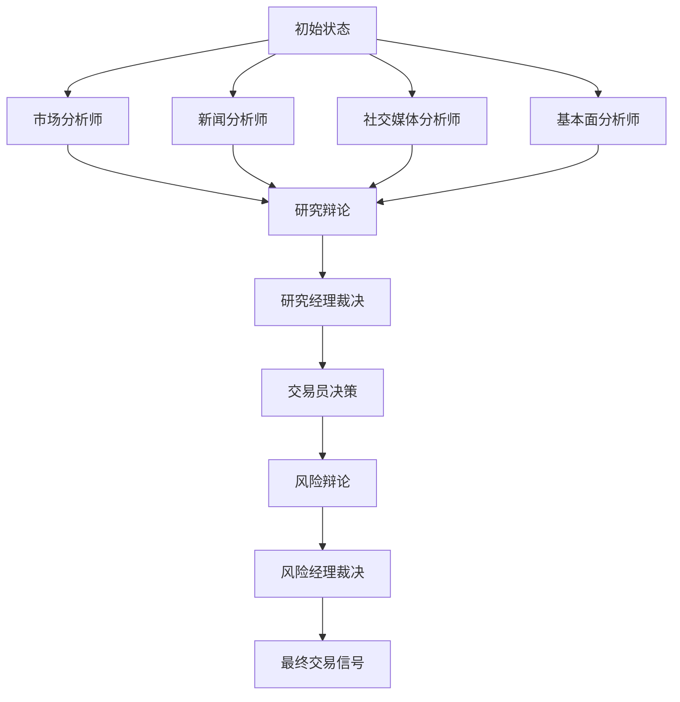

# 智能体系统

<cite>
**本文档中引用的文件**  
- [market_analyst.py](file://tradingagents/agents/analysts/market_analyst.py)
- [news_analyst.py](file://tradingagents/agents/analysts/news_analyst.py)
- [social_media_analyst.py](file://tradingagents/agents/analysts/social_media_analyst.py)
- [fundamentals_analyst.py](file://tradingagents/agents/analysts/fundamentals_analyst.py)
- [bull_researcher.py](file://tradingagents/agents/researchers/bull_researcher.py)
- [bear_researcher.py](file://tradingagents/agents/researchers/bear_researcher.py)
- [research_manager.py](file://tradingagents/agents/managers/research_manager.py)
- [aggresive_debator.py](file://tradingagents/agents/risk_mgmt/aggresive_debator.py)
- [conservative_debator.py](file://tradingagents/agents/risk_mgmt/conservative_debator.py)
- [neutral_debator.py](file://tradingagents/agents/risk_mgmt/neutral_debator.py)
- [risk_manager.py](file://tradingagents/agents/managers/risk_manager.py)
- [trader.py](file://tradingagents/agents/trader/trader.py)
- [trading_graph.py](file://tradingagents/graph/trading_graph.py)
- [stockstats_utils.py](file://tradingagents/dataflows/stockstats_utils.py)
- [googlenews_utils.py](file://tradingagents/dataflows/googlenews_utils.py)
- [reddit_utils.py](file://tradingagents/dataflows/reddit_utils.py)
- [finnhub_utils.py](file://tradingagents/dataflows/finnhub_utils.py)
</cite>

## 目录
1. [分析团队](#分析团队)
2. [研究团队](#研究团队)
3. [交易团队](#交易团队)
4. [风险管理团队](#风险管理团队)
5. [智能体协作流程](#智能体协作流程)

## 分析团队

分析团队由市场分析师、新闻分析师、社交媒体分析师和基本面分析师组成，各自负责从不同维度收集和分析信息，为后续决策提供数据支持。

### 市场分析师

市场分析师通过技术指标对股票进行量化分析。其核心功能是根据当前市场状况，从多个技术指标中选择最多8个最具互补性和信息价值的指标进行分析，避免冗余。支持的指标包括：

- **移动平均线**：如50日简单移动平均（close_50_sma）、200日简单移动平均（close_200_sma）和10日指数移动平均（close_10_ema），用于判断趋势方向和动态支撑/阻力。
- **MACD相关指标**：包括MACD线（macd）、MACD信号线（macds）和MACD柱状图（macdh），用于识别动量变化和趋势反转信号。
- **动量指标**：相对强弱指数（rsi），用于判断超买/超卖状态，结合趋势分析避免误判。
- **波动率指标**：布林带（boll、boll_ub、boll_lb）和平均真实波幅（atr），用于识别价格突破和设置止损。
- **成交量指标**：成交量加权移动平均（vwma），用于确认趋势强度。

在执行分析时，系统首先调用`get_YFin_data`获取历史价格数据，再调用`get_stockstats_indicators_report`生成所需指标。最终输出包含详细趋势分析和结构化Markdown表格的报告。

**Section sources**
- [market_analyst.py](file://tradingagents/agents/analysts/market_analyst.py#L1-L89)
- [stockstats_utils.py](file://tradingagents/dataflows/stockstats_utils.py#L1-L87)

### 新闻分析师

新闻分析师负责整合宏观和公司层面的新闻信息，评估其对市场的影响。系统根据配置决定使用在线或离线工具获取新闻数据：

- **在线模式**：调用`get_global_news_openai`和`get_google_news`获取实时新闻。
- **离线模式**：从`get_finnhub_news`、`get_reddit_news`和`get_google_news`获取已缓存的新闻数据。

新闻分析师综合多源信息，撰写包含宏观经济、行业动态和公司事件的综合报告，并以Markdown表格总结关键点，为交易决策提供背景支持。

**Section sources**
- [news_analyst.py](file://tradingagents/agents/analysts/news_analyst.py#L1-L60)
- [googlenews_utils.py](file://tradingagents/dataflows/googlenews_utils.py#L1-L108)

### 社交媒体分析师

社交媒体分析师专注于从Reddit等平台获取公众情绪和市场情绪数据。其主要功能是分析特定公司相关的社交媒体内容，评估公众情绪变化。

在离线模式下，系统调用`get_reddit_stock_info`从本地缓存中提取Reddit帖子数据。该函数通过`fetch_top_from_category`从指定子版块中筛选出与目标公司相关的高热度帖子，并按点赞数排序，提取标题、内容、链接和发布时间等信息。

最终报告整合社交媒体情绪、公司新闻和公众讨论，形成对公司当前状态的全面评估。

**Section sources**
- [social_media_analyst.py](file://tradingagents/agents/analysts/social_media_analyst.py#L1-L60)
- [reddit_utils.py](file://tradingagents/dataflows/reddit_utils.py#L1-L135)

### 基本面分析师

基本面分析师负责评估公司的财务健康状况和内在价值。其分析涵盖财务报表、内部人士交易和市场情绪等多个维度。

在离线模式下，系统调用以下工具获取数据：
- `get_finnhub_company_insider_sentiment`：获取内部人士情绪数据
- `get_finnhub_company_insider_transactions`：获取内部人士交易记录
- `get_simfin_balance_sheet`：获取资产负债表
- `get_simfin_cashflow`：获取现金流量表
- `get_simfin_income_stmt`：获取利润表

这些数据共同构成对公司基本面的全面视图，为投资决策提供长期价值判断依据。

**Section sources**
- [fundamentals_analyst.py](file://tradingagents/agents/analysts/fundamentals_analyst.py#L1-L64)
- [finnhub_utils.py](file://tradingagents/dataflows/finnhub_utils.py#L1-L36)

## 研究团队

研究团队由多头研究员（Bull Researcher）、空头研究员（Bear Researcher）和研究经理（Research Manager）组成，通过辩论机制形成投资观点。

### 多头/空头研究员

多头研究员和空头研究员基于市场、新闻、情绪和基本面四份报告展开辩论。双方均能访问辩论历史、对方最新论点以及从记忆中检索的类似历史案例。

- **多头研究员**：强调增长潜力、竞争优势和积极指标，主动反驳空头观点，构建支持买入的论据。
- **空头研究员**：聚焦风险、挑战和负面信号，批判性分析多头论点中的乐观假设，论证卖出理由。

辩论过程采用迭代方式进行，双方轮流发言，每次均基于最新信息和历史记忆优化论点。

**Section sources**
- [bull_researcher.py](file://tradingagents/agents/researchers/bull_researcher.py#L1-L59)
- [bear_researcher.py](file://tradingagents/agents/researchers/bear_researcher.py#L1-L61)

### 研究经理

研究经理作为辩论的裁决者，负责评估多空双方的论点并做出最终投资决策。其决策逻辑如下：

1. 汇总多空双方的完整辩论历史
2. 结合当前市场、情绪、新闻和基本面报告
3. 检索历史记忆中的类似案例和教训
4. 生成明确的投资建议（买入、卖出或持有）
5. 制定详细的投资计划，包括战略行动步骤

研究经理避免在双方观点相持时默认选择“持有”，而是基于最强论据做出明确决策。

**Section sources**
- [research_manager.py](file://tradingagents/agents/managers/research_manager.py#L1-L55)

## 交易团队

交易团队由交易员（Trader）组成，负责整合研究团队的投资计划并生成最终交易决策。

交易员接收研究经理生成的投资计划，并结合以下信息进行最终判断：
- 市场、情绪、新闻和基本面四份分析报告
- 从记忆中检索的历史相似情境和教训

交易员的角色是最终决策者，其输出必须以“FINAL TRANSACTION PROPOSAL: **BUY/HOLD/SELL**”结尾，明确指示交易动作。

**Section sources**
- [trader.py](file://tradingagents/agents/trader/trader.py#L1-L46)

## 风险管理团队

风险管理团队由激进、中立和保守三位风险分析师及风险经理组成，对交易决策进行风险评估。

### 风险分析师评估维度

- **激进风险分析师**：强调高回报机会，主张承担更高风险以获取超额收益，积极反驳保守和中立观点。
- **保守风险分析师**：优先考虑资产安全和风险最小化，批判高风险决策，主张稳健策略。
- **中立风险分析师**：提供平衡视角，评估风险与回报的权衡，倡导适度风险策略。

三位分析师基于交易员的投资计划展开辩论，各自引用市场数据支持其立场。

**Section sources**
- [aggresive_debator.py](file://tradingagents/agents/risk_mgmt/aggresive_debator.py#L1-L55)
- [conservative_debator.py](file://tradingagents/agents/risk_mgmt/conservative_debator.py#L1-L58)
- [neutral_debator.py](file://tradingagents/agents/risk_mgmt/neutral_debator.py#L1-L55)

### 风险经理

风险经理作为最终裁决者，评估三位风险分析师的辩论，做出最终风险决策。其职责包括：

1. 总结各方核心论点
2. 提供清晰的买入/卖出/持有建议
3. 基于研究经理的原始计划和辩论结果调整投资策略
4. 结合历史教训优化决策，避免重复错误

风险经理的决策形成最终交易指令。

**Section sources**
- [risk_manager.py](file://tradingagents/agents/managers/risk_manager.py#L1-L66)

## 智能体协作流程

智能体系统通过图结构（Graph）协调各智能体的执行顺序和消息传递。整个流程如下：

1. **并行分析阶段**：市场、新闻、社交媒体和基本面分析师同时运行，生成各自的分析报告。
2. **研究辩论阶段**：多头与空头研究员基于四份报告展开多轮辩论。
3. **研究裁决阶段**：研究经理评估辩论结果，生成投资计划。
4. **交易执行阶段**：交易员整合投资计划，生成初步交易提案。
5. **风险评估阶段**：三位风险分析师对交易提案进行辩论。
6. **风险裁决阶段**：风险经理做出最终风险决策。
7. **信号处理**：系统提取最终交易信号（BUY/SELL/HOLD）。

该流程由`TradingAgentsGraph`类协调，通过`trading_graph.py`中的图结构实现状态传播和条件控制。

**Diagram sources**
- [trading_graph.py](file://tradingagents/graph/trading_graph.py#L1-L254)

**Section sources**
- [trading_graph.py](file://tradingagents/graph/trading_graph.py#L1-L254)