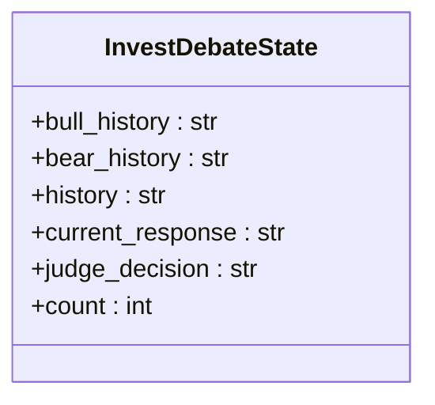
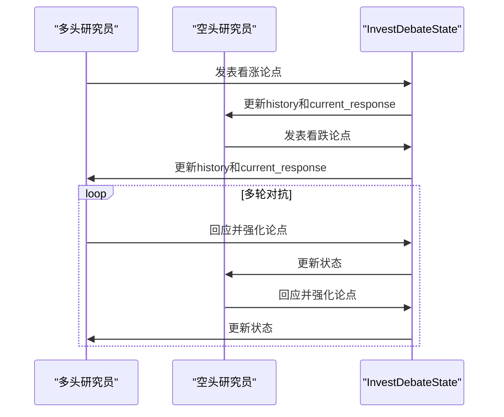
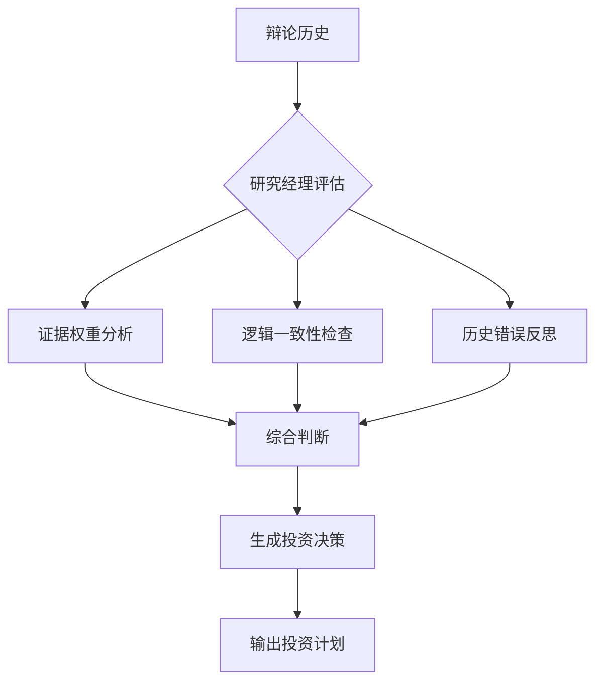
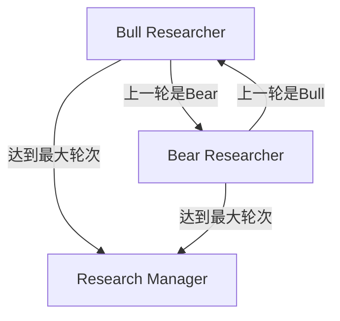

# 研究团队

<cite>
**本文档引用的文件**  
- [bull_researcher.py](file://tradingagents/agents/researchers/bull_researcher.py)
- [bear_researcher.py](file://tradingagents/agents/researchers/bear_researcher.py)
- [research_manager.py](file://tradingagents/agents/managers/research_manager.py)
- [agent_states.py](file://tradingagents/agents/utils/agent_states.py)
- [conditional_logic.py](file://tradingagents/graph/conditional_logic.py)
- [setup.py](file://tradingagents/graph/setup.py)
- [trading_graph.py](file://tradingagents/graph/trading_graph.py)
</cite>

## 目录
1. [引言](#引言)
2. [核心组件分析](#核心组件分析)
3. [多空辩论机制](#多空辩论机制)
4. [研究经理决策逻辑](#研究经理决策逻辑)
5. [LangGraph图结构与状态传播](#langgraph图结构与状态传播)
6. [辩论轮次控制与终止条件](#辩论轮次控制与终止条件)
7. [异常处理与记忆机制](#异常处理与记忆机制)
8. [结论](#结论)

## 引言
本文档深入解析交易代理系统中研究团队的多空辩论机制与研究经理的决策逻辑。该机制通过构建对立观点的智能体（多头与空头研究员）进行多轮推理对抗，最终由研究经理综合判断并做出投资决策。系统基于LangGraph框架实现状态驱动的流程控制，结合条件边逻辑实现动态路径选择，确保推理过程的灵活性与严谨性。

**Section sources**  
- [trading_graph.py](file://tradingagents/graph/trading_graph.py#L1-L50)

## 核心组件分析

### 多头研究员（Bull Researcher）
多头研究员负责构建支持投资的看涨论点。其核心逻辑在于从市场、情绪、新闻和基本面报告中提取正面信号，强调增长潜力、竞争优势和积极指标，并主动反驳空方观点。该智能体通过记忆机制回顾历史相似情境中的推荐，以避免重复错误。

**Section sources**  
- [bull_researcher.py](file://tradingagents/agents/researchers/bull_researcher.py#L1-L60)

### 空头研究员（Bear Researcher）
空头研究员负责识别投资风险并提出看跌观点。其职责是突出市场饱和、财务不稳定、竞争劣势等负面因素，利用数据揭示潜在下行风险，并对多方论点进行批判性分析，暴露其乐观假设的弱点。

**Section sources**  
- [bear_researcher.py](file://tradingagents/agents/researchers/bear_researcher.py#L1-L62)

### 研究经理（Research Manager）
研究经理作为最终裁决者，负责评估多空双方的论证强度并做出明确的投资决策（买入、卖出或持有）。其决策不仅基于当前辩论内容，还结合历史反思，避免重蹈覆辙，确保决策质量持续提升。

**Section sources**  
- [research_manager.py](file://tradingagents/agents/managers/research_manager.py#L1-L56)

## 多空辩论机制

### InvestDebateState 状态结构
多空辩论的状态由 `InvestDebateState` 类型定义，包含以下关键字段：
- **bull_history**: 多头研究员的完整对话历史
- **bear_history**: 空头研究员的完整对话历史
- **history**: 双方完整的辩论历史
- **current_response**: 当前发言者的最新论点
- **count**: 当前对话轮次计数器
- **judge_decision**: 研究经理的最终裁决

该状态结构确保了辩论过程的可追溯性和上下文连续性。



**Diagram sources**  
- [agent_states.py](file://tradingagents/agents/utils/agent_states.py#L10-L20)

### 多轮推理对抗流程
多空辩论采用交替发言的对抗模式。流程始于多头研究员首次发言，随后根据 `current_response` 字段的前缀判断上一轮发言者，决定下一轮由哪一方继续。此机制确保了辩论的交替性和公平性。



**Diagram sources**  
- [bull_researcher.py](file://tradingagents/agents/researchers/bull_researcher.py#L1-L60)
- [bear_researcher.py](file://tradingagents/agents/researchers/bear_researcher.py#L1-L62)

## 研究经理决策逻辑

### 裁决准则
研究经理的决策基于以下核心准则：
- **证据权重**: 评估双方论点所依赖数据的可靠性与相关性。
- **逻辑一致性**: 检查论证是否存在内部矛盾或逻辑漏洞。
- **历史反思**: 参考过去在相似情境下的错误决策，主动规避已知陷阱。

### 集成方式
研究经理不采用简单的加权投票，而是执行**元推理（Meta-Reasoning）**。它将整个辩论历史作为输入，进行高层次的综合分析，最终输出一个明确的、行动导向的投资建议（买入、卖出或持有），并附带详细的**投资计划**，包括战略行动步骤。



**Diagram sources**  
- [research_manager.py](file://tradingagents/agents/managers/research_manager.py#L1-L56)

## LangGraph图结构与状态传播

### 节点定义
研究团队在LangGraph中的主要节点包括：
- **Bull Researcher**: 多头研究员节点
- **Bear Researcher**: 空头研究员节点
- **Research Manager**: 研究经理节点

### 条件边逻辑（Conditional Edge）
`should_continue_debate` 函数定义了辩论流程的条件转移逻辑：
1.  **轮次检查**: 若 `investment_debate_state["count"]` 达到预设最大轮次（默认为2轮，即4次发言），则跳转至“Research Manager”。
2.  **发言者检查**: 若上一轮发言者是“Bull”，则下一轮由“Bear Researcher”接续；反之，则由“Bull Researcher”接续。



**Diagram sources**  
- [conditional_logic.py](file://tradingagents/graph/conditional_logic.py#L45-L55)

### 状态传播路径
完整的状态传播路径如下：
1.  数据分析师节点（市场、社交媒体、新闻、基本面）依次执行并生成报告。
2.  报告汇总至 `AgentState`。
3.  流程进入“Bull Researcher”节点，启动多空辩论。
4.  通过条件边在“Bull Researcher”和“Bear Researcher”之间循环。
5.  达到终止条件后，进入“Research Manager”节点进行裁决。
6.  决策结果通过 `investment_plan` 字段传播至后续的交易员节点。

**Section sources**  
- [setup.py](file://tradingagents/graph/setup.py#L150-L205)

## 辩论轮次控制与终止条件

### 轮次控制
系统通过 `InvestDebateState` 中的 `count` 字段精确控制辩论轮次。每次研究员发言后，`count` 值递增1。

### 终止条件
辩论的终止由 `conditional_logic.py` 中的 `should_continue_debate` 函数判定，其终止条件为：
```python
state["investment_debate_state"]["count"] >= 2 * self.max_debate_rounds
```
其中 `max_debate_rounds` 默认为1，因此当 `count` 达到2时（即完成一轮完整的“多头->空头”发言），辩论结束。此设计确保了辩论的高效性，避免无限循环。

**Section sources**  
- [conditional_logic.py](file://tradingagents/graph/conditional_logic.py#L45-L55)

## 异常处理与记忆机制

### 异常处理
系统通过LangGraph的工具调用机制（ToolNode）处理外部数据获取的异常。若工具调用失败，`should_continue_*` 系列函数会检查 `last_message.tool_calls`，决定是否重试或清除消息并继续流程，从而保证了工作流的健壮性。

### 记忆机制
系统集成了 `FinancialSituationMemory` 记忆模块。在每次决策后，`reflect_and_remember` 方法会根据实际收益/亏损情况，对多头、空头及研究经理的记忆进行反思和更新。这使得智能体能够从历史错误中学习，持续优化未来的决策质量。

**Section sources**  
- [trading_graph.py](file://tradingagents/graph/trading_graph.py#L230-L254)

## 结论
本研究团队的设计实现了高度结构化的投资决策流程。通过引入多空对抗机制，系统能够主动探索投资标的的正反两面，有效减少认知偏差。研究经理的元推理决策模式，结合历史反思，确保了最终决策的审慎与高质量。整个流程在LangGraph的驱动下，实现了状态的精确管理与流程的灵活控制，构成了一个具备自我学习能力的智能投研系统。