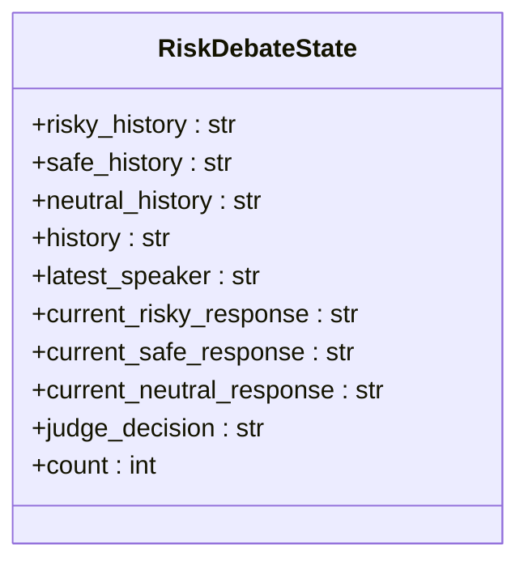
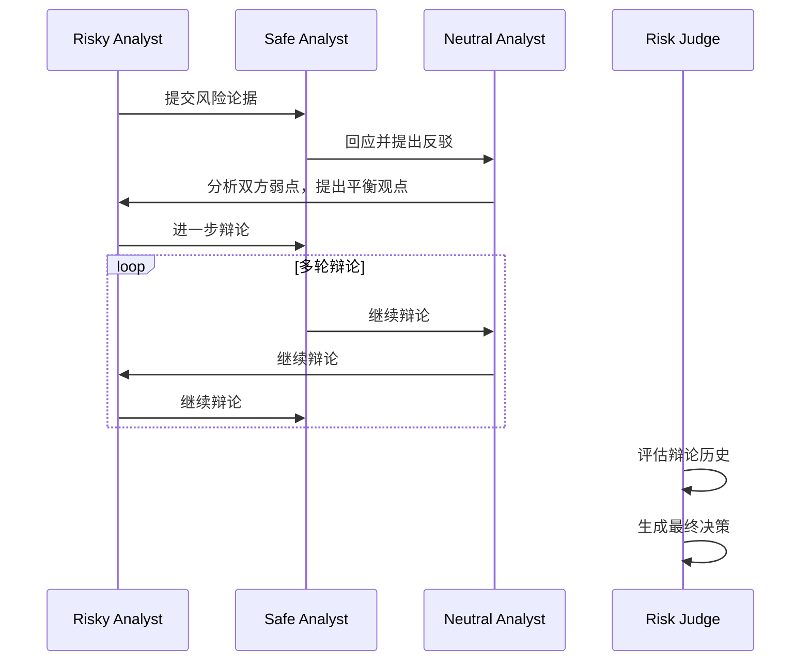
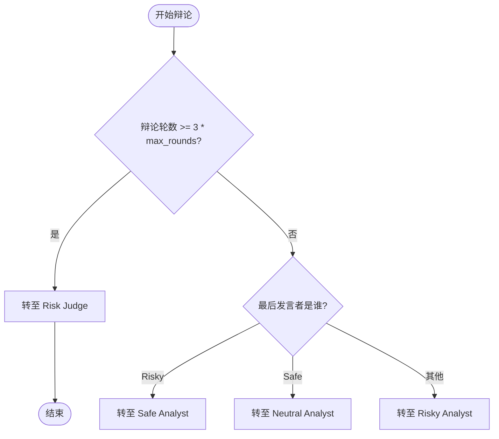

# 风险管理团队

<cite>
**本文档中引用的文件**  
- [aggresive_debator.py](file://tradingagents/agents/risk_mgmt/aggresive_debator.py)
- [conservative_debator.py](file://tradingagents/agents/risk_mgmt/conservative_debator.py)
- [neutral_debator.py](file://tradingagents/agents/risk_mgmt/neutral_debator.py)
- [risk_manager.py](file://tradingagents/agents/managers/risk_manager.py)
- [agent_states.py](file://tradingagents/agents/utils/agent_states.py)
- [conditional_logic.py](file://tradingagents/graph/conditional_logic.py)
- [setup.py](file://tradingagents/graph/setup.py)
</cite>

## 目录
1. [引言](#引言)
2. [三重评估机制与风险辩论状态](#三重评估机制与风险辩论状态)
3. [风险分析师角色分析](#风险分析师角色分析)
4. [风险辩论流程与状态更新机制](#风险辩论流程与状态更新机制)
5. [风险经理的综合决策过程](#风险经理的综合决策过程)
6. [图工作流中的条件分支逻辑](#图工作流中的条件分支逻辑)
7. [中断/继续控制接口与熔断机制](#中断继续控制接口与熔断机制)
8. [结论](#结论)

## 引言
本文件系统性地描述了交易代理系统中风险管理团队的三重评估机制与风险经理的综合决策过程。该机制通过三位具有不同风险偏好的分析师——激进风险分析师（Risky Analyst）、保守风险分析师（Safe Analyst）和中立风险分析师（Neutral Analyst）之间的多轮辩论，形成对交易计划的全面风险评估。最终由风险经理（Risk Judge）整合各方意见，生成最终决策建议。本文档详细阐述了各角色的职责、辩论流程、状态管理、决策逻辑及其在图工作流中的控制机制。

## 三重评估机制与风险辩论状态

风险管理团队采用三重评估机制，通过结构化辩论实现风险视角的多元化整合。该机制的核心是 `RiskDebateState` 状态对象，用于跟踪辩论全过程。

**图来源**  
- [agent_states.py](file://tradingagents/agents/utils/agent_states.py#L24-L46)

**节来源**  
- [agent_states.py](file://tradingagents/agents/utils/agent_states.py#L24-L46)

## 风险分析师角色分析

### 激进风险分析师（Aggressive Debator）
激进风险分析师（`aggresive_debator.py`）从高杠杆、高波动的角度识别潜在收益机会。其核心职责是积极倡导高回报、高风险的投资机会，强调大胆策略和竞争优势。在评估交易计划时，该角色专注于潜在的上行空间、增长潜力和创新优势，利用市场数据和情绪分析来强化论点，并直接反驳保守派和中立派的观点。

**节来源**  
- [aggresive_debator.py](file://tradingagents/agents/risk_mgmt/aggresive_debator.py#L0-L20)

### 保守风险分析师（Conservative Debator）
保守风险分析师（`conservative_debator.py`）强调本金安全与下行保护。其首要目标是保护资产、最小化波动性并确保稳定可靠的增长。该角色优先考虑稳定性、安全性和风险缓解，仔细评估潜在损失、经济衰退和市场波动。在评估交易计划时，会批判性地审查高风险元素，指出决策可能带来的过度风险，并主张更谨慎的替代方案。

**节来源**  
- [conservative_debator.py](file://tradingagents/agents/risk_mgmt/conservative_debator.py#L0-L23)

### 中立风险分析师（Neutral Debator）
中立风险分析师（`neutral_debator.py`）致力于平衡风险收益比。该角色提供平衡的视角，权衡交易决策的潜在收益与风险。它优先考虑全面的方法，评估利弊，同时考虑更广泛的市场趋势、潜在的经济变化和多元化策略。其任务是挑战激进派和保守派的观点，指出各自的过度乐观或过度谨慎之处，倡导一种适度、可持续的策略。

**节来源**  
- [neutral_debator.py](file://tradingagents/agents/risk_mgmt/neutral_debator.py#L0-L24)

## 风险辩论流程与状态更新机制

三名风险分析师在 `RiskDebateState` 中提交各自的风险评分与论据，并通过多轮辩论形成初步共识。辩论流程由图工作流的条件逻辑驱动。

**图来源**  
- [conditional_logic.py](file://tradingagents/graph/conditional_logic.py#L37-L66)
- [setup.py](file://tradingagents/graph/setup.py#L157-L204)

**节来源**  
- [conditional_logic.py](file://tradingagents/graph/conditional_logic.py#L37-L66)
- [setup.py](file://tradingagents/graph/setup.py#L157-L204)

## 风险经理的综合决策过程

风险经理（`risk_manager.py`）负责整合三方意见，生成最终风险评级。其决策过程并非简单的加权平均，而是作为“辩论裁判和辩论促进者”，对辩论内容进行深度评估。

风险经理节点接收完整的辩论历史（`history`）、各分析师的独立历史（`risky_history`, `safe_history`, `neutral_history`）以及当前的市场、新闻、基本面和情绪报告。它还会查询记忆系统，获取与当前情境相似的历史决策案例（`past_memories`），以吸取过去的经验教训。

决策提示词明确要求风险经理必须给出清晰的建议：买入（Buy）、卖出（Sell）或持有（Hold）。它被要求总结关键论点，提供基于辩论和历史案例的详细理由，并基于交易员的原始计划进行调整。

最终，风险经理的决策被记录在 `judge_decision` 字段中，并作为 `final_trade_decision` 输出，从而决定是否放行交易。

**节来源**  
- [risk_manager.py](file://tradingagents/agents/managers/risk_manager.py#L0-L65)

## 图工作流中的条件分支逻辑

风险辩论的流程由图工作流（`setup.py`）中的条件分支逻辑精确控制。`should_continue_risk_analysis` 函数决定了辩论的走向。

**图来源**  
- [conditional_logic.py](file://tradingagents/graph/conditional_logic.py#L37-L66)
- [setup.py](file://tradingagents/graph/setup.py#L157-L204)

**节来源**  
- [conditional_logic.py](file://tradingagents/graph/conditional_logic.py#L37-L66)

## 中断/继续控制接口与熔断机制

该模块通过 `count` 计数器和 `max_risk_discuss_rounds` 参数实现了内置的“熔断机制”。当 `state["risk_debate_state"]["count"] >= 3 * self.max_risk_discuss_rounds` 时，条件逻辑会强制将流程导向 `Risk Judge` 节点，从而中断辩论。

这一机制确保了辩论不会无限循环，为整个风险评估过程设定了明确的终止条件，是系统在异常市场条件下（如信息过载或观点僵持）保持稳定性和效率的关键设计。

**节来源**  
- [conditional_logic.py](file://tradingagents/graph/conditional_logic.py#L37-L66)

## 结论
风险管理团队的三重评估机制通过模拟不同风险偏好的专家辩论，实现了对交易决策的深度、多维度风险评估。从激进、保守到中立的视角碰撞，再到风险经理的最终裁决，整个流程结构严谨，逻辑清晰。通过 `RiskDebateState` 状态管理和图工作流的条件分支，系统实现了动态、可控的决策过程，并通过计数器熔断机制保证了流程的健壮性。该设计有效整合了多元化观点，为交易决策提供了坚实的风险控制保障。