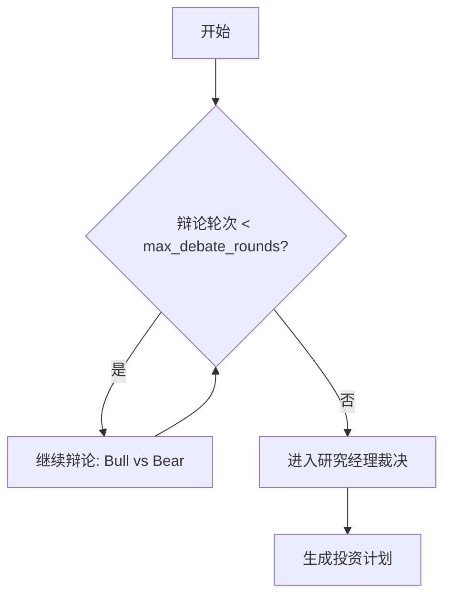
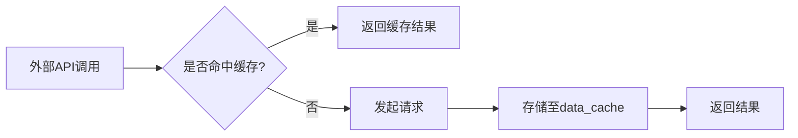
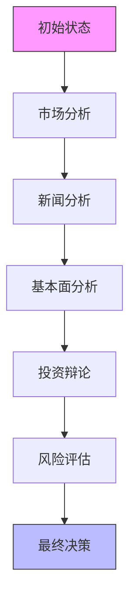

# 性能优化

<cite>
**本文档引用的文件**  
- [main.py](file://main.py)
- [trading_graph.py](file://tradingagents/graph/trading_graph.py)
- [conditional_logic.py](file://tradingagents/graph/conditional_logic.py)
- [propagation.py](file://tradingagents/graph/propagation.py)
- [risk_manager.py](file://tradingagents/agents/managers/risk_manager.py)
- [conservative_debator.py](file://tradingagents/agents/risk_mgmt/conservative_debator.py)
- [neutral_debator.py](file://tradingagents/agents/risk_mgmt/neutral_debator.py)
- [aggresive_debator.py](file://tradingagents/agents/risk_mgmt/aggresive_debator.py)
- [googlenews_utils.py](file://tradingagents/dataflows/googlenews_utils.py)
- [setup.py](file://tradingagents/graph/setup.py)
- [cli/main.py](file://cli/main.py)
</cite>

## 目录
1. [引言](#引言)
2. [并发控制与智能体协作优化](#并发控制与智能体协作优化)
3. [缓存机制与重复计算避免](#缓存机制与重复计算避免)
4. [状态传播性能瓶颈分析](#状态传播性能瓶颈分析)
5. [异步调用与LangGraph工作流优化](#异步调用与langgraph工作流优化)
6. [max_debate_rounds参数调优](#max_debaterounds参数调优)
7. [高频率场景下的结果缓存与增量更新](#高频率场景下的结果缓存与增量更新)
8. [总结](#总结)

## 引言
TradingAgents框架通过多智能体协作实现金融交易决策，其性能受LLM调用延迟、外部数据源响应、状态传播效率等多因素影响。本指南系统总结性能优化最佳实践，涵盖并发控制、缓存策略、异步执行与参数调优，旨在提升系统响应速度与决策效率。

## 并发控制与智能体协作优化

TradingAgents通过状态驱动的图结构协调多个智能体，合理控制并发流程可显著减少等待时间。系统采用`StateGraph`与条件判断函数（如`should_continue_debate`）动态决定执行路径，避免不必要的串行等待。

例如，在投资辩论阶段，`should_continue_debate`根据辩论轮次自动终止流程，防止无限循环。类似地，风险分析阶段的`should_continue_risk_analysis`控制三名分析师（激进、中立、保守）的发言顺序，确保在达到`max_risk_discuss_rounds`后及时进入裁决阶段。



**图示来源**  
- [conditional_logic.py](file://tradingagents/graph/conditional_logic.py#L37-L66)

**本节来源**  
- [conditional_logic.py](file://tradingagents/graph/conditional_logic.py#L37-L66)
- [trading_graph.py](file://tradingagents/graph/trading_graph.py)

## 缓存机制与重复计算避免

为避免对相同数据的重复API调用和计算，框架在多个层面实施缓存策略：

1. **外部数据缓存**：`googlenews_utils.py`中使用`tenacity`库实现带指数退避的重试机制，并通过随机延迟（`time.sleep(random.uniform(2, 6))`）降低被限流风险。同时，系统创建本地缓存目录`dataflows/data_cache`以存储中间结果。

2. **智能体记忆缓存**：风险管理者（`risk_manager`）通过`memory.get_memories()`检索历史决策，避免重复推理。该记忆机制基于当前市场状况（`curr_situation`）进行语义匹配，复用过往经验。

3. **结果持久化**：`TradingAgentsGraph`将完整状态日志保存至`eval_results/{ticker}/...`路径，支持后续分析与缓存复用。



**图示来源**  
- [googlenews_utils.py](file://tradingagents/dataflows/googlenews_utils.py#L0-L45)
- [risk_manager.py](file://tradingagents/agents/managers/risk_manager.py#L0-L24)

**本节来源**  
- [googlenews_utils.py](file://tradingagents/dataflows/googlenews_utils.py#L0-L45)
- [risk_manager.py](file://tradingagents/agents/managers/risk_manager.py#L0-L24)
- [trading_graph.py](file://tradingagents/graph/trading_graph.py#L0-L57)

## 状态传播性能瓶颈分析

状态传播（propagation）是系统性能的关键路径，主要瓶颈包括：

1. **LLM调用延迟**：每个智能体节点（如`bull_researcher`、`risky_debator`）均需调用LLM生成响应，延迟随模型复杂度增加而上升。系统支持配置`quick_thinking_llm`和`deep_thinking_llm`以平衡速度与质量。

2. **外部数据源响应**：新闻、社交媒体、财务数据等外部API（如Google News、Finnhub）响应时间不可控，可能成为系统瓶颈。`googlenews_utils.py`中的重试机制虽能提高成功率，但会增加整体延迟。

3. **状态同步开销**：`Propagator`需在每一步更新全局状态（如`investment_debate_state`、`risk_debate_state`），频繁的状态复制与传递带来额外开销。



**图示来源**  
- [propagation.py](file://tradingagents/graph/propagation.py#L0-L48)
- [trading_graph.py](file://tradingagents/graph/trading_graph.py)

**本节来源**  
- [propagation.py](file://tradingagents/graph/propagation.py#L0-L48)
- [trading_graph.py](file://tradingagents/graph/trading_graph.py)
- [googlenews_utils.py](file://tradingagents/dataflows/googlenews_utils.py)

## 异步调用与LangGraph工作流优化

框架通过LangGraph的`stream_mode="values"`实现流式异步处理，允许在状态更新的同时进行后续计算，提升整体吞吐量。`graph.stream()`逐块返回结果，前端可实时展示分析进度。

此外，`recursion_limit`参数（默认100）防止无限递归，确保系统稳定性。建议在高并发场景下适当调整该值，并结合`config`参数优化执行上下文。

**本节来源**  
- [propagation.py](file://tradingagents/graph/propagation.py#L45-L48)
- [trading_graph.py](file://tradingagents/graph/trading_graph.py)

## max_debate_rounds参数调优

`max_debate_rounds`是平衡决策质量与执行速度的核心参数。其值直接影响投资辩论的轮次：

- **低值（如1）**：快速收敛，适合高频交易场景，但可能牺牲决策深度。
- **高值（如3）**：允许更充分的多角度辩论，提升决策质量，但增加延迟。

该参数在`ConditionalLogic`类中初始化，并通过`should_continue_debate`函数控制流程。用户可通过配置文件或CLI动态调整：

```python
config["max_debate_rounds"] = 2  # 在main.py或CLI中设置
```

**本节来源**  
- [conditional_logic.py](file://tradingagents/graph/conditional_logic.py#L0-L35)
- [cli/main.py](file://cli/main.py#L714-L749)

## 高频率场景下的结果缓存与增量更新

在高频率使用场景下，建议实施以下策略：

1. **结果缓存**：将`eval_results`目录中的历史决策缓存至Redis或本地数据库，对相似市场状况直接返回缓存结果。
2. **增量更新**：仅当新数据（如新闻、股价）发生显著变化时触发完整分析流程，否则执行轻量级更新。
3. **并行数据采集**：同时调用`market_analyst`、`news_analyst`等独立模块，减少串行等待。

**本节来源**  
- [trading_graph.py](file://tradingagents/graph/trading_graph.py#L214-L253)
- [propagation.py](file://tradingagents/graph/propagation.py#L0-L48)

## 总结
通过合理配置`max_debate_rounds`、启用多级缓存、优化异步流式处理，TradingAgents可在保证决策质量的同时显著提升性能。建议在生产环境中监控各阶段延迟，针对性优化瓶颈模块。