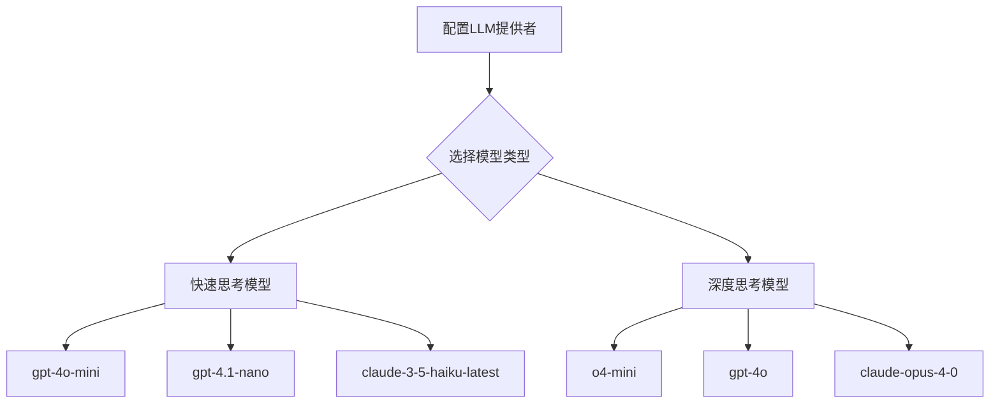
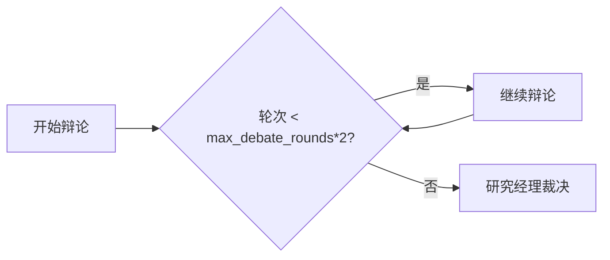

# 成本控制

<cite>
**本文档中引用的文件**  
- [main.py](file://main.py)
- [default_config.py](file://tradingagents/default_config.py)
- [trading_graph.py](file://tradingagents/graph/trading_graph.py)
- [config.py](file://tradingagents/dataflows/config.py)
- [utils.py](file://cli/utils.py)
</cite>

## 目录
1. [引言](#引言)
2. [核心成本控制策略](#核心成本控制策略)
3. [LLM模型选择与配置](#llm模型选择与配置)
4. [辩论轮次管理](#辩论轮次管理)
5. [在线工具使用优化](#在线工具使用优化)
6. [环境特定配置示例](#环境特定配置示例)
7. [综合成本优化建议](#综合成本优化建议)

## 引言
本指南旨在为TradingAgents框架提供全面的成本控制策略，帮助用户在开发和生产环境中有效降低API调用成本。通过合理配置LLM模型、优化辩论流程和管理外部工具调用，可以在保证分析质量的同时显著减少运行开销。文档详细说明了如何利用配置文件灵活调整系统行为，实现成本与性能的最佳平衡。

## 核心成本控制策略
TradingAgents框架提供了多种机制来控制运行成本，主要包括经济型LLM模型的选择、辩论轮次的限制以及在线工具的开关控制。这些策略共同作用，确保系统在不同使用场景下都能保持高效且经济的运行状态。

**Section sources**
- [default_config.py](file://tradingagents/default_config.py#L1-L21)
- [trading_graph.py](file://tradingagents/graph/trading_graph.py#L59-L72)

## LLM模型选择与配置
框架支持通过配置文件灵活切换deep_think_llm和quick_think_llm两种模型，实现成本与性能的平衡。在测试和开发阶段，强烈推荐使用gpt-4o-mini等经济型模型以显著降低API调用成本。

### 模型配置机制
系统通过配置字典中的`deep_think_llm`和`quick_think_llm`参数来指定使用的模型。在初始化TradingAgentsGraph时，根据配置动态创建相应的LLM实例。支持的提供商包括OpenAI、Anthropic、Google、OpenRouter和Ollama。

### 推荐模型选择
对于快速思考任务，`gpt-4o-mini`是首选的经济型模型，具有良好的性能和较低的成本。深度思考任务可根据需求选择更强大的模型，但在开发阶段也可使用经济型模型进行测试。



**Diagram sources**
- [default_config.py](file://tradingagents/default_config.py#L1-L21)
- [utils.py](file://cli/utils.py#L127-L233)

**Section sources**
- [trading_graph.py](file://tradingagents/graph/trading_graph.py#L59-L72)
- [utils.py](file://cli/utils.py#L127-L233)

## 辩论轮次管理
通过合理设置`max_debate_rounds`参数，可以有效避免不必要的多轮辩论导致的成本激增。该参数控制投资辩论和风险讨论的最大轮次，直接影响LLM调用次数和整体成本。

### 参数作用机制
`max_debate_rounds`参数在ConditionalLogic类中被使用，决定辩论流程的终止条件。当辩论计数达到2倍该值时（代表两方各发言指定轮次），辩论结束并转交研究经理裁决。

### 推荐配置值
- 开发/测试环境：建议设置为1，仅进行基本辩论
- 生产环境：可根据需要设置为3-5，进行更深入的分析
- 极端成本敏感场景：可设置为1或更低



**Diagram sources**
- [conditional_logic.py](file://tradingagents/graph/conditional_logic.py#L37-L66)
- [default_config.py](file://tradingagents/default_config.py#L1-L21)

**Section sources**
- [conditional_logic.py](file://tradingagents/graph/conditional_logic.py#L37-L66)
- [default_config.py](file://tradingagents/default_config.py#L1-L21)

## 在线工具使用优化
通过设置`online_tools`配置参数，可以在非关键分析任务中禁用外部API调用，使用本地缓存数据，从而减少外部API调用费用。

### 工具调用机制
系统在创建tool_nodes时根据`online_tools`参数决定是否包含在线工具。当该参数为False时，仅使用离线工具（如本地数据文件），避免产生外部API调用成本。

### 使用建议
- 开发和测试：建议设置`online_tools=False`，使用缓存数据进行快速迭代
- 生产环境：设置`online_tools=True`，获取最新市场数据
- 成本敏感场景：结合数据缓存策略，定期更新而非实时调用

**Section sources**
- [trading_graph.py](file://tradingagents/graph/trading_graph.py#L144-L189)
- [default_config.py](file://tradingagents/default_config.py#L1-L21)

## 环境特定配置示例
结合main.py中的配置示例，可以为不同环境定制成本优化方案。通过复制默认配置并进行针对性修改，实现环境间的灵活切换。

### 开发环境配置
```python
config = DEFAULT_CONFIG.copy()
config["llm_provider"] = "openai"
config["deep_think_llm"] = "o4-mini"
config["quick_think_llm"] = "gpt-4o-mini"
config["max_debate_rounds"] = 1
config["online_tools"] = False
```

### 生产环境配置
```python
config = DEFAULT_CONFIG.copy()
config["llm_provider"] = "openai"
config["deep_think_llm"] = "o1"
config["quick_think_llm"] = "gpt-4o"
config["max_debate_rounds"] = 3
config["online_tools"] = True
```

**Section sources**
- [main.py](file://main.py#L0-L21)
- [default_config.py](file://tradingagents/default_config.py#L1-L21)

## 综合成本优化建议
为实现最佳成本效益，建议采取分层优化策略：在开发阶段使用最经济的配置组合，在生产阶段根据实际需求逐步提升资源配置。定期评估各组件的成本效益比，持续优化配置参数。

**Section sources**
- [main.py](file://main.py#L0-L21)
- [default_config.py](file://tradingagents/default_config.py#L1-L21)
- [trading_graph.py](file://tradingagents/graph/trading_graph.py#L59-L72)