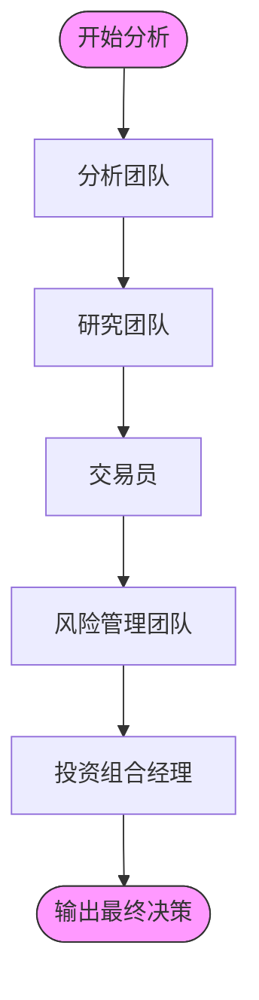
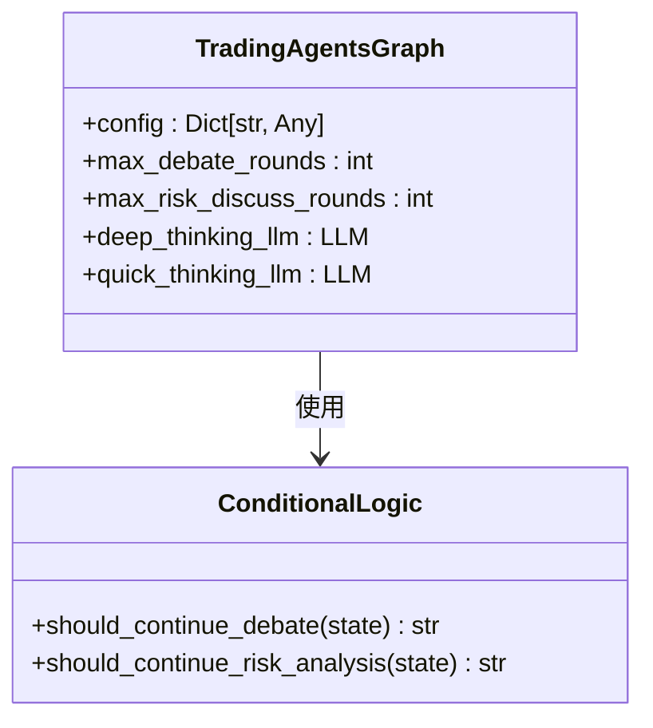
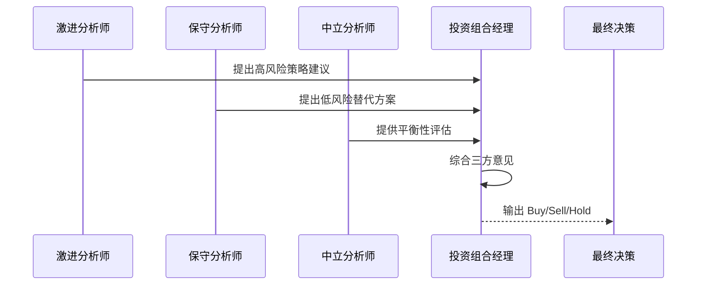

# 最佳实践

<cite>
**本文档中引用的文件**  
- [default_config.py](file://tradingagents/default_config.py)
- [trading_graph.py](file://tradingagents/graph/trading_graph.py)
- [conditional_logic.py](file://tradingagents/graph/conditional_logic.py)
- [risk_manager.py](file://tradingagents/agents/managers/risk_manager.py)
- [aggresive_debator.py](file://tradingagents/agents/risk_mgmt/aggresive_debator.py)
- [conservative_debator.py](file://tradingagents/agents/risk_mgmt/conservative_debator.py)
- [neutral_debator.py](file://tradingagents/agents/risk_mgmt/neutral_debator.py)
- [trader.py](file://tradingagents/agents/trader/trader.py)
- [main.py](file://cli/main.py)
</cite>

## 目录
1. [引言](#引言)
2. [性能优化最佳实践](#性能优化最佳实践)
3. [成本控制最佳实践](#成本控制最佳实践)
4. [风险管理最佳实践](#风险管理最佳实践)
5. [实验设计指南](#实验设计指南)
6. [生产环境部署注意事项](#生产环境部署注意事项)
7. [结论](#结论)

## 引言
TradingAgents 是一个基于多智能体架构的金融交易研究框架，通过模拟真实交易公司中的分析师、研究员、交易员和风控团队的协作流程，实现对市场状况的综合评估与决策。该框架采用 LangGraph 构建，支持模块化扩展和灵活配置。本最佳实践文档旨在为开发者和研究人员提供在性能、成本和风险管理方面的指导原则，并涵盖实验设计与生产部署的关键建议。

## 性能优化最佳实践

### 并发控制策略
TradingAgents 框架通过 `LangGraph` 实现状态驱动的智能体协作流程，其执行模式本质上是顺序与条件分支结合的流式处理。为避免不必要的资源竞争和上下文切换开销，不建议在单次分析任务中启用多线程并发执行。相反，应通过外部调度器（如 Celery 或 Airflow）对多个独立的股票分析任务进行并行调度，以充分利用计算资源。

框架内部通过 `Propagator` 类管理状态传播，并设置 `max_recur_limit` 参数（默认为100）来防止无限递归。合理设置此参数可避免因复杂条件逻辑导致的性能下降。



**图示来源**  
- [trading_graph.py](file://tradingagents/graph/trading_graph.py#L191-L214)
- [conditional_logic.py](file://tradingagents/graph/conditional_logic.py#L0-L67)

### 缓存机制减少重复计算
框架内置了数据缓存机制，位于 `dataflows/data_cache` 目录下，支持离线工具调用以减少对 API 的依赖。通过配置 `config["online_tools"] = False`，可强制使用缓存数据进行回测，显著提升执行速度并降低外部依赖风险。

此外，`FinancialSituationMemory` 类实现了基于情境的记忆检索功能，允许智能体从历史决策中学习，避免重复推理相似市场状况。

**本节来源**  
- [trading_graph.py](file://tradingagents/graph/trading_graph.py#L0-L254)
- [default_config.py](file://tradingagents/default_config.py#L0-L22)

## 成本控制最佳实践

### 经济型模型选择
在测试和开发阶段，强烈推荐使用成本较低的模型以减少 API 调用费用。根据 `default_config.py` 中的默认配置：

- **深度思考模型 (deep_think_llm)**: `o4-mini`（即 gpt-4o-mini）
- **快速思考模型 (quick_think_llm)**: `gpt-4o-mini`

这些轻量级模型在保持较高推理能力的同时，大幅降低了每次调用的成本，特别适合用于调试、单元测试和大规模回测场景。

### 合理设置辩论轮次
框架中的研究团队和风控团队采用辩论机制生成决策。通过 `max_debate_rounds` 和 `max_risk_discuss_rounds` 参数控制辩论轮数。每增加一轮辩论，将导致额外的 LLM 调用。

建议在初期实验中将这两个参数设置为 1，在验证逻辑正确性后，再逐步增加轮次以探索性能与成本的平衡点。用户可通过 CLI 界面选择“研究深度”来动态调整这些参数。



**图示来源**  
- [default_config.py](file://tradingagents/default_config.py#L0-L22)
- [conditional_logic.py](file://tradingagents/graph/conditional_logic.py#L0-L67)

**本节来源**  
- [main.py](file://cli/main.py#L714-L749)
- [conditional_logic.py](file://tradingagents/graph/conditional_logic.py#L0-L67)

## 风险管理最佳实践

### 研究目的声明
TradingAgents 框架明确声明**仅用于研究目的**，其输出结果不应作为实际投资决策的依据。市场表现受多种因素影响，包括所选基础语言模型、模型温度、交易周期、数据质量等非确定性变量。

### 风控团队辩论机制
框架通过三类风险分析师（激进、中立、保守）与投资组合经理（Portfolio Manager）构成四层风控体系：

- **激进分析师 (Risky Analyst)**：主张高风险高回报策略
- **保守分析师 (Safe Analyst)**：强调资产保护与低波动
- **中立分析师 (Neutral Analyst)**：提供平衡视角
- **投资组合经理 (Judge)**：综合各方意见做出最终决策

该机制通过 `risk_manager_node` 实现，确保最终决策经过多角度审视。



**图示来源**  
- [risk_manager.py](file://tradingagents/agents/managers/risk_manager.py#L0-L66)
- [aggresive_debator.py](file://tradingagents/agents/risk_mgmt/aggresive_debator.py#L0-L55)
- [conservative_debator.py](file://tradingagents/agents/risk_mgmt/conservative_debator.py#L0-L58)

### 模拟环境验证
所有策略应在模拟环境中充分验证。框架支持通过 `trading_graph.py` 中的 `propagate()` 方法接收指定日期和股票代码，结合缓存数据进行历史回测。建议在部署前完成至少一个完整市场周期的回测，并结合 `reflect_and_remember()` 方法进行决策复盘。

**本节来源**  
- [risk_manager.py](file://tradingagents/agents/managers/risk_manager.py#L0-L66)
- [trading_graph.py](file://tradingagents/graph/trading_graph.py#L0-L254)

## 实验设计指南

### 变量控制
进行 A/B 测试时，应严格控制变量。建议每次实验仅改变一个参数，例如：
- 不同 LLM 模型对比
- 不同辩论轮次的影响
- 开启/关闭在线工具

使用 `DEFAULT_CONFIG.copy()` 创建独立配置实例，避免污染全局设置。

### 结果记录
框架自动将每次执行的完整状态记录至 `eval_results/{ticker}/TradingAgentsStrategy_logs/` 目录下的 JSON 文件中，包含：
- 各类分析报告
- 辩论历史
- 最终交易决策
- 智能体状态

可通过 `_log_state()` 方法自定义日志结构。

### A/B 测试方法
建议采用如下流程进行策略对比：
1. 定义基准配置（Control）
2. 创建变体配置（Variant）
3. 使用相同输入（股票、日期）运行两组实验
4. 比较输出决策与中间推理过程
5. 评估记忆更新效果

**本节来源**  
- [trading_graph.py](file://tradingagents/graph/trading_graph.py#L191-L214)
- [main.py](file://cli/main.py#L714-L749)

## 生产环境部署注意事项

### 密钥安全管理
所有 API 密钥（如 OpenAI、FinnHub）应通过环境变量注入，禁止硬编码。推荐使用 `.env` 文件配合 `python-dotenv` 库管理，并确保该文件被 `.gitignore` 忽略。

```bash
export OPENAI_API_KEY=your_key_here
export FINNHUB_API_KEY=your_key_here
```

### 调用速率限制
由于框架涉及大量 LLM API 调用，必须实施速率限制以避免超出配额或触发封禁。建议：
- 使用 `tiktoken` 库估算 token 消耗
- 在客户端实现指数退避重试机制
- 配置监控告警以检测异常调用频率

### 监控告警设置
部署时应集成监控系统，关键监控指标包括：
- 单次分析耗时
- LLM 调用次数与成本
- 缓存命中率
- 错误率（如 API 超时、解析失败）

可通过重写 `message_buffer` 的日志输出逻辑，将关键事件发送至 Prometheus、Grafana 或 ELK 等监控平台。

**本节来源**  
- [main.py](file://cli/main.py#L73-L94)
- [trading_graph.py](file://tradingagents/graph/trading_graph.py#L0-L254)

## 结论
TradingAgents 提供了一个高度可配置的多智能体金融分析框架。通过合理运用性能优化策略、成本控制手段和风险管理机制，研究人员可在保障系统稳定性的前提下高效开展实验。强烈建议始终在模拟环境中验证策略，并遵循安全开发实践进行生产部署。未来可通过扩展记忆模块和引入强化学习进一步提升决策质量。