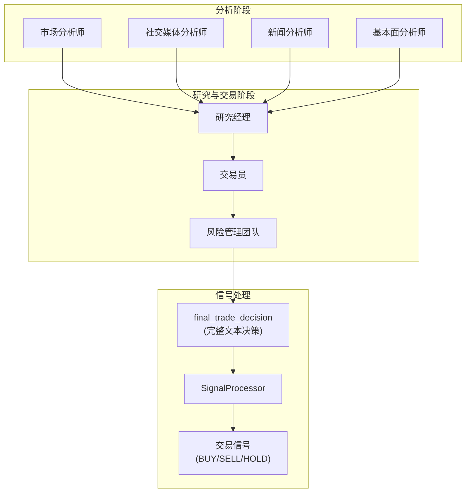
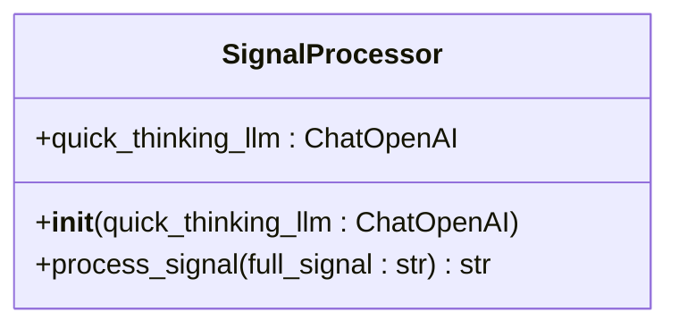
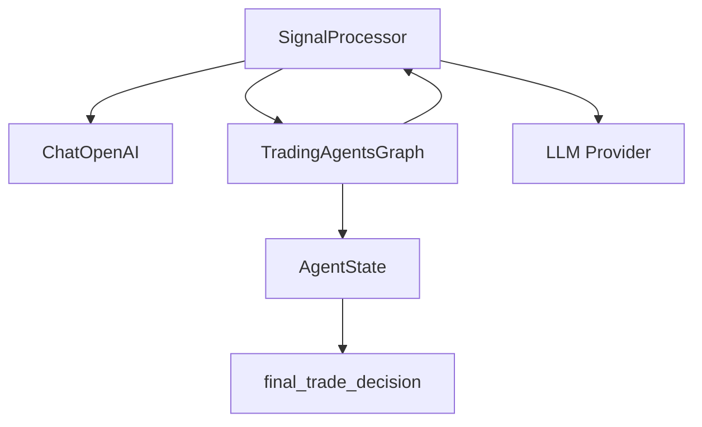

# 信号处理

<cite>
**本文档中引用的文件**  
- [signal_processing.py](file://tradingagents/graph/signal_processing.py)
- [trading_graph.py](file://tradingagents/graph/trading_graph.py)
- [agent_states.py](file://tradingagents/agents/utils/agent_states.py)
- [main.py](file://cli/main.py)
</cite>

## 目录
1. [简介](#简介)
2. [核心组件](#核心组件)
3. [架构概述](#架构概述)
4. [详细组件分析](#详细组件分析)
5. [依赖分析](#依赖分析)
6. [性能考虑](#性能考虑)
7. [故障排除指南](#故障排除指南)
8. [结论](#结论)

## 简介
本文档旨在深入分析交易系统中的信号处理模块，重点阐述`SignalProcessor`类如何将复杂的最终交易决策（`final_trade_decision`）提炼为简洁可执行的交易信号。该模块在决策闭环中扮演关键角色，通过调用大语言模型（LLM）从冗长的分析报告中提取核心操作指令（BUY、SELL 或 HOLD），从而实现从多维度分析到可执行动作的转化。文档将结合`trading_graph.py`中的调用流程，说明其在整个系统中的集成方式，并提供输入输出示例。

## 核心组件
信号处理模块的核心是`SignalProcessor`类，它负责将包含大量上下文和推理过程的完整交易决策文本，压缩为一个明确的、机器可读的交易指令。该类通过预设的系统提示（system prompt）引导LLM专注于提取唯一的决策关键词，确保输出的简洁性和一致性。`process_signal`方法是该模块的入口点，接收原始决策文本并返回标准化的信号。

**Section sources**
- [signal_processing.py](file://tradingagents/graph/signal_processing.py#L5-L30)

## 架构概述
信号处理模块作为交易决策流程的最终环节，接收来自风险分析团队的综合决策，并将其转化为可执行的交易信号。它与`TradingAgentsGraph`主控制器紧密集成，是整个多智能体框架输出端的关键组件。



**Diagram sources**
- [trading_graph.py](file://tradingagents/graph/trading_graph.py#L109-L189)
- [signal_processing.py](file://tradingagents/graph/signal_processing.py#L5-L30)

## 详细组件分析

### SignalProcessor 类分析
`SignalProcessor`类是信号提炼功能的实现核心。它利用一个“快速思考”LLM实例，通过精心设计的提示工程，强制模型忽略决策背后的复杂推理，仅输出三个预定义的关键词之一。

#### 类结构与方法


**Diagram sources**
- [signal_processing.py](file://tradingagents/graph/signal_processing.py#L5-L30)

#### process_signal 方法实现逻辑
`process_signal`方法的实现逻辑非常直接且高效。它构建了一个包含系统提示和用户输入（即`full_signal`）的消息列表。系统提示明确限定了模型的角色和任务：从分析师提供的报告中提取投资决策，并且**只输出**BUY、SELL或HOLD中的一个词，不附加任何其他文本。

该方法的处理流程如下：
1.  **输入接收**：接收一个字符串`full_signal`，该字符串是来自`final_trade_decision`的完整决策文本。
2.  **消息构造**：创建一个由两条消息组成的列表。第一条是系统消息，定义了模型的行为准则。第二条是人类消息，内容即为传入的`full_signal`。
3.  **LLM调用**：调用`quick_thinking_llm`的`invoke`方法，将消息列表发送给LLM。
4.  **结果提取**：直接返回LLM响应内容（`.content`）作为最终的交易信号。

此方法的设计确保了输出的高度结构化和可预测性，为下游的交易执行系统提供了清晰的指令。

**Section sources**
- [signal_processing.py](file://tradingagents/graph/signal_processing.py#L12-L30)

### 在决策闭环中的作用
`SignalProcessor`并非孤立运行，而是`TradingAgentsGraph`工作流中的一个关键环节。在`propagate`方法的最后阶段，系统会调用`process_signal`来处理刚刚生成的`final_trade_decision`。

#### 调用流程分析
```mermaid
sequenceDiagram
participant Graph as TradingAgentsGraph
participant State as AgentState
participant Processor as SignalProcessor
participant LLM as Quick-Thinking LLM
Graph->>Graph : propagate(company_name, trade_date)
Graph->>Graph : graph.invoke(init_agent_state)
Graph->>State : 获取 final_state
State->>Graph : 提供 final_state["final_trade_decision"]
Graph->>Processor : process_signal(final_trade_decision)
Processor->>LLM : 发送系统提示和决策文本
LLM-->>Processor : 返回 BUY/SELL/HOLD
Processor-->>Graph : 返回交易信号
Graph-->> : 返回 (final_state, 交易信号)
```

**Diagram sources**
- [trading_graph.py](file://tradingagents/graph/trading_graph.py#L189)
- [signal_processing.py](file://tradingagents/graph/signal_processing.py#L12-L30)

如序列图所示，`TradingAgentsGraph`在完成所有智能体的推理和辩论后，会得到一个包含`final_trade_decision`字段的`final_state`。随后，`propagate`方法直接调用`self.process_signal(final_state["final_trade_decision"])`，将这个复杂的文本决策传递给`SignalProcessor`，从而完成从“思考”到“行动”的最后一步。

## 依赖分析
信号处理模块的正常运行依赖于几个关键组件。



**Diagram sources**
- [signal_processing.py](file://tradingagents/graph/signal_processing.py#L5)
- [trading_graph.py](file://tradingagents/graph/trading_graph.py#L150-L152)
- [agent_states.py](file://tradingagents/agents/utils/agent_states.py#L75)

- **LLM 依赖**：`SignalProcessor`在初始化时需要一个`ChatOpenAI`（或兼容）实例，用于执行信号提取任务。这个实例由`TradingAgentsGraph`在初始化时提供。
- **数据流依赖**：`SignalProcessor`的输入`full_signal`来源于`AgentState`状态对象中的`final_trade_decision`字段。该字段由风险分析团队的智能体（如`Portfolio Manager`）填充。
- **集成依赖**：`SignalProcessor`被`TradingAgentsGraph`直接持有并调用，是其对外输出交易信号的工具。

## 性能考虑
由于`process_signal`方法仅进行一次LLM调用，且提示词和期望输出都非常简洁，因此该模块的延迟主要取决于所选LLM的响应速度。使用“快速思考”LLM（如gpt-3.5-turbo）而非“深度思考”LLM（如gpt-4）是合理的性能优化，因为此任务不需要复杂的推理能力，只需要模式匹配和关键词提取。

## 故障排除指南
当信号处理模块未能返回预期的BUY/SELL/HOLD信号时，应检查以下方面：

**Section sources**
- [signal_processing.py](file://tradingagents/graph/signal_processing.py#L20-L25)
- [main.py](file://cli/main.py#L1077)

- **LLM 响应格式**：检查LLM的原始响应内容。如果模型返回了额外的解释（如“根据分析，建议：BUY”），则说明系统提示未能完全约束模型行为。可能需要调整提示词。
- **输入数据**：确认传入`process_signal`的`full_signal`不是空值或格式错误的文本。`final_trade_decision`字段的生成是上游流程的责任。
- **LLM 连接**：确保`quick_thinking_llm`实例已正确初始化，并且能够成功连接到后端服务。

## 结论
`SignalProcessor`类通过巧妙的提示工程，实现了从复杂决策文本到简洁交易信号的高效转换。它作为多智能体交易系统决策闭环的“最后一公里”解决方案，将智能体的集体智慧提炼为可执行的原子指令。其与`TradingAgentsGraph`的无缝集成，确保了整个框架能够从市场分析一直流畅地运行到交易信号生成，为自动化交易提供了坚实的基础。