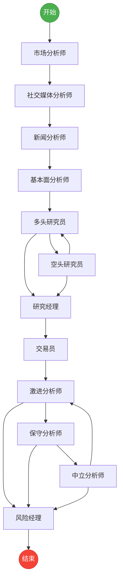
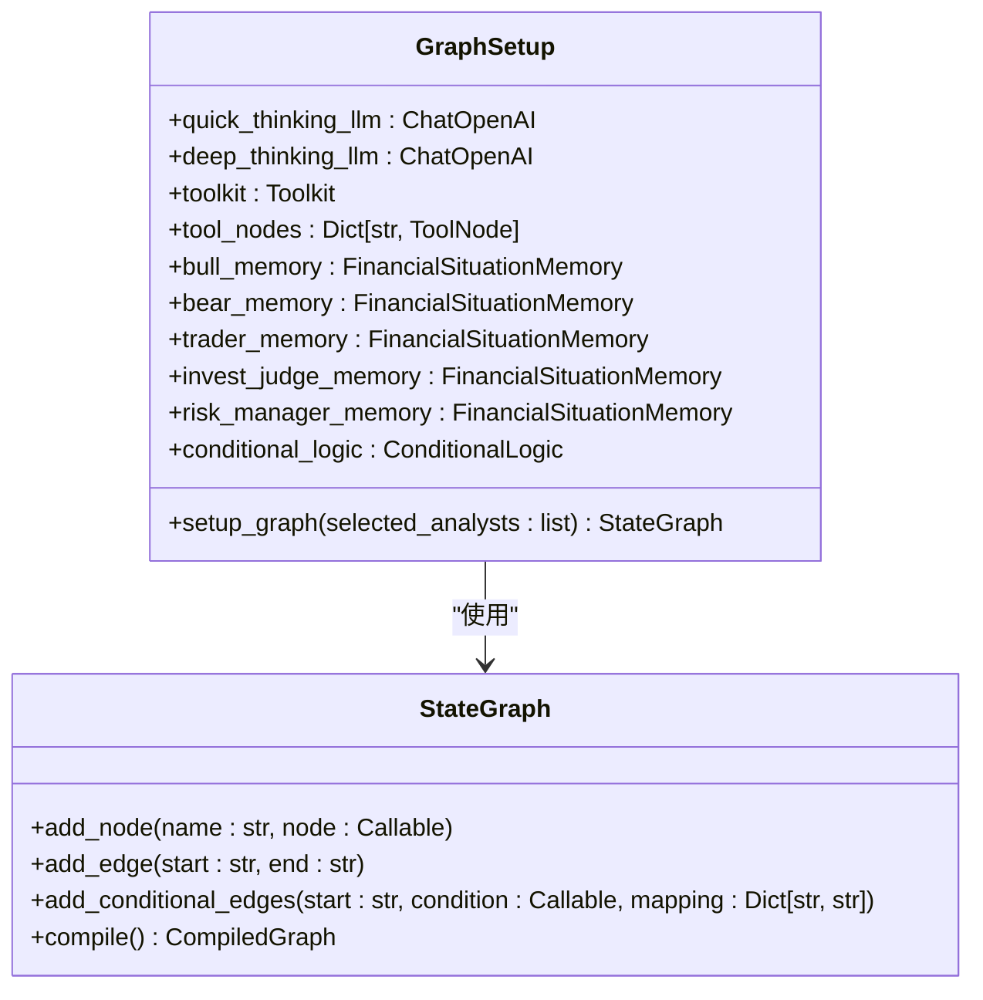
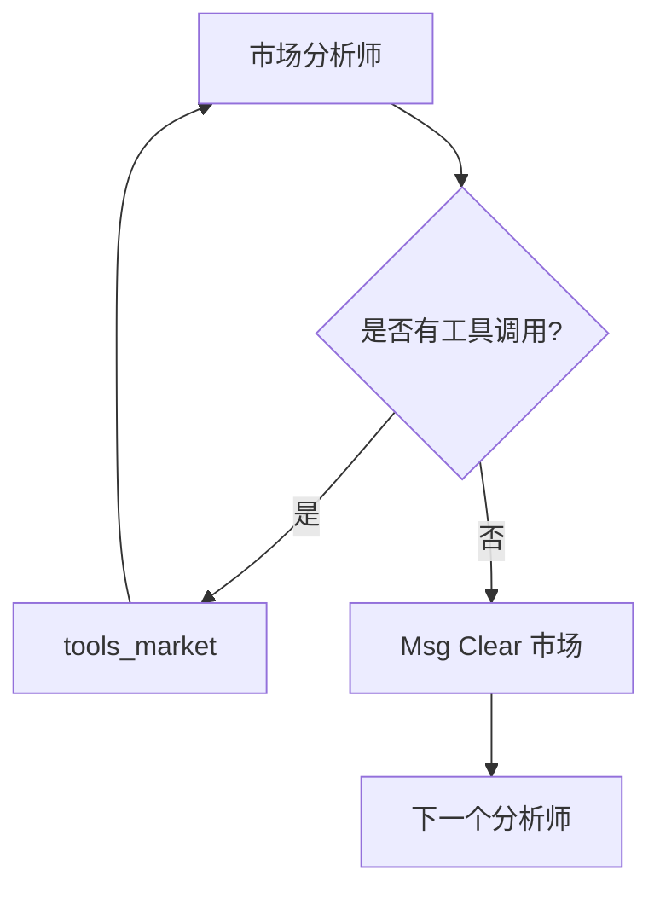
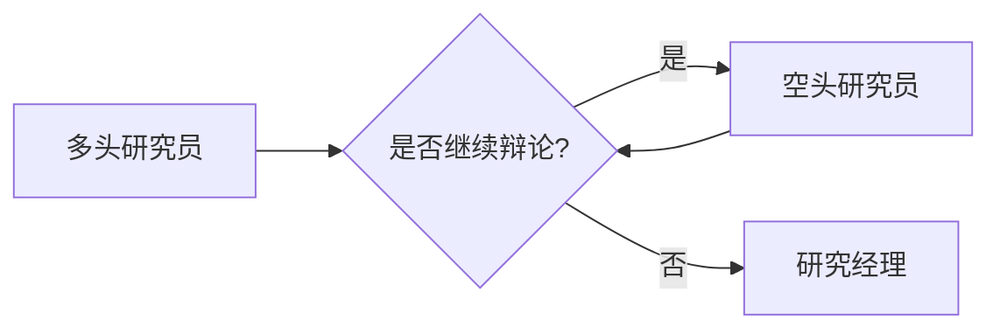
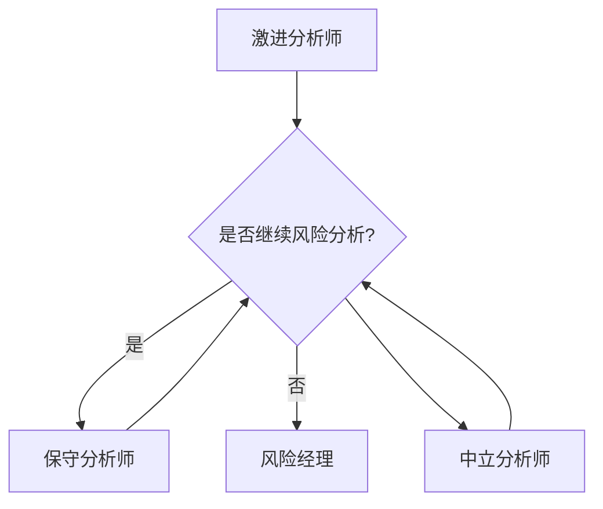
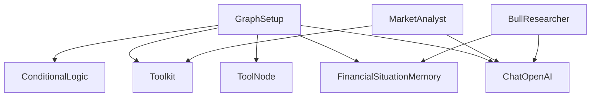

# 工作流引擎

<cite>
**本文档中引用的文件**
- [setup.py](file://tradingagents/graph/setup.py)
- [conditional_logic.py](file://tradingagents/graph/conditional_logic.py)
- [agent_states.py](file://tradingagents/agents/utils/agent_states.py)
- [market_analyst.py](file://tradingagents/agents/analysts/market_analyst.py)
- [social_media_analyst.py](file://tradingagents/agents/analysts/social_media_analyst.py)
- [news_analyst.py](file://tradingagents/agents/analysts/news_analyst.py)
- [fundamentals_analyst.py](file://tradingagents/agents/analysts/fundamentals_analyst.py)
- [bull_researcher.py](file://tradingagents/agents/researchers/bull_researcher.py)
- [bear_researcher.py](file://tradingagents/agents/researchers/bear_researcher.py)
- [research_manager.py](file://tradingagents/agents/managers/research_manager.py)
- [trader.py](file://tradingagents/agents/trader/trader.py)
- [aggresive_debator.py](file://tradingagents/agents/risk_mgmt/aggresive_debator.py)
- [neutral_debator.py](file://tradingagents/agents/risk_mgmt/neutral_debator.py)
- [conservative_debator.py](file://tradingagents/agents/risk_mgmt/conservative_debator.py)
- [risk_manager.py](file://tradingagents/agents/managers/risk_manager.py)
</cite>

## 目录
1. [简介](#简介)
2. [核心组件](#核心组件)
3. [架构概述](#架构概述)
4. [详细组件分析](#详细组件分析)
5. [依赖分析](#依赖分析)
6. [性能考虑](#性能考虑)
7. [故障排除指南](#故障排除指南)
8. [结论](#结论)

## 简介
本文档详细描述了基于LangGraph构建的交易智能体工作流引擎的架构设计。该系统通过状态机驱动的决策流程，整合市场、社交媒体、新闻和基本面等多维度分析师智能体，经过研究团队辩论和风险管理阶段，最终生成交易决策。文档重点阐述GraphSetup类如何动态构建工作流拓扑，以及条件边如何实现复杂的决策流控制。

## 核心组件
工作流引擎的核心是`GraphSetup`类，它负责初始化并编排整个智能体协作流程。该类接收多种大语言模型（LLM）、工具包、工具节点和记忆组件作为依赖，通过`setup_graph`方法动态构建状态图。系统定义了多种智能体角色，包括市场分析师、社交媒体分析师、新闻分析师、基本面分析师、多头研究员、空头研究员、交易员以及风险分析团队（激进、中立、保守分析师和风险经理），这些角色通过条件边连接，形成一个复杂的决策网络。

**本文档中引用的文件**
- [setup.py](file://tradingagents/graph/setup.py)
- [agent_states.py](file://tradingagents/agents/utils/agent_states.py)

## 架构概述
该工作流引擎采用模块化设计，基于LangGraph框架构建了一个有向无环图（DAG）来表示智能体的执行流程。整个流程从`START`节点开始，依次经过一系列分析师节点，然后进入研究团队的辩论循环，最终由交易员做出初步决策，并进入风险管理阶段的多路径分支讨论，最后由风险经理做出最终决策并到达`END`节点。

**Diagram sources**
- [setup.py](file://tradingagents/graph/setup.py#L14-L204)

## 详细组件分析

### GraphSetup类分析
`GraphSetup`类是整个工作流的构建器，其核心方法`setup_graph`根据`selected_analysts`参数动态注册智能体节点并配置条件边。

#### 动态节点注册
`setup_graph`方法根据传入的`selected_analysts`列表，动态创建相应的分析师节点。例如，如果列表中包含"market"，则会调用`create_market_analyst`函数创建市场分析师节点，并同时创建一个用于清除消息的`Msg Clear`节点和一个`tools`节点以支持工具调用。这种设计使得工作流拓扑结构完全由输入参数决定，极大地增强了系统的灵活性和可扩展性。

**Diagram sources**
- [setup.py](file://tradingagents/graph/setup.py#L14-L204)

#### 条件边与决策流控制
条件边是实现复杂决策逻辑的关键。每个分析师节点（如"市场分析师"）在执行后，会触发一个条件函数（如`should_continue_market`），该函数检查节点的输出消息中是否包含工具调用（`tool_calls`）。如果存在，则流程转向对应的`tools`节点执行工具调用；否则，流程转向`Msg Clear`节点，清除消息并准备进入下一个节点。这确保了智能体在需要外部数据时能自动调用工具，而无需在工作流定义中硬编码这些逻辑。

**Diagram sources**
- [setup.py](file://tradingagents/graph/setup.py#L14-L204)
- [conditional_logic.py](file://tradingagents/graph/conditional_logic.py#L10-L25)

### 完整执行路径分析

#### 分析师序列执行
执行路径从`START`节点开始，连接到`selected_analysts`列表中的第一个分析师节点。随后，通过一个循环，将所有选定的分析师按顺序连接起来。每个分析师节点通过条件边决定是执行工具调用还是进入消息清除节点，消息清除节点再连接到下一个分析师。当最后一个分析师完成分析后，流程进入"多头研究员"节点，标志着研究阶段的开始。

#### 研究团队辩论循环
研究团队由"多头研究员"和"空头研究员"组成，他们之间形成一个辩论循环。该循环由`should_continue_debate`条件函数控制。该函数检查辩论的轮数（`count`），如果未达到预设的最大轮数（默认为1轮，即2次发言），则根据上一轮发言者决定下一个发言者（多头发言后轮到空头，反之亦然）。一旦达到最大轮数，流程将跳出循环，进入"研究经理"节点，由其做出投资决策。

**Diagram sources**
- [setup.py](file://tradingagents/graph/setup.py#L14-L204)
- [conditional_logic.py](file://tradingagents/graph/conditional_logic.py#L40-L48)

#### 风险管理阶段的多路径分支
风险管理阶段由"激进分析师"、"保守分析师"和"中立分析师"组成一个三向辩论循环。该循环由`should_continue_risk_analysis`条件函数控制。该函数同样检查辩论轮数，如果未达到最大轮数（默认为1轮，即3次发言），则根据上一次发言的分析师类型，决定下一个发言者（激进->保守，保守->中立，中立->激进）。一旦达到最大轮数，流程将跳出循环，进入"风险经理"节点，由其综合所有意见，做出最终的交易决策。

**Diagram sources**
- [setup.py](file://tradingagents/graph/setup.py#L14-L204)
- [conditional_logic.py](file://tradingagents/graph/conditional_logic.py#L50-L65)

### 模块化节点设计的优势
该架构的模块化设计带来了显著的灵活性和可扩展性优势。`selected_analysts`参数直接影响工作流的拓扑结构。例如，如果只选择["market", "news"]，则工作流将只包含市场和新闻分析师，跳过社交媒体和基本面分析，从而形成一个更轻量级的决策流程。这种设计允许用户根据数据可用性、计算成本或特定分析需求，灵活地定制智能体团队的组成，而无需修改核心代码。

**Section sources**
- [setup.py](file://tradingagents/graph/setup.py#L14-L204)
- [market_analyst.py](file://tradingagents/agents/analysts/market_analyst.py)
- [news_analyst.py](file://tradingagents/agents/analysts/news_analyst.py)

## 依赖分析
工作流引擎的组件之间存在清晰的依赖关系。`GraphSetup`类依赖于`ConditionalLogic`类来提供条件判断函数，依赖于`Toolkit`和`ToolNode`来提供外部数据访问能力，依赖于各种`FinancialSituationMemory`实例来实现记忆功能。各个智能体节点（如`create_market_analyst`）依赖于LLM和`Toolkit`来执行其分析任务。这种依赖注入的设计模式使得各组件高度解耦，便于测试和维护。

**Diagram sources**
- [setup.py](file://tradingagents/graph/setup.py#L14-L204)
- [agent_utils.py](file://tradingagents/agents/utils/agent_utils.py#L1-L419)

## 性能考虑
该工作流的性能主要受LLM调用次数和外部API调用的影响。由于每个智能体节点都可能触发工具调用，因此在`selected_analysts`列表中包含更多分析师会显著增加总的API调用次数和执行时间。此外，研究团队和风险管理团队的辩论循环会增加额外的LLM调用。为了优化性能，可以调整`max_debate_rounds`和`max_risk_discuss_rounds`参数来限制辩论轮数，或者在非关键路径上使用响应更快的"quick_thinking_llm"。

## 故障排除指南
当工作流执行失败时，应首先检查`selected_analysts`参数是否为空，因为`setup_graph`方法会对此进行校验并抛出异常。其次，应检查LLM和外部API（如Yahoo Finance, Finnhub）的连接是否正常。如果智能体未能正确调用工具，应检查`conditional_logic`中的条件函数（如`should_continue_market`）是否正常工作，确保其能正确解析消息中的`tool_calls`字段。最后，如果辩论循环无法正常终止，应检查`count`计数器是否被正确更新。

**Section sources**
- [setup.py](file://tradingagents/graph/setup.py#L14-L204)
- [conditional_logic.py](file://tradingagents/graph/conditional_logic.py#L10-L65)

## 结论
该工作流引擎通过LangGraph成功构建了一个复杂、灵活且可扩展的智能体协作系统。`GraphSetup`类通过动态节点注册和条件边配置，实现了高度模块化的状态机工作流。从分析师序列执行，到研究团队的辩论循环，再到风险管理的多路径分支，整个决策流程设计精巧，能够模拟真实的投资决策过程。模块化的设计使得系统可以根据需求轻松调整，为构建高级自动化交易系统提供了坚实的基础。