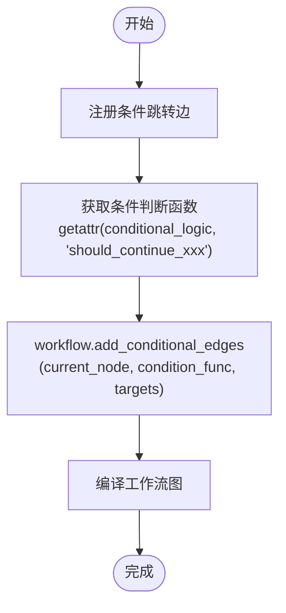

# 条件跳转机制

<cite>
**本文档中引用的文件**  
- [conditional_logic.py](file://tradingagents/graph/conditional_logic.py)
- [setup.py](file://tradingagents/graph/setup.py)
- [agent_states.py](file://tradingagents/agents/utils/agent_states.py)
- [bull_researcher.py](file://tradingagents/agents/researchers/bull_researcher.py)
- [bear_researcher.py](file://tradingagents/agents/researchers/bear_researcher.py)
- [aggresive_debator.py](file://tradingagents/agents/risk_mgmt/aggresive_debator.py)
- [conservative_debator.py](file://tradingagents/agents/risk_mgmt/conservative_debator.py)
- [neutral_debator.py](file://tradingagents/agents/risk_mgmt/neutral_debator.py)
</cite>

## 目录
1. [引言](#引言)
2. [核心组件分析](#核心组件分析)
3. [条件跳转逻辑实现](#条件跳转逻辑实现)
4. [研究团队辩论循环机制](#研究团队辩论循环机制)
5. [风险管理多路径分析](#风险管理多路径分析)
6. [自定义条件逻辑扩展方法](#自定义条件逻辑扩展方法)
7. [典型问题排查指南](#典型问题排查指南)
8. [结论](#结论)

## 引言
本文深入解析交易代理系统中工作流引擎的条件跳转机制，重点剖析 `setup_graph` 中 `add_conditional_edges` 的调用逻辑。通过分析 `ConditionalLogic` 类中的 `should_continue_debate` 和 `should_continue_risk_analysis` 等判断函数，揭示其如何驱动决策流在不同代理节点间跳转。结合研究团队辩论循环与风险管理多路径评估的实际场景，展示状态机如何在 Bull Researcher 与 Bear Researcher 之间循环跳转，或在 Risky Analyst、Safe Analyst 与 Neutral Analyst 之间形成闭环评估。同时提供条件逻辑的扩展方法与常见问题的排查方案。

## 核心组件分析

### 条件逻辑控制器
`ConditionalLogic` 类是整个条件跳转机制的核心，负责根据当前状态决定工作流的下一步走向。其内部通过多个判断函数实现不同阶段的分支控制。

**Section sources**
- [conditional_logic.py](file://tradingagents/graph/conditional_logic.py#L5-L67)

### 图结构配置器
`GraphSetup` 类负责构建整个代理工作流图，通过 `setup_graph` 方法将各个分析节点、研究节点和风险管理节点连接起来，并利用 `ConditionalLogic` 实例注册条件跳转规则。

**Section sources**
- [setup.py](file://tradingagents/graph/setup.py#L14-L204)

### 状态数据结构
`AgentState` 及其子类型 `InvestDebateState` 和 `RiskDebateState` 定义了工作流中各阶段的状态数据结构，为条件判断提供了数据基础。

**Section sources**
- [agent_states.py](file://tradingagents/agents/utils/agent_states.py#L10-L46)

## 条件跳转逻辑实现

### add_conditional_edges 调用机制
在 `GraphSetup.setup_graph` 方法中，通过 `add_conditional_edges` 注册条件跳转规则。该方法接收三个参数：
- 当前节点名称
- 判断函数（通常为 `ConditionalLogic` 的实例方法）
- 跳转目标映射



**Diagram sources**
- [setup.py](file://tradingagents/graph/setup.py#L14-L204)

### 条件判断函数调用链


**Diagram sources**
- [setup.py](file://tradingagents/graph/setup.py#L14-L204)
- [conditional_logic.py](file://tradingagents/graph/conditional_logic.py#L5-L67)

## 研究团队辩论循环机制

### 循环跳转逻辑
`should_continue_debate` 函数控制 Bull Researcher 与 Bear Researcher 之间的辩论循环：


**Diagram sources**
- [conditional_logic.py](file://tradingagents/graph/conditional_logic.py#L50-L58)
- [bull_researcher.py](file://tradingagents/agents/researchers/bull_researcher.py#L5-L58)
- [bear_researcher.py](file://tradingagents/agents/researchers/bear_researcher.py#L5-L60)

### 状态流转分析


**Diagram sources**
- [agent_states.py](file://tradingagents/agents/utils/agent_states.py#L10-L20)
- [conditional_logic.py](file://tradingagents/graph/conditional_logic.py#L50-L58)

## 风险管理多路径分析

### 三节点闭环评估
`should_continue_risk_analysis` 函数驱动 Risky、Safe、Neutral 三个分析师形成闭环评估：


**Diagram sources**
- [conditional_logic.py](file://tradingagents/graph/conditional_logic.py#L60-L67)
- [aggresive_debator.py](file://tradingagents/agents/risk_mgmt/aggresive_debator.py#L4-L54)
- [conservative_debator.py](file://tradingagents/agents/risk_mgmt/conservative_debator.py#L5-L57)
- [neutral_debator.py](file://tradingagents/agents/risk_mgmt/neutral_debator.py#L4-L54)

### 风险评估状态模型


**Diagram sources**
- [agent_states.py](file://tradingagents/agents/utils/agent_states.py#L24-L46)
- [conditional_logic.py](file://tradingagents/graph/conditional_logic.py#L60-L67)

## 自定义条件逻辑扩展方法

### 新增判断函数
可通过继承 `ConditionalLogic` 类并添加新的判断函数来扩展条件逻辑：

```python
class ExtendedConditionalLogic(ConditionalLogic):
    def should_continue_custom_analysis(self, state: AgentState) -> str:
        # 自定义判断逻辑
        if condition_met:
            return "NextNode"
        return "EndNode"
```

### 修改跳转规则
通过重写现有判断函数可修改跳转规则：

```python
def should_continue_debate(self, state: AgentState) -> str:
    # 修改终止条件或跳转逻辑
    if state["investment_debate_state"]["count"] >= custom_rounds:
        return "Research Manager"
    # 其他逻辑保持不变
```

### 集成外部决策信号
可将外部系统信号集成到条件判断中：

```python
def should_continue_with_external_signal(self, state: AgentState) -> str:
    external_signal = get_external_signal()
    if external_signal == "STOP":
        return "END"
    return "ContinueNode"
```

**Section sources**
- [conditional_logic.py](file://tradingagents/graph/conditional_logic.py#L5-L67)

## 典型问题排查指南

### 死循环规避
**问题现象**：Bull/Bear 研究员或风险分析师之间无限循环。

**排查步骤**：
1. 检查 `max_debate_rounds` 和 `max_risk_discuss_rounds` 配置值
2. 验证 `count` 状态变量是否正确递增
3. 确认 `current_response` 或 `latest_speaker` 字段是否被正确更新

**解决方案**：
- 确保每个节点执行后 `count` 值递增
- 检查节点函数是否正确更新 `current_response` 前缀
- 设置合理的最大轮次限制

### 终止条件失效
**问题现象**：达到最大轮次后仍未跳转到终止节点。

**排查步骤**：
1. 检查条件判断函数中的比较逻辑
2. 验证状态路径是否正确（如 `state["investment_debate_state"]["count"]`）
3. 确认目标节点名称拼写正确

**解决方案**：
- 使用调试日志输出实际状态值
- 验证 `add_conditional_edges` 中的目标映射
- 检查节点名称是否与图中定义一致

**Section sources**
- [conditional_logic.py](file://tradingagents/graph/conditional_logic.py#L50-L67)
- [setup.py](file://tradingagents/graph/setup.py#L14-L204)

## 结论
本文详细解析了交易代理系统中条件跳转机制的实现原理，重点分析了 `setup_graph` 中 `add_conditional_edges` 的调用逻辑，以及 `ConditionalLogic` 类中 `should_continue_debate` 和 `should_continue_risk_analysis` 等判断函数如何驱动决策流分支。通过研究团队辩论循环和风险管理多路径分析的实际场景，展示了条件表达式如何精确控制状态机的跳转行为。同时提供了自定义条件逻辑的扩展方法和典型问题的排查指南，为系统的维护和扩展提供了全面的技术支持。