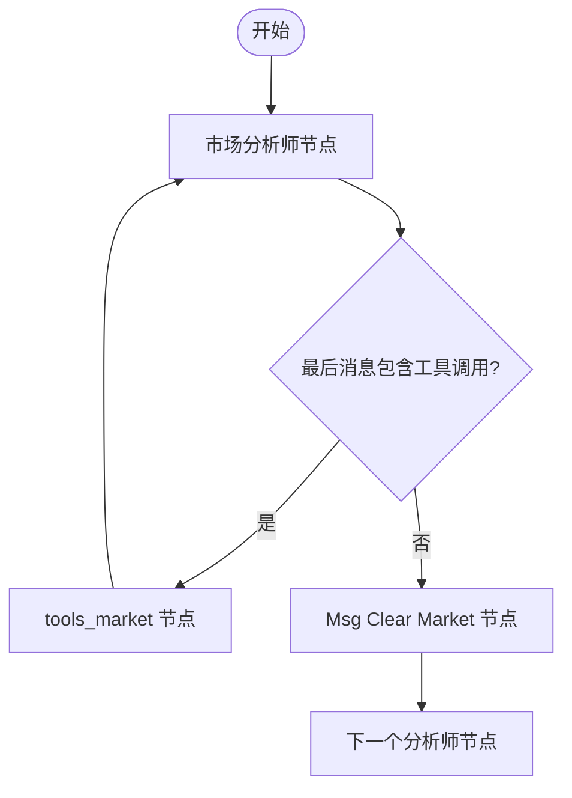

# 节点管理

<cite>
**本文档中引用的文件**  
- [setup.py](file://tradingagents/graph/setup.py)
- [trading_graph.py](file://tradingagents/graph/trading_graph.py)
- [conditional_logic.py](file://tradingagents/graph/conditional_logic.py)
- [market_analyst.py](file://tradingagents/agents/analysts/market_analyst.py)
- [agent_states.py](file://tradingagents/agents/utils/agent_states.py)
- [main.py](file://cli/main.py)
- [utils.py](file://cli/utils.py)
</cite>

## 目录
1. [引言](#引言)
2. [节点注册与初始化机制](#节点注册与初始化机制)
3. [节点依赖与拓扑结构构建](#节点依赖与拓扑结构构建)
4. [工具节点注入与协同逻辑](#工具节点注入与协同逻辑)
5. [节点命名规范与执行上下文](#节点命名规范与执行上下文)
6. [节点生命周期管理](#节点生命周期管理)
7. [常见配置错误与调试方法](#常见配置错误与调试方法)
8. [结论](#结论)

## 引言
本文档详细阐述了交易智能体系统中工作流引擎的节点注册与管理机制。重点分析`GraphSetup`类如何通过`setup_graph`方法动态创建和注册各类智能体节点，包括市场分析师、社交媒体分析师、新闻分析师和基本面分析师等。文档结合代码逻辑说明`selected_analysts`参数如何影响节点的初始化与拓扑结构构建，解释节点间依赖关系的组织方式，并描述节点命名规范、执行上下文传递及状态保持策略。同时提供节点生命周期管理的最佳实践，涵盖初始化、执行与清理阶段，并指出常见配置错误及调试方法。

## 节点注册与初始化机制

`GraphSetup`类负责整个智能体工作流图的构建与配置。其核心方法`setup_graph`接收`selected_analysts`参数，用于动态决定哪些分析师节点将被创建和注册到工作流中。该参数是一个字符串列表，支持`"market"`、`"social"`、`"news"`和`"fundamentals"`四种类型。

当`setup_graph`被调用时，系统首先检查`selected_analysts`是否为空，若为空则抛出异常，确保至少有一个分析师被选中。随后，系统遍历`selected_analysts`列表，为每个选中的分析师类型执行以下初始化操作：
1.  **创建主分析师节点**：调用相应的工厂函数（如`create_market_analyst`）创建主智能体节点。
2.  **创建消息清理节点**：调用`create_msg_delete()`创建一个用于清理消息的辅助节点。
3.  **关联工具节点**：从预构建的`tool_nodes`字典中获取与该分析师类型对应的`ToolNode`。

这些节点被分别存储在`analyst_nodes`、`delete_nodes`和`tool_nodes`三个字典中，为后续的图结构构建做准备。

**Section sources**
- [setup.py](file://tradingagents/graph/setup.py#L42-L74)

## 节点依赖与拓扑结构构建

工作流的拓扑结构通过`StateGraph`对象进行定义。节点间的依赖关系决定了执行的顺序和条件分支。

### 分析师节点的序列化连接
所有选中的分析师节点按照`selected_analysts`列表中的顺序被串联起来。流程从第一个分析师节点开始，执行完毕后，其输出会传递给下一个分析师，形成一个链式结构。当最后一个分析师完成工作后，控制权将转移至“Bull Researcher”节点，进入后续的多空辩论阶段。

### 条件边与动态流程
节点间的连接不仅限于简单的顺序执行，还大量使用了条件边（`add_conditional_edges`）来实现动态流程控制。每个主分析师节点在执行后，会根据其输出状态决定下一步的走向。例如，`should_continue_market`方法会检查当前状态的最后一条消息是否包含工具调用（`tool_calls`）。如果包含，则流程转向`tools_market`节点执行工具；否则，流程转向`Msg Clear Market`节点，表示该阶段分析完成，可以进入下一节点。

**Diagram sources**
- [setup.py](file://tradingagents/graph/setup.py#L142-L155)
- [conditional_logic.py](file://tradingagents/graph/conditional_logic.py#L15-L24)

### 后续节点的固定拓扑
在分析师链之后，系统会添加一系列固定的节点，包括“Bull Researcher”、“Bear Researcher”、“Research Manager”、“Trader”以及风险分析团队（“Risky Analyst”、“Safe Analyst”、“Neutral Analyst”和“Risk Judge”）。这些节点之间的连接也通过条件边实现，例如多空研究员之间的辩论循环，以及风险分析团队内部的三向辩论，最终由“Risk Judge”做出最终决策并结束流程。

**Section sources**
- [setup.py](file://tradingagents/graph/setup.py#L110-L155)

## 工具节点注入与协同逻辑

工具节点（`ToolNode`）是实现智能体“思考-行动”循环的关键组件。它们被设计为独立的执行单元，专门负责调用外部API或执行具体的数据获取任务。

### 工具节点的创建
`TradingAgentsGraph`类在初始化时，会通过`_create_tool_nodes`方法创建一个包含所有类型工具节点的字典。每个工具节点都封装了一组与特定数据源相关的工具函数，例如“market”工具节点包含了从Yahoo Finance和StockStats获取数据的函数。

### 协同逻辑
主分析师节点与工具节点的协同遵循一个标准模式：
1.  主分析师节点在分析过程中，如果判断需要外部数据，会在其响应中生成一个`tool_call`。
2.  工作流引擎检测到`tool_call`后，根据条件逻辑，将流程导向对应的`tools_xxx`节点。
3.  `tools_xxx`节点执行实际的工具调用，获取数据。
4.  工具执行的结果被添加到状态的`messages`中，并将控制权返回给原始的主分析师节点。
5.  主分析师节点接收到工具返回的数据后，继续其分析过程，直至完成或再次需要调用工具。

这种设计实现了职责分离，主分析师节点专注于决策和规划，而工具节点专注于执行，两者通过工作流引擎协调。

**Section sources**
- [trading_graph.py](file://tradingagents/graph/trading_graph.py#L144-L189)
- [setup.py](file://tradingagents/graph/setup.py#L110-L140)

## 节点命名规范与执行上下文

### 节点命名规范
系统采用了一套清晰且一致的命名规范，便于识别和调试：
-   **主分析师节点**：`{analyst_type.capitalize()} Analyst`，例如`Market Analyst`。
-   **消息清理节点**：`Msg Clear {analyst_type.capitalize()}`，例如`Msg Clear Market`。
-   **工具节点**：`tools_{analyst_type}`，例如`tools_market`。

这种命名方式直接反映了节点的功能和所属的分析师类型，使得工作流图的结构一目了然。

### 执行上下文与状态保持
所有节点共享一个全局的执行上下文，即`AgentState`。该状态对象继承自`MessagesState`，并扩展了多个特定字段，用于在节点间传递数据和保持状态。

`AgentState`的核心组成部分包括：
-   **消息列表** (`messages`)：存储整个对话历史，是节点间通信的主要载体。
-   **公司与日期信息** (`company_of_interest`, `trade_date`)：全局上下文信息。
-   **各阶段报告** (`market_report`, `news_report`等)：用于存储各个分析师节点的输出结果。
-   **辩论状态** (`investment_debate_state`, `risk_debate_state`)：用于管理多空辩论和风险分析的复杂状态，包括历史记录、计数器和最新发言者等。

这种集中式的状态管理确保了信息可以在整个工作流中无缝流动。

**Section sources**
- [agent_states.py](file://tradingagents/agents/utils/agent_states.py#L0-L76)
- [setup.py](file://tradingagents/graph/setup.py#L110-L140)

## 节点生命周期管理

### 初始化
节点的生命周期始于`TradingAgentsGraph`的构造函数。在此阶段，所有依赖项（LLM、工具包、记忆、条件逻辑等）被初始化，`GraphSetup`实例被创建，并最终调用`setup_graph`方法来完成所有节点的注册和工作流的编译。

### 执行
执行阶段由`TradingAgentsGraph.propagate`方法触发。该方法首先通过`Propagator.create_initial_state`创建初始状态，然后调用`graph.invoke`或`graph.stream`来启动工作流。引擎会根据预定义的边和条件，自动调度各个节点的执行。

### 清理
系统没有显式的“清理”阶段，因为`AgentState`的设计是为单次分析任务服务的。每次`propagate`调用都处理一个独立的公司和日期，任务完成后，相关的状态会被记录到日志文件中，而内存中的状态对象在方法结束后自然被回收。对于需要长期记忆的场景，系统通过`FinancialSituationMemory`类和`Reflector`组件，将关键决策和教训持久化到外部存储。

**Section sources**
- [trading_graph.py](file://tradingagents/graph/trading_graph.py#L144-L189)
- [propagation.py](file://tradingagents/graph/propagation.py#L0-L48)

## 常见配置错误与调试方法

### 常见配置错误
1.  **未选择任何分析师**：如果`selected_analysts`列表为空，`setup_graph`会抛出`ValueError`。这通常发生在CLI交互中用户未做选择。
2.  **工具调用失败**：如果主分析师节点生成的`tool_call`名称与`ToolNode`中注册的工具名称不匹配，工具执行将失败。这通常是因为提示词（prompt）中的工具名称拼写错误。
3.  **LLM配置错误**：在`TradingAgentsGraph.__init__`中，如果`llm_provider`配置不正确，会抛出`ValueError`。

### 调试方法
1.  **启用调试模式**：在创建`TradingAgentsGraph`时设置`debug=True`。这会启用`graph.stream`，并逐条打印每个节点的输出，便于追踪执行流程和查看中间状态。
2.  **检查日志文件**：系统会将每次分析的完整状态保存为JSON文件，位于`eval_results/{ticker}/TradingAgentsStrategy_logs/`目录下。这是分析最终结果和排查问题的最直接方式。
3.  **验证输入参数**：确保`selected_analysts`参数的值是预定义的四种类型之一，并且列表不为空。

**Section sources**
- [setup.py](file://tradingagents/graph/setup.py#L42-L45)
- [trading_graph.py](file://tradingagents/graph/trading_graph.py#L74-L109)
- [main.py](file://cli/main.py#L714-L749)

## 结论
本系统通过`GraphSetup`类实现了高度动态和可配置的节点管理机制。`selected_analysts`参数作为核心配置项，允许用户灵活定制分析流程。工作流引擎利用`StateGraph`的强大功能，通过条件边精确控制节点间的依赖关系，实现了复杂的决策逻辑。工具节点的注入机制保证了智能体能够与外部世界交互。统一的`AgentState`为整个工作流提供了稳定的数据流和状态保持能力。这套机制为构建复杂的多智能体协作系统提供了坚实的基础。