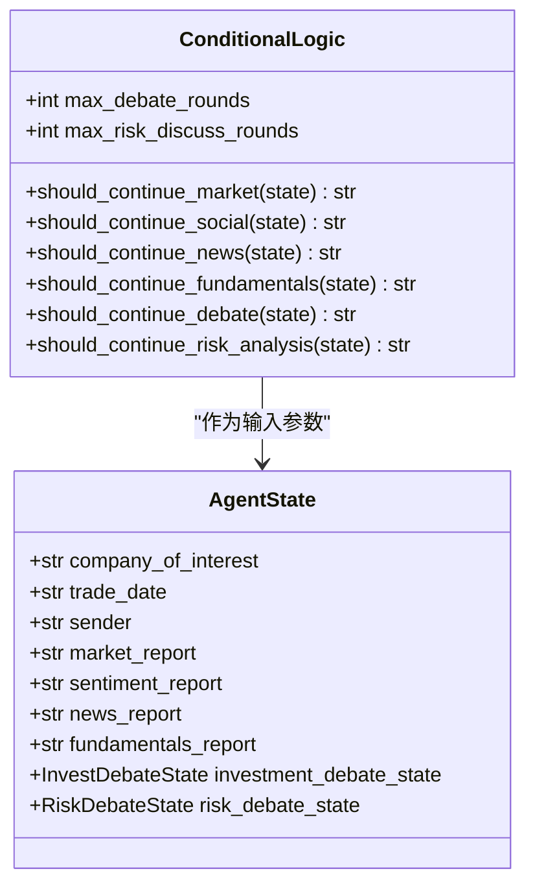
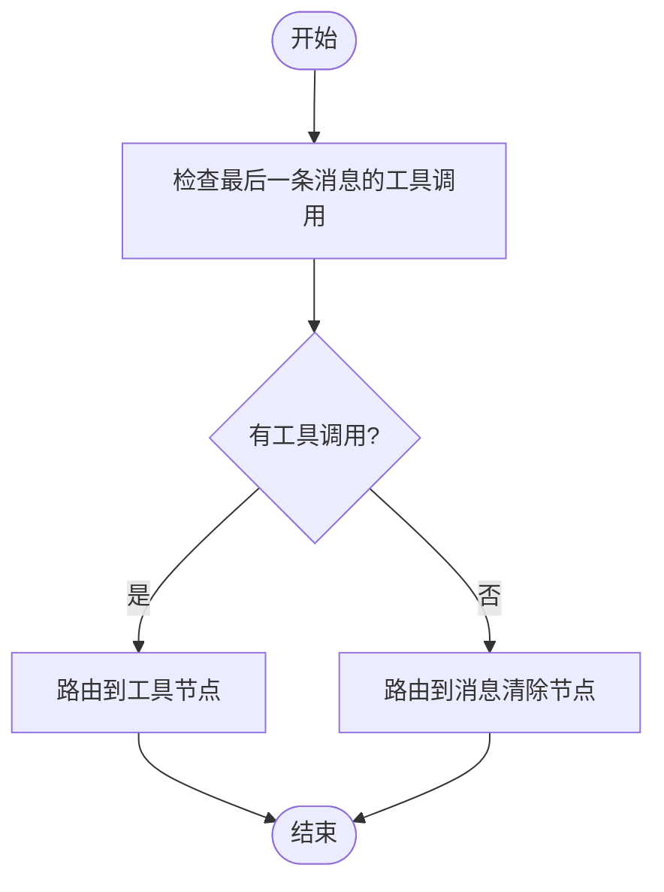
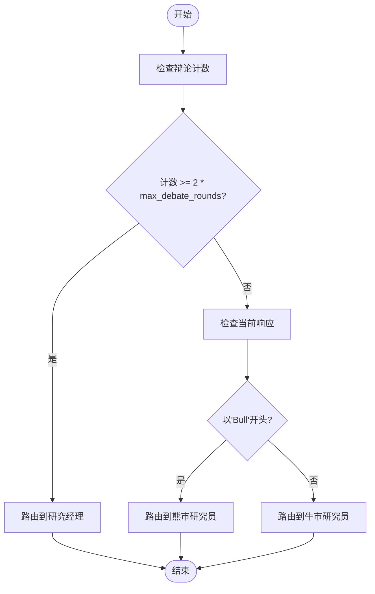
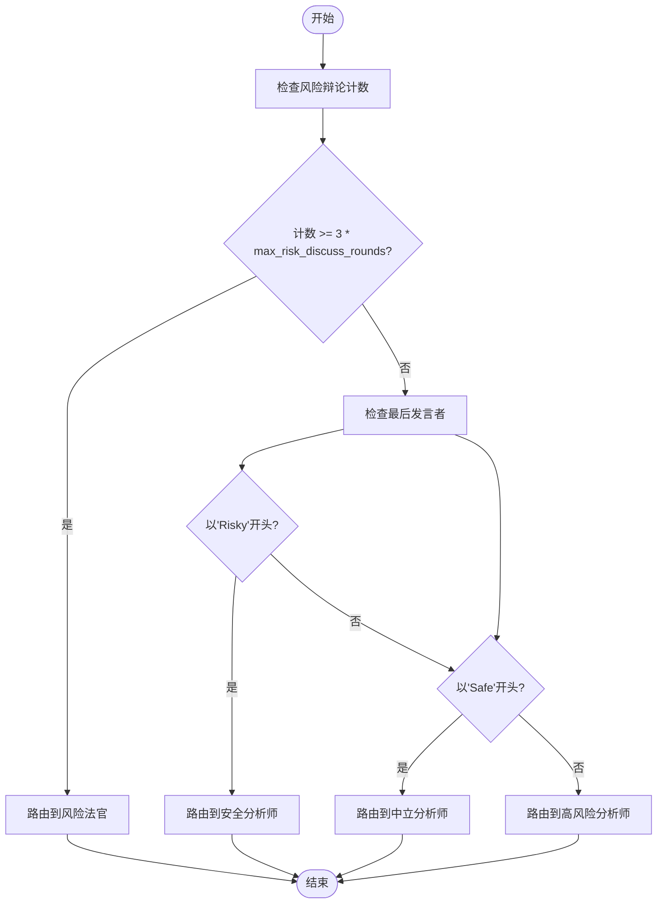
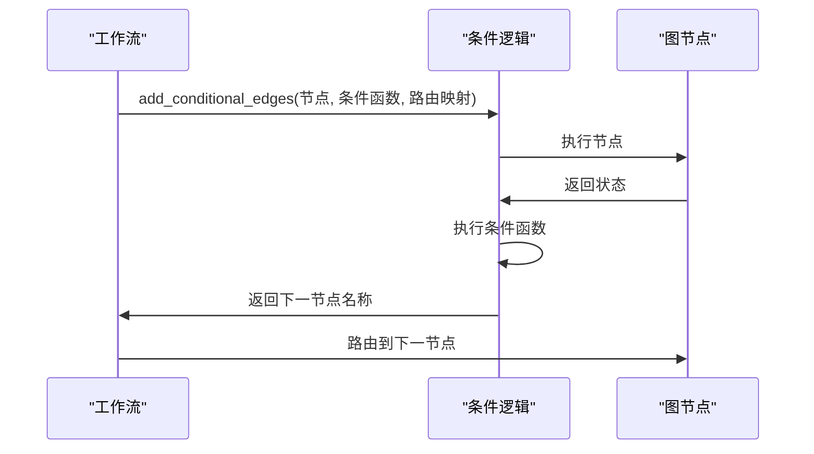
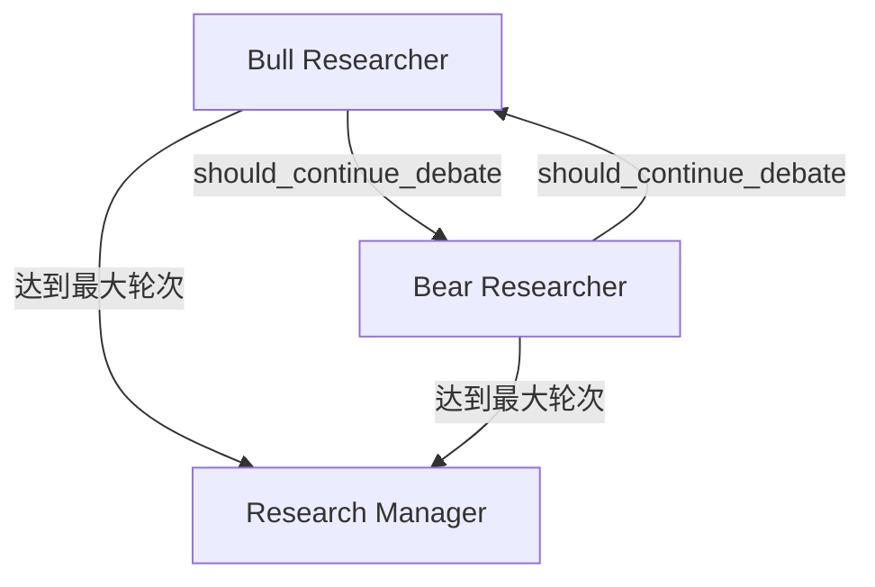
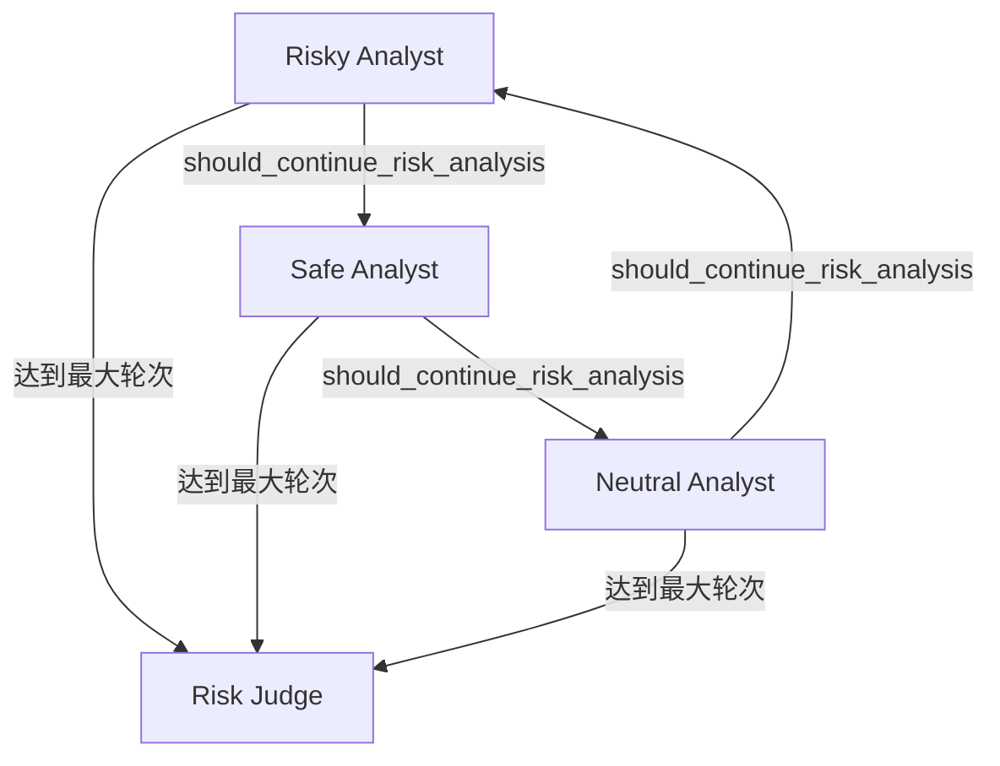

# 条件逻辑

<cite>
**本文档中引用的文件**   
- [conditional_logic.py](file://tradingagents/graph/conditional_logic.py)
- [setup.py](file://tradingagents/graph/setup.py)
- [agent_states.py](file://tradingagents/agents/utils/agent_states.py)
</cite>

## 目录
1. [引言](#引言)
2. [条件逻辑模块架构](#条件逻辑模块架构)
3. [should_continue_系列方法分析](#should_continue_系列方法分析)
4. [条件函数与LangGraph边的绑定机制](#条件函数与langgraph边的绑定机制)
5. [动态辩论循环实现机制](#动态辩论循环实现机制)
6. [结论](#结论)

## 引言
本文档详细阐述了交易代理系统中条件逻辑模块的实现机制，重点分析`conditional_logic.py`中定义的`should_continue_`系列方法如何驱动工作流的分支决策。通过结合`setup.py`中的`add_conditional_edges`调用，说明条件函数与LangGraph边的绑定机制，并提供`should_continue_debate`和`should_continue_risk_analysis`的具体判断逻辑示例，讨论其在实现动态辩论循环中的关键作用。

**Section sources**
- [conditional_logic.py](file://tradingagents/graph/conditional_logic.py#L1-L10)
- [setup.py](file://tradingagents/graph/setup.py#L1-L20)

## 条件逻辑模块架构
条件逻辑模块由`ConditionalLogic`类实现，该类封装了所有工作流分支决策的条件判断逻辑。该类在初始化时接收最大辩论轮次和风险讨论轮次参数，用于控制循环的终止条件。

**Diagram sources **
- [conditional_logic.py](file://tradingagents/graph/conditional_logic.py#L1-L67)
- [agent_states.py](file://tradingagents/agents/utils/agent_states.py#L1-L76)

**Section sources**
- [conditional_logic.py](file://tradingagents/graph/conditional_logic.py#L1-L20)
- [agent_states.py](file://tradingagents/agents/utils/agent_states.py#L1-L76)

## should_continue_系列方法分析
`should_continue_`系列方法是条件逻辑模块的核心，它们根据`AgentState`的内容返回下一节点的路由决策。

### 分析类条件函数
`should_continue_market`、`should_continue_social`、`should_continue_news`和`should_continue_fundamentals`方法实现了类似的逻辑模式：检查当前消息的工具调用状态，如果有待执行的工具调用，则路由到相应的工具节点；否则，路由到消息清除节点。

**Diagram sources **
- [conditional_logic.py](file://tradingagents/graph/conditional_logic.py#L25-L50)

**Section sources**
- [conditional_logic.py](file://tradingagents/graph/conditional_logic.py#L25-L50)

### 辩论循环条件函数
`should_continue_debate`方法根据投资辩论状态决定是否继续辩论循环。该方法检查辩论计数是否达到最大轮次的两倍（表示完成了指定轮次的来回辩论），如果达到则路由到研究经理节点；否则根据当前响应的发起者决定下一个发言的代理。

**Diagram sources **
- [conditional_logic.py](file://tradingagents/graph/conditional_logic.py#L52-L60)

**Section sources**
- [conditional_logic.py](file://tradingagents/graph/conditional_logic.py#L52-L60)
- [agent_states.py](file://tradingagents/agents/utils/agent_states.py#L10-L25)

### 风险分析条件函数
`should_continue_risk_analysis`方法根据风险辩论状态决定是否继续风险分析循环。该方法检查风险辩论计数是否达到最大轮次的三倍（表示完成了指定轮次的三方来回辩论），如果达到则路由到风险法官节点；否则根据最后发言的分析师类型决定下一个发言的代理。

**Diagram sources **
- [conditional_logic.py](file://tradingagents/graph/conditional_logic.py#L62-L67)

**Section sources**
- [conditional_logic.py](file://tradingagents/graph/conditional_logic.py#L62-L67)
- [agent_states.py](file://tradingagents/agents/utils/agent_states.py#L27-L42)

## 条件函数与LangGraph边的绑定机制
条件函数通过`setup.py`中的`add_conditional_edges`方法与LangGraph的工作流边进行绑定。这种机制允许工作流根据运行时状态动态选择下一个执行节点。

### 工作流设置中的绑定
在`GraphSetup`类的`setup_graph`方法中，通过`add_conditional_edges`方法将条件函数与图节点连接起来。对于每个分析师节点，使用`getattr`动态获取相应的`should_continue_`方法。

**Diagram sources **
- [setup.py](file://tradingagents/graph/setup.py#L100-L150)

**Section sources**
- [setup.py](file://tradingagents/graph/setup.py#L100-L150)
- [conditional_logic.py](file://tradingagents/graph/conditional_logic.py#L1-L67)

### 动态方法获取机制
系统使用`getattr`函数动态获取`ConditionalLogic`实例中的条件方法，这使得代码更加灵活和可扩展。当添加新的分析师类型时，只要在`ConditionalLogic`类中实现相应的`should_continue_`方法，就可以自动集成到工作流中。

**Section sources**
- [setup.py](file://tradingagents/graph/setup.py#L120-L130)

## 动态辩论循环实现机制
条件逻辑模块通过状态驱动的循环机制实现了动态辩论功能，这种设计模式在投资决策和风险评估过程中发挥着关键作用。

### 投资辩论循环
投资辩论循环由牛市研究员和熊市研究员之间的交替发言构成，通过`should_continue_debate`方法控制循环的执行。每次代理发言后，辩论计数递增，当达到预设的最大轮次时，循环终止并路由到研究经理进行最终决策。

**Diagram sources **
- [setup.py](file://tradingagents/graph/setup.py#L160-L170)
- [conditional_logic.py](file://tradingagents/graph/conditional_logic.py#L52-L60)

**Section sources**
- [setup.py](file://tradingagents/graph/setup.py#L160-L170)
- [conditional_logic.py](file://tradingagents/graph/conditional_logic.py#L52-L60)

### 风险分析循环
风险分析循环由高风险、安全和中立三位分析师构成的三方辩论，通过`should_continue_risk_analysis`方法控制循环的执行。该循环实现了更复杂的辩论模式，三位分析师按照特定顺序轮流发言，形成多角度的风险评估。

**Diagram sources **
- [setup.py](file://tradingagents/graph/setup.py#L175-L190)
- [conditional_logic.py](file://tradingagents/graph/conditional_logic.py#L62-L67)

**Section sources**
- [setup.py](file://tradingagents/graph/setup.py#L175-L190)
- [conditional_logic.py](file://tradingagents/graph/conditional_logic.py#L62-L67)

## 结论
条件逻辑模块通过精心设计的`should_continue_`系列方法，实现了灵活且可扩展的工作流分支决策机制。这些方法基于`AgentState`中的各种状态标志（如分析完成标志、辩论轮次计数等）返回下一节点的路由决策，从而驱动整个交易代理系统的工作流。

通过`setup.py`中的`add_conditional_edges`调用，条件函数与LangGraph的工作流边实现了无缝绑定，使得系统能够根据运行时状态动态调整执行路径。`should_continue_debate`和`should_continue_risk_analysis`方法在实现动态辩论循环中发挥着关键作用，通过状态计数和发言者跟踪机制，确保了辩论过程的有序进行和适时终止。

这种设计模式不仅提高了系统的灵活性和可维护性，还为未来的功能扩展提供了良好的基础。通过简单的配置参数（如`max_debate_rounds`和`max_risk_discuss_rounds`），就可以轻松调整辩论循环的深度和复杂度，满足不同场景下的需求。