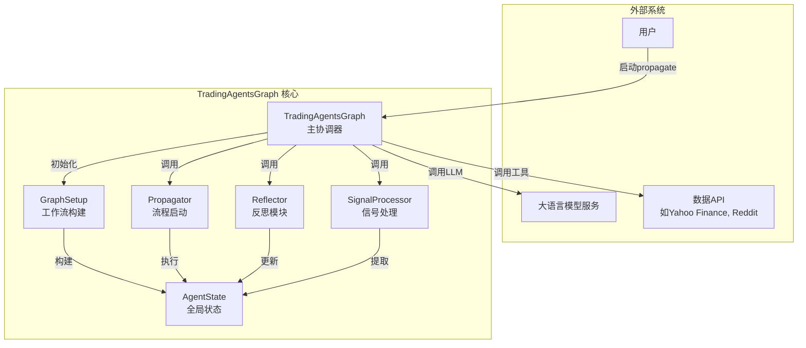
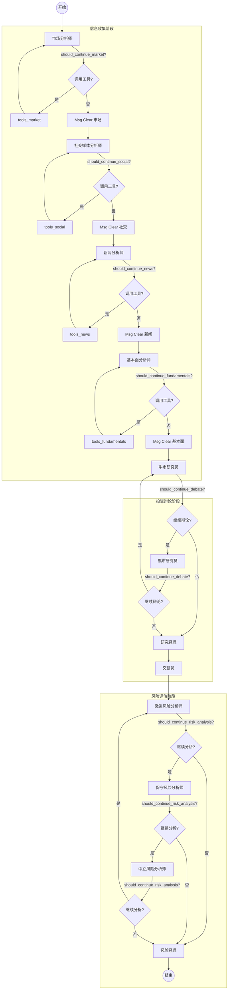

# 核心架构

<cite>
**本文档中引用的文件**  
- [trading_graph.py](file://tradingagents/graph/trading_graph.py)
- [setup.py](file://tradingagents/graph/setup.py)
- [agent_states.py](file://tradingagents/agents/utils/agent_states.py)
- [propagation.py](file://tradingagents/graph/propagation.py)
- [reflection.py](file://tradingagents/graph/reflection.py)
- [signal_processing.py](file://tradingagents/graph/signal_processing.py)
- [conditional_logic.py](file://tradingagents/graph/conditional_logic.py)
</cite>

## 目录
1. [引言](#引言)
2. [系统上下文与角色职责](#系统上下文与角色职责)
3. [状态机工作流架构](#状态机工作流架构)
4. [工作流节点注册机制](#工作流节点注册机制)
5. [条件边实现逻辑](#条件边实现逻辑)
6. [状态对象传播机制](#状态对象传播机制)
7. [核心执行阶段分析](#核心执行阶段分析)
8. [模块化设计优势](#模块化设计优势)
9. [系统上下文图](#系统上下文图)
10. [组件交互图](#组件交互图)

## 引言
`TradingAgentsGraph` 是交易智能体框架的核心协调器，负责组织和调度多个专业智能体的执行流程。该组件基于 LangGraph 构建状态机工作流，通过定义明确的节点、边和状态对象，实现复杂决策流程的自动化。本文档详细描述其架构设计、执行逻辑和模块化优势，帮助理解该系统如何协调市场分析、投资辩论和风险管理等阶段，最终生成交易决策。

## 系统上下文与角色职责
`TradingAgentsGraph` 作为主协调器，承担以下核心职责：
- **组件初始化**：根据配置初始化大语言模型（LLM）、工具包（Toolkit）、记忆模块（Memory）和各类智能体节点。
- **工作流构建**：利用 `GraphSetup` 类动态构建基于 `StateGraph` 的有向图工作流。
- **状态管理**：维护全局状态 `curr_state`，并在执行过程中传播和更新 `AgentState`。
- **流程驱动**：调用 `propagate` 方法启动工作流，协调各智能体按序执行。
- **后处理支持**：提供 `reflect_and_remember` 和 `process_signal` 方法，支持决策后反思和信号提取。

**Section sources**
- [trading_graph.py](file://tradingagents/graph/trading_graph.py#L31-L253)

## 状态机工作流架构
系统采用 LangGraph 的 `StateGraph` 实现状态机驱动的工作流。`AgentState` 作为全局状态对象，在节点间传递，确保数据一致性。工作流由多个阶段构成：
1. **信息收集阶段**：依次执行市场、社交媒体、新闻和基本面分析师节点。
2. **投资辩论阶段**：牛市与熊市研究员交替辩论，由研究经理做出最终投资建议。
3. **交易执行阶段**：交易员基于投资计划生成交易提案。
4. **风险评估阶段**：激进、保守和中立风险分析师进行辩论，由风险经理做出最终风险决策。

**Section sources**
- [trading_graph.py](file://tradingagents/graph/trading_graph.py#L31-L253)
- [setup.py](file://tradingagents/graph/setup.py#L49-L205)

## 工作流节点注册机制
`GraphSetup` 类的 `setup_graph` 方法负责注册所有工作流节点。节点注册遵循以下模式：
- **分析师节点**：根据 `selected_analysts` 参数动态创建市场、社交、新闻和基本面分析师节点。
- **工具节点**：为每个分析师关联对应的 `ToolNode`，用于执行数据获取工具。
- **消息清理节点**：为每个分析师创建 `Msg Clear` 节点，用于清除消息历史，避免上下文过长。
- **研究与管理节点**：固定注册牛市研究员、熊市研究员、研究经理和交易员节点。
- **风险分析节点**：固定注册激进、保守、中立风险分析师及风险经理节点。

节点通过 `workflow.add_node` 方法注册到 `StateGraph` 实例中。

**Section sources**
- [setup.py](file://tradingagents/graph/setup.py#L49-L205)

## 条件边实现逻辑
条件边（Conditional Edges）是驱动工作流动态行为的核心机制。其实现逻辑如下：
- **分析师条件边**：每个分析师节点后连接一个条件边，由 `should_continue_{analyst_type}` 方法决定是否调用工具。若需调用工具，则跳转到对应 `tools_{analyst_type}` 节点；否则跳转到 `Msg Clear` 节点。
- **辩论条件边**：牛市和熊市研究员节点后连接条件边，由 `should_continue_debate` 方法根据辩论轮数决定跳转到对方节点继续辩论，或跳转到研究经理节点结束辩论。
- **风险分析条件边**：三个风险分析师节点后连接条件边，由 `should_continue_risk_analysis` 方法决定跳转到下一个分析师节点继续辩论，或跳转到风险经理节点结束辩论。

条件边通过 `workflow.add_conditional_edges` 方法注册，实现了非线性的、基于逻辑判断的流程控制。

**Section sources**
- [setup.py](file://tradingagents/graph/setup.py#L49-L205)
- [conditional_logic.py](file://tradingagents/graph/conditional_logic.py)

## 状态对象传播机制
`AgentState` 继承自 `MessagesState`，并扩展了多个领域特定字段，用于在整个工作流中传播数据。其传播机制如下：
- **初始化**：`Propagator.create_initial_state` 方法创建初始状态，包含公司名称和交易日期。
- **节点更新**：每个节点接收当前状态，处理后返回一个字典，其中键对应 `AgentState` 的字段。LangGraph 自动合并这些更新到全局状态。
- **字段传播**：例如，`market_analyst_node` 更新 `market_report` 字段，`bull_researcher_node` 更新 `investment_debate_state` 字段。
- **最终输出**：工作流结束后，最终状态包含所有阶段的输出，如 `final_trade_decision`。

这种基于键值更新的机制确保了状态的可预测性和可追溯性。

**Section sources**
- [agent_states.py](file://tradingagents/agents/utils/agent_states.py#L49-L75)
- [trading_graph.py](file://tradingagents/graph/trading_graph.py#L31-L253)

## 核心执行阶段分析

### 信息传播阶段（Propagation）
`propagate` 方法是启动整个工作流的入口。它负责：
- 创建初始状态并调用 `graph.invoke` 或 `graph.stream` 执行工作流。
- 在调试模式下，通过 `stream` 方法逐块输出执行过程，便于追踪。
- 将最终状态存储在 `curr_state` 中，供后续反思使用。
- 调用 `process_signal` 提取最终交易信号。

**Section sources**
- [trading_graph.py](file://tradingagents/graph/trading_graph.py#L153-L185)

### 反思阶段（Reflection）
`reflect_and_remember` 方法在交易执行后调用，用于从结果中学习。它：
- 将最终状态和实际收益/损失传递给 `Reflector`。
- `Reflector` 调用各个智能体的反思方法（如 `reflect_bull_researcher`），分析决策成败原因。
- 更新各智能体的记忆模块（如 `bull_memory`），将经验存入向量数据库，供未来决策参考。

**Section sources**
- [trading_graph.py](file://tradingagents/graph/trading_graph.py#L235-L247)
- [reflection.py](file://tradingagents/graph/reflection.py)

### 信号处理阶段（Signal Processing）
`process_signal` 方法负责从复杂的最终决策文本中提取核心交易信号。它：
- 调用 `SignalProcessor.process_signal` 方法。
- 使用 LLM 解析包含详细分析的 `final_trade_decision` 字符串。
- 提取并返回标准化的交易动作，如 "BUY"、"SELL" 或 "HOLD"。

**Section sources**
- [trading_graph.py](file://tradingagents/graph/trading_graph.py#L249-L253)
- [signal_processing.py](file://tradingagents/graph/signal_processing.py)

## 模块化设计优势
系统的模块化设计带来了显著优势：
- **组件解耦**：每个智能体（如 `market_analyst`）和功能模块（如 `Propagator`）独立实现，通过明确定义的接口（状态对象）交互，降低了模块间的依赖性。
- **易于扩展**：添加新的分析师类型（如 "technical"）只需实现相应的节点函数，并在 `setup_graph` 中注册，无需修改核心协调逻辑。
- **测试友好**：各模块可独立测试。例如，`Reflector` 的反思逻辑可单独验证，无需运行完整工作流。
- **配置灵活**：通过 `selected_analysts` 参数可动态启用/禁用分析师，适应不同场景需求。

**Section sources**
- [trading_graph.py](file://tradingagents/graph/trading_graph.py#L31-L253)
- [setup.py](file://tradingagents/graph/setup.py#L49-L205)

## 系统上下文图
该图展示了 `TradingAgentsGraph` 与外部系统及内部核心组件的交互关系。

**Diagram sources**
- [trading_graph.py](file://tradingagents/graph/trading_graph.py#L31-L253)
- [setup.py](file://tradingagents/graph/setup.py#L49-L205)
- [propagation.py](file://tradingagents/graph/propagation.py)
- [reflection.py](file://tradingagents/graph/reflection.py)
- [signal_processing.py](file://tradingagents/graph/signal_processing.py)

## 组件交互图
该图详细展示了工作流中各节点的执行顺序和条件跳转逻辑。

**Diagram sources**
- [setup.py](file://tradingagents/graph/setup.py#L49-L205)
- [conditional_logic.py](file://tradingagents/graph/conditional_logic.py)