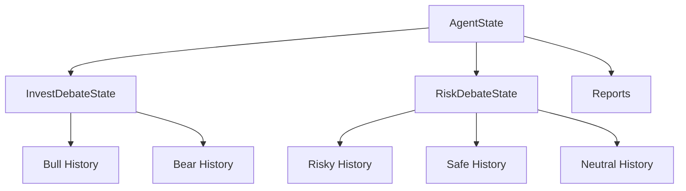
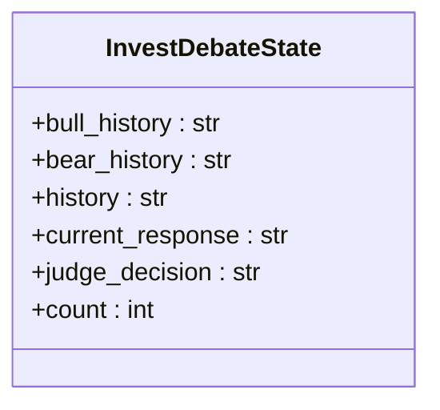
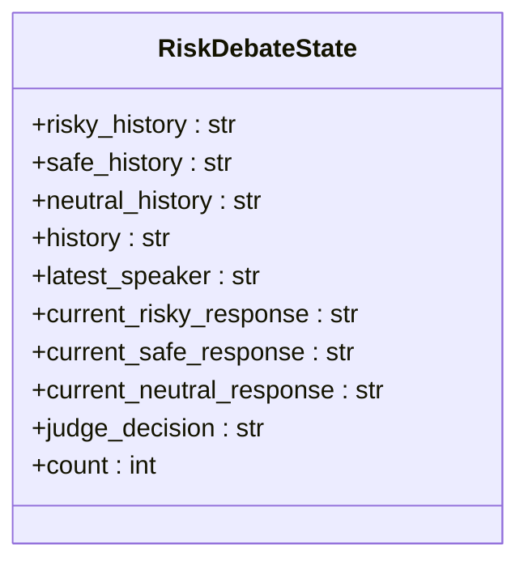
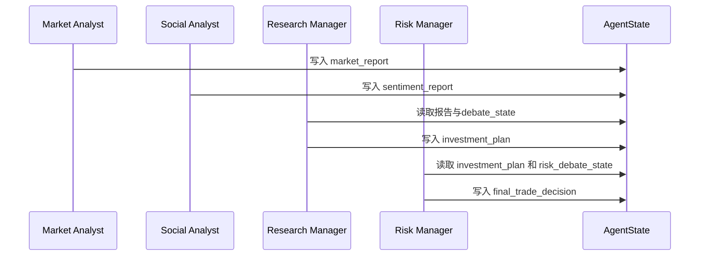

# 状态数据模型

<cite>
**本文档中引用的文件**  
- [agent_states.py](file://tradingagents/agents/utils/agent_states.py)
- [setup.py](file://tradingagents/graph/setup.py)
- [trading_graph.py](file://tradingagents/graph/trading_graph.py)
- [propagation.py](file://tradingagents/graph/propagation.py)
- [research_manager.py](file://tradingagents/agents/managers/research_manager.py)
- [risk_manager.py](file://tradingagents/agents/managers/risk_manager.py)
- [conditional_logic.py](file://tradingagents/graph/conditional_logic.py)
</cite>

## 目录
1. [引言](#引言)
2. [核心状态模型概述](#核心状态模型概述)
3. [AgentState 详解](#agentstate-详解)
4. [InvestDebateState 与 RiskDebateState 结构对比](#investdebatestate-与-riskdebatestate-结构对比)
5. [Annotated 类型注解的用途](#annotated-类型注解的用途)
6. [继承 MessagesState 的架构优势](#继承-messagesstate-的架构优势)
7. [状态数据在多智能体协作中的作用](#状态数据在多智能体协作中的作用)
8. [实际状态数据示例](#实际状态数据示例)
9. [字段演化规律分析](#字段演化规律分析)
10. [结论](#结论)

## 引言
本文件旨在全面阐述 TradingAgents 系统中的核心状态数据模型，包括 `AgentState`、`InvestDebateState` 和 `RiskDebateState`。这些模型构成了多智能体系统在投资决策流程中信息传递与累积的基础。文档将深入解析各字段的语义、类型及其在系统中的角色，并通过代码结构和运行机制说明其设计原理。

**Section sources**
- [agent_states.py](file://tradingagents/agents/utils/agent_states.py#L1-L75)

## 核心状态模型概述
系统采用分层状态建模方式，以 `AgentState` 为主干，整合了从市场分析到风险评估的全流程信息。`InvestDebateState` 和 `RiskDebateState` 作为嵌套子状态，分别封装了投资辩论和风险评估阶段的上下文。这种设计实现了状态的模块化管理，支持复杂决策流程的可追溯性与可调试性。



**Diagram sources**
- [agent_states.py](file://tradingagents/agents/utils/agent_states.py#L10-L46)
- [agent_states.py](file://tradingagents/agents/utils/agent_states.py#L49-L75)

**Section sources**
- [agent_states.py](file://tradingagents/agents/utils/agent_states.py#L1-L75)

## AgentState 详解
`AgentState` 是整个系统的工作流状态容器，继承自 `MessagesState`，用于存储多智能体交互过程中的所有关键信息。其字段按功能划分为多个逻辑区块：

- **基础信息**：`company_of_interest`（关注公司）、`trade_date`（交易日期）标识决策上下文。
- **发送者标识**：`sender` 记录当前消息的发出者，用于追踪信息来源。
- **研究阶段报告**：`market_report`、`sentiment_report`、`news_report`、`fundamentals_report` 分别存储来自市场、舆情、新闻和基本面分析师的分析结果。
- **投资决策链**：`investment_debate_state` 存储辩论状态，`investment_plan` 为研究经理生成的投资计划，`trader_investment_plan` 为交易员的执行计划。
- **风险管理链**：`risk_debate_state` 存储风险评估状态，`final_trade_decision` 为最终交易决策。

该状态模型通过结构化字段实现了从数据采集到最终决策的端到端信息流追踪。

**Section sources**
- [agent_states.py](file://tradingagents/agents/utils/agent_states.py#L49-L75)
- [trading_graph.py](file://tradingagents/graph/trading_graph.py#L200-L205)

## InvestDebateState 与 RiskDebateState 结构对比
两个子状态模型均采用 `TypedDict` 实现，但其结构设计反映了不同的协作模式。

### InvestDebateState
专用于牛市与熊市研究员之间的二元辩论：
- `bull_history` 和 `bear_history` 分别记录双方独立的讨论历史。
- `history` 为合并的完整对话记录。
- `current_response` 表示最新回应。
- `judge_decision` 存储研究经理的最终裁决。
- `count` 跟踪对话轮次。



**Diagram sources**
- [agent_states.py](file://tradingagents/agents/utils/agent_states.py#L10-L20)

### RiskDebateState
支持三元风险评估（激进、保守、中立）：
- `risky_history`、`safe_history`、`neutral_history` 分别记录三类风险分析师的历史。
- `latest_speaker` 明确标识最后发言者，用于控制辩论流程。
- `current_risky_response`、`current_safe_response`、`current_neutral_response` 分别存储三类分析师的最新响应。
- 其余字段与 `InvestDebateState` 类似。



**Diagram sources**
- [agent_states.py](file://tradingagents/agents/utils/agent_states.py#L24-L46)

**Section sources**
- [agent_states.py](file://tradingagents/agents/utils/agent_states.py#L10-L46)
- [conditional_logic.py](file://tradingagents/graph/conditional_logic.py#L58-L67)

## Annotated 类型注解的用途
`Annotated` 类型注解在本系统中承担双重职责：
1. **类型标注**：明确字段的数据类型（如 `str`、`int`、`InvestDebateState`）。
2. **语义描述**：通过字符串参数提供字段的业务语义说明，例如 `"Company that we are interested in trading"`。

这种设计不仅增强了代码的可读性，还为后续可能的自动化文档生成、状态验证或调试工具提供了丰富的元数据支持。例如，在日志输出或状态序列化时，可结合类型与描述生成更具可读性的信息。

**Section sources**
- [agent_states.py](file://tradingagents/agents/utils/agent_states.py#L49-L75)

## 继承 MessagesState 的架构优势
`AgentState` 继承自 `langgraph` 框架的 `MessagesState`，这一设计带来了显著优势：
- **消息集成**：天然支持将智能体间的对话历史（`messages`）作为状态的一部分，无需额外字段管理。
- **框架兼容**：与 `langgraph` 的 `StateGraph` 完美集成，支持基于消息的条件流转（如 `should_continue_market`）。
- **简化开发**：复用框架对消息的序列化、流式处理和持久化能力，降低开发复杂度。
- **统一接口**：所有节点均可通过标准方式访问和修改消息历史，保证了交互的一致性。

此架构决策体现了“约定优于配置”的原则，使开发者能专注于业务逻辑而非状态管理基础设施。

**Section sources**
- [agent_states.py](file://tradingagents/agents/utils/agent_states.py#L49-L75)
- [setup.py](file://tradingagents/graph/setup.py#L12)
- [trading_graph.py](file://tradingagents/graph/trading_graph.py#L200-L205)

## 状态数据在多智能体协作中的作用
状态模型是多智能体协作的核心枢纽，其作用体现在：
- **信息传递**：前序节点（如分析师）将结果写入报告字段，后序节点（如研究经理）读取并据此决策。
- **上下文累积**：`history` 字段持续追加对话内容，确保后续参与者拥有完整上下文。
- **流程控制**：`count` 和 `latest_speaker` 等字段被 `ConditionalLogic` 用于判断是否继续辩论或进入下一阶段。
- **记忆与反思**：`FinancialSituationMemory` 利用状态中的 `judge_decision` 和报告内容进行事后反思，形成经验知识库。

例如，`research_manager_node` 会读取 `investment_debate_state` 和各类报告，生成 `investment_plan`，实现了从分散信息到集中决策的转化。



**Diagram sources**
- [agent_states.py](file://tradingagents/agents/utils/agent_states.py#L49-L75)
- [research_manager.py](file://tradingagents/agents/managers/research_manager.py#L1-L55)
- [risk_manager.py](file://tradingagents/agents/managers/risk_manager.py#L1-L66)

**Section sources**
- [agent_states.py](file://tradingagents/agents/utils/agent_states.py#L49-L75)
- [research_manager.py](file://tradingagents/agents/managers/research_manager.py#L1-L55)
- [risk_manager.py](file://tradingagents/agents/managers/risk_manager.py#L1-L66)

## 实际状态数据示例
以下为一个简化的 `AgentState` JSON 示例：

```json
{
  "company_of_interest": "AAPL",
  "trade_date": "2023-10-01",
  "sender": "Research Manager",
  "market_report": "Apple stock shows strong upward momentum...",
  "sentiment_report": "Social media sentiment is overwhelmingly positive...",
  "news_report": "Apple announces new product launch...",
  "fundamentals_report": "Revenue growth exceeds expectations...",
  "investment_debate_state": {
    "bull_history": "Bull: The new product will drive sales...",
    "bear_history": "Bear: Market is saturated, growth limited...",
    "history": "Bull: ... Bear: ...",
    "current_response": "Bear: ...",
    "judge_decision": "Recommendation: Buy. Rationale: Strong fundamentals and positive sentiment outweigh saturation concerns.",
    "count": 4
  },
  "investment_plan": "Buy AAPL, target price $200...",
  "trader_investment_plan": "Execute buy order for 100 shares...",
  "risk_debate_state": {
    "risky_history": "Risky: Aggressive buy, leverage up...",
    "safe_history": "Safe: Conservative position, limit exposure...",
    "neutral_history": "Neutral: Moderate buy, balanced portfolio...",
    "history": "Risky: ... Safe: ... Neutral: ...",
    "latest_speaker": "Judge",
    "current_risky_response": "...",
    "current_safe_response": "...",
    "current_neutral_response": "...",
    "judge_decision": "Final Decision: Buy with moderate risk. Adjust trader plan to reduce leverage.",
    "count": 3
  },
  "final_trade_decision": "Buy AAPL with moderate position size."
}
```

**Section sources**
- [trading_graph.py](file://tradingagents/graph/trading_graph.py#L220-L250)
- [propagation.py](file://tradingagents/graph/propagation.py#L20-L49)

## 字段演化规律分析
在系统运行过程中，各字段遵循明确的演化规律：
- **初始化**：由 `Propagator.create_initial_state` 创建初始状态，所有报告为空，计数器为0。
- **逐步填充**：各分析师节点依次填充其报告字段。
- **辩论累积**：`bull_history`、`bear_history` 等字段在研究员节点间流转时持续追加内容，`count` 递增。
- **决策覆盖**：`judge_decision` 在每次裁决时被新内容覆盖，形成决策的最终版本。
- **计划迭代**：`investment_plan` 由研究经理生成，`trader_investment_plan` 由交易员细化，`final_trade_decision` 由风险经理最终确认，体现决策的层层细化与风险控制。

`ConditionalLogic` 类中的条件函数（如 `should_continue_debate`）通过检查 `count` 和 `current_response` 来控制流程，确保辩论在达到最大轮次后终止。

**Section sources**
- [propagation.py](file://tradingagents/graph/propagation.py#L20-L49)
- [conditional_logic.py](file://tradingagents/graph/conditional_logic.py#L48-L67)
- [research_manager.py](file://tradingagents/agents/managers/research_manager.py#L1-L55)

## 结论
`AgentState`、`InvestDebateState` 和 `RiskDebateState` 构成了 TradingAgents 系统的骨架，其设计体现了模块化、可追溯和框架集成的优秀实践。通过继承 `MessagesState` 并利用 `Annotated` 注解，系统实现了高效的状态管理与清晰的语义表达。这些模型不仅支撑了复杂的多智能体协作流程，还为系统的可扩展性、可维护性和可解释性奠定了坚实基础。