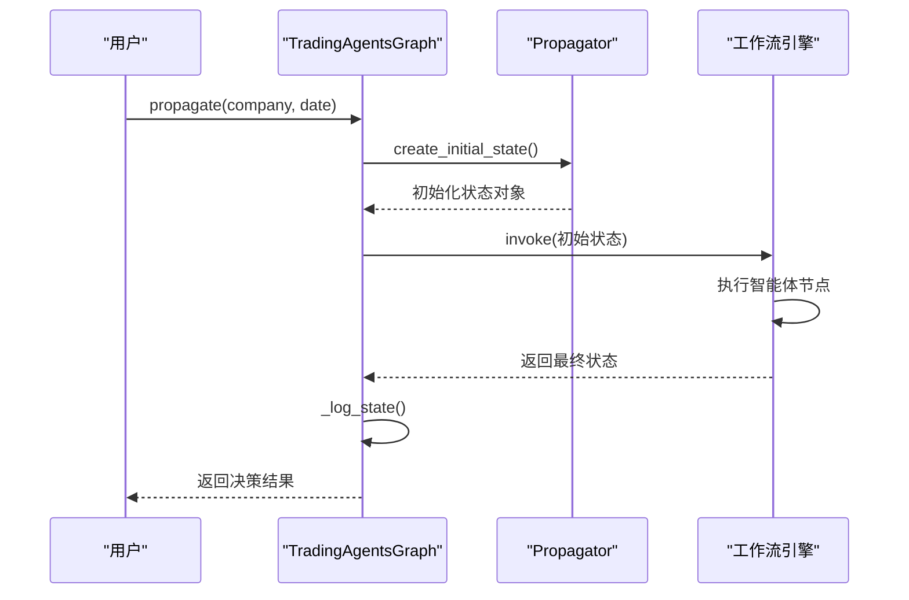
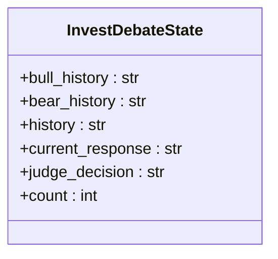
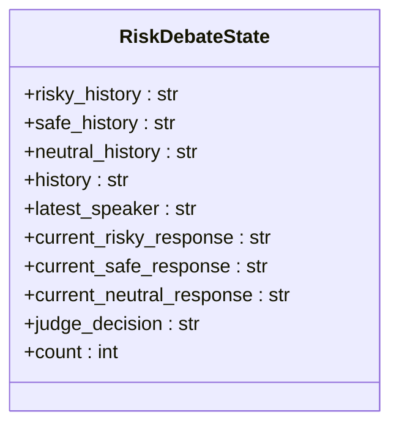
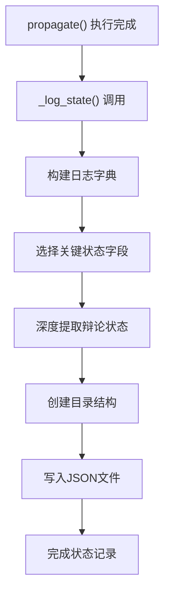

# 状态管理

<cite>
**本文档引用的文件**  
- [agent_states.py](file://tradingagents/agents/utils/agent_states.py)
- [propagation.py](file://tradingagents/graph/propagation.py)
- [trading_graph.py](file://tradingagents/graph/trading_graph.py)
</cite>

## 目录
1. [引言](#引言)
2. [核心状态模型设计](#核心状态模型设计)
3. [状态初始化与传播机制](#状态初始化与传播机制)
4. [投资辩论状态结构与演化](#投资辩论状态结构与演化)
5. [风险辩论状态结构与演化](#风险辩论状态结构与演化)
6. [状态快照与日志记录](#状态快照与日志记录)
7. [实际状态数据示例](#实际状态数据示例)

## 引言
本文档深入解析交易智能体系统中的状态管理机制，重点阐述`AgentState`数据模型的设计原理及其在多智能体协作流程中的核心作用。系统通过结构化状态对象在不同智能体节点间传递信息，实现市场分析、投资决策与风险管理的协同工作流。

## 核心状态模型设计

`AgentState`是整个智能体协作系统的核心数据结构，继承自`MessagesState`，采用`TypedDict`模式定义，确保类型安全与结构清晰。该状态模型贯穿整个工作流，承载从初始输入到最终决策的完整信息链。

状态模型按功能划分为多个逻辑区块：
- **基础信息**：公司标的与交易日期
- **研究阶段报告**：市场、情绪、新闻与基本面分析结果
- **投资决策流程**：投资辩论状态与投资计划
- **风险管理流程**：风险辩论状态与最终交易决策

这种分层设计实现了关注点分离，便于各智能体模块独立操作其相关字段，同时保持全局状态一致性。

**Section sources**
- [agent_states.py](file://tradingagents/agents/utils/agent_states.py#L49-L75)

## 状态初始化与传播机制

### Propagator类的角色
`Propagator`类负责状态的初始化和图工作流中的传播控制。其核心方法`create_initial_state`为每次执行创建一个结构完整、字段初始化的初始状态对象。



**Diagram sources**
- [propagation.py](file://tradingagents/graph/propagation.py#L20-L45)
- [trading_graph.py](file://tradingagents/graph/trading_graph.py#L156-L180)

### 状态传播流程
`propagate`方法是状态驱动的核心入口，其执行流程如下：
1. 接收公司名称与交易日期作为输入
2. 调用`Propagator.create_initial_state`创建初始状态
3. 获取图执行参数（流模式、递归限制）
4. 调用图工作流引擎执行完整决策流程
5. 存储当前状态用于后续反思
6. 调用`_log_state`进行状态持久化
7. 返回最终决策与处理后的信号

此机制确保了状态在智能体网络中的有序流动与累积演化。

**Section sources**
- [trading_graph.py](file://tradingagents/graph/trading_graph.py#L156-L180)

## 投资辩论状态结构与演化

`InvestDebateState`类定义了投资辩论过程中的状态结构，采用多视角记录机制：

- **bull_history**：牛市研究员的论点历史
- **bear_history**：熊市研究员的论点历史
- **history**：综合对话历史
- **current_response**：当前最新回应
- **judge_decision**：投资裁判的最终裁决
- **count**：对话轮次计数

该状态在研究员团队（bull_researcher, bear_researcher, research_manager）间传递时持续累积信息。每轮辩论后，相应字段被更新，形成完整的决策追溯链。`count`字段用于控制辩论轮次，防止无限循环。



**Diagram sources**
- [agent_states.py](file://tradingagents/agents/utils/agent_states.py#L10-L20)

**Section sources**
- [agent_states.py](file://tradingagents/agents/utils/agent_states.py#L10-L20)

## 风险辩论状态结构与演化

`RiskDebateState`类管理风险评估过程的状态，支持三种风险偏好的辩论：

- **risky_history/safe_history/neutral_history**：分别记录激进、保守、中立风险分析师的论点历史
- **current_risky_response/current_safe_response/current_neutral_response**：各风险类型分析师的最新回应
- **latest_speaker**：最后发言的分析师
- **judge_decision**：风险裁判的最终判断
- **count**：风险辩论轮次

该设计允许多方风险视角的并行评估，最终由风险经理整合形成综合风险判断。状态在`aggresive_debator`、`conservative_debator`、`neutral_debator`和`risk_manager`间传递演化。



**Diagram sources**
- [agent_states.py](file://tradingagents/agents/utils/agent_states.py#L24-L46)

**Section sources**
- [agent_states.py](file://tradingagents/agents/utils/agent_states.py#L24-L46)

## 状态快照与日志记录

系统通过`_log_state`方法实现状态的序列化与持久化：

1. **选择性序列化**：从完整状态中提取关键字段构建日志对象
2. **嵌套状态处理**：对`investment_debate_state`和`risk_debate_state`进行深度提取
3. **文件持久化**：以JSON格式保存至`eval_results/{ticker}/TradingAgentsStrategy_logs/`目录
4. **命名规范**：文件名为`full_states_log_{trade_date}.json`，便于按日期检索

日志记录不仅用于事后审计，也为`Reflector`组件提供反思与记忆更新的依据，形成学习闭环。



**Diagram sources**
- [trading_graph.py](file://tradingagents/graph/trading_graph.py#L182-L204)

**Section sources**
- [trading_graph.py](file://tradingagents/graph/trading_graph.py#L182-L204)

## 实际状态数据示例

以下为一个典型状态快照的JSON结构示例：

```json
{
  "company_of_interest": "AAPL",
  "trade_date": "2024-01-15",
  "market_report": "市场整体呈上涨趋势...",
  "sentiment_report": "社交媒体情绪偏积极...",
  "news_report": "公司发布新产品线...",
  "fundamentals_report": "营收同比增长15%...",
  "investment_debate_state": {
    "bull_history": "牛市观点：新产品将带动增长...",
    "bear_history": "熊市观点：市场竞争加剧...",
    "history": "多轮辩论后...",
    "current_response": "综合来看...",
    "judge_decision": "建议投资"
  },
  "trader_investment_decision": "买入100股",
  "risk_debate_state": {
    "risky_history": "激进观点：可加杠杆...",
    "safe_history": "保守观点：应分散风险...",
    "neutral_history": "中立观点：适度配置...",
    "history": "风险评估完成...",
    "judge_decision": "风险可控"
  },
  "investment_plan": "长期持有策略",
  "final_trade_decision": "执行买入"
}
```

该示例展示了状态对象如何累积来自不同智能体的信息，最终形成完整的决策记录。

**Section sources**
- [trading_graph.py](file://tradingagents/graph/trading_graph.py#L182-L204)