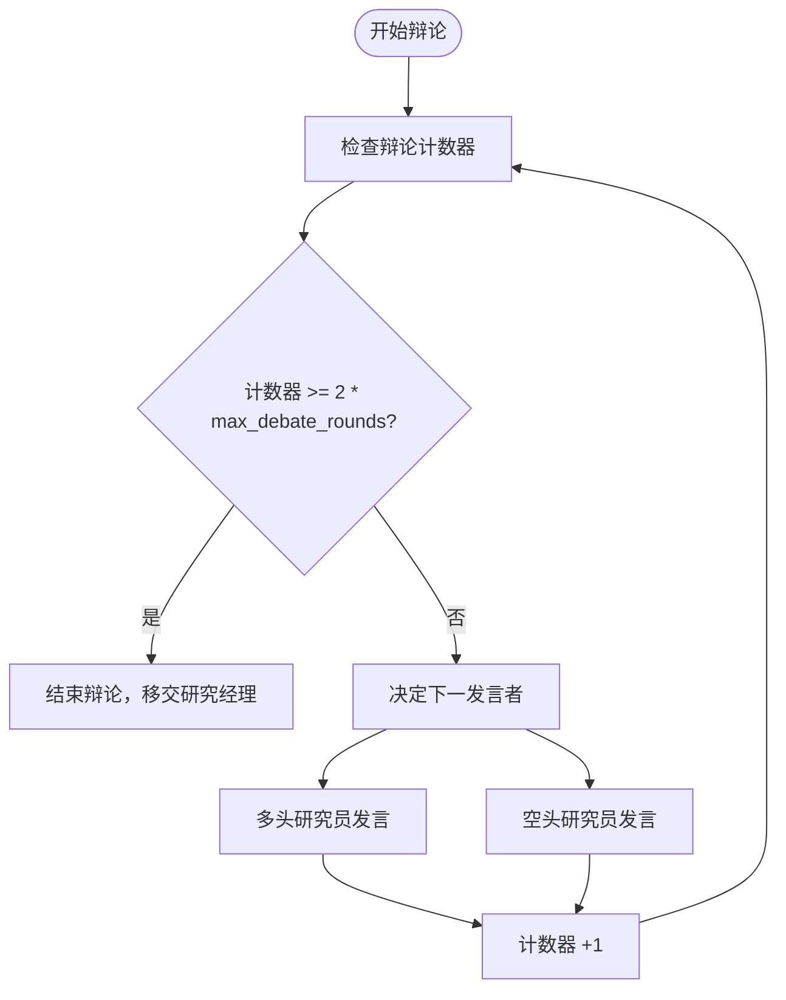
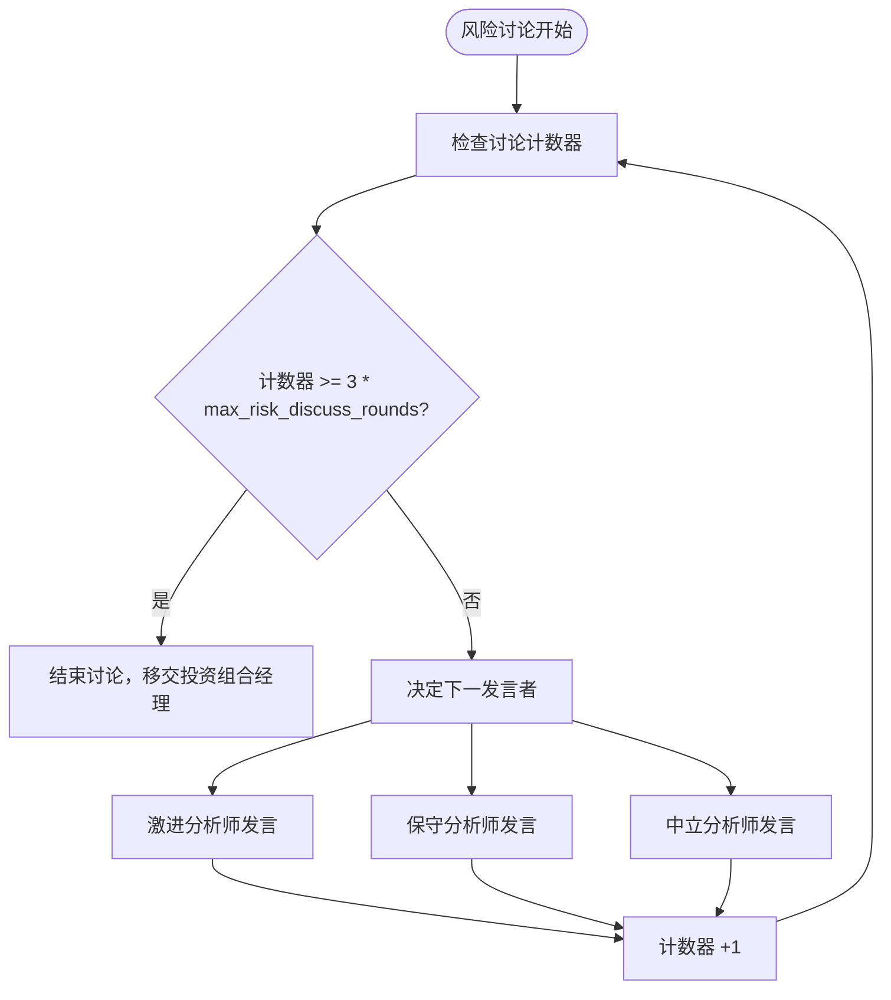
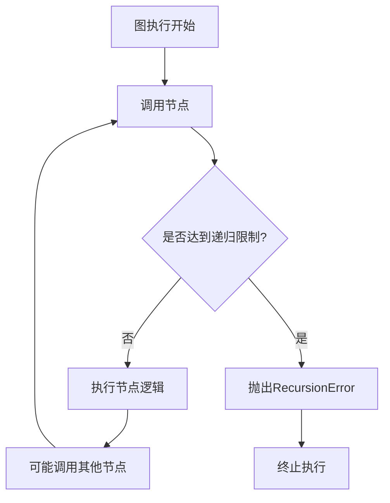

# 分析深度设置

<cite>
**本文档中引用的文件**  
- [default_config.py](file://tradingagents/default_config.py)
- [conditional_logic.py](file://tradingagents/graph/conditional_logic.py)
- [propagation.py](file://tradingagents/graph/propagation.py)
- [research_manager.py](file://tradingagents/agents/managers/research_manager.py)
- [risk_manager.py](file://tradingagents/agents/managers/risk_manager.py)
- [bull_researcher.py](file://tradingagents/agents/researchers/bull_researcher.py)
- [bear_researcher.py](file://tradingagents/agents/researchers/bear_researcher.py)
- [aggresive_debator.py](file://tradingagents/agents/risk_mgmt/aggresive_debator.py)
- [conservative_debator.py](file://tradingagents/agents/risk_mgmt/conservative_debator.py)
- [neutral_debator.py](file://tradingagents/agents/risk_mgmt/neutral_debator.py)
</cite>

## 目录
1. [引言](#引言)
2. [核心参数概览](#核心参数概览)
3. [辩论轮次控制机制](#辩论轮次控制机制)
4. [风险管理讨论轮次](#风险管理讨论轮次)
5. [递归调用安全限制](#递归调用安全限制)
6. [配置策略建议](#配置策略建议)
7. [性能与成本权衡](#性能与成本权衡)
8. [结论](#结论)

## 引言
本文件旨在深入解析交易智能体系统中的分析深度控制机制，重点围绕 `default_config.py` 中定义的三个关键参数：`max_debate_rounds`、`max_risk_discuss_rounds` 和 `max_recur_limit`。这些参数共同决定了系统在投资决策和风险管理过程中进行多轮辩论与递归分析的能力，直接影响决策的审慎性、稳健性与执行效率。通过理解其工作原理，用户可根据不同风险偏好和交易策略进行精细化配置。

## 核心参数概览
系统通过默认配置文件 `default_config.py` 定义了控制分析深度的核心参数，这些参数作为系统行为的“旋钮”，允许用户在决策质量与执行速度之间进行权衡。

```python
# debate and discussion settings
"max_debate_rounds": 1,
"max_risk_discuss_rounds": 1,
"max_recur_limit": 100,
```

- **`max_debate_rounds`**: 控制多头（Bull）与空头（Bear）研究员之间投资辩论的最大轮次。
- **`max_risk_discuss_rounds`**: 控制风险管理部门内激进、保守与中立分析师之间风险讨论的最大轮次。
- **`max_recur_limit`**: 设置图执行引擎的最大递归调用次数，防止无限循环。

**Section sources**
- [default_config.py](file://tradingagents/default_config.py#L15-L22)

## 比论轮次控制机制
`max_debate_rounds` 参数直接影响投资决策的审慎程度。该参数被 `ConditionalLogic` 类接收，并用于判断是否应继续进行多头与空头之间的辩论。



**Diagram sources**
- [conditional_logic.py](file://tradingagents/graph/conditional_logic.py#L47-L53)
- [bull_researcher.py](file://tradingagents/agents/researchers/bull_researcher.py#L55)
- [bear_researcher.py](file://tradingagents/agents/researchers/bear_researcher.py#L57)

### 工作原理
1. **状态计数**: 每当多头或空头研究员发表一次观点，`investment_debate_state` 中的 `count` 值就会递增。
2. **终止条件**: `should_continue_debate` 函数检查 `count` 是否达到 `2 * max_debate_rounds`。例如，当 `max_debate_rounds=1` 时，最多允许1轮完整的来回（即多头说一次，空头说一次，共2次发言）。
3. **决策移交**: 一旦达到上限，辩论流程将终止，并将最终决策权移交给研究经理（Research Manager），由其根据辩论历史做出最终投资建议。

**Section sources**
- [conditional_logic.py](file://tradingagents/graph/conditional_logic.py#L47-L53)
- [research_manager.py](file://tradingagents/agents/managers/research_manager.py#L50)

## 风险管理讨论轮次
`max_risk_discuss_rounds` 参数用于控制风险管理团队内部的讨论深度。该团队由三位分析师组成：激进（Risky）、保守（Safe）和中立（Neutral），因此其计数逻辑更为复杂。



**Diagram sources**
- [conditional_logic.py](file://tradingagents/graph/conditional_logic.py#L55-L62)
- [aggresive_debator.py](file://tradingagents/agents/risk_mgmt/aggresive_debator.py#L51)
- [conservative_debator.py](file://tradingagents/agents/risk_mgmt/conservative_debator.py#L54)
- [neutral_debator.py](file://tradingagents/agents/risk_mgmt/neutral_debator.py#L20)

### 工作原理
1. **三方辩论**: 讨论在三位风险分析师之间循环进行，发言顺序由 `latest_speaker` 字段决定。
2. **终止条件**: `should_continue_risk_analysis` 函数检查 `risk_debate_state` 的 `count` 是否达到 `3 * max_risk_discuss_rounds`。例如，当 `max_risk_discuss_rounds=1` 时，最多允许1轮完整的三方讨论（即每位分析师各发言一次，共3次发言）。
3. **最终裁决**: 达到上限后，讨论结束，风险经理（Risk Manager）将综合所有观点，做出最终的交易决策（买入、卖出或持有）。

**Section sources**
- [conditional_logic.py](file://tradingagents/graph/conditional_logic.py#L55-L62)
- [risk_manager.py](file://tradingagents/agents/managers/risk_manager.py#L60)

## 递归调用安全限制
`max_recur_limit` 是一个关键的安全机制，用于防止系统在执行复杂的图（Graph）流程时陷入无限递归循环，从而导致资源耗尽。



**Diagram sources**
- [propagation.py](file://tradingagents/graph/propagation.py#L15-L25)
- [propagation.py](file://tradingagents/graph/propagation.py#L43-L47)

### 工作原理
1. **初始化**: `Propagator` 类在初始化时接收 `max_recur_limit` 参数（默认值为100）。
2. **配置传递**: 该限制值通过 `get_graph_args` 方法被传递给底层的图执行引擎（如LangGraph）。
3. **引擎监控**: 图执行引擎会自动跟踪当前的调用深度。一旦实际递归调用次数超过此限制，引擎将立即终止执行并抛出异常，确保系统稳定。

**Section sources**
- [propagation.py](file://tradingagents/graph/propagation.py#L15-L25)
- [propagation.py](file://tradingagents/graph/propagation.py#L43-L47)

## 配置策略建议
根据不同的交易策略和风险偏好，可以调整这些参数以优化系统性能。

| 风险偏好 | max_debate_rounds | max_risk_discuss_rounds | 说明 |
| :--- | :--- | :--- | :--- |
| **保守策略** | 2-3 | 2-3 | 增加辩论轮次，允许更充分的观点交锋，提升决策的稳健性和抗风险能力，适合长期投资。 |
| **平衡策略** | 1-2 | 1-2 | 在决策质量和执行效率之间取得平衡，适用于大多数常规交易场景。 |
| **高频/激进策略** | 0-1 | 0-1 | 极大减少或关闭辩论，以最低延迟做出决策，适合对速度要求极高的交易，但决策风险较高。 |

**Section sources**
- [default_config.py](file://tradingagents/default_config.py#L15-L22)

## 性能与成本权衡
调整分析深度参数会直接影响系统的性能和运行成本。

- **增加轮次的收益**: 更多的辩论轮次意味着更全面的分析和更少的决策盲点，有助于避免因信息不足导致的错误。
- **增加轮次的成本**: 每一轮辩论都需要调用大语言模型（LLM），这会显著增加API调用次数、响应延迟和计算成本。例如，将 `max_debate_rounds` 从1增加到3，可能使相关LLM调用次数增加2-3倍。
- **过度配置的风险**: 将 `max_debate_rounds` 或 `max_risk_discuss_rounds` 设置得过高，可能导致单次决策耗时过长，错失市场机会，同时导致API成本急剧上升，性价比降低。

因此，建议用户根据实际需求进行A/B测试，找到最适合自身策略的“甜蜜点”。

## 结论
`max_debate_rounds`、`max_risk_discuss_rounds` 和 `max_recur_limit` 是控制系统分析深度和行为模式的核心参数。它们分别管理着投资辩论的深度、风险管理的广度和系统执行的安全边界。通过合理配置这些参数，用户可以在决策的审慎性、执行的效率和运行的成本之间找到最佳平衡点。建议从默认值（均为1）开始，根据策略需求逐步调整，并密切监控性能与成本变化，以实现最优的交易智能体行为。