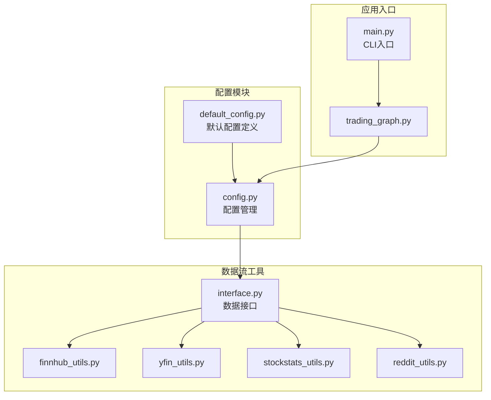
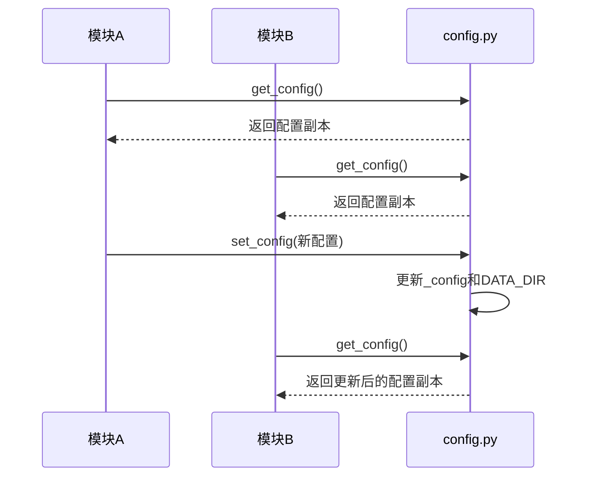

# 数据源配置

<cite>
**Referenced Files in This Document**   
- [config.py](file://tradingagents/dataflows/config.py)
- [default_config.py](file://tradingagents/default_config.py)
- [interface.py](file://tradingagents/dataflows/interface.py)
- [main.py](file://cli/main.py)
</cite>

## 目录
1. [项目结构](#项目结构)
2. [核心配置项详解](#核心配置项详解)
3. [配置管理函数](#配置管理函数)
4. [配置同步机制](#配置同步机制)
5. [实践示例](#实践示例)
6. [常见问题诊断](#常见问题诊断)

## 项目结构

本项目的数据源配置主要分布在 `tradingagents/dataflows/` 目录下，核心配置文件包括 `config.py` 和 `default_config.py`。`dataflows` 模块负责管理所有数据流相关的功能，包括数据路径、缓存、以及与外部数据源的交互。



**Diagram sources**
- [default_config.py](file://tradingagents/default_config.py)
- [config.py](file://tradingagents/dataflows/config.py)
- [interface.py](file://tradingagents/dataflows/interface.py)

**Section sources**
- [tradingagents/dataflows/config.py](file://tradingagents/dataflows/config.py)
- [tradingagents/default_config.py](file://tradingagents/default_config.py)

## 核心配置项详解

### 数据存储路径 (data_dir)

`data_dir` 配置项用于指定原始金融数据的存储位置。该路径是所有离线数据操作的基础，包括股票价格、基本面数据、新闻和社交媒体数据等。

在 `default_config.py` 中，`data_dir` 被设置为一个绝对路径：
```python
"data_dir": "/Users/yluo/Documents/Code/ScAI/FR1-data"
```

该路径在 `config.py` 中被初始化为全局变量 `DATA_DIR`，供 `dataflows` 模块中的所有工具函数使用。例如，在 `yfin_utils.py` 和 `stockstats_utils.py` 中，数据文件的读取都基于此路径构建完整的文件路径。

**Section sources**
- [default_config.py](file://tradingagents/default_config.py#L10-L12)
- [config.py](file://tradingagents/dataflows/config.py#L4-L5)

### 数据缓存路径 (data_cache_dir)

`data_cache_dir` 配置项用于管理API响应的本地缓存，旨在减少对远程服务的重复请求，提高系统性能和稳定性。

在 `default_config.py` 中，`data_cache_dir` 通过 `os.path.join` 动态构建，确保其相对于项目根目录的位置：
```python
"data_cache_dir": os.path.join(
    os.path.abspath(os.path.join(os.path.dirname(__file__), ".")),
    "dataflows/data_cache",
),
```

此缓存目录通常用于存储从Finnhub、Google News等外部API获取的响应数据。通过缓存机制，系统可以在离线模式或网络不稳定时，依然能够提供历史数据服务。

**Section sources**
- [default_config.py](file://tradingagents/default_config.py#L13-L17)

### 结果输出路径 (results_dir)

`results_dir` 配置项定义了分析结果的保存位置。该路径支持通过环境变量 `TRADINGAGENTS_RESULTS_DIR` 进行覆盖，提供了灵活的部署选项。

```python
"results_dir": os.getenv("TRADINGAGENTS_RESULTS_DIR", "./results")
```

在 `cli/main.py` 中，该路径被用于创建以股票代码和分析日期命名的子目录，确保每次分析的结果都能被独立保存和追溯。例如，对 `NVDA` 在 `2024-05-10` 的分析结果将被保存在 `./results/NVDA/2024-05-10/` 目录下。

**Section sources**
- [default_config.py](file://tradingagents/default_config.py#L9)
- [main.py](file://cli/main.py#L751-L753)

## 配置管理函数

### 配置初始化 (initialize_config)

`initialize_config()` 函数负责在系统启动时初始化配置。它检查全局变量 `_config` 是否为空，如果为空，则从 `default_config.DEFAULT_CONFIG` 创建一个副本，并将 `DATA_DIR` 设置为配置中的 `data_dir` 值。

```python
def initialize_config():
    """Initialize the configuration with default values."""
    global _config, DATA_DIR
    if _config is None:
        _config = default_config.DEFAULT_CONFIG.copy()
        DATA_DIR = _config["data_dir"]
```

此函数在 `config.py` 文件末尾被调用，确保模块加载时配置已就绪。

**Section sources**
- [config.py](file://tradingagents/dataflows/config.py#L8-L13)

### 配置动态更新 (set_config)

`set_config(config: Dict)` 函数允许在运行时动态更新配置。它接受一个字典参数，将其中的键值对更新到全局配置 `_config` 中，并同步更新 `DATA_DIR` 变量。

```python
def set_config(config: Dict):
    """Update the configuration with custom values."""
    global _config, DATA_DIR
    if _config is None:
        _config = default_config.DEFAULT_CONFIG.copy()
    _config.update(config)
    DATA_DIR = _config["data_dir"]
```

此函数在 `trading_graph.py` 中被调用，允许用户通过传入自定义配置来覆盖默认设置。

**Section sources**
- [config.py](file://tradingagents/dataflows/config.py#L16-L22)
- [trading_graph.py](file://tradingagents/graph/trading_graph.py#L51)

### 配置安全访问 (get_config)

`get_config()` 函数提供对当前配置的安全访问。它返回 `_config` 的一个副本，防止外部代码直接修改内部状态。

```python
def get_config() -> Dict:
    """Get the current configuration."""
    if _config is None:
        initialize_config()
    return _config.copy()
```

此函数在 `interface.py` 和 `main.py` 中被广泛使用，确保各个模块都能获取到一致的配置信息。

**Section sources**
- [config.py](file://tradingagents/dataflows/config.py#L25-L29)
- [interface.py](file://tradingagents/dataflows/interface.py#L705)

## 配置同步机制

配置同步机制是确保多模块间配置一致性的关键。该机制通过以下方式实现：

1.  **全局单例模式**：`_config` 和 `DATA_DIR` 作为全局变量，确保整个应用中只有一个配置实例。
2.  **惰性初始化**：`get_config()` 函数在首次调用时才初始化配置，保证了配置的按需加载。
3.  **集中更新**：所有配置更新都通过 `set_config()` 函数进行，确保 `DATA_DIR` 等衍生变量能与主配置保持同步。



**Diagram sources**
- [config.py](file://tradingagents/dataflows/config.py)

**Section sources**
- [config.py](file://tradingagents/dataflows/config.py)

## 实践示例

### 自定义数据路径

要将数据存储路径切换到云存储挂载点（例如 `/mnt/nas/financial_data`），可以在初始化 `TradingAgentsGraph` 时传入自定义配置：

```python
from tradingagents.graph.trading_graph import TradingAgentsGraph
from tradingagents.default_config import DEFAULT_CONFIG

# 创建自定义配置
custom_config = DEFAULT_CONFIG.copy()
custom_config["data_dir"] = "/mnt/nas/financial_data"
custom_config["results_dir"] = "/mnt/nas/analysis_results"

# 初始化图对象
graph = TradingAgentsGraph(config=custom_config)
```

### 环境变量配置

通过设置环境变量，可以在不修改代码的情况下改变结果输出路径：
```bash
export TRADINGAGENTS_RESULTS_DIR="/mnt/nas/trading_results"
python -m cli.main
```

## 常见问题诊断

### 典型错误：数据加载失败

**症状**：系统报错 `FileNotFoundError` 或 `Stockstats fail: Yahoo Finance data not fetched yet!`。

**诊断步骤**：
1.  **检查 `data_dir` 路径**：确认 `data_dir` 配置的路径是否正确，并且指向包含所需数据文件的目录。
2.  **验证文件存在性**：检查 `data_dir` 目录下是否存在如 `market_data/price_data/NVDA-YFin-data-2015-01-01-2025-03-25.csv` 的文件。
3.  **检查路径同步**：确保所有模块都通过 `get_config()` 获取配置，避免因直接使用硬编码路径导致的不一致。
4.  **权限检查**：确认运行程序的用户对 `data_dir` 目录有读取权限。

**Section sources**
- [stockstats_utils.py](file://tradingagents/dataflows/stockstats_utils.py#L40-L44)
- [config.py](file://tradingagents/dataflows/config.py)