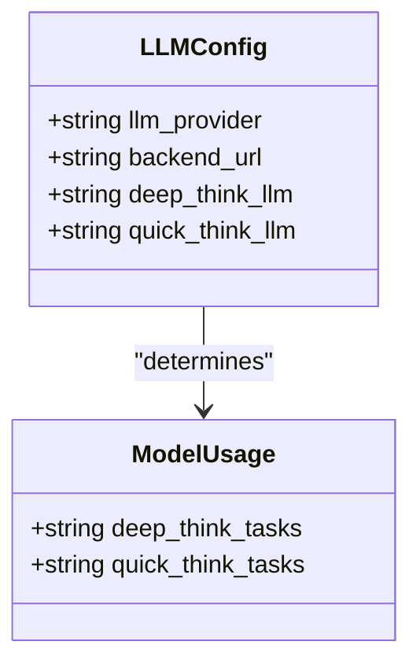
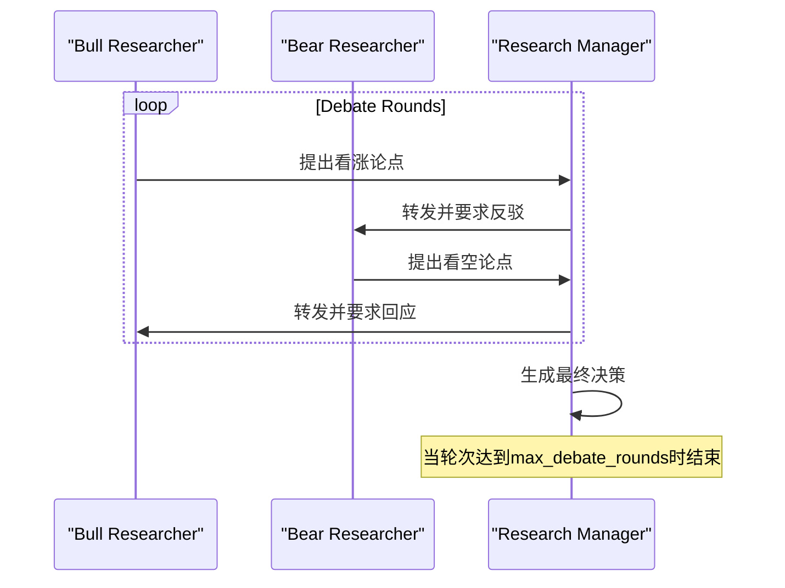
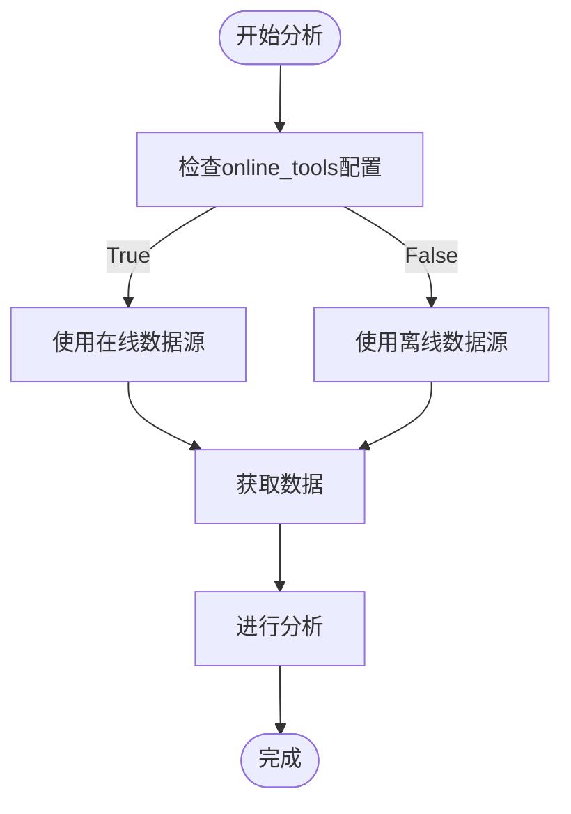

# 配置与定制

<cite>
**本文档中引用的文件**   
- [default_config.py](file://tradingagents/default_config.py)
- [config.py](file://tradingagents/dataflows/config.py)
- [main.py](file://main.py)
- [conditional_logic.py](file://tradingagents/graph/conditional_logic.py)
- [news_analyst.py](file://tradingagents/agents/analysts/news_analyst.py)
- [market_analyst.py](file://tradingagents/agents/analysts/market_analyst.py)
- [social_media_analyst.py](file://tradingagents/agents/analysts/social_media_analyst.py)
- [fundamentals_analyst.py](file://tradingagents/agents/analysts/fundamentals_analyst.py)
</cite>

## 目录
1. [简介](#简介)
2. [项目结构](#项目结构)
3. [核心配置参数](#核心配置参数)
4. [LLM提供商与模型配置](#llm提供商与模型配置)
5. [辩论与风险讨论轮次控制](#辩论与风险讨论轮次控制)
6. [在线工具开关机制](#在线工具开关机制)
7. [数据流相关配置](#数据流相关配置)
8. [自定义配置创建方法](#自定义配置创建方法)
9. [不同场景下的最佳实践](#不同场景下的最佳实践)
10. [配置验证与错误处理](#配置验证与错误处理)

## 简介
本文档全面介绍交易代理系统中的配置机制，重点解析 `default_config.py` 中定义的各项可配置参数及其作用。详细说明如何通过复制默认配置并修改特定字段来创建自定义配置实例，涵盖LLM提供商选择、深思与快思模型配置、辩论轮次控制、在线工具开关等关键选项的使用方法和影响。同时描述 `config.py` 中数据流相关的配置项，如API端点、超时设置和缓存策略，并提供不同应用场景下的配置最佳实践。

## 项目结构
本项目采用模块化设计，主要分为CLI接口、交易代理核心模块、数据流处理、图结构逻辑等部分。配置系统位于 `tradingagents/` 目录下，由 `default_config.py` 提供默认配置，`dataflows/config.py` 负责配置的初始化与管理。

```mermaid
graph TB
subgraph "配置系统"
default_config[default_config.py<br/>默认配置定义]
config[config.py<br/>配置管理]
main[main.py<br/>自定义配置示例]
end
subgraph "代理模块"
analysts[analysts<br/>各类分析师]
managers[managers<br/>管理角色]
researchers[researchers<br/>研究角色]
risk_mgmt[risk_mgmt<br/>风险辩论者]
end
subgraph "数据流"
dataflows[dataflows<br/>数据获取工具]
interface[interface.py<br/>工具接口]
end
subgraph "图逻辑"
graph[graph<br/>流程控制]
conditional_logic[conditional_logic.py<br/>条件判断]
end
default_config --> config
config --> main
config --> analysts
config --> dataflows
config --> conditional_logic
```

**Diagram sources**
- [default_config.py](file://tradingagents/default_config.py#L1-L22)
- [config.py](file://tradingagents/dataflows/config.py#L1-L33)
- [main.py](file://main.py#L1-L21)

**Section sources**
- [default_config.py](file://tradingagents/default_config.py#L1-L22)
- [config.py](file://tradingagents/dataflows/config.py#L1-L33)

## 核心配置参数
系统通过 `DEFAULT_CONFIG` 字典定义所有可配置参数，这些参数控制着代理的行为、模型选择、数据获取方式等关键功能。

**Section sources**
- [default_config.py](file://tradingagents/default_config.py#L1-L22)

## LLM提供商与模型配置
系统支持多种LLM提供商，可通过配置灵活切换。

### LLM提供商选择
通过 `llm_provider` 字段指定使用的LLM提供商，当前支持：
- `"openai"`：使用OpenAI API
- `"google"`：使用Google GenAI服务

该配置直接影响 `backend_url` 的设置，决定API请求的发送目标。

### 深思与快思模型配置
系统采用双模型架构，区分深度思考与快速思考任务：

- **deep_think_llm**：用于复杂推理任务的模型名称
- **quick_think_llm**：用于快速响应任务的模型名称

例如，在Google GenAI配置中，两者均可设置为 `"gemini-2.0-flash"` 以使用轻量级模型。



**Diagram sources**
- [default_config.py](file://tradingagents/default_config.py#L8-L11)
- [main.py](file://main.py#L5-L10)

**Section sources**
- [default_config.py](file://tradingagents/default_config.py#L8-L11)
- [main.py](file://main.py#L5-L10)

## 比赛与风险讨论轮次控制
系统通过配置参数精确控制辩论流程的深度和广度。

### 最大辩论轮次
`max_debate_rounds` 参数控制投资观点辩论的最大轮次。该值在 `ConditionalLogic` 类中被用来判断是否继续辩论流程：

```python
if state["investment_debate_state"]["count"] >= 2 * self.max_debate_rounds:
    return "Research Manager"
```

### 最大风险讨论轮次
`max_risk_discuss_rounds` 参数控制风险分析的最大讨论轮次，影响三名风险分析师之间的辩论循环：

```python
if state["risk_debate_state"]["count"] >= 3 * self.max_risk_discuss_rounds:
    return "Risk Judge"
```



**Diagram sources**
- [default_config.py](file://tradingagents/default_config.py#L13-L14)
- [conditional_logic.py](file://tradingagents/graph/conditional_logic.py#L37-L66)

**Section sources**
- [default_config.py](file://tradingagents/default_config.py#L13-L14)
- [conditional_logic.py](file://tradingagents/graph/conditional_logic.py#L37-L66)

## 在线工具开关机制
`online_tools` 配置项是控制系统数据获取模式的关键开关。

### 功能影响
当 `online_tools=True` 时，系统优先使用在线API获取实时数据；否则使用本地缓存或离线数据源。

### 各分析师模块的应用
- **新闻分析师**：决定使用 `get_global_news_openai` 还是 `get_finnhub_news`
- **市场分析师**：决定使用 `get_YFin_data_online` 还是 `get_YFin_data`
- **社交媒体分析师**：决定使用 `get_stock_news_openai` 还是 `get_reddit_stock_info`
- **基本面分析师**：决定使用 `get_fundamentals_openai` 还是多个Finnhub/SimFin工具



**Diagram sources**
- [default_config.py](file://tradingagents/default_config.py#L18)
- [news_analyst.py](file://tradingagents/agents/analysts/news_analyst.py#L8-L15)
- [market_analyst.py](file://tradingagents/agents/analysts/market_analyst.py#L10-L17)

**Section sources**
- [default_config.py](file://tradingagents/default_config.py#L18)
- [news_analyst.py](file://tradingagents/agents/analysts/news_analyst.py#L8-L15)

## 数据流相关配置
`config.py` 模块负责管理数据流相关的配置项。

### 配置管理机制
系统通过单例模式管理配置，提供三个核心函数：
- `initialize_config()`：初始化配置
- `set_config(config)`：更新配置
- `get_config()`：获取当前配置

### 数据目录配置
- `data_dir`：主数据目录路径
- `data_cache_dir`：数据缓存目录路径
- `results_dir`：结果输出目录路径

这些路径配置确保了数据的一致性和可追溯性。

**Section sources**
- [config.py](file://tradingagents/dataflows/config.py#L1-L33)

## 自定义配置创建方法
用户可通过复制默认配置并修改特定字段来创建自定义配置。

### 创建步骤
1. 导入 `DEFAULT_CONFIG`
2. 调用 `.copy()` 方法创建副本
3. 修改所需字段
4. 将配置传递给 `TradingAgentsGraph`

### 示例代码路径
[SPEC SYMBOL](file://main.py#L3-L15)

```mermaid
flowchart LR
A[导入DEFAULT_CONFIG] --> B[调用.copy()创建副本]
B --> C[修改特定字段]
C --> D[传递给TradingAgentsGraph]
D --> E[系统使用自定义配置]
```

**Diagram sources**
- [main.py](file://main.py#L3-L15)

**Section sources**
- [main.py](file://main.py#L3-L15)

## 不同场景下的最佳实践
根据不同应用需求，推荐以下配置策略。

### 成本敏感型配置
适用于预算有限的场景，优先考虑成本效益：

- **LLM选择**：使用轻量级模型如 `"gemini-2.0-flash"`
- **辩论轮次**：设置 `max_debate_rounds=1` 减少API调用
- **数据模式**：设置 `online_tools=False` 使用缓存数据

### 精度优先型配置
适用于对决策质量要求高的场景：

- **辩论轮次**：增加 `max_debate_rounds` 到3或更高
- **LLM选择**：使用更强大的深思模型
- **数据模式**：保持 `online_tools=True` 获取最新数据

**Section sources**
- [default_config.py](file://tradingagents/default_config.py#L13-L14)
- [main.py](file://main.py#L11-L12)

## 配置验证与错误处理
系统内置了基本的配置验证和错误处理机制。

### 初始化保护
`config.py` 中的 `initialize_config()` 函数确保配置不会为 `None`，并在首次访问时自动初始化。

### 错误处理
在数据获取函数中（如 `get_stockstats_indicator`），使用 `try-except` 块捕获异常并返回空字符串，防止单个数据源故障影响整体流程。

**Section sources**
- [config.py](file://tradingagents/dataflows/config.py#L10-L12)
- [interface.py](file://tradingagents/dataflows/interface.py#L543-L583)