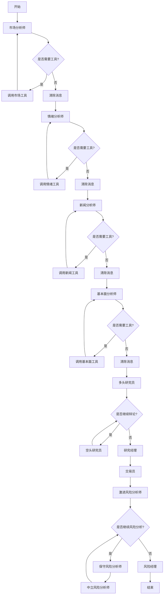
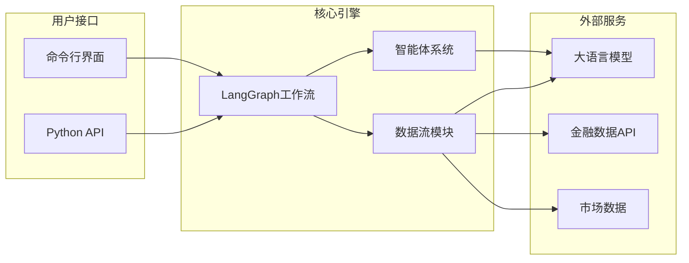

# 项目概述

<cite>
**本文档引用的文件**  
- [README.md](file://README.md)
- [main.py](file://main.py)
- [tradingagents/graph/trading_graph.py](file://tradingagents/graph/trading_graph.py)
- [tradingagents/graph/setup.py](file://tradingagents/graph/setup.py)
- [tradingagents/graph/propagation.py](file://tradingagents/graph/propagation.py)
- [tradingagents/graph/conditional_logic.py](file://tradingagents/graph/conditional_logic.py)
- [tradingagents/graph/reflection.py](file://tradingagents/graph/reflection.py)
- [tradingagents/agents/utils/agent_states.py](file://tradingagents/agents/utils/agent_states.py)
- [tradingagents/dataflows/interface.py](file://tradingagents/dataflows/interface.py)
- [assets/schema.png](file://assets/schema.png)
</cite>

## 目录
1. [项目简介](#项目简介)  
2. [核心目标与架构理念](#核心目标与架构理念)  
3. [多智能体系统设计](#多智能体系统设计)  
4. [基于LangGraph的状态机工作流](#基于langgraph的状态机工作流)  
5. [系统上下文与模块化架构](#系统上下文与模块化架构)  
6. [LLM集成与反思学习机制](#llm集成与反思学习机制)  
7. [辩论决策流程](#辩论决策流程)  
8. [应用场景示例](#应用场景示例)  
9. [与传统系统的对比](#与传统系统的对比)  
10. [总结](#总结)

## 项目简介

TradingAgents 是一个基于多智能体系统的金融交易框架，旨在模拟真实交易团队的协作流程。该项目通过部署多个由大语言模型（LLM）驱动的专业智能体，包括基本面分析师、情绪分析师、新闻分析师、技术分析师、交易员和风险管理团队，协同评估市场状况并做出交易决策。整个系统通过结构化辩论和动态讨论机制，识别最优策略，提升决策的稳健性与可解释性。

该框架专为研究目的设计，不构成任何投资建议。其性能受多种因素影响，包括所选LLM模型、温度参数、数据质量等。

**Section sources**  
- [README.md](file://README.md#L1-L213)

## 核心目标与架构理念

TradingAgents 的核心目标是将复杂的交易任务分解为多个专业化角色，通过多智能体协作实现更稳健、可扩展的市场分析与决策。其架构理念借鉴了现实世界交易公司的组织结构，将分析、研究、交易与风险管理分离，形成职责明确、相互制衡的系统。

系统通过LangGraph构建状态机驱动的工作流，确保各智能体按预定逻辑顺序执行任务，并支持条件分支与循环，实现动态决策路径。这种设计不仅提高了系统的灵活性，还增强了其对复杂市场环境的适应能力。

**Section sources**  
- [README.md](file://README.md#L1-L213)
- [tradingagents/graph/trading_graph.py](file://tradingagents/graph/trading_graph.py#L1-L254)

## 多智能体系统设计

TradingAgents 的智能体系统分为四个核心团队：分析师团队、研究员团队、交易员和风险管理团队。

### 分析师团队
- **基本面分析师**：评估公司财务状况与业绩指标，识别内在价值与潜在风险。
- **情绪分析师**：分析社交媒体与公众情绪，使用情绪评分算法判断短期市场情绪。
- **新闻分析师**：监控全球新闻与宏观经济指标，解读事件对市场的影响。
- **技术分析师**：利用MACD、RSI等技术指标检测交易模式，预测价格走势。

### 研究员团队
- 由多头（Bull）与空头（Bear）研究员组成，对分析师提供的信息进行批判性评估。
- 通过结构化辩论平衡潜在收益与固有风险，形成投资观点。

### 交易员
- 综合分析师与研究员的报告，做出交易决策。
- 决定交易时机与规模，基于全面的市场洞察制定投资计划。

### 风险管理与投资组合经理
- 持续评估投资组合风险，包括市场波动性、流动性等因素。
- 风险管理团队评估并调整交易策略，向投资组合经理提交评估报告。
- 投资组合经理最终批准或拒绝交易提案，若批准则发送至模拟交易所执行。

**Section sources**  
- [README.md](file://README.md#L1-L213)
- [tradingagents/graph/setup.py](file://tradingagents/graph/setup.py#L1-L205)

## 基于LangGraph的状态机工作流

TradingAgents 使用 LangGraph 构建其核心工作流，采用状态机（State Machine）模式管理智能体间的交互流程。系统状态由 `AgentState` 定义，包含公司名称、交易日期、各分析师报告、投资辩论状态、风险评估状态及最终决策等字段。

工作流的执行流程如下：
1. **初始化**：创建初始状态，包含目标公司与交易日期。
2. **顺序分析**：各分析师按配置顺序执行分析任务，生成市场、情绪、新闻与基本面报告。
3. **投资辩论**：多头与空头研究员基于报告展开辩论，研究经理作为裁判做出投资判断。
4. **交易决策**：交易员整合信息，制定投资计划。
5. **风险评估**：激进、保守与中立风险分析师进行风险辩论，风险经理做出最终风险判断。
6. **决策输出**：生成最终交易决策。

该流程通过 `ConditionalLogic` 类实现条件跳转，例如判断是否需要调用工具获取数据，或是否继续辩论轮次。



**Diagram sources**  
- [tradingagents/graph/setup.py](file://tradingagents/graph/setup.py#L1-L205)
- [tradingagents/graph/conditional_logic.py](file://tradingagents/graph/conditional_logic.py#L1-L67)

**Section sources**  
- [tradingagents/graph/trading_graph.py](file://tradingagents/graph/trading_graph.py#L1-L254)
- [tradingagents/graph/setup.py](file://tradingagents/graph/setup.py#L1-L205)
- [tradingagents/graph/conditional_logic.py](file://tradingagents/graph/conditional_logic.py#L1-L67)

## 系统上下文与模块化架构

系统上下文由 `schema.png` 图示化展示，呈现了从用户输入到最终决策的完整数据流与组件交互。系统采用高度模块化设计，各组件职责清晰，易于扩展与维护。

核心模块包括：
- **Dataflows**：提供数据获取接口，支持在线（实时）与离线（缓存）两种模式。
- **Agents**：实现各类智能体逻辑，包括分析师、研究员、交易员与风险管理者。
- **Graph**：构建与管理状态机工作流，协调各智能体执行顺序。
- **Utils**：提供记忆管理、状态定义、工具集等通用功能。

模块化设计使得用户可灵活配置智能体组合、更换LLM提供商、调整辩论轮次等参数，适应不同研究需求。



**Diagram sources**  
- [assets/schema.png](file://assets/schema.png)
- [tradingagents/dataflows/interface.py](file://tradingagents/dataflows/interface.py#L1-L799)

**Section sources**  
- [README.md](file://README.md#L1-L213)
- [tradingagents/dataflows/interface.py](file://tradingagents/dataflows/interface.py#L1-L799)

## LLM集成与反思学习机制

系统支持多种LLM提供商（如OpenAI、Anthropic、Google），用户可通过配置灵活切换。框架采用“深度思考”与“快速思考”双模型策略，分别用于复杂推理与快速响应。

**反思学习机制**通过 `Reflector` 类实现。系统在交易后根据实际收益调用 `reflect_and_remember` 方法，对各智能体的决策进行复盘，提取经验教训并更新其记忆。该机制使系统具备持续学习与优化能力，逐步提升决策质量。

```python
# 示例：调用反思机制
ta.reflect_and_remember(returns_losses=1000)
```

**Section sources**  
- [tradingagents/graph/trading_graph.py](file://tradingagents/graph/trading_graph.py#L1-L254)
- [tradingagents/graph/reflection.py](file://tradingagents/graph/reflection.py#L1-L121)

## 辩论决策流程

系统采用辩论机制提升决策质量。研究员团队中，多头与空头研究员交替发言，研究经理在达到最大辩论轮次后做出裁决。类似地，风险管理团队由激进、保守与中立三类分析师组成，通过多轮讨论形成风险评估。

辩论流程由 `should_continue_debate` 和 `should_continue_risk_analysis` 函数控制，基于当前辩论轮次与最新发言者决定下一步动作。

**Section sources**  
- [tradingagents/graph/conditional_logic.py](file://tradingagents/graph/conditional_logic.py#L1-L67)
- [tradingagents/graph/setup.py](file://tradingagents/graph/setup.py#L1-L205)

## 应用场景示例

### 量化研究
系统可自动化执行多因子分析，结合基本面、技术面、情绪面数据生成量化信号，适用于因子挖掘与回测验证。

### 策略验证
研究人员可配置不同智能体组合与参数，测试其在历史数据上的表现，验证交易策略的有效性与稳健性。

### 教学与演示
CLI界面提供直观的交互体验，适合教学演示与社区分享。

```bash
# 启动CLI
python -m cli.main
```

**Section sources**  
- [README.md](file://README.md#L1-L213)
- [main.py](file://main.py#L1-L21)

## 与传统系统的对比

| 特性 | 传统单体式系统 | TradingAgents 多智能体系统 |
|------|----------------|-----------------------------|
| **架构** | 单一模型决策 | 多智能体协作 |
| **可解释性** | 黑箱决策 | 透明辩论过程 |
| **灵活性** | 固定逻辑 | 可配置智能体组合 |
| **鲁棒性** | 易受单一错误影响 | 多方制衡，降低风险 |
| **学习能力** | 静态模型 | 反思记忆，持续优化 |
| **扩展性** | 难以扩展 | 模块化设计，易于扩展 |

**Section sources**  
- [README.md](file://README.md#L1-L213)
- [tradingagents/graph/trading_graph.py](file://tradingagents/graph/trading_graph.py#L1-L254)

## 总结

TradingAgents 通过多智能体系统模拟真实交易团队的协作流程，结合LangGraph的状态机工作流，实现了高度模块化、可扩展的金融交易框架。其创新的辩论机制与反思学习能力，显著提升了决策的稳健性与可解释性。无论是用于量化研究、策略验证还是教学演示，该框架都为金融AI研究提供了强大的工具支持。

**Section sources**  
- [README.md](file://README.md#L1-L213)
- [tradingagents/graph/trading_graph.py](file://tradingagents/graph/trading_graph.py#L1-L254)