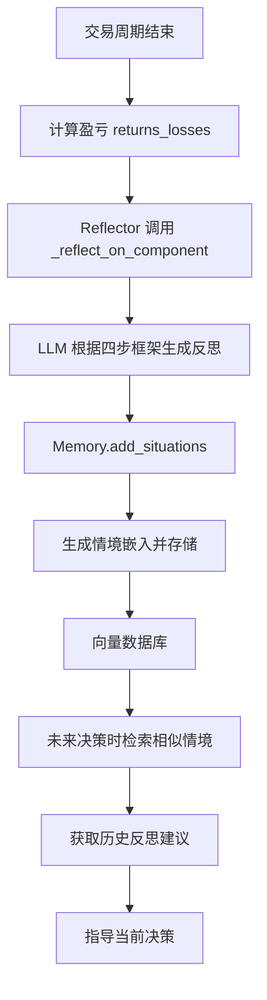

# 反思学习机制

<cite>
**本文档中引用的文件**  
- [reflection.py](file://tradingagents/graph/reflection.py)
- [trading_graph.py](file://tradingagents/graph/trading_graph.py)
- [memory.py](file://tradingagents/agents/utils/memory.py)
- [bull_researcher.py](file://tradingagents/agents/researchers/bull_researcher.py)
- [bear_researcher.py](file://tradingagents/agents/researchers/bear_researcher.py)
- [trader.py](file://tradingagents/agents/trader/trader.py)
</cite>

## 目录
1. [引言](#引言)
2. [Reflector类核心架构](#reflector类核心架构)
3. [_reflect_on_component方法与提示工程设计](#_reflect_on_component方法与提示工程设计)
4. [四步分析框架的作用机制](#四步分析框架的作用机制)
5. [记忆编码与经验提取](#记忆编码与经验提取)
6. [反思频率控制与性能权衡](#反思频率控制与性能权衡)
7. [结论](#结论)

## 引言
本项目通过构建一个基于多智能体协作的交易决策系统，实现对金融市场动态的深度分析与自动化交易。其中，**Reflector** 类作为系统的核心学习模块，负责在每次交易周期结束后对各智能体的决策进行质量评估，并将经验教训编码为可检索的记忆条目，从而实现持续优化。该机制结合大语言模型（LLM）的强大推理能力，使系统具备自我反思和知识积累的能力。

**Section sources**
- [reflection.py](file://tradingagents/graph/reflection.py#L1-L10)

## Reflector类核心架构
`Reflector` 类是整个反思机制的核心实现，其主要职责是接收交易结果、调用LLM进行决策复盘，并将生成的反思内容存储到对应智能体的记忆系统中。该类通过 `_get_reflection_prompt` 方法定义了一个结构化的系统提示词，指导LLM按照预设框架进行分析。同时，它提供了多个专用方法（如 `reflect_bull_researcher`、`reflect_trader` 等），用于针对不同类型的智能体执行反思操作。

`Reflector` 的初始化需要传入一个快速思考的LLM实例（`quick_thinking_llm`），用于执行反思任务。其内部维护了 `reflection_system_prompt` 字段，存储了用于引导LLM进行高质量分析的提示词模板。

**Section sources**
- [reflection.py](file://tradingagents/graph/reflection.py#L1-L20)

## _reflect_on_component方法与提示工程设计
`_reflect_on_component` 方法是生成反思内容的核心逻辑。该方法接收四个参数：`component_type`（组件类型）、`report`（该组件的分析或决策内容）、`situation`（当前市场状况）和 `returns_losses`（交易盈亏结果）。它构建了一个包含系统提示和人类输入的消息序列，提交给LLM进行处理。

人类输入部分的构造非常关键，其格式为：
```
Returns: {returns_losses}
Analysis/Decision: {report}
Objective Market Reports for Reference: {situation}
```
这种设计确保了LLM在评估决策时，能够同时参考**决策结果**、**决策过程**以及**客观市场数据**，从而做出更全面、更公正的判断。通过这种方式，系统能够针对多头研究员、空头研究员、交易员等不同角色生成具有针对性的反馈。

**Section sources**
- [reflection.py](file://tradingagents/graph/reflection.py#L55-L65)

## 四步分析框架的作用机制
`reflection_system_prompt` 中定义的四步分析框架是确保反思质量的关键。该框架强制LLM按照以下四个步骤进行思考：

1.  **推理 (Reasoning)**：首先判断决策的正确性（基于盈亏结果），并深入分析导致成功或失败的各种因素，如市场情报、技术指标、新闻分析、基本面数据等，并评估各因素的重要性。
2.  **改进 (Improvement)**：对于错误的决策，提出具体的改进建议和纠正措施，例如建议在特定日期将“持有”改为“买入”。
3.  **总结 (Summary)**：概括从成功和失败中吸取的经验教训，并说明如何将这些教训应用于未来的类似交易场景。
4.  **查询 (Query)**：将总结的精华提炼成一句简洁的陈述（不超过1000个token），便于后续作为记忆条目进行检索。

这一框架确保了反思过程的系统性和可操作性，使得生成的反馈不仅仅是简单的评价，而是包含了可执行的洞察。

**Section sources**
- [reflection.py](file://tradingagents/graph/reflection.py#L15-L50)

## 记忆编码与经验提取
反思的最终目的是将获得的洞察转化为可复用的知识。系统通过 `FinancialSituationMemory` 类实现记忆管理。当 `Reflector` 完成一次反思后，会调用对应智能体记忆的 `add_situations` 方法。

该方法接收一个元组列表，每个元组包含 `(situation, result)`，其中 `situation` 是通过 `_extract_current_situation` 方法从 `current_state` 中提取的市场状况（整合了市场、情绪、新闻和基本面报告），而 `result` 就是LLM生成的反思内容。`add_situations` 方法会为每个 `situation` 生成嵌入向量（embedding），并将其与对应的反思建议（`recommendation`）一起存储到向量数据库（ChromaDB）中。

在未来的决策中，智能体（如 `bull_researcher`）会通过 `get_memories` 方法，将当前的市场状况作为查询，从向量数据库中检索出最相似的历史情境及其对应的反思建议，从而实现“从过去的经验中学习”。



**Diagram sources**
- [reflection.py](file://tradingagents/graph/reflection.py#L80-L120)
- [memory.py](file://tradingagents/agents/utils/memory.py#L30-L50)

**Section sources**
- [reflection.py](file://tradingagents/graph/reflection.py#L80-L120)
- [memory.py](file://tradingagents/agents/utils/memory.py#L30-L50)

## 反思频率控制与性能权衡
系统的反思操作由 `TradingAgentsGraph` 类的 `reflect_and_remember` 方法统一触发。该方法在每次 `propagate`（即一个完整的交易决策流程）执行完毕后被调用，确保反思是基于完整的决策周期和明确的盈亏结果进行的。

这种**按周期触发**的策略有效避免了“过度反思”导致的计算开销。如果在决策过程中的每一步都进行反思，将产生巨大的LLM调用成本，严重影响系统性能。通过将反思集中在一个明确的阶段执行，系统在保证学习效果的同时，实现了计算资源的高效利用。

此外，使用轻量级的 `quick_thinking_llm` 进行反思，而非更强大的 `deep_thinking_llm`，也是性能优化的重要一环。这表明系统设计者在模型能力与响应速度之间做出了权衡。

**Section sources**
- [trading_graph.py](file://tradingagents/graph/trading_graph.py#L240-L253)

## 结论
Reflector类实现了一套完整的、基于LLM的反思学习机制。它通过精心设计的提示工程和四步分析框架，能够对多智能体系统的交易决策进行深度质量评估。该机制成功地将历史市场数据、决策结果与反思洞察关联起来，并利用向量数据库将这些经验编码为可检索的记忆。通过合理的反思频率控制策略，系统在实现持续学习和性能优化的同时，有效管理了计算成本，为构建具备自我进化能力的智能交易系统奠定了坚实基础。