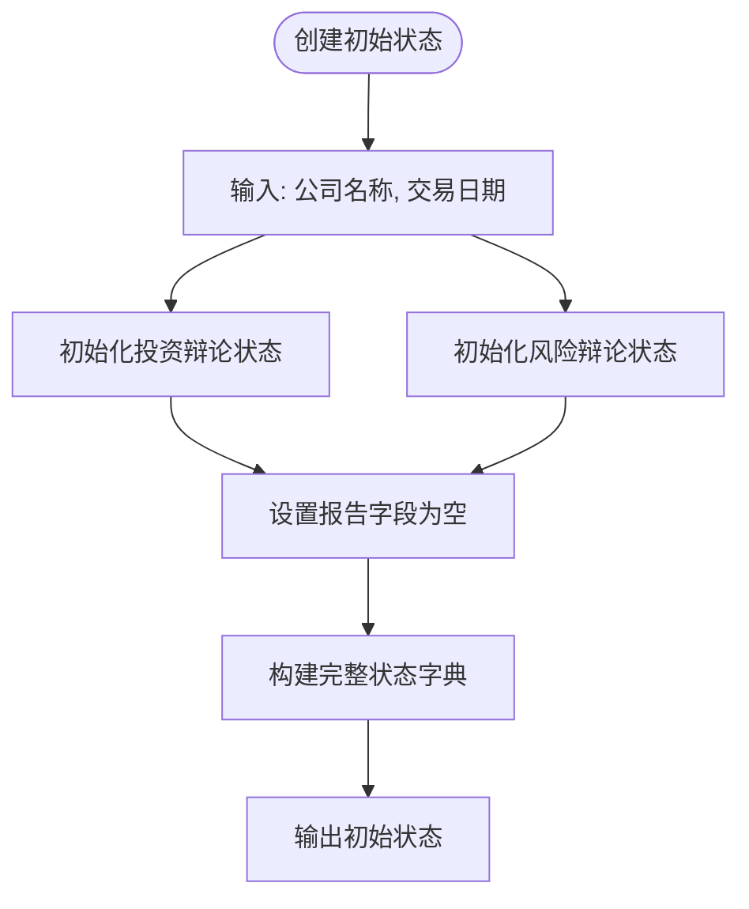
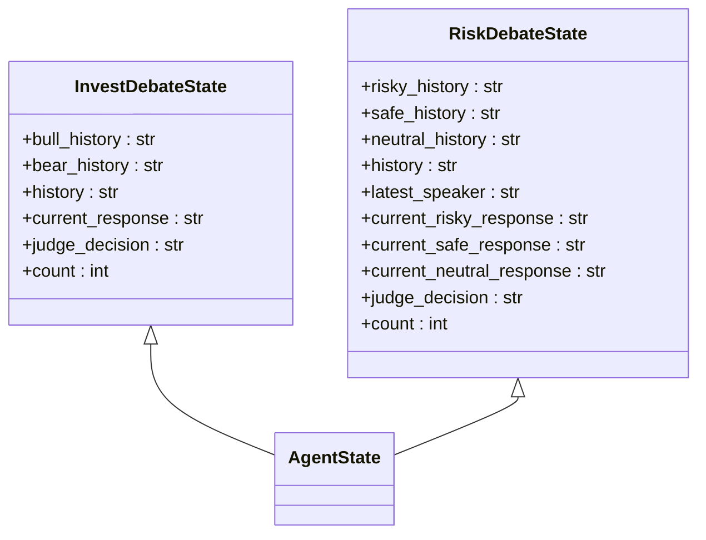
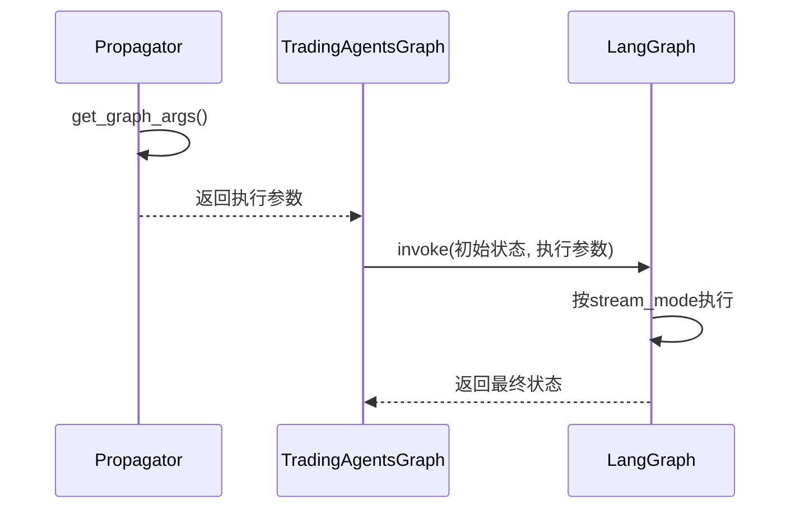
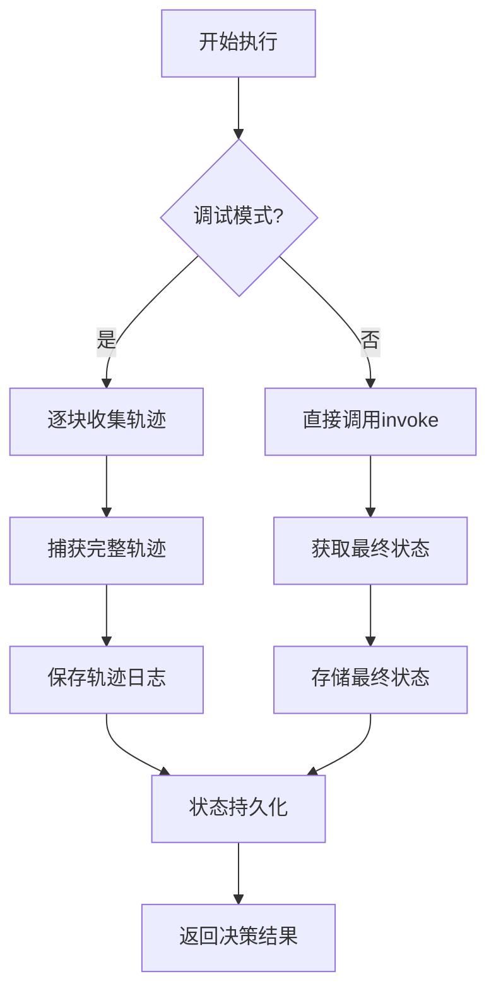

# 状态传播优化

<cite>
**本文档引用的文件**  
- [propagation.py](file://tradingagents/graph/propagation.py)
- [agent_states.py](file://tradingagents/agents/utils/agent_states.py)
- [trading_graph.py](file://tradingagents/graph/trading_graph.py)
- [reflection.py](file://tradingagents/graph/reflection.py)
</cite>

## 目录
1. [引言](#引言)
2. [Propagator类的核心作用](#propagator类的核心作用)
3. [初始状态构建机制](#初始状态构建机制)
4. [辩论状态演化分析](#辩论状态演化分析)
5. [图执行参数配置](#图执行参数配置)
6. [递归限制与执行平衡](#递归限制与执行平衡)
7. [错误恢复与状态暂存](#错误恢复与状态暂存)
8. [结论](#结论)

## 引言
本文档深入解析交易智能体框架中状态传播的核心机制，重点阐述Propagator类在工作流中的关键角色。通过分析初始状态创建、状态演化过程、执行参数配置及递归控制策略，全面揭示系统如何实现复杂决策链的稳定执行与容错处理。

## Propagator类的核心作用

Propagator类作为交易智能体图（TradingAgentsGraph）的核心组件，负责整个工作流的状态初始化与传播控制。该类通过封装状态构建逻辑和执行参数配置，实现了与LangGraph框架的无缝集成，确保多智能体协作流程的有序执行。

在TradingAgentsGraph的初始化过程中，Propagator被实例化并注入到图构建流程中，承担着从外部输入到内部状态转换的关键桥梁作用。其设计遵循单一职责原则，专注于状态生命周期管理，为系统提供了清晰的边界划分和可扩展的配置接口。

**本节来源**  
- [propagation.py](file://tradingagents/graph/propagation.py#L10-L20)
- [trading_graph.py](file://tradingagents/graph/trading_graph.py#L100-L105)

## 初始状态构建机制

`create_initial_state`方法是整个决策流程的起点，负责构建包含公司名称、交易日期及多维度分析报告的初始状态结构。该方法接收`company_name`和`trade_date`两个核心参数，生成符合AgentState类型定义的完整状态字典。

初始状态结构包含以下关键字段：
- **messages**：以人类输入形式记录目标公司名称，作为对话起点
- **company_of_interest**：明确当前分析的目标企业
- **trade_date**：记录交易决策的基准时间点
- **investment_debate_state**：初始化投资辩论状态，用于记录多空双方讨论过程
- **risk_debate_state**：初始化风险管理辩论状态，跟踪风险评估对话
- **各类报告字段**：为市场、基本面、情绪和新闻分析预留空字符串占位符

该方法通过调用InvestDebateState和RiskDebateState的构造函数，确保状态对象符合预定义的类型约束，为后续的类型安全操作提供保障。

**图来源**  
- [propagation.py](file://tradingagents/graph/propagation.py#L25-L48)

**本节来源**  
- [propagation.py](file://tradingagents/graph/propagation.py#L25-L48)
- [agent_states.py](file://tradingagents/agents/utils/agent_states.py#L49-L75)

## 辩论状态演化分析

### 投资辩论状态（InvestDebateState）

InvestDebateState采用TypedDict类型定义，结构化地记录投资决策讨论过程。其核心字段包括：
- **bull_history**：牛市分析师的对话历史
- **bear_history**：熊市分析师的对话历史
- **history**：综合对话历史
- **current_response**：最新响应内容
- **judge_decision**：最终裁决结果
- **count**：对话轮次计数器

该状态在多空研究员（bull_researcher和bear_researcher）的交替发言过程中持续更新，通过历史记录的累积实现辩论过程的可追溯性。最终由投资裁判（invest_judge）基于完整对话历史做出投资决策。

### 风险管理辩论状态（RiskDebateState）

RiskDebateState同样采用TypedDict定义，专门用于风险管理团队的决策过程，包含：
- **risky/safe/neutral_history**：激进、保守、中立分析师的对话历史
- **latest_speaker**：最后发言的分析师标识
- **current_risky/safe/neutral_response**：各风险偏好分析师的最新响应
- **judge_decision**：风险评估最终决策
- **count**：对话轮次计数

该状态结构支持三元辩论模式，允许系统从多个风险维度评估投资方案，确保决策的全面性和稳健性。

**图来源**  
- [agent_states.py](file://tradingagents/agents/utils/agent_states.py#L10-L46)

**本节来源**  
- [agent_states.py](file://tradingagents/agents/utils/agent_states.py#L10-L46)
- [propagation.py](file://tradingagents/graph/propagation.py#L35-L42)

## 图执行参数配置

`get_graph_args`方法负责生成LangGraph执行所需的关键参数，直接影响工作流的运行行为。该方法返回包含`stream_mode`和`config`的字典对象。

**stream_mode**配置为"values"，表示系统将以值流模式执行图节点，逐个返回每个节点的输出结果。这种模式有利于实时监控决策过程，便于调试和日志记录，同时支持在传播方法中实现调试模式的追踪功能。

**config**配置中的`recursion_limit`参数继承自Propagator实例的`max_recur_limit`属性，用于限制图执行的最大递归深度。这一配置防止了因循环依赖或逻辑错误导致的无限执行，确保系统在预设的资源消耗范围内完成决策流程。

**图来源**  
- [propagation.py](file://tradingagents/graph/propagation.py#L43-L48)
- [trading_graph.py](file://tradingagents/graph/trading_graph.py#L150-L160)

**本节来源**  
- [propagation.py](file://tradingagents/graph/propagation.py#L43-L48)
- [trading_graph.py](file://tradingagents/graph/trading_graph.py#L150-L160)

## 递归限制与执行平衡

`max_recur_limit`参数在防止无限循环与确保复杂决策链完整执行之间扮演着关键平衡角色。默认值设置为100，既避免了因递归过深导致的栈溢出和资源耗尽，又为复杂的多轮辩论提供了足够的执行空间。

在实际应用中，该限制需要根据具体业务场景进行调优：
- **过低的限制**可能导致长链推理被意外截断，影响决策完整性
- **过高的限制**可能增加系统资源消耗，延长响应时间

系统通过在TradingAgentsGraph的propagate方法中捕获执行结果，实现了对递归执行的优雅处理。在调试模式下，系统会逐块收集执行轨迹，便于分析递归深度和执行路径；在标准模式下，则直接获取最终状态，优化性能表现。

该平衡策略体现了系统设计中的防御性编程思想，在保证功能完整性的同时，维护了系统的稳定性和可靠性。

**本节来源**  
- [propagation.py](file://tradingagents/graph/propagation.py#L15-L20)
- [trading_graph.py](file://tradingagents/graph/trading_graph.py#L150-L165)

## 错误恢复与状态暂存

系统通过多层次机制实现状态传播过程中的错误恢复和中间状态管理：

### 错误恢复模式
1. **执行模式分离**：提供调试模式和标准模式两种执行路径
2. **轨迹追踪**：在调试模式下逐块收集执行结果，便于定位失败节点
3. **异常隔离**：通过独立的反射（Reflection）组件处理决策后分析，避免影响主决策流

### 中间状态暂存
1. **内存管理**：使用FinancialSituationMemory类管理各智能体的记忆状态
2. **日志持久化**：通过`_log_state`方法将完整状态序列化存储为JSON文件
3. **目录结构化**：按股票代码和策略类型组织日志文件，便于追溯和分析

这些机制共同构成了系统的容错体系，确保即使在部分组件失败的情况下，关键决策信息仍能得到有效保存和后续分析。

**图来源**  
- [trading_graph.py](file://tradingagents/graph/trading_graph.py#L150-L165)
- [reflection.py](file://tradingagents/graph/reflection.py#L10-L20)

**本节来源**  
- [trading_graph.py](file://tradingagents/graph/trading_graph.py#L150-L180)
- [reflection.py](file://tradingagents/graph/reflection.py#L10-L121)

## 结论
Propagator类通过精心设计的状态管理机制，为交易智能体系统提供了稳定可靠的工作流基础。从初始状态构建到执行参数配置，从状态演化跟踪到递归控制，系统展现了复杂决策系统的典型架构特征。通过合理的错误恢复和状态暂存策略，系统在保证功能完整性的同时，实现了生产环境所需的稳定性和可维护性。这些设计模式为类似的人工智能决策系统提供了有价值的参考范例。