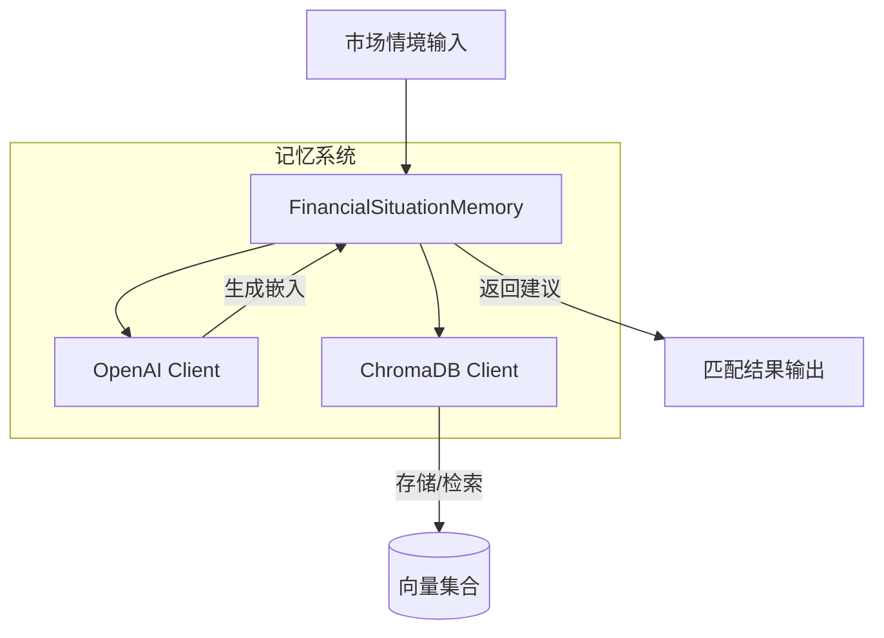
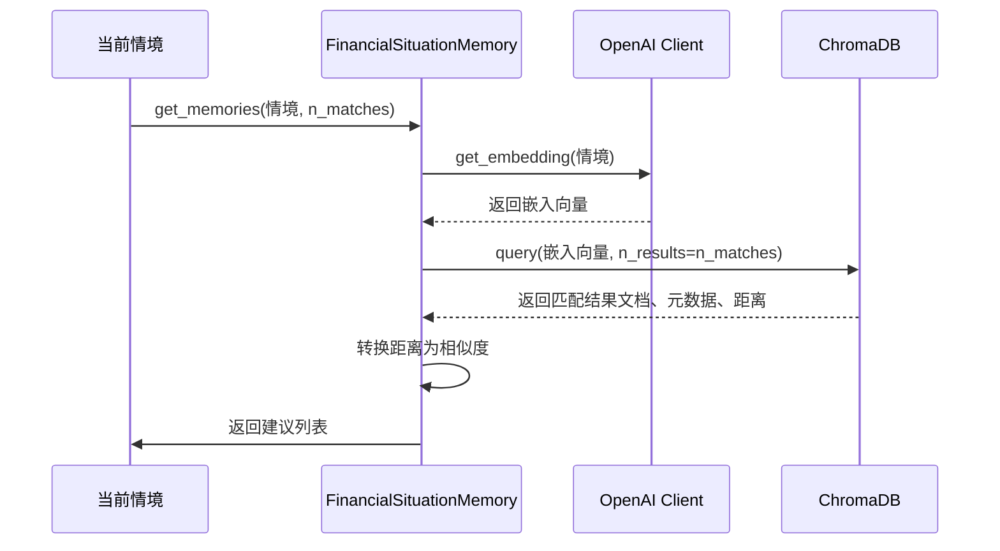
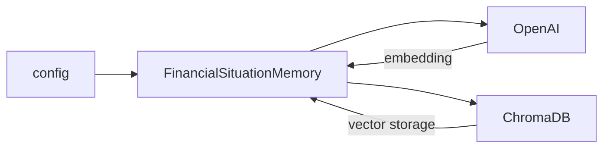

# 记忆系统

<cite>
**本文档引用的文件**  
- [memory.py](file://tradingagents/agents/utils/memory.py)
</cite>

## 目录
1. [引言](#引言)
2. [核心组件](#核心组件)
3. [架构概述](#架构概述)
4. [详细组件分析](#详细组件分析)
5. [依赖分析](#依赖分析)
6. [性能考虑](#性能考虑)
7. [故障排除指南](#故障排除指南)
8. [结论](#结论)

## 引言
本系统设计用于在交易智能体中实现金融情境记忆功能，通过向量数据库存储历史市场情境及其对应的专家建议。系统利用嵌入模型将自然语言描述的市场状况转化为高维语义向量，并基于相似性检索机制为当前市场环境匹配最相关的历史经验与投资建议。该机制增强了智能体的决策能力，使其能够借鉴过往情境进行推理。

## 核心组件

`FinancialSituationMemory` 类是整个记忆系统的核心，负责管理金融情境的存储与检索。它结合了 ChromaDB 向量数据库和 OpenAI 兼容的嵌入接口，实现了高效的语义搜索功能。系统支持多种后端嵌入模型，可根据配置灵活切换本地或云端服务。

**Section sources**
- [memory.py](file://tradingagents/agents/utils/memory.py#L5-L66)

## 架构概述

**Diagram sources**
- [memory.py](file://tradingagents/agents/utils/memory.py#L5-L66)

## 详细组件分析

### FinancialSituationMemory 类分析

#### 初始化逻辑
类初始化时根据配置中的 `backend_url` 决定使用哪种嵌入模型：
- 若指向 `http://localhost:11434/v1`，则使用 `nomic-embed-text` 模型（通常为本地运行的 Ollama 服务）
- 否则默认使用 OpenAI 的 `text-embedding-3-small` 模型

同时初始化 ChromaDB 客户端并创建指定名称的集合用于存储情境数据。

#### add_situations 方法
该方法用于批量添加市场情境与建议对。其处理流程如下：
1. 接收一个元组列表，每个元组包含情境描述和对应建议
2. 遍历列表，提取情境文本并调用 `get_embedding` 生成向量
3. 使用当前集合计数作为 ID 偏移，确保唯一性
4. 将文档、元数据（建议内容）、嵌入向量和 ID 批量写入 ChromaDB 集合

此方法实现了结构化知识的持久化存储，为后续检索奠定基础。

#### get_embedding 方法
封装了调用嵌入模型的核心逻辑：
- 使用统一的 OpenAI 兼容接口发送请求
- 根据配置动态选择嵌入模型
- 返回第一项嵌入向量（单文本输入）

该方法屏蔽了底层模型差异，提供一致的嵌入服务接口。

#### get_memories 方法
实现基于语义相似度的记忆检索：
1. 对当前市场情境生成查询嵌入向量
2. 调用 ChromaDB 的 `query` 方法执行近似最近邻搜索
3. 设置返回前 `n_matches` 个最相似结果
4. 包含元数据、原始文档和距离信息
5. 将余弦距离转换为相似度得分（1 - 距离）
6. 组装结果列表，包含匹配情境、建议和相似度分数

该方法实现了从当前情境到历史经验的语义映射。

**Diagram sources**
- [memory.py](file://tradingagents/agents/utils/memory.py#L5-L66)

**Section sources**
- [memory.py](file://tradingagents/agents/utils/memory.py#L5-L66)

## 依赖分析

系统依赖以下关键外部组件：
- **ChromaDB**：轻量级向量数据库，提供高效的相似性搜索能力
- **OpenAI 兼容 API**：支持多种后端（如 OpenAI 或 Ollama），用于生成文本嵌入
- **Python 客户端库**：`chromadb` 和 `openai` SDK，实现与上述服务的交互

配置通过 `config` 参数传入，其中 `backend_url` 决定了嵌入模型的选择，体现了系统的可配置性和灵活性。

**Diagram sources**
- [memory.py](file://tradingagents/agents/utils/memory.py#L5-L66)

## 性能考虑

- **嵌入模型选择**：`text-embedding-3-small` 在速度与精度间取得良好平衡，适合高频查询场景；`nomic-embed-text` 可在本地运行，避免网络延迟但需自行维护服务。
- **索引维护**：ChromaDB 自动管理向量索引，但在大规模数据下应定期优化或重建索引以保持查询效率。
- **批处理优化**：`add_situations` 方法采用批量写入，显著提升插入性能。
- **缓存策略**：可考虑对高频查询情境实施结果缓存，减少重复嵌入计算开销。

## 故障排除指南

常见问题及解决方案：
- **嵌入调用失败**：检查 `backend_url` 是否可达，确认服务正在运行（特别是本地 Ollama 实例）。
- **检索结果不相关**：验证嵌入模型是否适合金融领域语义，考虑更换模型或调整情境描述粒度。
- **性能下降**：监控 ChromaDB 内存使用情况，必要时升级硬件或分片存储。
- **ID 冲突风险**：当前基于计数偏移生成 ID，在并发写入场景下可能存在冲突，建议引入 UUID。

**Section sources**
- [memory.py](file://tradingagents/agents/utils/memory.py#L5-L66)

## 结论

`FinancialSituationMemory` 类构建了一个高效、可扩展的金融记忆系统，通过向量化存储与检索机制，使交易智能体具备“记忆”历史市场经验的能力。系统设计灵活，支持多后端嵌入模型，适用于不同部署环境。未来可通过引入更精细的元数据过滤、动态权重调整或反馈学习机制进一步提升推荐质量。