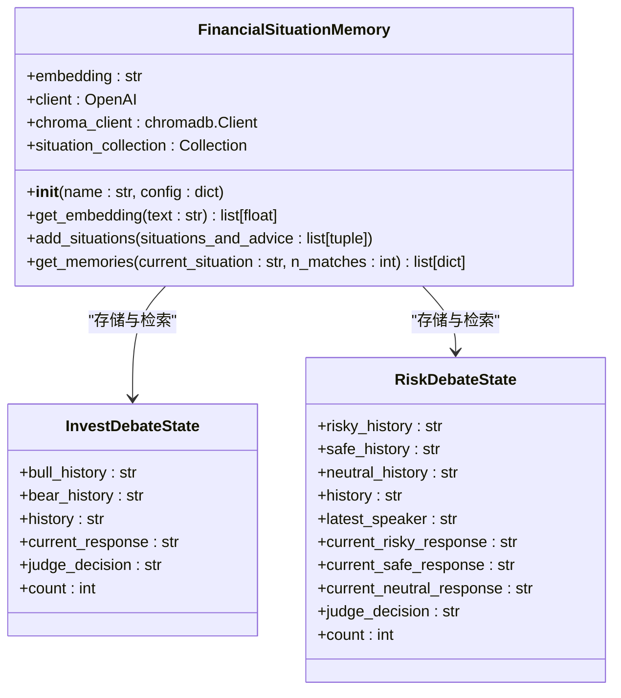
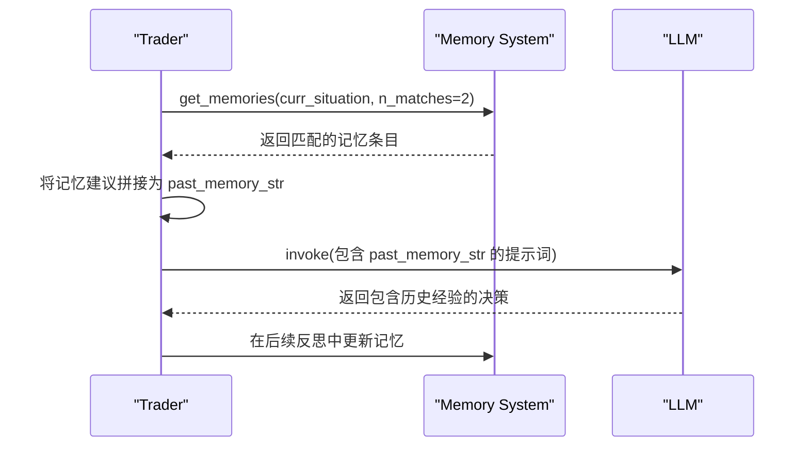

# 高级功能

<cite>
**本文档中引用的文件**  
- [reflection.py](file://tradingagents/graph/reflection.py)
- [memory.py](file://tradingagents/agents/utils/memory.py)
- [propagation.py](file://tradingagents/graph/propagation.py)
- [agent_states.py](file://tradingagents/agents/utils/agent_states.py)
- [trader.py](file://tradingagents/agents/trader/trader.py)
- [risk_manager.py](file://tradingagents/agents/managers/risk_manager.py)
- [research_manager.py](file://tradingagents/agents/managers/research_manager.py)
- [trading_graph.py](file://tradingagents/graph/trading_graph.py)
</cite>

## 目录
1. [引言](#引言)
2. [反思学习机制](#反思学习机制)
3. [记忆系统架构](#记忆系统架构)
4. [记忆的激活与应用](#记忆的激活与应用)
5. [状态传播逻辑](#状态传播逻辑)
6. [性能优化建议](#性能优化建议)
7. [结论](#结论)

## 引言
本系统通过集成反思学习（Reflection）、记忆存储与检索、以及复杂的状态传播机制，构建了一个具备自我改进能力的智能交易决策框架。该架构允许代理在每次交易后评估其决策质量，将经验编码为结构化记忆，并在后续决策中调用这些记忆以避免重复错误。同时，系统通过精确的状态管理机制确保多阶段分析流程的连贯性与可恢复性。本文将深入解析这些高级功能的实现机制。

## 反思学习机制

`reflection.py` 中定义的 `Reflector` 类实现了系统的反思学习功能。该机制在每次交易周期结束后，基于实际收益或损失对各决策组件的表现进行系统性评估。

`Reflector` 使用一个轻量级语言模型（LLM）作为快速思维引擎，通过 `_get_reflection_prompt` 提供的系统提示词引导模型执行四步分析流程：**推理**（评估决策正确性并分析影响因素）、**改进**（提出具体优化建议）、**总结**（提炼经验教训）和**查询**（生成可检索的摘要句）。该提示词明确要求模型从市场情报、技术指标、新闻、情绪分析等多个维度加权分析决策成败原因。

系统为不同角色（如多头研究员、空头研究员、交易员、投资法官、风险经理）提供了专用的反思方法（如 `reflect_bull_researcher`, `reflect_trader`）。这些方法首先通过 `_extract_current_situation` 汇总当前市场状况（包括市场报告、情绪报告、新闻报告和基本面报告），然后调用 `_reflect_on_component` 将交易结果（returns_losses）、该组件的决策历史与当前市场状况一并提交给LLM进行分析。最终，LLM生成的反思结果（包含经验教训和改进建议）将与当前情境配对，作为新的记忆条目传递给记忆系统进行存储。

**Section sources**
- [reflection.py](file://tradingagents/graph/reflection.py#L0-L121)
- [trading_graph.py](file://tradingagents/graph/trading_graph.py#L214-L253)

## 记忆系统架构

`memory.py` 实现的 `FinancialSituationMemory` 类构成了系统的核心记忆存储。该系统采用向量数据库（ChromaDB）来实现高效的情境匹配与知识积累。

记忆条目以 `(情境, 建议)` 的元组形式存储。当添加新记忆时，系统首先使用OpenAI的嵌入模型（或本地的nomic-embed-text模型）将“情境”文本转换为高维向量。这些向量连同原始情境文本（作为文档）和建议（作为元数据）一起被存入ChromaDB集合中。这种设计使得记忆的检索不再依赖于关键词匹配，而是基于语义相似度。

`get_memories` 方法实现了记忆的检索逻辑。当面临新的市场情境时，系统会将当前情境转换为嵌入向量，并在向量空间中搜索最相似的历史情境。ChromaDB返回的匹配结果包含原始情境、对应的建议以及一个相似度分数（1减去向量距离）。系统可以据此获取一个或多个最相关的历史经验，为当前决策提供参考。

该记忆系统支持长期知识积累，随着交易次数的增加，其内部的知识库会不断丰富，从而提升系统在复杂和相似市场环境下的决策能力。

**Diagram sources**
- [memory.py](file://tradingagents/agents/utils/memory.py#L0-L113)
- [agent_states.py](file://tradingagents/agents/utils/agent_states.py#L0-L76)

**Section sources**
- [memory.py](file://tradingagents/agents/utils/memory.py#L0-L113)

## 记忆的激活与应用

记忆系统并非被动存储，而是在决策过程中被主动激活和利用。多个决策节点（如交易员、研究经理、风险经理）在生成决策前，都会调用记忆系统的 `get_memories` 方法。

例如，在 `trader.py` 中，交易员节点会将当前的市场、情绪、新闻和基本面报告汇总为 `curr_situation`，然后查询记忆系统获取最多两条最相似历史情境的建议。这些过往的“反思教训”会被拼接成一个字符串 `past_memory_str`，并注入到交易员的系统提示词中。提示词明确要求交易员“不要忘记利用过去决策的经验教训来避免犯错”。

同样，`research_manager.py` 和 `risk_manager.py` 中的研究经理和风险经理节点也采用了完全相同的模式。这种设计确保了整个决策链上的所有智能体都能从历史经验中学习，从而形成一个闭环的、持续改进的决策系统。

**Diagram sources**
- [trader.py](file://tradingagents/agents/trader/trader.py#L0-L45)
- [research_manager.py](file://tradingagents/agents/managers/research_manager.py#L0-L54)
- [risk_manager.py](file://tradingagents/agents/managers/risk_manager.py#L0-L24)

**Section sources**
- [trader.py](file://tradingagents/agents/trader/trader.py#L0-L45)
- [research_manager.py](file://tradingagents/agents/managers/research_manager.py#L0-L54)
- [risk_manager.py](file://tradingagents/agents/managers/risk_manager.py#L0-L24)

## 状态传播逻辑

`propagation.py` 中的 `Propagator` 类负责整个代理图的状态初始化和传播，确保了复杂决策流程的有序执行。

`create_initial_state` 方法是流程的起点，它根据目标公司名称和交易日期创建一个结构化的初始状态字典。该状态字典预定义了所有后续分析所需的字段，包括用于存储各分析师报告的 `market_report`、`sentiment_report` 等，以及用于管理辩论流程的 `investment_debate_state` 和 `risk_debate_state`。这些状态对象（`InvestDebateState`, `RiskDebateState`）在初始化时被赋予空值，为后续的迭代更新做好准备。

`get_graph_args` 方法则配置了图执行的参数，其中 `recursion_limit` 限制了图的最大递归深度，防止因逻辑错误导致无限循环。这个初始状态和图参数共同构成了代理图运行的“舞台”，使得各个分析节点可以在这个共享的、不断演进的状态上进行协作。

**Section sources**
- [propagation.py](file://tradingagents/graph/propagation.py#L0-L49)
- [agent_states.py](file://tradingagents/agents/utils/agent_states.py#L0-L76)

## 性能优化建议

1.  **记忆索引策略**：当前的记忆系统为每个角色（多头、空头、交易员等）维护独立的集合。可以考虑引入更精细的索引策略，例如根据市场状态（牛市、熊市、震荡市）或资产类别（科技股、能源股）对记忆进行分区，以减少单次查询的搜索空间，提高检索效率。

2.  **反思频率控制**：并非每次微小的交易波动都需要触发完整的反思流程。可以引入一个“反思阈值”，例如只有当单笔交易的收益/损失超过一定百分比，或连续N次决策出现亏损时，才启动反思和记忆更新。这可以避免系统被噪声干扰，专注于学习重大决策的经验。

3.  **嵌入模型优化**：`FinancialSituationMemory` 根据后端URL选择不同的嵌入模型。在生产环境中，应评估不同模型（如 `text-embedding-3-small` 与 `nomic-embed-text`）在准确性和延迟上的权衡，选择最适合业务需求的模型。同时，可以实现嵌入向量的缓存，避免对相同或高度相似的情境重复计算。

4.  **状态传播的健壮性**：`Propagator` 创建的初始状态是整个流程的基础。建议增加状态验证逻辑，在图执行前检查关键字段的完整性，或在状态更新时进行异常捕获，以增强系统的容错能力。

## 结论
本系统的高级功能通过反思学习、记忆系统和状态传播三大核心机制，实现了智能交易代理的自我进化能力。`Reflector` 负责从结果中提炼知识，`FinancialSituationMemory` 负责以语义化的方式存储和检索知识，而 `Propagator` 则确保了知识在复杂决策流程中的有序流动。这些组件协同工作，使得系统能够不断从历史经验中学习，避免重复错误，并在动态变化的市场环境中做出更明智的决策。通过实施上述性能优化建议，可以进一步提升系统的效率和鲁棒性。