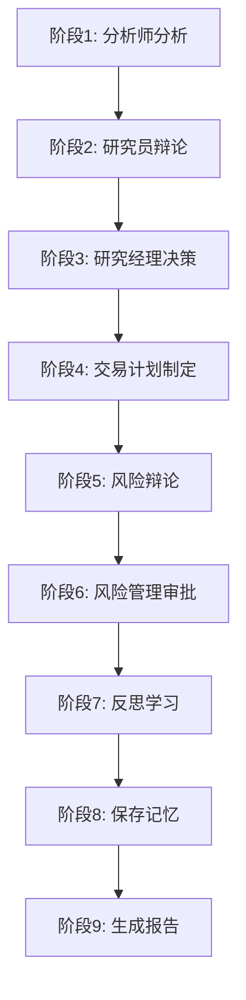

# JTrade

<div align="center">

**Java 版多智能体交易决策系统**

基于大语言模型（LLM）的智能金融交易研究框架

[](https://www.oracle.com/java/)
[](https://spring.io/projects/spring-boot)
[](https://maven.apache.org/)
[](LICENSE)

[English](README_EN.md) | 简体中文

</div>

---

## 📖 目录

- [项目概述](#-项目概述)
- [核心功能](#-核心功能)
- [技术栈](#-技术栈)
- [环境配置](#-环境配置)
- [构建与运行](#-构建与运行)
- [目录结构](#-目录结构)
- [核心模块](#-核心模块)
- [CLI 使用指南](#-cli-使用指南)
- [报告生成](#-报告生成)
- [跨平台部署](#-跨平台部署)
- [演示程序](#-演示程序)
- [配置说明](#-配置说明)
- [常见问题](#-常见问题)
- [贡献指南](#-贡献指南)
- [许可证](#-许可证)

---

## 🎯 项目概述

**JTrade** 是一个基于多智能体架构的智能交易决策系统，使用 Java 17 和 Spring Boot 3.2 构建。系统模拟真实交易公司的运作流程，通过 **12 个专业智能体**的协同工作，为股票交易提供全面、多维度的分析和决策支持。

### 系统特点

- 🤖 **多智能体协作**：12 个专业智能体模拟真实交易团队（分析师、研究员、交易员、风险管理）
- 🔄 **完整决策流程**：9 个阶段从数据分析到风险管理的完整链路
- 🧠 **智能反思机制**：3 层反思系统持续优化决策质量
- 💾 **记忆系统**：历史决策记录与检索，支持经验积累
- 📊 **自动报告生成**：Markdown 格式的详细分析报告，按股票代码组织
- 🔌 **灵活 LLM 支持**：支持 OpenAI、通义千问、DeepSeek、Ollama 等多种大模型
- 🚀 **生产就绪**：可执行 JAR 包、跨平台启动脚本、完整的监控日志

---

## ✨ 核心功能

### 1. 多智能体决策系统

系统包含 **12 个专业智能体**，分工协作完成交易决策：

#### 📈 分析师团队（4 个）
- **市场分析师**：技术指标分析（MA, RSI, MACD, 布林带等）
- **基本面分析师**：财务数据、公司基本面分析
- **新闻分析师**：新闻事件影响评估
- **社交媒体分析师**：市场情绪分析

#### 🔬 研究员团队（2 个）
- **多头研究员**：看涨观点论证
- **空头研究员**：看跌观点论证
- 通过**辩论机制**全面评估市场方向

#### 💼 交易团队（1 个）
- **交易员**：制定具体交易计划（入场点、止损、止盈）

#### ⚖️ 风险管理团队（5 个）
- **激进辩论者**：高风险高回报策略
- **保守辩论者**：稳健保守策略
- **中立辩论者**：平衡风险收益
- **研究经理**：整合分析结果，做出研究决策
- **风险管理器**：最终审批，风险把控

### 2. 9 阶段决策工作流



### 3. 高级特性

- **反思学习机制**：分析反思、决策反思、综合反思三个层次
- **记忆系统**：最多保留 10 条历史决策，支持摘要和统计分析
- **Prompt 管理**：集中式配置文件管理所有智能体提示词
- **Graph 工作流**：支持条件分支和循环的灵活工作流编排
- **数据聚合**：支持真实 API（Finnhub、Yahoo Finance）和模拟数据

---

## 🛠 技术栈

### 核心框架

| 技术 | 版本 | 说明 |
|-----|------|------|
| **Java** | 17 | LTS 长期支持版本 |
| **Spring Boot** | 3.2.1 | 企业级应用框架 |
| **Maven** | 3.6+ | 项目构建与依赖管理 |

### 主要依赖

| 依赖 | 版本 | 用途 |
|-----|------|------|
| **OkHttp** | 4.12.0 | HTTP 客户端，LLM API 调用 |
| **Jackson** | 2.16.1 | JSON 序列化/反序列化 |
| **Lombok** | 1.18.30 | 简化 Java 代码 |
| **TA4J** | 0.15 | 技术分析指标库 |
| **Guava** | 33.0.0 | Google 核心工具库 |
| **Commons CSV** | 1.10.0 | CSV 数据处理 |
| **Logback** | 1.4.14 | 日志框架 |

### 支持的 LLM 提供商

- ✅ **OpenAI**（gpt-4o、gpt-4o-mini、o1-mini）
- ✅ **通义千问**（qwen-plus、qwen-turbo）
- ✅ **DeepSeek**（deepseek-chat）
- ✅ **Ollama**（本地模型）

---

## ⚙️ 环境配置

### 1. 安装 JDK 17

#### macOS
```bash
# 使用 Homebrew
brew install openjdk@17

# 配置环境变量
echo 'export JAVA_HOME=/Library/Java/JavaVirtualMachines/jdk-17.jdk/Contents/Home' >> ~/.zshrc
echo 'export PATH=$JAVA_HOME/bin:$PATH' >> ~/.zshrc
source ~/.zshrc
```

#### Linux
```bash
# Ubuntu/Debian
sudo apt update
sudo apt install openjdk-17-jdk

# CentOS/RHEL
sudo yum install java-17-openjdk-devel

# 配置环境变量
echo 'export JAVA_HOME=/usr/lib/jvm/java-17-openjdk' >> ~/.bashrc
source ~/.bashrc
```

#### Windows
1. 下载 [Oracle JDK 17](https://www.oracle.com/java/technologies/downloads/#java17)
2. 安装并配置环境变量 `JAVA_HOME`
3. 验证安装：`java -version`

### 2. 安装 Maven

```bash
# macOS
brew install maven

# Linux
sudo apt install maven  # Ubuntu/Debian
sudo yum install maven   # CentOS/RHEL

# 验证安装
mvn -version
```

### 3. 配置 API 密钥

#### 方式1：环境变量（推荐）

```bash
# OpenAI
export OPENAI_API_KEY=sk-your-openai-api-key

# 通义千问
export DASHSCOPE_API_KEY=sk-your-dashscope-api-key

# Finnhub（可选，用于真实数据）
export FINNHUB_API_KEY=your-finnhub-api-key
```

#### 方式2：配置文件

编辑 `src/main/resources/application.yml`：

```yaml
llm:
  provider: openai  # 或 qwen, deepseek, ollama
  
  openai:
    apiKey: ${OPENAI_API_KEY}
    baseUrl: https://api.openai.com/v1
```

---

## 🚀 构建与运行

### 快速开始

```bash
# 1. 克隆项目
git clone https://github.com/Leavesfly/TradingAgents.git
cd TradingAgents/JTrade

# 2. 设置环境变量
export JAVA_HOME=/Library/Java/JavaVirtualMachines/jdk-17.jdk/Contents/Home
export OPENAI_API_KEY=your-api-key

# 3. 编译项目
mvn clean compile -DskipTests

# 4. 运行演示程序
mvn spring-boot:run -Dspring-boot.run.main-class=io.leavesfly.jtrade.JTradeDemoApplication
```

### 打包为可执行 JAR

```bash
# 打包
mvn clean package -DskipTests

# 运行 JAR
java -jar target/jtrade-1.0.0-exec.jar
```

### 使用启动脚本（推荐）

#### Unix/Linux/Mac

```bash
# 解压分发包
tar -xzf target/jtrade-1.0.0-distribution.tar.gz
cd jtrade-1.0.0

# 运行演示程序
./bin/jtrade.sh demo

# 运行 CLI 工具
./bin/jtrade.sh cli

# 运行集成演示
./bin/jtrade.sh integration
```

#### Windows

```cmd
REM 解压分发包
unzip target\jtrade-1.0.0-distribution.zip
cd jtrade-1.0.0

REM 运行演示程序
bin\jtrade.bat demo

REM 运行 CLI 工具
bin\jtrade.bat cli
```

---

## 📁 目录结构

```
JTrade/
├── src/
│   ├── main/
│   │   ├── java/io/leavesfly/jtrade/
│   │   │   ├── agents/              # 智能体实现
│   │   │   │   ├── analysts/        # 分析师团队
│   │   │   │   ├── researchers/     # 研究员团队
│   │   │   │   ├── trader/          # 交易员
│   │   │   │   ├── risk/            # 风险辩论者
│   │   │   │   ├── managers/        # 管理层
│   │   │   │   └── base/            # 基础接口
│   │   │   ├── core/                # 核心功能
│   │   │   │   ├── state/           # 状态管理
│   │   │   │   ├── memory/          # 记忆系统
│   │   │   │   ├── reflection/      # 反思机制
│   │   │   │   ├── report/          # 报告生成
│   │   │   │   ├── prompt/          # Prompt 管理
│   │   │   │   └── workflow/        # 工作流引擎
│   │   │   ├── graph/               # Graph 工作流
│   │   │   │   ├── TradingGraph.java
│   │   │   │   ├── ConditionalLogic.java
│   │   │   │   └── GraphPropagator.java
│   │   │   ├── service/             # 服务层
│   │   │   │   └── TradingService.java
│   │   │   ├── llm/                 # LLM 客户端
│   │   │   │   ├── client/
│   │   │   │   ├── model/
│   │   │   │   └── exception/
│   │   │   ├── dataflow/            # 数据流
│   │   │   │   ├── provider/
│   │   │   │   └── model/
│   │   │   ├── config/              # 配置类
│   │   │   ├── cli/                 # CLI 工具
│   │   │   └── demo/                # 演示程序
│   │   └── resources/
│   │       ├── prompts/             # Prompt 配置
│   │       │   └── agent-prompts.properties
│   │       ├── application.yml      # 主配置文件
│   │       └── logback-spring.xml   # 日志配置
│   └── test/                        # 测试代码
├── scripts/                         # 启动脚本
│   ├── jtrade.sh                    # Unix 启动脚本
│   └── jtrade.bat                   # Windows 启动脚本
├── reports/                         # 报告输出目录
│   └── {SYMBOL}/                    # 按股票代码组织
│       └── {DATE}/                  # 按日期分类
├── pom.xml                          # Maven 配置
├── README.md                        # 本文档
├── QUICK_START.md                   # 快速开始指南
└── PROJECT_STATUS.md                # 项目状态
```

---

## 🧩 核心模块

### 1. 多智能体系统（`agents/`）

**基础接口**：`Agent.java`
```java
public interface Agent {
    AgentState execute(AgentState state);
    AgentType getType();
}
```

**智能体类型**：
- 分析师：`MarketAnalyst`, `FundamentalsAnalyst`, `NewsAnalyst`, `SocialMediaAnalyst`
- 研究员：`BullResearcher`, `BearResearcher`
- 交易员：`Trader`
- 风险辩论者：`AggressiveDebator`, `ConservativeDebator`, `NeutralDebator`
- 管理层：`ResearchManager`, `RiskManager`

### 2. 工作流引擎（`core/workflow/` 和 `graph/`）

**TradingService**：顺序工作流，简洁易用
```java
public AgentState executeTradingWorkflow(String symbol, LocalDate date) {
    // 9 个阶段的顺序执行
    // 1. 分析师分析
    // 2. 研究员辩论
    // 3-9. ...
}
```

**TradingGraph**：图工作流，支持条件分支
```java
public AgentState propagate(String symbol, LocalDate date) {
    // 支持条件判断和循环
    // 更灵活的工作流编排
}
```

### 3. 状态管理（`core/state/`）

使用**不可变对象** + **Builder 模式**：
```java
@Data
@Builder(toBuilder = true)
public class AgentState {
    private String company;              // 股票代码
    private LocalDate date;              // 分析日期
    private List<String> analystReports; // 分析师报告
    private String finalSignal;          // 最终信号（BUY/SELL/HOLD）
    // ...
}
```

### 4. LLM 客户端（`llm/client/`）

支持多种 LLM 提供商的统一接口：
```java
public interface LlmClient {
    LlmResponse chat(List<LlmMessage> messages, ModelConfig config);
}
```

**SimpleLlmClient** 实现：
- 支持 OpenAI、通义千问、DeepSeek、Ollama
- 指数退避重试机制
- 完善的错误处理

### 5. 反思系统（`core/reflection/`）

三层反思机制：
- **分析反思**：评估分析质量
- **决策反思**：审视决策过程
- **综合反思**：整体复盘

### 6. 记忆系统（`core/memory/`）

功能：
- 历史决策存储（最多 10 条）
- 决策检索与统计
- 历史摘要生成

### 7. 报告生成（`core/report/`）

自动生成 **Markdown 格式**报告：
- 按股票代码组织目录：`reports/{SYMBOL}/`
- 按日期分类：`reports/{SYMBOL}/{DATE}/`
- 包含时间戳避免冲突
- 8 种报告类型 + 1 个最终摘要

---

## 💻 CLI 使用指南

### 启动 CLI

```bash
# 方式1：Maven
mvn spring-boot:run -Dspring-boot.run.main-class=io.leavesfly.jtrade.cli.JTradeCLI

# 方式2：JAR 包
java -jar target/jtrade-1.0.0-exec.jar --spring.main.class=io.leavesfly.jtrade.cli.JTradeCLI

# 方式3：启动脚本
./bin/jtrade.sh cli
```

### 命令列表

| 命令 | 说明 | 示例 |
|-----|------|------|
| `analyze` | 分析指定股票 | `analyze AAPL 2024-05-10` |
| `history` | 查看历史决策 | `history AAPL` |
| `list` | 列出所有决策 | `list` |
| `clear` | 清除历史记录 | `clear AAPL` |
| `help` | 显示帮助信息 | `help` |
| `exit` | 退出 CLI | `exit` |

### 使用示例

```bash
jtrade> analyze AAPL 2024-05-10
[执行分析...]
✓ 分析完成
  最终信号: BUY
  报告位置: ./reports/AAPL/2024-05-10/

jtrade> history AAPL
[显示 AAPL 的历史决策]

jtrade> list
[显示所有股票的决策记录]

jtrade> exit
感谢使用 JTrade！
```

---

## 📊 报告生成

### 报告目录结构

```
reports/
├── AAPL/                    # Apple 股票
│   └── 2024-05-10/          # 分析日期
│       ├── 20240510_143000_FINAL_SUMMARY.md          # 📊 最终摘要（推荐首先查看）
│       ├── 20240510_143000_analyst_reports.md        # 📈 分析师报告
│       ├── 20240510_143000_researcher_debate.md      # 💬 研究员辩论
│       ├── 20240510_143000_research_manager_decision.md  # ✅ 研究经理决策
│       ├── 20240510_143000_trading_plan.md           # 💼 交易计划
│       ├── 20240510_143000_risk_debate.md            # ⚖️ 风险辩论
│       ├── 20240510_143000_risk_manager_decision.md  # 🛡️ 风险管理决策
│       └── 20240510_143000_reflections.md            # 🧠 反思记录
├── TSLA/                    # Tesla 股票
└── MSFT/                    # Microsoft 股票
```

### 报告内容

#### FINAL_SUMMARY.md（最终摘要）
包含：
- 📋 基本信息（股票代码、日期、时间）
- 📊 决策流程摘要（各阶段统计）
- 🎯 最终交易信号（BUY/SELL/HOLD）
- 💡 关键决策点（核心观点摘要）
- 📁 详细报告文件清单

### 查看报告

```bash
# 查看 AAPL 的最终摘要
cat ./reports/AAPL/2024-05-10/*_FINAL_SUMMARY.md

# 查看所有报告文件
ls -lh ./reports/AAPL/2024-05-10/

# 使用 Markdown 阅读器
markdown-reader ./reports/AAPL/2024-05-10/*_FINAL_SUMMARY.md
```

---

## 🌍 跨平台部署

### 1. 构建分发包

```bash
# 生成所有分发包
mvn clean package -DskipTests

# 生成的文件：
# - jtrade-1.0.0-exec.jar          (26MB，可执行 JAR)
# - jtrade-1.0.0-distribution.tar.gz (24MB，Unix/Linux/Mac)
# - jtrade-1.0.0-distribution.zip    (24MB，Windows)
```

### 2. Unix/Linux/Mac 部署

```bash
# 1. 解压分发包
tar -xzf jtrade-1.0.0-distribution.tar.gz
cd jtrade-1.0.0

# 2. 配置环境变量
export OPENAI_API_KEY=your-api-key
export JAVA_OPTS="-Xms1g -Xmx4g -XX:+UseG1GC"

# 3. 运行
./bin/jtrade.sh demo
```

### 3. Windows 部署

```cmd
REM 1. 解压分发包
unzip jtrade-1.0.0-distribution.zip
cd jtrade-1.0.0

REM 2. 配置环境变量
set OPENAI_API_KEY=your-api-key
set JAVA_OPTS=-Xms1g -Xmx4g

REM 3. 运行
bin\jtrade.bat demo
```

### 4. Docker 部署

```dockerfile
FROM openjdk:17-slim

WORKDIR /app

COPY target/jtrade-1.0.0-exec.jar app.jar

ENV OPENAI_API_KEY=""
ENV JAVA_OPTS="-Xms1g -Xmx4g"

EXPOSE 8080

ENTRYPOINT ["sh", "-c", "java $JAVA_OPTS -jar app.jar"]
```

```bash
# 构建镜像
docker build -t jtrade:1.0.0 .

# 运行容器
docker run -e OPENAI_API_KEY=your-key jtrade:1.0.0
```

### 5. 生产环境优化

```bash
# JVM 参数优化
export JAVA_OPTS="\
  -Xms2g -Xmx4g \
  -XX:+UseG1GC \
  -XX:MaxGCPauseMillis=200 \
  -XX:+HeapDumpOnOutOfMemoryError \
  -XX:HeapDumpPath=/var/logs/jtrade \
  -Dfile.encoding=UTF-8"

# 后台运行
nohup java $JAVA_OPTS -jar jtrade-1.0.0-exec.jar > /var/logs/jtrade/app.log 2>&1 &
```

---

## 🎮 演示程序

JTrade 提供 **8 个完整的演示程序**，展示不同功能特性：

| 演示程序 | 说明 | 运行命令 |
|---------|------|----------|
| **IntegrationDemo** | 完整功能集成演示 | `mvn spring-boot:run -Dspring-boot.run.main-class=io.leavesfly.jtrade.demo.IntegrationDemo` |
| **InteractiveDemo** | 交互式演示 | `-Dspring-boot.run.main-class=io.leavesfly.jtrade.demo.InteractiveDemo` |
| **AgentPerformanceDemo** | 智能体性能分析 | `-Dspring-boot.run.main-class=io.leavesfly.jtrade.demo.AgentPerformanceDemo` |
| **WorkflowVisualizationDemo** | 工作流可视化 | `-Dspring-boot.run.main-class=io.leavesfly.jtrade.demo.WorkflowVisualizationDemo` |
| **BatchTestDemo** | 批量测试 | `-Dspring-boot.run.main-class=io.leavesfly.jtrade.demo.BatchTestDemo` |
| **ComparativeAnalysisDemo** | 对比分析 | `-Dspring-boot.run.main-class=io.leavesfly.jtrade.demo.ComparativeAnalysisDemo` |
| **PromptManagementDemo** | Prompt 管理 | `-Dspring-boot.run.main-class=io.leavesfly.jtrade.demo.PromptManagementDemo` |
| **ReportWriterDemo** | 报告写入功能 | `-Dspring-boot.run.main-class=io.leavesfly.jtrade.demo.ReportWriterDemo` |

---

## ⚙️ 配置说明

### LLM 配置（`application.yml`）

```yaml
llm:
  provider: openai  # openai, qwen, deepseek, ollama
  
  openai:
    apiKey: ${OPENAI_API_KEY}
    baseUrl: https://api.openai.com/v1
  
  qwen:
    apiKey: ${DASHSCOPE_API_KEY}
    baseUrl: https://dashscope.aliyuncs.com/compatible-mode/v1
  
  deepseek:
    apiKey: ${DEEPSEEK_API_KEY}
    baseUrl: https://api.deepseek.com
  
  ollama:
    baseUrl: http://localhost:11434
  
  deepThinkModelName: gpt-4o        # 深度思考模型
  quickThinkModelName: gpt-4o-mini  # 快速思考模型
```

### Prompt 配置（`agent-prompts.properties`）

位置：`src/main/resources/prompts/agent-prompts.properties`

```properties
# 市场分析师
analyst.market.system=你是一名资深的市场分析师...
analyst.market.prompt=请分析以下股票的技术指标：{symbol}...

# 基本面分析师
analyst.fundamentals.system=你是一名资深的基本面分析师...
# ...
```

### 日志配置（`logback-spring.xml`）

支持按日期、大小滚动，彩色控制台输出。

---

## ❓ 常见问题

### Q1: 编译失败，提示 Java 版本不对？

**A:** 确保 JAVA_HOME 指向 JDK 17：
```bash
echo $JAVA_HOME
java -version
# 应该显示 java version "17.x.x"
```

### Q2: 运行时提示 API 密钥未设置？

**A:** 设置环境变量：
```bash
export OPENAI_API_KEY=your-api-key
# 或在 application.yml 中配置
```

### Q3: 如何切换不同的 LLM 提供商？

**A:** 修改 `application.yml` 中的 `llm.provider`：
```yaml
llm:
  provider: qwen  # 改为 qwen、deepseek 或 ollama
```

### Q4: 报告文件在哪里？

**A:** 默认在项目根目录的 `./reports/{股票代码}/{日期}/` 下。

### Q5: 如何修改智能体的 Prompt？

**A:** 编辑 `src/main/resources/prompts/agent-prompts.properties`。

### Q6: 内存不足怎么办？

**A:** 调整 JVM 参数：
```bash
export JAVA_OPTS="-Xms2g -Xmx4g"
```

### Q7: 如何使用本地模型（Ollama）？

**A:** 
```bash
# 1. 安装 Ollama
curl https://ollama.ai/install.sh | sh

# 2. 下载模型
ollama pull llama2

# 3. 修改配置
llm:
  provider: ollama
  ollama:
    baseUrl: http://localhost:11434
```

---

## 🤝 贡献指南

欢迎贡献代码、报告问题或提出建议！

### 开发流程

```bash
# 1. Fork 项目
# 2. 创建特性分支
git checkout -b feature/your-feature

# 3. 提交更改
git commit -am 'Add some feature'

# 4. 推送到分支
git push origin feature/your-feature

# 5. 创建 Pull Request
```

### 代码规范

- 遵循 Java 代码规范
- 使用 Lombok 简化代码
- 添加必要的注释和文档
- 编写单元测试

---

## 📄 许可证

MIT License

Copyright (c) 2024 JTrade

Permission is hereby granted, free of charge, to any person obtaining a copy
of this software and associated documentation files (the "Software"), to deal
in the Software without restriction, including without limitation the rights
to use, copy, modify, merge, publish, distribute, sublicense, and/or sell
copies of the Software, and to permit persons to whom the Software is
furnished to do so, subject to the following conditions:

The above copyright notice and this permission notice shall be included in all
copies or substantial portions of the Software.

THE SOFTWARE IS PROVIDED "AS IS", WITHOUT WARRANTY OF ANY KIND, EXPRESS OR
IMPLIED, INCLUDING BUT NOT LIMITED TO THE WARRANTIES OF MERCHANTABILITY,
FITNESS FOR A PARTICULAR PURPOSE AND NONINFRINGEMENT. IN NO EVENT SHALL THE
AUTHORS OR COPYRIGHT HOLDERS BE LIABLE FOR ANY CLAIM, DAMAGES OR OTHER
LIABILITY, WHETHER IN AN ACTION OF CONTRACT, TORT OR OTHERWISE, ARISING FROM,
OUT OF OR IN CONNECTION WITH THE SOFTWARE OR THE USE OR OTHER DEALINGS IN THE
SOFTWARE.

---

## 📞 联系方式

- **项目主页**：[GitHub](https://github.com/Leavesfly/TradingAgents)
- **问题反馈**：[Issues](https://github.com/Leavesfly/TradingAgents/issues)
- **文档**：[Wiki](https://github.com/Leavesfly/TradingAgents/wiki)

---

<div align="center">

**⭐ 如果这个项目对你有帮助，请给它一个 Star！**

由 ❤️ 和 ☕ 驱动

</div>
